# Introduction, History, and Internet Architecture

## Key concepts:
* Internet growth and scaling challenges
* Layering, encapsulation, and the Internet protocol stack
* The end-to-end principle
* Practical exceptions such as NAT and middleboxes
* The Internet hourglass architecture
* Protocol evolution and ossification
* Hubs, switches, bridges, and routers
* Learning bridges and forwarding tables
* Spanning Tree Protocol and Layer 2 loop prevention

## A Brief History of the Internet
The Internet evolved over decades through key milestones in packet switching, open architecture, internetworking, and scalable naming that together shaped today's global network infrastructure.

### Early Visions of Networked Computing

The conceptual foundation for the Internet predates any actual network.

- **Galactic Network (1962)**:
    - J.C.R. Licklider described a vision of globally interconnected computers
    - Would allow people to access data and programs from many locations
    - Framed networking as enabling human interaction and collaboration, not just machine connection

### Packet Switching Research

A fundamental shift in how data is transmitted across networks emerged in the early 1960s.

- **Packet switching**:
    - Data is broken into packets and sent efficiently across shared networks
    - A major departure from traditional **circuit-switched** communication
    - Made communication more flexible and better suited for data traffic

### First Wide-Area Network Experiment

The first long-distance computer communication experiment revealed key limitations of existing infrastructure.

- **1965** — Lawrence Roberts and Thomas Merrill connected a computer in Massachusetts to one in California via a low-speed dial-up telephone line
    - Demonstrated that time-shared computers could communicate over long distances
    - Showed that the **circuit-switched telephone system** was poorly suited for computer networking
    - Motivated the move toward packet-switched network design

### ARPANET

The first major practical step toward the Internet demonstrated that distributed packet-switched networks were viable.

- **1969** — First ARPANET node installed at UCLA
    - Followed by nodes at Stanford Research Institute, UC Santa Barbara, and University of Utah
    - Four host computers connected by end of 1969
    - Demonstrated that packet-switched networks could support geographically distributed communication

### Network Control Protocol and Early Applications

Once a host-to-host protocol existed, the first network applications could be built.

- **1970** — Network Working Group completed **NCP (Network Control Protocol)**, the initial ARPANET host-to-host protocol
- **1972** — Email introduced as one of the first major network applications
    - Showed that network value came from enabling **people-to-people communication**, not just machine connectivity

### Open Architecture Networking

A key design philosophy that allowed the Internet to scale across diverse technologies.

- Different networks could be built independently with their own internal designs
- Connected through a **common internetworking architecture** rather than a uniform internal standard
- Enabled growth across wired, wireless, satellite, and radio networks

### TCP/IP and the Modern Internet Architecture

As networking expanded beyond ARPANET, a universal protocol layer was needed.

- **TCP/IP** developed to connect multiple independent networks
    - Became the foundation of the modern Internet
    - Allowed different networks to **interoperate** through a shared protocol layer
    - Created the Internet's **"network of networks"** architecture

### DNS and the World Wide Web

Two developments made the Internet scalable and accessible to a broad public.

- **DNS (Domain Name System)**:
    - Introduced a scalable, distributed way to translate domain names into IP addresses
    - Replaced the impractical single table of host names and addresses
- **World Wide Web**:
    - Made the Internet significantly easier to use for publishing, linking, and accessing information
    - Brought the Internet to a much broader public audience

### Why These Milestones Matter

The Internet's success stems from a set of interconnected foundational ideas.

- Core ideas: **packet switching**, **open architecture**, **end-to-end communication**, **scalable naming**, and **application support**
- Result: a system that connects many different devices, networks, and technologies under a common communication model
- Explains why the **Internet protocol stack** scales successfully and why core protocols are difficult to replace

## Internet Architecture Introduction
Network protocol designers organize protocols into layers to manage complexity, where each layer provides a service to the layer above and uses the service of the layer below.

### Why Structure Is Needed
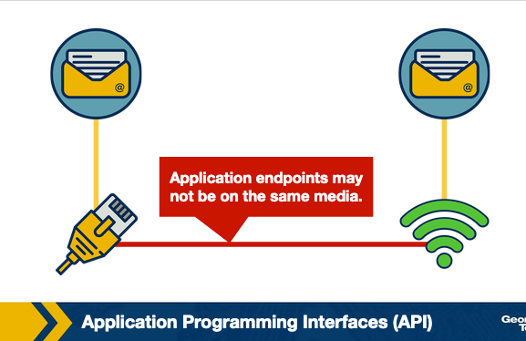
The Internet is a complex system that requires organization to remain manageable.

- Includes many types of hosts, links, switches, routers, protocols, and applications
- Without structure, designing, updating, or troubleshooting such a system would be very difficult
- Solution: organize protocols into **layers**

### Layers, Services, and Functionality
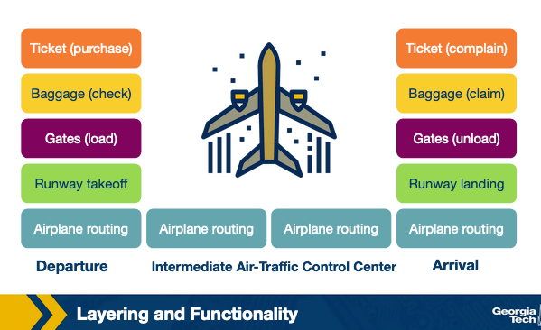
Each layer has a specific responsibility and interacts only with the layers directly above and below it.

- **Service model**:
    - Each layer provides a service to the layer above it
    - Each layer uses the service provided by the layer below it
    - Example: one layer may provide local delivery across a single link; another provides end-to-end communication between applications
- **Airline analogy**:
    - A passenger goes through ticketing → baggage check → gate → boarding → flight → exit → baggage claim
    - Each step provides a service supporting the next
    - The passenger does not need to know internal details of baggage routing or air traffic control
    - Same principle applies to Internet layers — each focuses on one part of communication

### Why Layering Helps

Layering provides several important benefits to Internet architecture.

- **Scalability**:
    - Each layer has a focused role, so the system can grow without every component needing to understand every detail
- **Modularity**:
    - A layer can change its internal implementation as long as it continues to provide the same service upward
    - Example: an application keeps working even if the access technology changes from Ethernet to Wi-Fi or 5G
- **Interoperability**:
    - Devices, networks, and applications from different vendors work together by following common protocol interfaces and standards
- **Easier troubleshooting**:
    - Engineers can isolate failures by layer: physical? local delivery? routing? transport? application?

### Limitations of Layering

Strict layering is not always perfect in practice.

- One layer may **duplicate functionality** that already appears in another layer (e.g., error recovery at multiple layers)
- One layer may need **information from another layer**, making strict separation difficult
- Despite these limitations, layering remains the main design idea that keeps the Internet manageable and able to evolve

## The OSI Model
The Internet uses a five-layer protocol stack that consolidates the seven-layer OSI reference model, with each layer providing a well-defined service to the layer above it.

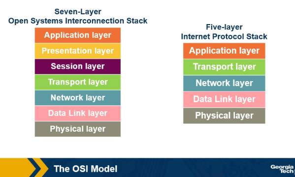

### OSI Model vs. Internet Protocol Stack

Two layered models describe network architecture, differing primarily in how upper layers are organized.

- **OSI model** (7 layers) — proposed by the International Organization for Standardization:
    - Application
    - Presentation
    - Session
    - Transport
    - Network
    - Data Link
    - Physical
- **Internet protocol stack** (5 layers) — the model used in practice:
    - Application
    - Transport
    - Network
    - Data Link
    - Physical
- Key difference: the Internet model **combines** the OSI application, presentation, and session layers into a single broader **application layer**
    - Application-specific functions such as data formatting, session management, and application logic are handled by the application itself

### The Socket Interface

The boundary between the application layer and the transport layer is defined by a standard interface.

- **Socket interface** — the access point between the application layer and the transport layer
- Application developers use **sockets** to send and receive data over the network
- The developer decides what functionality the application needs and how it uses the transport-layer services below

### Limitations of Layering

Strict layering introduces some practical challenges.

- **Cross-layer dependencies** — some layers may need information from other layers, making strict separation difficult
- **Duplicated functionality** — some functions appear in more than one layer (e.g., error recovery at both lower and higher layers)
- **Added overhead** — each layer may add headers or processing steps, introducing additional overhead

### Reviewing Each Layer

For each layer of the Internet protocol stack, four questions frame the discussion.

- What **service** does the layer provide?
- How is the layer **accessed**?
- What are example **protocols or technologies** at that layer?
- What do we call the **packet of information** handled at that layer?

## Application, Presentation, and Session Layers
- The OSI model separates the top three layers into application, presentation, and session, but the Internet protocol stack combines all three into a single broader application layer handled by applications or application-level protocols.

### Application Layer

The application layer is the layer closest to user-facing software and supports network applications and their protocols.

- Common application-layer protocols:
    - **HTTP** — web communication
    - **SMTP** — sending email
    - **FTP** — transferring files between hosts
    - **DNS** — translating domain names into IP addresses
- Services at this layer depend on the specific application (e.g., a web browser and email client use the network differently)
- Packet of information at this layer is called a **message**

### Presentation Layer

The presentation layer is responsible for how data is represented and formatted before delivery to the application.

- Handles tasks such as:
    - Data formatting and encoding
    - Compression
    - Translation between data representations (e.g., **big endian** vs. **little endian**)
- Example: formatting a video stream for the application
- In the Internet protocol stack, these functions are handled **inside the application** or by application-level libraries

### Session Layer

The session layer manages communication sessions between application processes and organizes related streams of communication.

- Keeps related streams tied together as part of the same interaction
- Example: in a teleconference, the session layer concept explains how related **audio and video streams** are kept together as part of the same call
- In the Internet protocol stack, session management is handled by **the application itself** or by protocols and libraries used by the application

## Transport and Network Layers
- The transport layer handles end-to-end communication between applications on different hosts, while the network layer moves packets across the Internet from one host to another.

### Transport Layer

The transport layer provides end-to-end communication between applications running on different hosts.

- Two main transport-layer protocols:
    - **TCP (Transmission Control Protocol)**:
        - **Connection-oriented** — two endpoints establish a connection before exchanging data
        - **Reliable delivery** — lost data can be retransmitted
        - **Flow control** — prevents the sender from overwhelming the receiver
        - **Congestion control** — slows the sender when the network appears congested
    - **UDP (User Datagram Protocol)**:
        - **Connectionless** — no connection established before sending
        - **Best-effort delivery** — no built-in reliability, flow control, or congestion control
        - Lightweight; applications using UDP must handle reliability or timing requirements themselves
- Packet of information at this layer is called a **segment**

### Network Layer

The network layer is responsible for moving packets from one host to another across the Internet.

- A source host passes a transport-layer segment and destination address down to the network layer
    - The network layer adds its own header and creates a **datagram**
    - The datagram is forwarded across routers and networks toward the destination host
- Most important protocol: **IP (Internet Protocol)**
    - Often described as the **glue that holds the Internet together**
    - All Internet hosts and routers use IP to send and forward datagrams
    - Defines the structure of the datagram and the addressing information used by hosts and routers
    - IP alone does not decide the full path in advance — **routing protocols** determine the routes datagrams can take
- Packet of information at this layer is called a **datagram**

## Data Link Layer and Physical Layer
- The data link layer moves frames between directly connected nodes one hop at a time, while the physical layer transmits raw bits across the actual physical medium.

### Data Link Layer

The data link layer is responsible for moving frames from one node to the next across a single link.

- A node may be a host, router, or switch
- As a datagram travels from sender to receiver across many routers, at each hop:
    - The network layer passes the datagram down to the data link layer
    - The data link layer delivers it across the next link
- Common data link layer technologies:
    - **Ethernet**
    - **Wi-Fi**
    - **Point-to-Point Protocol (PPP)**
- Services depend on the specific link-layer protocol; some provide **reliable delivery across a single link**
    - This differs from TCP reliability:
        - **Link-layer reliability** — applies only from one node to the next across one link
        - **TCP reliability** — applies end-to-end from source host to destination host
- Packet of information at this layer is called a **frame**

### Physical Layer

The physical layer is responsible for transferring raw bits across the physical medium.

- Interacts directly with the actual transmission technology
- Supported media types:
    - Twisted-pair copper wire
    - Coaxial cable
    - Fiber optics
    - Radio signals
- Defines how bits are **represented and transmitted** over the medium
- Example: Ethernet can run over copper wire or fiber optics — the data link layer remains Ethernet but the **physical-layer details differ** depending on the medium

## Layers Encapsulation
- As data moves down the protocol stack at the sender, each layer adds its own header to form a new packet unit; at the receiver, each layer strips its corresponding header in reverse — a process called de-encapsulation.

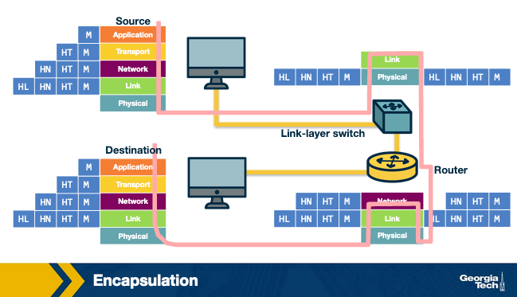

### Encapsulation at the Sending Host

Each layer wraps the data it receives from the layer above by adding its own header.

- **Application layer** — creates the original message M
- **Transport layer** — adds transport-layer header H_T to form a **segment**
    - Header may include: destination application process info, error detection, reliability support
- **Network layer** — adds network-layer header H_N to form a **datagram**
    - Header includes: source and destination **IP addresses** used by routers to forward the datagram
- **Data link layer** — adds link-layer header H_L to form a **frame**
    - Frame is transmitted across the physical medium as raw bits
- At each layer, a packet has two parts:
    - **Payload** — the message received from the layer above
    - **Header** — control information added by the current layer

### De-encapsulation at the Receiving Host

The receiving host processes layers in reverse, stripping each header as it moves up the stack.

- Data link layer receives the frame → removes link-layer header
- Network layer processes the datagram → removes network-layer header
- Transport layer processes the segment → removes transport-layer header
- Original application message is delivered to the destination application

### Intermediate Devices and Encapsulation

Devices along the path between sender and receiver implement only the layers needed for their role.

- **Layer 2 switch** — implements physical and data link layers only
    - Uses **MAC addresses** to decide where to forward frames
- **Router** — implements physical, data link, and network layers
    - Uses **IP addresses** to decide where to forward datagrams
- Intermediate devices do not process application data — only enough header information to forward the packet to the next hop

### A Design Choice

The decision of which layers each device implements reflects a deliberate architectural principle.

- **End hosts** implement all five layers — they create and consume application data
- **Intermediate devices** implement fewer layers — their role is to move traffic through the network
- Keeps complexity and intelligence at the **edges of the network**
- Keeps the **network core** simpler and focused on forwarding
- Connects directly to the **end-to-end principle**

## The End-to-end Principle
- The end-to-end principle argues that the network core should remain simple and general, while application-specific functions should be implemented by the end systems at the edges of the network.

### Core Idea

Some functions can only be implemented completely and correctly with the knowledge and involvement of the endpoints.

- The network should avoid building application-specific features into the core
- The core provides a simple, shared communication service
- Applications implement the functions they need **at the edges**

### Why Keep the Core Simple?

Different applications have different requirements, so a universal behavior enforced by the core would limit flexibility.

- **File transfer** — cares about correctness; every byte must arrive in order
- **Video call** — cares about low delay; can tolerate small loss but not high delay
- Enforcing one universal behavior in the core would prevent applications from choosing their own tradeoffs
- Keeping the core simple allows applications to select the services that fit their needs

### Why This Helped the Internet Grow

Pushing intelligence to the edge made the Internet easier to evolve and innovate on.

- Application developers could build new services **without requiring changes inside the network core**
- New applications, protocols, and services could appear over time without redesigning the infrastructure
- Lower layers could focus on shared network functions — moving packets across links and networks
- This separation gave application designers **more flexibility** while keeping the underlying infrastructure **more general**

## Violations of the End-to-End Principle and NAT Boxes
- Real networks sometimes violate the end-to-end principle through intermediate devices like firewalls and NAT boxes that solve practical problems such as security enforcement and IPv4 address scarcity.

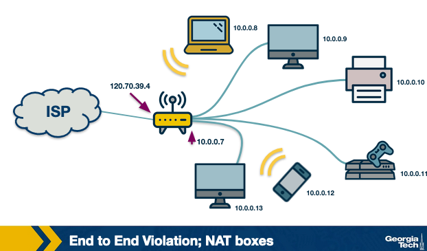

### Firewalls

A firewall is an intermediate device that monitors and filters traffic entering or leaving a network.

- Can **allow or block** traffic based on security rules
- Example: drops traffic that appears malicious or violates network policy
- Violates the end-to-end principle because it sits between communicating end hosts and **interferes with their communication** instead of simply forwarding packets

### Network Address Translation (NAT)

NAT was introduced as a practical response to the shortage of public IPv4 addresses.

- An ISP assigns **one public IP address** to a home router instead of assigning one to every device
- Devices inside the home network use **private IP addresses**:
    - 10.0.0.0/8
    - 192.168.0.0/16
- Private addresses have meaning only **inside the private network**; many home networks can reuse the same private ranges since they are not routed on the public Internet

### How NAT Works
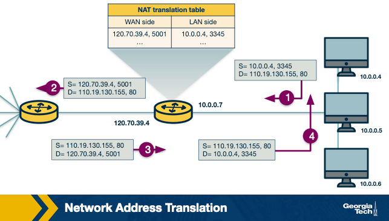

A NAT-enabled router translates between private addresses inside the home network and the public Internet.

- Outgoing traffic: NAT rewrites the packet's **source IP address** from the private address to the router's public IP address, and also rewrites the **source port number**
- NAT device maintains a **translation table** mapping public-facing IP and port back to the correct internal private IP and port
- Example:
    - Internal device: 10.0.0.4 : port 3345
    - NAT rewrites to: 120.70.39.4 : port 5001
    - Response arrives at 120.70.39.4:5001 → NAT rewrites destination back to 10.0.0.4:3345

### Why NAT Violates the End-to-End Principle

NAT breaks the original Internet model of globally addressable, directly reachable hosts.

- In the original model, hosts are **globally addressable** and can communicate directly
- With NAT, hosts inside the private network are **not globally addressable** and cannot be directly reached from the public Internet
- An outside host usually **cannot initiate a connection** to a device behind NAT without a pre-existing mapping or special configuration
- The NAT box becomes an **active participant** in the communication, rewriting addresses and ports

### NAT Workarounds

Because NAT complicates direct communication, several techniques have been developed to work around it.

- **STUN (Session Traversal Utilities for NAT)** — helps a host discover the public IP address and port that the NAT has assigned to its traffic
- **UDP hole punching** — helps establish bidirectional UDP communication between hosts behind NATs
- These workarounds help applications function but also demonstrate how NAT **adds complexity** to end-to-end communication

## The Hourglass Shape of Internet Architecture
- The Internet protocol stack takes an hourglass shape with many lower-layer technologies and upper-layer applications connected through a narrow waist of core protocols, particularly IP, TCP, and UDP.

markdown## The Hourglass Architecture of the Internet
- The Internet protocol stack takes an hourglass shape with many lower-layer technologies and upper-layer applications connected through a narrow waist of core protocols, particularly IP, TCP, and UDP.

- 

### The Hourglass Shape

The Internet protocol stack is described as an hourglass due to the distribution of protocols across layers.

- **Bottom (wide)** — many lower-layer technologies: Ethernet, Wi-Fi, fiber, cellular networks
- **Middle (narrow waist)** — a small set of core protocols: **IP, TCP, UDP**
- **Top (wide)** — many application-layer protocols: web, email, video streaming, real-time communication

### Historical Context

The narrow waist was not always the case — it emerged through competition among protocols over time.

- In the early 1990s, several network-layer protocols competed with IPv4:
    - Novell's **IPX**, **X.25**, and others
- Over time, **IPv4 became dominant**, creating the narrow waist
- Result: many lower-layer technologies could carry IP packets; many higher-layer protocols could build on top of IP
- Gave the Internet a powerful form of **interoperability** through one common network-layer protocol

### Innovation Patterns

The hourglass shape explains where Internet innovation tends to happen.

- **Lower layers** — frequent innovation in link and physical technologies (Ethernet, Wi-Fi, fiber, cellular)
- **Upper layers** — frequent innovation in applications and services (web apps, streaming, cloud, AI)
- **Near the waist** — protocols like IPv4, TCP, and UDP have been much more **stable**
    - Widely deployed and depended on, making them **difficult to replace**
    - This stability creates **ossification** — core protocols become resistant to change even when better alternatives exist

### Why Core Protocols Are Hard to Replace

A protocol that many systems depend on becomes entrenched regardless of technical merit.

- Replacing a core protocol requires coordination across applications, operating systems, routers, firewalls, and network operators
- A technically better protocol will struggle if the broader ecosystem does not adopt it
- This is why the Internet **innovates rapidly at the edges** but **changes slowly at the core**

### EvoArch: A Model for Protocol Evolution

Researchers Saamer Akhshabi and Constantine Dovrolis proposed the **Evolutionary Architecture (EvoArch)** model to study how layered protocol stacks evolve.

- Protocols are represented as **nodes in a layered dependency graph**
- A protocol gains **evolutionary value** when many important higher-layer protocols and applications rely on it
- Protocols at the same layer **compete** with each other if they offer similar services
    - A protocol with low evolutionary value is more likely to disappear when competing with a stronger protocol
- Over time, this process **naturally produces an hourglass shape** — many protocols at top and bottom, narrow set in the middle
- Key insight: the hourglass shape does **not need to be planned** — it emerges through dependencies, competition, and adoption

### Why This Matters

The hourglass architecture is both a strength and a limitation of the Internet.

- **Strength** — a narrow waist allows many technologies and applications to interoperate through a common foundation
- **Limitation** — the same core protocols become difficult to modify or replace
- Future Internet architectures must consider not only technical performance but also **deployment, compatibility, coexistence, and smooth transition** from old protocols to new ones

## Evolutionary Architecture Model
- EvoArch models how layered protocol stacks evolve over time through dependencies, competition, and adoption, explaining why the Internet naturally develops an hourglass shape with a narrow, ossified waist.

markdown## EvoArch: Evolutionary Architecture Model
- EvoArch models how layered protocol stacks evolve over time through dependencies, competition, and adoption, explaining why the Internet naturally develops an hourglass shape with a narrow, ossified waist.

- 

### Modeling a Protocol Stack

EvoArch represents a protocol stack as a layered directed acyclic network.

- **Layers** — represent the layers of a protocol stack
- **Nodes** — represent protocols
- **Edges** — represent dependencies between protocols
- **Substrates** — the lower-layer protocols that a protocol depends on
- **Products** — the higher-layer protocols or applications that depend on a protocol
- Example: if TCP is used by many applications, those applications are **products** of TCP; IP is a **substrate** of TCP

### Layer Generality

Lower layers provide more general services; higher layers provide more specific services.

- **Lower layers** — general services (e.g., physical layer moves bits across any medium); more likely to be selected as substrates by many protocols above
- **Higher layers** — specialized services designed for specific applications or use cases
- As you move up the stack, protocols become **more specialized**

### Evolutionary Value

A protocol's value is determined by how many important protocols and applications depend on it.

- A protocol gains **evolutionary value** when many valuable products depend on it
- Example: TCP has high evolutionary value because many widely used application-layer protocols rely on it
- A technically better protocol with **few dependents** will still have low evolutionary value
- Explains why better technology does not always replace older technology — **adoption and dependency matter**

### Competition Between Protocols
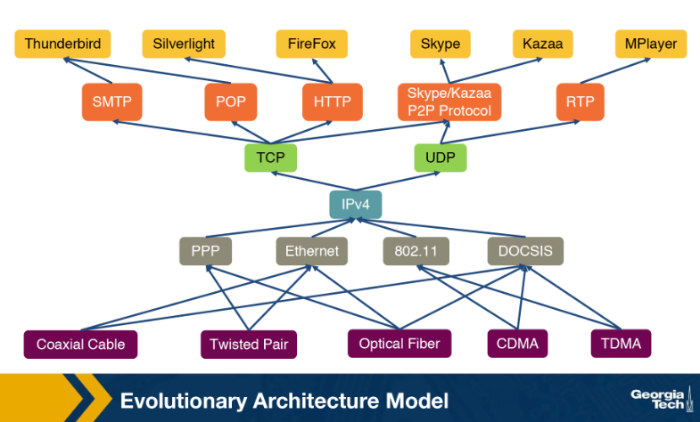
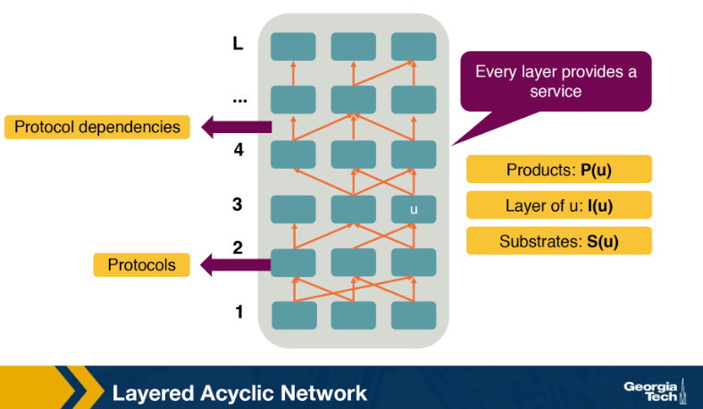

Protocols at the same layer compete when they serve similar dependents.

- Two protocols compete if they share enough of the same **products**
- A protocol with much lower evolutionary value than a competitor is more likely to **disappear**
- Protocols survive not only because they are technically good but because they are **useful to the ecosystem**

### How the Simulation Runs
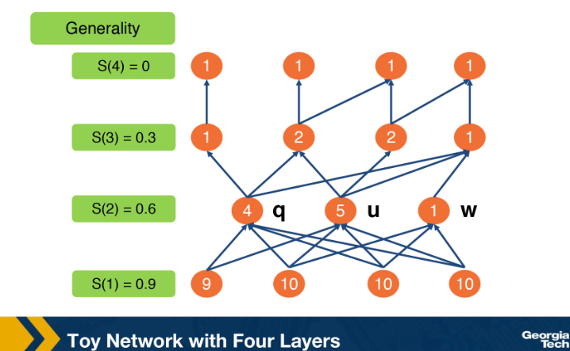
EvoArch runs as a discrete-time simulation where the protocol ecosystem evolves in rounds.

- Each round: new protocols are introduced into the stack and connected to lower-layer substrates based on layer generality
- Evolutionary values are updated based on each protocol's products
- Protocols with lower evolutionary value **compete and may die out**
- If a protocol dies, protocols that depended only on it may also die — **cascading effect**
- Simulation continues until the ecosystem reaches a target size
- Result: the surviving protocol distribution often shows the **hourglass pattern**

### How the Hourglass Emerges

The hourglass shape arises naturally from the dynamics of competition and dependency over many rounds.

- **Lower layers** remain broad — many technologies can provide general services
- **Upper layers** remain broad — many applications and services can be created
- **Middle layers** become narrow — a small number of protocols gain high evolutionary value and outcompete alternatives

### Implications for TCP/IP

EvoArch explains why the TCP/IP stack became dominant and why it is difficult to replace.

- Early TCP/IP supported useful applications (FTP, email, Telnet), increasing its evolutionary value over time
- IPv4, TCP, and UDP became stable foundations — many lower-layer technologies carry IP; many applications build on TCP/UDP
- This created **ossification**: once a protocol underlies many systems, it becomes very difficult to replace even if newer alternatives are technically superior

### The Transport Layer as an Evolutionary Shield

TCP and UDP protect IPv4 from replacement by forming a stable, narrow transport layer.

- Most applications depend on TCP or UDP, making it difficult for new transport protocols to gain adoption
- Without new transport protocols depending on a new network-layer protocol, that new protocol cannot gain evolutionary value
- TCP and UDP act as an **evolutionary shield** for IPv4, reinforcing the stability of the network-layer waist

### Implications for Future Internet Architectures

EvoArch warns that even new architectures designed from scratch may re-develop the same hourglass dynamics.

- A small number of successful protocols may again become highly depended on and resistant to change
- Possible lesson: future architectures should avoid an **overly narrow waist**
- A **wider waist** with several general but non-overlapping protocols may reduce competition among core protocols and make future evolution easier

## Interconnecting Hosts and Networks
- Different network devices operate at different layers of the protocol stack, from hubs that repeat raw bits at Layer 1 to switches that forward frames at Layer 2 to routers that move packets between networks at Layer 3.

### Repeaters and Hubs (Layer 1)

Repeaters and hubs operate at the physical layer and work only with signals and bits.

- A hub receives bits on one port and **repeats them out to all other ports**
- No understanding of IP addresses, MAC addresses, or traffic destinations
- **Advantage**: simple and inexpensive; can extend physical connectivity between Ethernet segments
- **Limitation**: all hosts share the same **collision domain**
    - Hosts compete for access to the same communication medium
    - More hosts → more collisions → worse performance

### Bridges and Layer-2 Switches (Layer 2)

Bridges and Layer-2 switches operate at the data link layer and use MAC addresses to forward frames.

- Inspect frame headers and forward frames **only toward the correct destination** rather than flooding all ports
- If the switch knows which port a host is reachable through, it sends the frame out **only that port**
- More efficient than hubs for local network traffic
- **Limitation**: output links have finite bandwidth
    - If frames arrive faster than the output link can transmit, frames are stored in a **buffer**
    - If the buffer fills up, frames may be **dropped**

### Routers and Layer-3 Switches (Layer 3)

Routers and Layer-3 switches operate at the network layer and use IP addresses to move packets between networks.

- Connect **separate networks**, not just hosts within the same local network
- Example: a home host sending traffic to a web server — the router moves the packet from the local network toward the wider Internet
- Routing protocols and router internals covered in detail in later modules
- 
## Learning Bridges
- A learning bridge builds a forwarding table by observing source MAC addresses and incoming ports, allowing it to selectively forward frames to the correct port rather than flooding all ports.

### Forwarding Tables
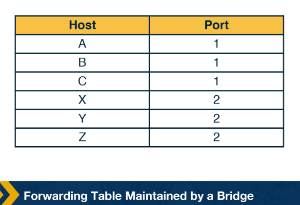
A learning bridge maintains a forwarding table that maps MAC addresses to bridge ports.

- Example entries:
    - Host A → port 1
    - Host B → port 2
    - Host C → port 3
- Once populated, the bridge forwards frames **only through the port that leads to the destination** instead of sending to every port

### How the Bridge Learns
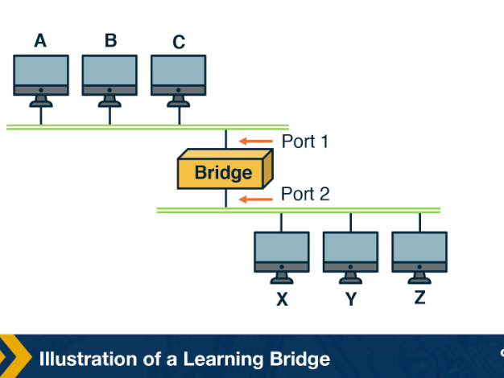
The bridge learns by observing two pieces of information from every frame it receives.

- **Source MAC address** — identifies which host sent the frame
- **Incoming port** — identifies which port the frame arrived on
- Example: a frame from Host A arrives on port 1 → bridge records that Host A is reachable through port 1
- This mapping is stored in the **forwarding table** and used for future frames destined for Host A

### Known and Unknown Destinations

When a frame arrives, the bridge checks the destination MAC address against its forwarding table.

- **Known destination** — frame is forwarded **only on the corresponding port**
- **Unknown destination** — bridge does not yet know where the host is located
    - Bridge **floods** the frame out all ports except the port it arrived on
    - When the destination host replies, the bridge observes the reply and **learns the host's port**
    - Flooding is how the bridge discovers new host locations

### Why Learning Bridges Help

Learning bridges improve local network efficiency over time.

- Reduce unnecessary traffic by avoiding sending every frame to every port
- As the bridge observes more traffic, its forwarding table becomes **more accurate**
- Forwarding becomes mostly **selective** rather than flooded

## Looping Problem in Bridges and the Spanning Tree Algorithm
- The Spanning Tree Algorithm prevents Layer-2 forwarding loops by having bridges exchange configuration messages, elect a root bridge, and disable ports that would create cycles while preserving full physical connectivity.

markdown## Spanning Tree Algorithm
- The Spanning Tree Algorithm prevents Layer-2 forwarding loops by having bridges exchange configuration messages, elect a root bridge, and disable ports that would create cycles while preserving full physical connectivity.

- 

### Why Loops Are Problematic

Redundant links improve reliability but can create cycles in the Layer-2 topology.

- Layer-2 frames have **no hop limit** (unlike IP packets), so a frame in a loop circulates indefinitely
- Problems caused by loops:
    - Frames may loop forever
    - Bridges keep forwarding the same traffic repeatedly, causing congestion
    - Forwarding tables become **unstable** — the same source address may appear to move between ports

### The Spanning Tree Idea

The solution is to select a loop-free subset of links that still keeps all bridges connected.

- Represent the network as a graph:
    - **Bridges** → nodes
    - **Links** → edges
- Select a subset of links forming a **spanning tree** — connected but cycle-free
- Some ports are **disabled for forwarding** so frames cannot loop
- Physical redundant links are kept; only forwarding behavior changes

### How Bridges Build the Tree

The spanning tree algorithm is **distributed** — bridges exchange messages with neighbors and gradually agree on a loop-free topology without a central controller.

- Each bridge has a unique **bridge ID**
- All bridges initially assume they are the **root bridge**
- Example initial message from bridge 3: `<3, 3, 0>`
    - Sender ID = 3
    - Believed root ID = 3
    - Distance to root = 0 hops

### Configuration Messages

Each round, bridges send configuration messages to neighbors containing three fields.

- **Sender ID** — the bridge sending the message
- **Root ID** — the bridge the sender currently believes is the root
- **Distance to root** — the sender's distance from that root in hops

### Comparing Configurations

Bridges use the following rules to determine which configuration is better.

- Prefer the **smaller root ID**
- If root ID is tied, prefer the **shorter distance to root**
- If both are tied, break the tie using the **smaller sender ID**
- Over time, all bridges converge on the same root and best paths toward it

### Selecting Forwarding Ports
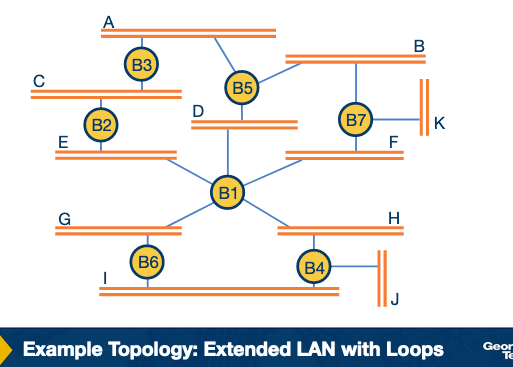
After comparing messages, each bridge decides which ports to keep active and which to block.

- **Keep forwarding** on ports that are part of the best path toward the root or needed to connect other bridges
- **Block forwarding** on a port if the neighbor on that port has a better path to the root
    - Using that port would create a loop

### Toy Example

In a network with bridges B1–B7 connected through multiple paths, the spanning tree algorithm resolves cycles.

- B1 has the smallest bridge ID → elected as **root bridge**
- Other bridges choose best paths toward B1 based on spanning tree rules
- Example: B3 receives messages from B2 and B5
    - Initially may accept B2 as root, then updates once B1 is discovered as smallest ID
    - Eventually B3 blocks some ports because B2 and B5 already have better paths to B1
- Result: some links are no longer used for forwarding, **removing all cycles** while keeping the network connected

### Convergence
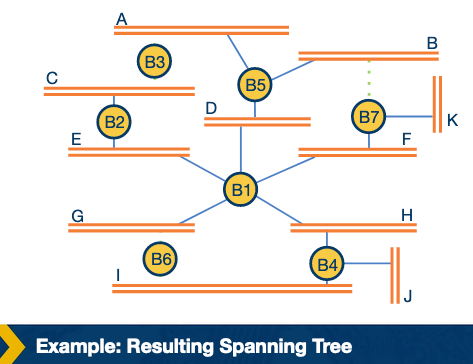
The algorithm converges when no bridge changes its view of the best configuration.

- All bridges agree on the same **root bridge**
- Each bridge has selected its **best path** toward the root
- **Forwarding and blocked ports no longer change**
- No bridge receives a better configuration message from any neighbor
- If topology changes (link failure, bridge goes offline), bridges exchange new messages and **recompute the spanning tree**

### Final Result

The converged spanning tree has two properties.

- All bridges remain **connected**
- There are **no cycles**
- Physical redundancy is preserved; only forwarding behavior is restricted to a loop-free subset of links

## Quiz
- Q: Some data link layer protocols, such 802.11 (WiFi), implement some basic error correction as the physical medium used is easily prone to interference and noise (such as a nearby running microwave). Is this a violation of the end-to-end principle?
  - No, because violations of the e2e principle typically refer to scenarios where it is not possible to implement a functionality entirely at the end hosts, such as NAT and firewalls. In this question, we have a lower level protocol implementing error checking.
- Q: Which of the following are ramifications of the “hourglass shape of the internet”?
  -   A. Many technologies that were not originally designed for the internet have been modified so that they have versions that can communicate over the internet (such as Radio over IP).
  -   B. It has been a difficult and slow process to transition to IPv6, despite the shortage of public IPv4 addresses. 

