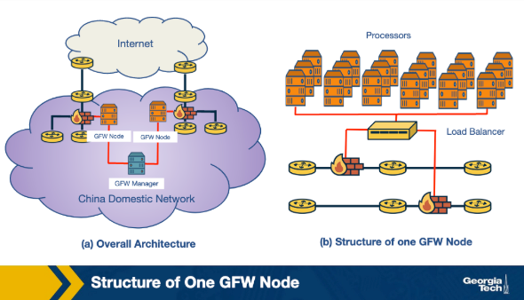
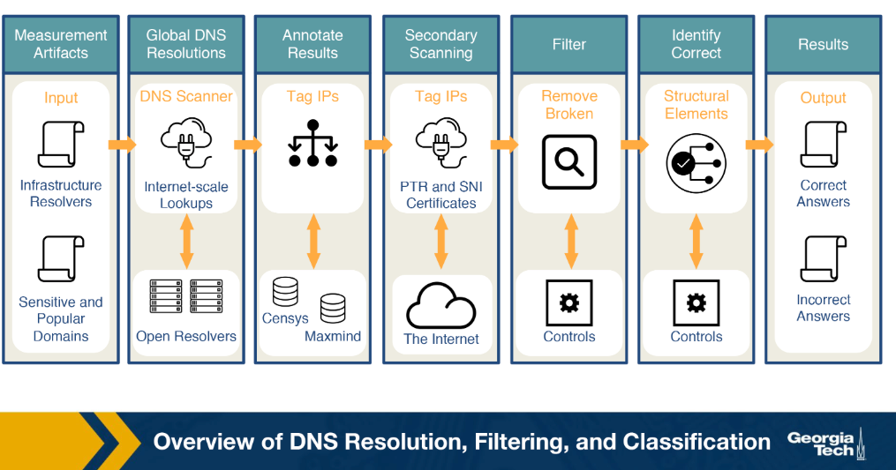
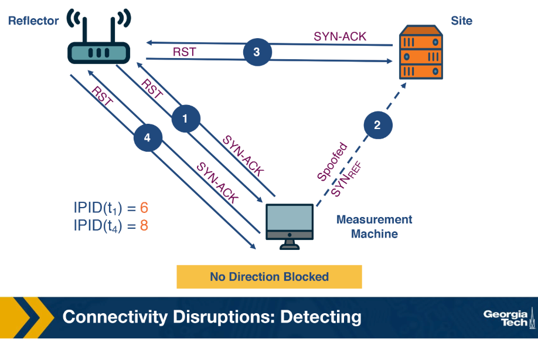
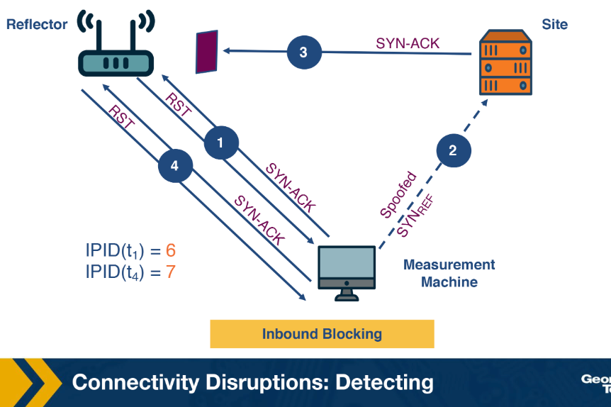
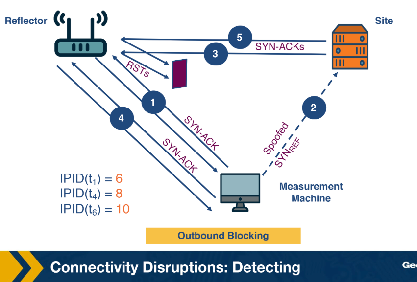

# Lesson 10

## Key concepts:
* DNS-based censorship
* Great Firewall of China
* DNS injection and fake DNS responses
* Packet dropping
* DNS poisoning
* Proxy-based content inspection
* IDS-based content inspection
* TCP reset injection
* Temporary connection blocking
* DNS manipulation measurement
* Open DNS resolvers and global vantage points
* Consistency and independent verifiability metrics
* Iris and DNS manipulation detection
* Connectivity disruptions
* Routing disruption and packet filtering
* Augur and TCP/IP side-channel measurement
* Measurement ethics and risks to users

## DNS Censorship: What is it?
- DNS censorship is a large-scale traffic filtering strategy used by networks to suppress material deemed objectionable by injecting fake DNS responses.

### The Great Firewall of China (GFW)

The GFW is a large-scale DNS censorship system that blocks access to foreign websites by injecting fake DNS record responses.

- **GFW properties identified by researchers**:
    - **Locality of GFW nodes**:
        - Two differing views on whether nodes exist only at edge ISPs or also in non-bordering Chinese ASes
        - Majority view is that censorship nodes are present at the edge
    - **Centralized management**:
        - Blocklists obtained from two distinct GFW locations are identical
        - Suggests a central management entity (GFW Manager) orchestrates the blocklists
    - **Load balancing**:
        - GFW load balances between processes based on source and destination IP address
        - Processes are clustered together to collectively send injected DNS responses

### Organizations Tracking the GFW

Several organizations continuously monitor Chinese censorship for censored domains.

- **greatfire.org**: monitoring since 2011
- **hikinggfw.org**: monitoring since 2012

## Example DNS Censorship Techniques (1)
- DNS injection is one of the most common censorship techniques used by the GFW, intercepting DNS probes and returning fake responses for blocked domains with over 99.9% accuracy.

### How DNS Injection Works

The GFW uses a ruleset to determine when to inject fake DNS replies to censor network traffic.

- **DNS injection process**:
    - DNS probe is sent to an open DNS resolver
    - Probe is checked against a blocklist of domains and keywords
    - For blocked domains, a fake DNS A record response is sent back

- **Two levels of domain blocking**:
    - Directly blocking the domain
    - Blocking based on keywords present in the domain

### Identifying Censored Networks

Researchers use probing techniques and vantage points to identify networks that use DNS injection.

- **Evaluation approach**:
    - Probes sent for both restricted and benign domains
    - Injected paths are searched for and evaluated
    - Accuracy of DNS open resolvers in polluting responses recorded at over 99.9%

## Example DNS Censorship Techniques (2)
- Censorship systems typically combine multiple techniques to filter network traffic, ranging from simple packet dropping to sophisticated content inspection.

### Technique 1: Packet Dropping

All network traffic going to a set of specific IP addresses is discarded rather than forwarded normally.

- **Strengths**:
    - Easy to implement
    - Low cost
- **Weaknesses**:
    - Blocklist maintenance is challenging to keep up to date
    - Overblocking: if two websites share the same IP, blocking one risks blocking both

### Technique 2: DNS Poisoning

A DNS query receives no answer or an incorrect answer, redirecting or misleading the user request.

- **Strength**:
    - No overblocking: the extra layer of hostname translation allows blocking specific hostnames rather than blanket IP blocking
- **Weakness**:
    - Blocks the entire domain; not possible to allow email contact while blocking the website

### Technique 3: Content Inspection

Content inspection examines network traffic for objectionable content rather than blocking by address alone.

- **Proxy-based content inspection**:
    - All traffic passes through a proxy where content is examined and objectionable requests are rejected
    - Strengths:
        - Precise censorship down to individual web pages or objects within a page
        - Flexible and works well in combination with other techniques like packet dropping and DNS poisoning
    - Weakness:
        - Not scalable due to large processing overhead on a large-scale network

- **IDS-based content inspection**:
    - Uses parts of an intrusion detection system to inspect network traffic
    - More cost-effective and easier to implement than proxy-based systems
    - Proactive rather than reactive: informs firewall rules for future censorship

### Technique 4: Blocking with Resets

The GFW sends TCP reset (RST) packets to block individual connections containing objectionable content.

- **Benign request example**:
    - cam(53382) → china(http) [SYN]
    - china(http) → cam(53382) [SYN, ACK]
    - cam(53382) → china(http) [ACK]
    - cam(53382) → china(http) GET / HTTP/1.0
    - china(http) → cam(53382) HTTP/1.1 200 OK — page served successfully

- **Flagged request example**:
    - cam(54190) → china(http) GET /?falun HTTP/1.0
    - china(http) → cam(54190) [RST] TTL=47, seq=1, ack=1
    - china(http) → cam(54190) [RST] TTL=47, seq=1461, ack=1
    - china(http) → cam(54190) [RST] TTL=47, seq=4381, ack=1
    - Three RST packets are sent corresponding to the sequence number of the flagged GET request to ensure the sender receives a reset

### Technique 5: Immediate Reset of Connections

After a flagged request, the censorship system suspends all traffic from that source for a short period.

- **Behavior**:
    - Following a request with flaggable keywords, subsequent legitimate GET requests continue to receive RST packets from the firewall
    - Blocking period is variable in duration

- **Example**:
    - cam(54191) → china(http) [SYN]
    - china(http) → cam(54191) [SYN, ACK] TTL=41
    - cam(54191) → china(http) [ACK]
    - china(http) → cam(54191) [RST] TTL=49, seq=1
    - Reset packet is sent by the firewall regardless of whether subsequent requests are legitimate

## Why is DNS Manipulation Difficult to Measure?
- Understanding global DNS censorship is limited by measurement diversity, scale, intent detection, and ethical risks associated with involving citizens in studies.

### Diverse Measurements

Censorship varies across countries, ISPs, and protocol layers, requiring widespread longitudinal measurements.

- **Sources of heterogeneity**:
    - Political dynamics vary, leading different ISPs to use different filtering techniques
    - Organizations may implement censorship at multiple layers of the Internet protocol stack
    - Example: one ISP may block traffic based on IP address while another blocks web requests based on keywords
- **What is needed**:
    - Widespread longitudinal measurements across countries, resolvers, and domains
    - Coverage spanning different geographic regions, ISPs, and regions within a single country

### Need for Scale

Early censorship measurement methods relied on volunteers, which is insufficient for the scale required.

- **Problem with volunteer-based methods**:
    - Requires volunteers to install software and run measurements on their own devices
    - Unlikely to reach the scale needed for comprehensive measurement
- **What is needed**:
    - Methods and tools that are independent of human intervention and participation

### Identifying Intent to Restrict Content Access

Detecting DNS manipulation requires identifying intent to block content, not just anomalous responses.

- **Challenge**:
    - Inconsistent or anomalous DNS responses can stem from misconfigurations, not just censorship
    - Identifying DNS manipulation requires detecting the intent to block access to content
- **What is needed**:
    - Reliance on multiple indications to infer DNS manipulation

### Ethics and Minimizing Risks

Involving citizens in censorship measurement studies carries legal and personal risks in certain countries.

- **Risks**:
    - Some countries penalize access to censored material
    - Using DNS resolvers in home networks of individual users exposes them to risk
- **Safer approach**:
    - Rely on open DNS resolvers hosted in Internet infrastructure such as ISPs or cloud hosting providers
    - Avoid using DNS resolvers or forwarders in individual users' home networks

## Example Censorship Detection Systems and Their Limitations
- Global censorship measurement tools use diverse vantage points to detect censorship, but most approaches face limitations in scale, continuity, or scope.

### Existing Approaches

- **CensMon**:
    - Used PlanetLab nodes in different countries as vantage points
    - No longer in use

- **OpenNet Initiative**:
    - Volunteers perform measurements on their home networks at different times
    - Has been in use for over a decade
    - Limitation: relying on volunteer efforts makes continuous and diverse measurements very difficult

- **Augur**:
    - New system that performs longitudinal global measurements using TCP/IP side channels
    - Focuses on identifying IP-based disruptions rather than DNS-based manipulations

## DNS Censorship: A Global Measurement Methodology
- Iris is a system that identifies DNS manipulation using open DNS resolvers across the globe and classifies responses using consistency and independent verifiability metrics.

### Data Collection

Iris uses open DNS resolvers located globally, restricted to infrastructure resolvers to avoid home routers misconfigured as open resolvers.

- **Steps to obtain resolvers**:
    - Scanning the Internet's IPv4 space for open DNS resolvers
    - Identifying infrastructure DNS resolvers from the broader set

### Measurement Process

- **Performing global DNS queries**:
    - Iris queries thousands of domains across thousands of open DNS resolvers
    - Three DNS domains under Iris's own control are included to establish a baseline for evaluation

- **Annotating DNS responses**:
    - IP addresses are annotated with auxiliary information including geo-location, AS, and port 80 HTTP responses
    - Information sourced from the Censys dataset

- **Additional PTR and TLS scanning**:
    - One IP address can host multiple websites via virtual hosting
    - Censys certificates from port 443 may differ from those retrieved via TLS's **Server Name Indication (SNI)** extension
    - This discrepancy could cause Iris to incorrectly label virtual hosting as DNS inconsistencies
    - PTR and SNI certificates are added to avoid this

### Classification Metrics

After annotating and cleaning the dataset, Iris uses two types of metrics to identify DNS manipulation.

- **Consistency metrics**:
    - Domain access should show consistent network properties, infrastructure, or content across global vantage points
    - Metrics used: IP address, Autonomous System, HTTP content, HTTPS certificate, PTRs for CDN

- **Independent verifiability metrics**:
    - Metrics that can be externally verified using outside data sources
    - Metrics used: HTTPS certificate and HTTPS certificate with SNI

- **Classification rule**:
    - If any consistency or independent verifiability metric is satisfied, the response is classified as correct
    - If no metric is satisfied, the response is classified as manipulated

## Censorship Through Connectivity Disruptions
- Connectivity disruption censorship ranges from completely blocking Internet access to more subtle software-based methods that interrupt routing or packet forwarding.

### Complete Blocking

The highest level of censorship is to fully block access to the Internet.

- **Manual disconnection**:
    - Physically disconnecting hardware critical to Internet connectivity
    - May not be feasible as infrastructure can be distributed over a wide area

### Routing Disruption

Disrupting BGP communication on critical routers can render large parts of a network unreachable.

- **How it works**:
    - Routers use BGP to share reachable destinations and update forwarding tables
    - Disabling or disrupting BGP communication on critical routers causes large-scale unreachability
- **Detection**:
    - Easily detectable as it involves withdrawing previously advertised prefixes or re-advertising them with different properties
    - Modifies the global routing state of the network on the control plane

### Packet Filtering

Packet filtering blocks packets matching certain criteria to disrupt normal forwarding behavior.

- **How it works**:
    - Typically used as a security mechanism in firewalls and switches
    - Can be repurposed to block packets matching specific criteria
- **Detection**:
    - Harder to detect than routing disruption
    - May require active probing of the forwarding path or monitoring traffic of the impacted network

### Other Connectivity Disruption Methods

Connectivity disruption can occur at multiple layers beyond routing and packet filtering.

- **Additional methods**:
    - DNS-based blocking
    - Deep packet inspection by an ISP
    - Client software blocking traffic

## Connectivity Disruptions: Detection
- Augur uses a measurement machine and IP ID side channels to detect filtering between a reflector and a site without direct access to either host.

### Key Concepts

- **Reflector**: a host that maintains a global IP ID counter
- **Site**: a host that may be potentially blocked
- **Measurement machine**: a third machine used to detect filtering between the reflector and site

### IP ID

Augur exploits the global IP ID counter maintained by hosts to infer whether packets are being filtered.

- **IP ID**:
    - Every packet sent by a host is assigned a unique 16-bit IP identifier
    - Used by the destination host to reassemble fragmented packets
    - Global counter is incremented for each packet generated by the host
    - Allows inference of whether and how many packets a host has generated
- **Additional assumption**:
    - When an unexpected TCP packet is sent to a host, it responds with a TCP RST packet
    - No complex factors such as cross-traffic or packet loss are assumed

### Probing

Probing monitors the IP ID of a reflector over time.

- **Process**:
    - Measurement machine sends a TCP SYN-ACK to the reflector
    - Reflector responds with a TCP RST packet containing its latest IP ID
    - Measurement machine tracks the reflector's IP ID counter at any given point

### Perturbation

Perturbation forces a host to increment its IP ID counter by sending spoofed traffic.

- **Process**:
    - Measurement machine sends a spoofed TCP SYN to the site with the reflector's IP as the source address
    - Site responds to the reflector with a TCP SYN-ACK packet
    - Reflector sends a TCP RST to the site and increments its global IP ID counter by 1

### Filtering Detection Scenarios
Assume the reflector's initial IP ID counter is 5.

- **No filtering**:
    - 
    - Measurement machine probes reflector → receives IP ID = 6
    - Measurement machine perturbs site → site sends SYN-ACK to reflector → reflector increments IP ID to 7 and sends RST
    - Measurement machine probes reflector again → receives IP ID = 8
    - IP ID difference of 2 between first and last probe indicates communication occurred between the two hosts

- **Inbound blocking** (filtering on path from site to reflector):
    - 
    - SYN-ACK from site does not reach the reflector
    - Reflector generates no response and IP ID does not increment
    - Final probe returns IP ID = 7
    - IP ID difference of 1 indicates filtering on the path from site to reflector

- **Outbound blocking** (filtering on outgoing path from reflector):
    - 
    - Reflector receives SYN-ACK and sends RST, incrementing IP ID to 7
    - RST does not reach the site
    - Site resends SYN-ACK packets at regular intervals, causing further IP ID increments
    - Final probe reveals IP ID has increased by 2 again, indicating retransmission has occurred
    - Pattern of retransmission-driven increments indicates outbound blocking

## 

## 

## 

## 

## 

## 

## 

## 

## 

## 
