# Lesson 11

## Key concepts:
* Multimedia applications and network requirements
* Voice over IP
* Audio and video characteristics
* Compression and encoding
* Streaming stored audio and video
* Conversational voice and video
* Live streaming
* Buffering and continuous playout
* Latency, jitter, and packet loss
* Bitrate adaptation
* Quality of Experience

## Background: Video and Audio Characteristics
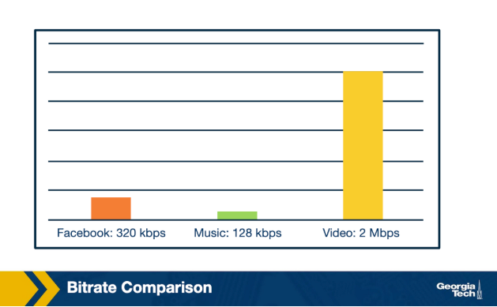

- Basic properties of video and audio bit rate and compression, providing context for later discussions like bitrate adaptation algorithms.

### Video Properties

Video is defined first by its high bit rate compared to other media.

- **High bit rate**:
    - Typically ranges from **100 kbps** to over **3 Mbps**, depending on video quality
    - Far higher than browsing an online photo gallery or listening to streaming music
        - Example: a user flipping through a photo gallery at about one photo per second has a much lower typical rate
- **Compression**:
    - Video can be compressed at varying levels
    - Different techniques offer trade-offs between compression level and video quality
        - These techniques are covered later in the lesson

### Audio Properties

Audio behaves differently from video despite having a lower bit rate.

- **Lower bit rate**:
    - Audio has a lower bit rate than video
- **Sensitivity to glitches**:
    - Audio glitches are generally more noticeable than video glitches
        - In a video conference, video freezing briefly is usually acceptable
        - Audio cutting out or becoming garbled is much more disruptive and may require canceling or rescheduling the conference
- **Compression**:
    - Audio, like video, can be compressed at varying quality levels

## Types of Multimedia Applications and Characteristics
- The three major categories of multimedia applications, and their key characteristics.

### Overview

Multimedia applications can be organized into three major categories.

- **Streaming stored audio and video**:
    - Example: video clips on Udacity for OMSCS courses
- **Conversational voice and video over IP**:
    - Example: Skype
- **Streaming live audio and video**:
    - Example: the graduation ceremony for GATech on graduation day

### Streaming Stored Video

Streaming stored video has several defining characteristics.

- **Streamed**:
    - Playback starts within a few seconds of receiving data
    - Does not wait for the entire file to download first
- **Interactive**:
    - Users can pause, fast forward, skip ahead, or move back
    - The response to these actions appears within a few seconds
- **Continuous playout**:
    - Plays out the same way it was recorded
    - Should not freeze up in the middle
- **Storage and delivery model**:
    - Files are generally stored on a **CDN** rather than a single data center
    - Can also be implemented using the peer-to-peer model instead of the client-server model

### Streaming Live Audio and Video

Streaming live audio and video is similar to streaming stored video but has some important differences.

- **Simultaneous users**:
    - Generally involves many simultaneous users
        - Users can be in very different geographic locations
- **Delay sensitivity**:
    - Delay-sensitive, but less so than conversational voice and video
    - A **ten second** delay is generally acceptable
    - Discussed in more detail later in the lesson

### Conversational Voice and Video over IP

Conversational voice and video over IP, or **VoIP**, resembles traditional phone service but runs over the Internet.

- **VoIP**:
    - Stands for **Voice over IP**
    - Functions like phone service, but goes over the Internet instead of a traditional circuit-switched telephony network
- **Participants**:
    - Calls or video conferences often involve three or more participants
- **Delay sensitivity**:
    - Highly delay-sensitive since calls are real-time and involve human interaction
        - A delay of less than **150 milliseconds** is not really noticeable
        - A delay of over **400 milliseconds** can be frustrating and cause people to accidentally talk over each other
- **Loss tolerance**:
    - Loss-tolerant, unlike its sensitivity to delay
        - Techniques exist to conceal occasional glitches
        - Even if a word gets garbled, human listeners can usually just ask the other side to repeat themselves

## How Does VoIP Work?
- A closer look at conversational voice over IP, covering encoding and signaling as two of its major topics.

### Overview

VoIP faces the challenge of running over the best-effort Internet, which makes no guarantees a datagram will arrive, or arrive on time.

- **Major topics**:
    - Encoding
    - Signaling
    - QoS (Quality of Service) metrics
        - These topics also apply, to varying degrees, to other multimedia applications

### Encoding

Analog audio is a continuous wave, but digital data is discrete, so digital representations of analog audio are only approximations.

- **Sampling and quantization**:
    - Audio is encoded by taking many (thousands) of samples per second
    - Each sample's value is rounded to a discrete number within a range
        - This rounding process is called **quantization**
    - More samples per second, or a larger range of quantization values, produces a closer approximation to the analog signal
        - This means higher playback quality
        - The tradeoff is a higher bit rate needed for playback
- **PCM (Pulse Code Modulation)**:
    - An example encoding technique used with speech
        - Takes **8000** samples per second, with each sample **8 bits** long
    - Also used with audio CDs
        - Takes **44,100** samples per second, with each sample **16 bits** long
- **Encoding schemes**:
    - Three major categories: narrowband, broadband, and multimode
        - Multimode can operate as either narrowband or broadband
    - For VoIP, the goal is to keep speech understandable while using as little bandwidth as possible
- **Compression**:
    - Audio can also be compressed, with its own tradeoffs
        - Concepts like how packet loss interferes with compression techniques apply to both audio and video
        - Video compression is discussed later in the lesson

### Signaling

In traditional telephony, a signaling protocol handles how calls are set up and torn down, and VoIP uses signaling protocols for the same purpose.

- **Major functions**:
    - **User location**:
        - The caller locates where the callee is
    - **Session establishment**:
        - Handles the callee accepting, rejecting, or redirecting a call
    - **Session negotiation**:
        - Endpoints synchronize with each other on a set of properties for the session
    - **Call participation management**:
        - Handles endpoints joining or leaving an existing session
- **SIP (Session Initiation Protocol)**:
    - One example of a signaling protocol used in many VoIP applications

## QoS for VoIP: Metrics
There are three major QoS metrics for VoIP:
* end-to-end delay
* jitter
* packet loss

## QoS for VoIP: End-to-End Delay
- The first QoS metric for VoIP, end-to-end delay, and how it affects call quality.

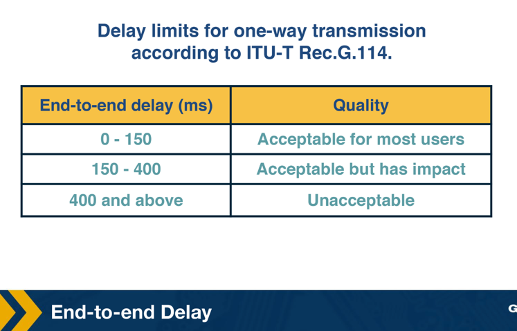

### End-to-End Delay

End-to-end delay is the total delay from mouth to ear, made up of several accumulated sources.

- **Sources of delay**:
    - Encoding delay
        - The time it takes to encode the audio
    - Packetization delay
        - The time it takes to put the audio into packets
    - Network delay
        - Normal sources of network delay that traffic encounters, such as queueing delays
    - Playback delay
        - Comes from the receiver's playback buffer
        - A mitigation technique for delay jitter
    - Decoding delay
        - The time it takes to reconstruct the signal
- **Impact on human listeners**:
    - Below **150ms**: not noticeable
    - Between **150ms** and **400ms**: noticeable, but perhaps acceptable depending on the purpose of the call and user expectations
        - Example: more acceptable when calling a more remote region
    - Greater than **400ms**: starts becoming unacceptable, as people begin accidentally talking over each other
- **Delay thresholds**:
    - VoIP applications frequently set a delay threshold, such as **400ms**
    - Packets received with a delay greater than the threshold are discarded
        - These packets are effectively treated as lost

## QoS for VoIP: Delay Jitter
- The second QoS metric for VoIP, delay jitter, and how it is mitigated.

### Delay Jitter

Different voice packets can end up with different amounts of delay due to varying buffer sizes, queueing delays, and network congestion levels, a phenomenon called jitter, packet jitter, or delay jitter.

- **Problem with jitter**:
    - Interferes with reconstructing the analog voice stream
    - Large jitter leads to more delayed packets being discarded
        - This can lead to a gap in the audio
        - Too many dropped sequential packets can make the audio unintelligible
    - The human ear is pretty intolerant of audio gaps
        - Audio gaps should ideally be kept below **30ms**
        - Gaps between **30 to 75ms** can be acceptable, depending on the voice codec used and other factors
- **Jitter buffer**:
    - The main mechanism for mitigating jitter, also called the play-out buffer
    - Smooths out and hides the variation in delay between received packets by buffering them and playing them out for decoding at a steady rate
    - **Tradeoff**:
        - A longer jitter buffer reduces the number of packets discarded for being received too late, but adds to end-to-end delay
        - A shorter jitter buffer doesn't add to end-to-end delay as much, but can lead to more dropped packets, reducing speech quality

## QoS for VoIP: Packet Loss

- The third QoS metric for VoIP, packet loss, and the methods used to deal with it.

### Packet Loss

Packet loss is pretty much inevitable since VoIP operates on the Internet, a best-effort service.

- **TCP vs UDP**:
    - VoIP protocols could use TCP, since TCP eliminates packet loss by retransmission
        - Retransmitted packets are no good if they are received too late
        - TCP congestion control algorithms drop the sender's transmission rate every time there's a dropped packet
            - This can cause the sender's transmission rate to drop below the receiver's drain rate from playing out the audio
    - Most of the time, VoIP protocols use UDP instead
- **Definition of packet loss for VoIP**:
    - A packet is lost if it either never arrives OR if it arrives after its scheduled playout
        - This is a harsher definition than for other applications, such as file transfers
    - VoIP can tolerate loss rates of between **1 and 20 percent**, depending on the voice codec used and other factors
- **Methods for dealing with packet loss**:
    - FEC (Forward Error Correction)
    - Interleaving
    - Error concealment

### FEC (Forward Error Correction)
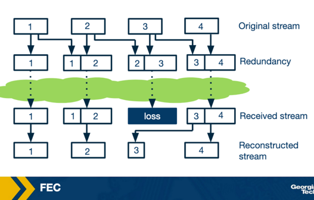

FEC works by transmitting redundant data alongside the main transmission, allowing the receiver to replace lost data with the redundant data.

- **Redundant data types**:
    - A copy of the original data
        - Done by breaking the audio into chunks and using exclusive OR (XOR) with n previous chunks
    - A lower-quality audio stream transmitted alongside the original stream
        - Similar to how a spare tire in a car may be of lower quality than the normal tires, but enough to get by in the case of a flat tire
- **Tradeoff**:
    - The more redundant data transmitted, the more bandwidth is consumed
    - Some FEC techniques require the receiving end to receive more chunks before playing out the audio, which increases playout delay

### Interleaving
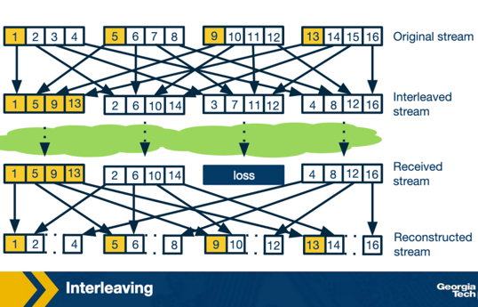

Interleaving does not transmit any redundant data, so it doesn't add extra bandwidth requirements or overhead.

- **How it works**:
    - Mixes chunks of audio together so that if one set of chunks is lost, the lost chunks aren't consecutive
        - The idea is that many smaller audio gaps are preferable to one large audio gap
        - The human ear is pretty intolerant of audio gaps, and ideally audio gaps should be under **30ms**
- **Tradeoff**:
    - The receiving side has to wait longer to receive consecutive chunks of audio, which increases latency
        - Limits its usefulness for VoIP
        - Can have good performance for streaming stored audio

### Error Concealment

Error concealment involves guessing what a lost audio packet might be, possible because small audio snippets, between **4ms and 40ms**, tend to have similarity to the next audio snippet.

- **Principle**:
    - The same principle that makes audio compression possible
- **Packet repetition**:
    - Replaces the lost packet with a copy of the previous packet
        - Computationally cheap
        - Works pretty well in a lot of cases
- **Interpolation**:
    - Uses the audio before and after the lost packet to calculate a guess for an appropriate packet
        - A better solution than packet repetition
        - More computationally expensive

## Live/On Demand Streaming Introduction
- An introduction to streaming media content over the Internet, its enabling technologies, and its two main content categories.

### Overview

Streaming media content over the Internet accounts for nearly 60-70% of Internet traffic.

- **Enabling technologies and trends**:
    - Bandwidth for both the core network and last-mile access links has increased tremendously over the years
    - Video compression technologies have become more efficient
        - Enables streaming high-quality video without using a lot of bandwidth
    - The development of Digital Rights Management culture has encouraged content providers to put their content on the Internet

### Types of Streamed Content

Content streamed over the Internet can be divided into two categories.

- **Live**:
    - Video content is created and delivered to clients simultaneously
        - Examples: streaming of sports events, music concerts
- **On-demand**:
    - Streaming stored video based on users' convenience
        - Examples: watching videos on Netflix, non-live videos on YouTube
- **Constraints**:
    - Constraints for streaming live and on-demand content differ slightly
        - One main constraint: there is not a lot of room for pre-fetching content in the case of live streaming
    - Most of the basic principles behind streaming live at large-scale and on-demand content are similar, apart from a few details such as video encoding
        - This lesson focuses mainly on understanding streaming of on-demand video

## Video Streaming Bigger Picture
- A high-level overview of the steps involved in video streaming.

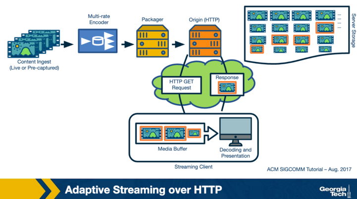

### Steps in Video Streaming

The video content is first created, then goes through several steps before reaching the end-user.

- **Content creation**:
    - Created in a professional studio, or using a smartphone by a user
        - The raw recorded content is typically at a high quality
- **Encoding**:
    - The content is compressed using an encoding algorithm
- **DRM and hosting**:
    - The encoded content is secured using DRM and hosted over a server
- **Distribution**:
    - Content providers have their own data centers, such as Google, or use third-party Content Delivery Networks
        - Replicates the content over multiple geographically distributed servers
        - Ensures that content can be delivered in a scalable manner
- **Download**:
    - End-users download the video content over the Internet
- **Decoding and rendering**:
    - The downloaded video is decoded and rendered on the user's screen

### Questions to Explore

The remaining lesson delves deeper into these steps.

- **Video compression**:
    - How does video compression work?
- **Delivery protocols**:
    - What application and transport-layer protocols are used for video delivery?
- **Diversity of conditions**:
    - How do we ensure that the same content can be watched under a diversity of network conditions and using different user devices?

## Optional: VBR vs CBR
- Two methods for using video compression's quality-versus-size tradeoff knobs: constant bitrate and variable bitrate encoding.

### Encoding Methods

Video compression algorithms provide knobs to control the trade-off between output image quality and size, which can be used in two ways.

- **Constant bitrate encoding (CBR)**:
    - The output size of the video is fixed over time
- **Variable bitrate encoding (VBR)**:
    - The output size remains the same on average, but varies based on the underlying scene complexity
- **Comparison**:
    - Image quality is better in VBR compared to CBR for the same bitrate
    - VBR is more computationally expensive compared to CBR
- **Computational cost**:
    - Video compression in general requires heavy computation
        - For live streaming, where compression has to be done real-time, specialized but expensive hardware encoders are used by content providers

## UDP vs TCP
- Why TCP is chosen as the transport protocol for delivering compressed video to clients.

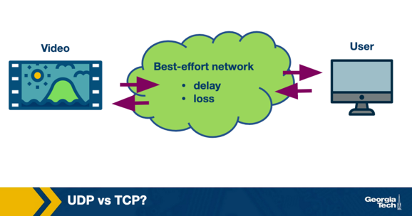

### Choosing a Transport Protocol

The compressed video, stored on a server, needs to be delivered reliably to the client because decoding can fail if data is lost.

- **Decoding failure risk**:
    - If an I-frame is lost partially, the RGB matrices may not be obtained correctly
    - If an I-frame is lost, a P-frame cannot be decoded
- **Requirement**:
    - A transport protocol is needed that ensures data is delivered reliably over the Internet, which is a best-effort network
- **TCP vs UDP**:
    - Content providers ended up choosing TCP for video delivery, as it provides reliability
        - An additional benefit is that TCP already provides congestion control
            - Required for effectively sharing bandwidth over the Internet

## Why Do We Use HTTP?
- Two approaches for the application-layer protocol used for video delivery, and why HTTP was ultimately chosen.

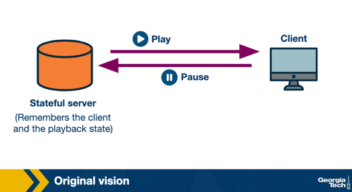

### Choosing an Application-Layer Protocol

There were two options considered for the application-layer protocol used for video delivery.

- **Specialized video servers**:
    - The original vision was to have specialized video servers that remembered the state of the clients
        - These servers would control the sending rate to the client
        - If a client paused the video, it would send a signal to the server, and the server would stop sending video
    - All the intelligence would be stored at a centralized point, and clients would have to do a minimal amount of work
        - Required content providers to buy specialized hardware
- **HTTP**:
    - The server is essentially stateless, and the intelligence to download the video is stored at the client
    - **Advantages**:
        - Content providers could use the already existing CDN infrastructure
        - Made bypassing middleboxes and firewalls easier, since they already understood HTTP
- **Outcome**:
    - Because of these advantages, the original vision was abandoned, and content providers ended up using HTTP for video delivery

## Progressive Download vs Streaming
- How the client fetches video content from a stateless HTTP server, using byte-range requests and a playout buffer.

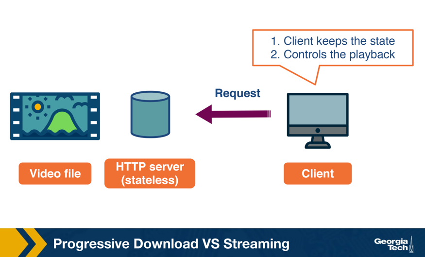

### Downloading the Entire File

One way to stream the video would be to send an HTTP GET request for video, essentially like downloading a file over HTTP.

- **Basic HTTP download**:
    - The server sends the data as fast as possible, with the download rate limited only by TCP rate control mechanisms
- **Disadvantages**:
    - Users often leave the video mid-way
        - Downloading the entire file can lead to a waste of network resources
    - Video content downloaded but not yet played would have to be stored
        - Requires a video buffer at the client to store this content in memory
        - Can be an issue particularly with long videos, as a large buffer would be required

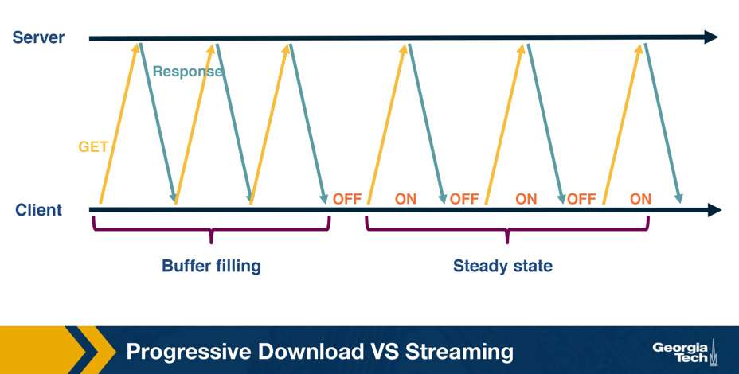

### Byte-Range Requests

Instead of downloading the content all at once, the client tries to pace it.

- **Pacing mechanism**:
    - Done by sending byte-range requests for part of the video, instead of requesting the entire video
    - Once the video content has been watched, the client sends a request for more content
        - Ideally, this should be enough for streaming without stalls

### Playout Buffer

Downloading video content takes time depending on network throughput, which is variable due to the Internet being best-effort, leading to unnecessary stalling if the client is doing pure streaming.

- **Playout buffer**:
    - The client pre-fetches some video ahead and stores it in a playout buffer to account for throughput variations
    - Usually defined in terms of number of seconds of video downloaded in advance, or in terms of size in bytes
        - Example: the video buffer can be 5 seconds
    - Once the video buffer becomes full, the client waits for it to get depleted before asking for more content
- **Streaming states**:
    - Filling state
        - Happens when the video buffer is empty and the client tries to fill it as soon as possible
        - Example: at the beginning of playback, the client tries to download as fast as possible until the buffer becomes full
    - Steady state
        - After the buffer has become full, the client waits for it to become lower than a threshold, then sends a request for more content
        - Characterized by ON-OFF patterns

## How to Handle Network and User Device Diversity?
- How diversity in devices and network conditions leads to multi-bitrate encoding and bitrate adaptation, coordinated through a manifest file.

### Diversity in Streaming Context

A client's streaming context can be quite diverse in terms of device and network environment.

- **Device diversity**:
    - Devices range from a small-screen smartphone to a large-screen TV
        - A low bitrate that looks good on a smartphone may not look great on a TV
- **Network diversity**:
    - Some viewers may be on a fixed connection or WiFi access point with high Internet speed
    - Others may be on a cellular connection or a spotty Internet connection
        - A high bitrate video can stream seamlessly over a high-speed connection, but not without stalls over a spotty connection
- **Transient throughput**:
    - Example: a 2 Mbps connection watching a video encoded at 1.5 Mbps
        - If another family member starts downloading a file, available bandwidth reduces to 1 Mbps
        - There is no way to watch the video without stalls, degrading the streaming experience

### Multi-Bitrate Encoding

A single-bitrate encoded video is not the best solution given this diversity, so content providers encode their video at multiple bitrates chosen from a set of pre-defined bitrates.

- **Segmentation and encoding**:
    - The video is chunked into segments, usually of equal duration
    - Each segment is encoded at multiple bitrates and stored at the server
    - The client specifies the desired quality when requesting a segment
        - Example: a Star Trek episode divided into 5s segments, each encoded at 250kbps, 500 kbps, 1.5 Mbps, 3Mbps, and 6 Mbps
    - A higher bitrate usually leads to higher video quality
- **Bitrate adaptation**:
    - Example: watching over a 2 Mbps connection
        - Stream at 1.5 Mbps for the best possible quality
        - When available bandwidth reduces due to a background download, reduce video quality and stream at 500 kbps to avoid stalls
        - When the background download finishes and throughput returns to 2 Mbps, resume streaming at 1.5 Mbps
    - Mechanisms for bitrate adaptation will be looked at in detail shortly

### Manifest File

The client needs to know the different encoding bitrates available and the URL of each video segment.

- **Manifest file**:
    - Downloaded by the client over HTTP at the beginning of every video session
    - Contains all the metadata information about the video content and the associated URLs

## Bitrate Adaptation in DASH
- A summary of DASH and an introduction to the bitrate adaptation function.

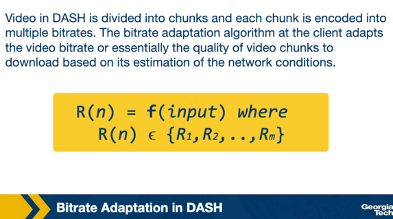

### DASH Summary

The content-provider encodes the video and stores it on a web server, and the video player downloads content using HTTP/TCP while dynamically adjusting the bitrate.

- **DASH**:
    - Stands for Dynamic Streaming over HTTP
        - "Dynamic" signifies the dynamic bitrate adaptation
    - The client dynamically adjusts the video bitrate based on network conditions and device type
- **Implementations**:
    - Multiple implementations exist, with HLS and MPEG-DASH being the most popular
        - Differ in details such as encoding algorithms, segment sizes, DRM support, bitrate adaptation algorithms, etc.

### Bitrate Adaptation Function

In DASH, a video is divided into chunks, and each chunk is encoded into multiple bitrates.

- **Function f**:
    - Called each time the video player needs to download a video chunk
    - Takes in some input and outputs the bitrate of the chunk to be downloaded
        - R(n) denotes the set of available bitrates
    - Adapts the video bitrate, or quality of video chunks to download, based on the client's estimation of network conditions
- **Variations**:
    - Different functions for bitrate adaptation can take into account different kinds of input
    - Upcoming topics will cover:
        - What kind of input the function takes
        - How it uses the input to decide the quality of the video chunk
        - What it tries to optimize while doing bitrate adaptation

## What are the Goals of Bitrate Adaptation?
- The goals of a bitrate adaptation algorithm, centered on optimizing the user's Quality of Experience (QoE).

### Quality of Experience (QoE)

A bitrate adaptation algorithm essentially tries to optimize the user's viewing quality of experience, characterized by several factors.

- **Low or zero re-buffering**:
    - Users typically tend to close the video session if the video stalls a lot
- **High video quality**:
    - Better the video quality, better the user QoE
        - A higher video quality is usually characterized by high bitrate video chunks
- **Low video quality variations**:
    - A lot of video quality variations are also known to reduce the user QoE
- **Low startup latency**:
    - Startup latency is the time it takes to start playing the video since the user first requested to play it
        - Players typically fill up the video buffer a little before playing the video
        - This lesson skips startup latency and focuses on the other three metrics

### Conflicting Metrics

The different metrics characterizing QoE are conflicting.

- **Quality vs re-buffering**:
    - To have high video quality, the player can download higher bitrate chunks
        - This can lead to re-buffering if network conditions are not good
- **Avoiding re-buffering**:
    - The player can download the lowest bitrate, leading to low video quality
    - Or the player can change the video bitrate as soon as it notices a change in network conditions, leading to high video quality variations
- **Overall goal**:
    - A good bitrate adaptation algorithm considers these trade-offs and maximizes the overall user Quality of Experience

## Bitrate Adaptation Algorithms
- The two main signals that serve as input to a bitrate adaptation algorithm: network throughput and video buffer.

### Adaptation Signals
Different signals can inform the decision of which bitrate to select for the next video chunk.

- **Network Throughput**:
    - The network conditions, or more specifically, the network throughput
        - Ideally, select a bitrate equal to or lesser than the available throughput
    - Bitrate adaptation using this signal is known as rate-based adaptation
- **Video Buffer**:
    - The amount of video in the buffer can inform the decision of the video bitrate for the next chunk
        - If the video buffer is nearly full, the player can possibly afford to download high-quality chunks
        - If the video buffer is nearly depleted, the player can download low-quality chunks to quickly fill up the buffer and avoid re-buffering
    - Bitrate adaptation based on the video buffer is known as buffer-based adaptation
- **Combined use**:
    - The remaining lesson looks at an example of each kind of adaptation algorithm
    - In practice, video players end up using both the network throughput and the video buffer together for bitrate adaptation

## Throughput-Based Adaptation and its Limitations
- How throughput-based adaptation works, using the video buffer's filling and depletion rates.

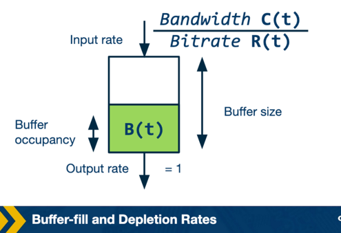

### Buffer Filling and Depletion

The video buffer can be modeled as a queue, which fills as a new chunk is downloaded and depletes as the video content is played.

- **Buffer-filling rate**:
    - The network bandwidth divided by the chunk bitrate
        - Example: available bandwidth of 10 Mbps and chunk bitrate of 1 Mbps
            - In 1 second, 10s of video can be downloaded
            - The buffer-filling rate is 10
- **Buffer-depletion rate**:
    - The output rate, simply 1
        - 1s of video content gets played in 1s

### Stall-Free Streaming Condition

For stall-free streaming, the buffer-filling rate should be greater than the buffer-depletion rate.

- **Condition**:
    - C(t)/R(t) > 1, or C(t) > R(t)
        - C(t) is the future bandwidth, which cannot be known
- **Estimating future bandwidth**:
    - A good estimate of the future bandwidth is the bandwidth observed in the past
        - The previous chunk throughput is used to decide the bitrate of the next chunk

## Rate-based Adaptation Mechanisms
- The steps of a simple rate-based adaptation algorithm: estimation and quantization.

### Algorithm Steps

A simple rate-based adaptation algorithm has two main steps.

- **Estimation**:
    - Involves estimating the future bandwidth
        - Done by considering the throughput of the last few downloaded chunks
        - A smoothing filter, such as moving average or the harmonic mean, is typically used over these throughputs
- **Quantization**:
    - Maps the continuous throughput to a discrete bitrate
        - Selects the maximum bitrate that is less than the estimate of the throughput, including a factor in this selection

### Reason for the Factor

A factor is added to the throughput estimate for a few reasons.

- **Conservative estimate**:
    - Being a little conservative in the estimate of future bandwidth avoids any re-buffering
- **VBR encoding**:
    - If the chunks are VBR-encoded, their bitrate can exceed the nominal bitrate
- **Overheads**:
    - Additional application and transport-layer overheads are associated with downloading the chunk

### Download Process

Once the chunk bitrate is decided, the player sends the HTTP GET request for the next chunk.

- **Buffer check**:
    - A new chunk is not downloaded if the video buffer is already full
        - The player waits for the buffer to deplete before sending the next request
- **Repeating the process**:
    - Once the new chunk is downloaded, its download throughput is taken into account in estimating the next chunk's bitrate
        - The same process is repeated for downloading the next chunk

## Issues with Bitrate Adaptation
- An introduction to an important issue with rate-based adaptation: errors in future bandwidth estimation.

### Bandwidth Estimation Errors
Rate-based adaptation can end up either overestimating or underestimating the future bandwidth, leading to selection of a nonoptimal chunk bitrate.

- **Cases to examine**:
    - Overestimation
    - Underestimation

## Problem of Bandwidth OVER-Estimation with Rate-Based Adaptation
- How rate-based adaptation can lead to overestimation of future bandwidth when bandwidth drops rapidly.

### Overestimation Scenario

Consider a case where bandwidth is 5 Mbps for the first 20 seconds and then drops to 375 kbps.

- **Setup**:
    - Available bitrates: {250kbps, 500 kbps, 1 Mbps, 2 Mbps, 3 Mbps}
    - Chunk size: 3 Mbps
    - Initially, the player streams at 3 Mbps
    - At t = 20 seconds, bandwidth drops to 375 kbps, high enough only to play at the lowest bitrate
        - Buffer occupancy at this time was 15 seconds
- **Consequence**:
    - The video player has no way of knowing the bandwidth has reduced, so it requests a 3 Mbps chunk
        - Downloading this 5-second chunk takes 3Mbps * 1000 * 5sec / 375kbps, or 40 seconds
    - Meanwhile, the video player buffer will deplete, and the video will eventually re-buffer
    - If the player uses a weighted average, it may take even more time to reflect the drop in bandwidth
        - The player may end up requesting a higher bitrate than it should
- **Conclusion**:
    - When bandwidth changes rapidly, the player takes some time to converge to the correct estimate of bandwidth
        - This can sometimes lead to an overestimation of the future bandwidth

## Problem of Bandwidth UNDER-Estimation with Rate-Based Adaption
- How rate-based adaptation can lead to underestimation of bandwidth, causing a DASH client to converge to an unfairly low bitrate.

### Underestimation Scenario

Consider a client watching a video over a 5 Mbps link.

- **Setup**:
    - Available bitrates: {235kbps, 375kbps, 560 kbps, 750kbps, 1050kbps, 1400kbps, 1750kbps}
    - The client streams at 1.75 Mbps under rate-based adaptation
    - Another client joins and starts downloading a large file
- **Expected vs actual outcome**:
    - Ideally, both clients would get equal network bandwidth, i.e., 2.5 Mbps, since both use TCP
        - The video client should continue streaming at 1.75 Mbps
    - Instead, the client picks a lower bitrate and eventually goes all the way down to 235 kbps

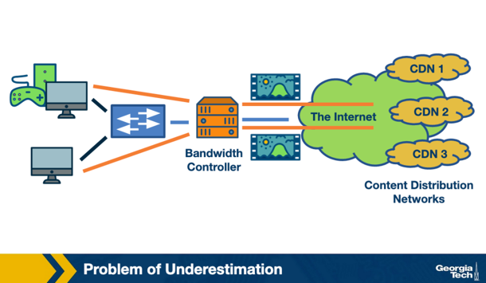

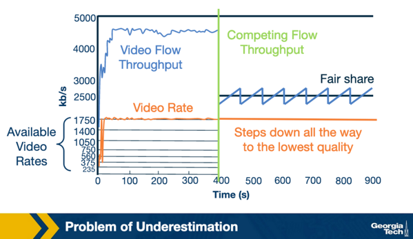

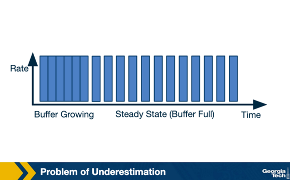

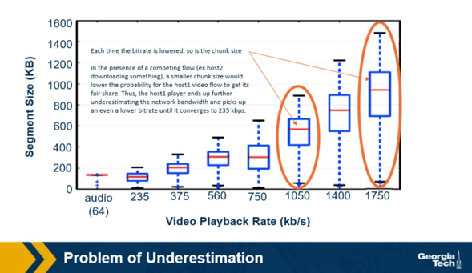

### Why This Happens

The problem stems from the ON-OFF pattern of DASH clients in the steady state.

- **ON-OFF pattern**:
    - Occurs when the video client's buffer is filled and it waits for it to deplete before requesting the next chunk
    - In this OFF period, the TCP connection resets the congestion window
        - Impacts the throughput observed for the chunk download, since the TCP flow has a competing flow
- **TCP convergence**:
    - While TCP is fair, it takes time for flows to converge to their fair share of bandwidth
        - The chunk download can finish before TCP actually converges to the fair share
    - Example: observed throughput for a chunk was only 1.6 Mbps
        - The player picks a lower bitrate, 1050 kbps, because rate estimation is conservative, using a factor of alpha
- **Chunk size effect**:
    - As bitrate becomes lower, chunk size reduces
        - In the presence of a competing flow, a smaller chunk size lowers the probability of the video flow getting its fair share
    - This further aggravates the problem, causing the player to underestimate the network bandwidth further and pick an even lower bitrate, until it converges to 235 kbps
- **Root cause**:
    - This problem happens because of the ON-OFF behavior in DASH
        - Had it been two competing TCP flows, they would have gotten their fair share
    - Can also happen between competing DASH players, leading to an unfair allocation of network bandwidth

## Rate-Based Adaptation Conclusion
- A summary of rate-based adaptation and its core limitation.

### Summary

Rate-based adaptation picks the chunk bitrate based on estimation of available network bandwidth.

- **Estimation approach**:
    - The actual available bandwidth is unknown and variable
    - Past throughput is used as a proxy for the available bandwidth
- **Limitation**:
    - This reactive estimation can lead the player to sometimes underestimate or overestimate the bandwidth under different scenarios

## Optional Reading: Bitrate Adaptation Algorithm: Buffer-Based
- An alternative bitrate adaptation approach that uses buffer occupancy instead of network throughput to select bitrate.

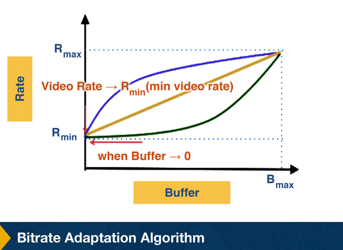

### Buffer-Based Adaptation Function

The bitrate of the chunk is a function of the buffer occupancy: R_next = f(buffer_now).

- **Function design**:
    - If the buffer occupancy is low, the player should download a low bitrate chunk
    - The chunk quality should increase as buffer occupancy increases
    - The bitrate adaptation function should be an increasing function with respect to the buffer occupancy
        - Example functions shown are all increasing with respect to buffer occupancy

### Advantages over Rate-Based Adaptation

Buffer-based adaptation can overcome the errors in bandwidth estimation seen in rate-based adaptation.

- **Avoids unnecessary re-buffering**:
    - As long as the download throughput is more than the minimum available bitrate, the video will not re-buffer
        - As buffer occupancy becomes very low, it selects the minimum available bitrate
- **Fully utilizes link capacity**:
    - Does not suffer from bandwidth underestimation
        - Avoids the ON-OFF behavior as long as the video bitrate is less than the maximum available bitrate
        - Once buffer occupancy is close to full, it starts requesting the maximum possible video bitrate

## Optional Reading: Buffer-Based Adaptation Example
- An example buffer-based function with three regions of buffer occupancy.

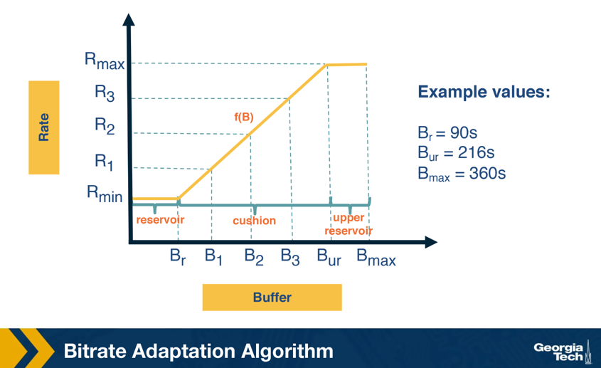

### Three Regions

The example buffer-based function has three regions of buffer occupancy.

- **Reservoir region**:
    - Corresponds to low buffer occupancy
    - The player always selects the minimum available bitrate in this region
- **Upper reservoir region**:
    - Corresponds to high buffer occupancy
    - The highest available bitrate is selected
- **Cushion region**:
    - The middle region, where the bitrate is a linear function of the buffer occupancy
        - For instance, if the buffer is between B1 and B2, rate R1 is selected
- **Example values**:
    - The figure also shows example values for these regions

## Optional Reading: Issues with Buffer-Based Adaptation
- The issues with buffer-based adaptation, despite its advantages over rate-based adaptation.

### Issues

Buffer-based adaptation has some issues of its own.

- **Startup phase**:
    - Buffer occupancy is zero at startup
        - The player will download a lot of low quality chunks, which may be unnecessary
- **Bitrate oscillations**:
    - Can lead to unnecessary bitrate oscillations
        - Example: available bandwidth is 1.5 Mbps, with available video bitrates of 1 Mbps and 2 Mbps
            - The player downloads 1 Mbps chunks, buffer occupancy increases, and it switches to 2 Mbps chunks
            - Since available bandwidth is 1.5 Mbps, buffer occupancy then decreases, and it switches back to 1 Mbps
            - The player keeps oscillating between these two bitrates
- **Buffer size requirement**:
    - Requires a large buffer to implement the algorithm efficiently
        - May not always be feasible
        - Example: in live streaming, the buffer size is typically not more than 8-16 seconds

## Bitrate Adaptation Conclusion
- A summary of the two flavors of bitrate adaptation and pointers to further research.

### Conclusion

Two different flavors of bitrate adaptation were covered, each with associated advantages and disadvantages.

- **Active research area**:
    - Designing optimal bitrate adaptation algorithms is an active area of research
    - In practice, most video players use both throughput and buffer occupancy together to decide the bitrate of the next chunk
- **Further reading**:
    - A recent paper from Sigcomm models bitrate adaptation as a QoE optimization problem
        - https://www.cs.cmu.edu/~xia/resources/Documents/Yin_sigcomm15.pdf
    - A more recent paper models bitrate adaptation as a reinforcement learning problem
        - https://people.csail.mit.edu/hongzi/content/publications/Pensieve-Sigcomm17.pdf
    - Students are encouraged to check these papers

## 