# Lesson 12: Applications: CDNs and Overlay Networks

## Key concepts:
* CDN motivation and architecture
* Limits of single-origin content delivery
* Edge servers and geographically distributed caches
* Content placement and replication
* CDN server selection
* DNS and content distribution
* Video delivery and user-perceived performance
* CDN-ISP interaction
* Hybrid CDN and peer-to-peer approaches
* Resilience to origin, path, and demand failures

## Introduction to Content Distribution Networks
- CDNs solve the problems of relying on a single centralized server to deliver Internet content.

### Traditional Single Data Center Approach

The classic way to serve content was a single, publicly accessible web server or data center.

- **Single massive data center**:
    - Simple design, even at scale
    - Services all requests for one company from one location

### Drawback 1: Geographic Distance

Users are spread across the globe, far from any single server location.

- **Distance problem**:
    - Server-to-client packets must traverse many links across many ISPs
    - If any one link has throughput lower than the video playout rate, the user experiences interruptions and delays

### Drawback 2: Viral Content Demand

A spike in demand for the same content strains a single data center.

- **Viral videos**:
    - Popular clips like movie trailers or breaking news cause many requests for the same data
    - Repeatedly sending identical data over the same link wastes bandwidth
    - The company pays its ISP for every byte transmitted, so this also wastes money

### Drawback 3: Single Point of Failure

A single data center creates one location whose failure takes down the whole service.

- **Points of failure**:
    - Natural disasters or power outages can take the data center offline, temporarily or permanently
    - Disrupted Internet links prevent content distribution even if the data center itself is fine

### The CDN Solution

Almost all major video-streaming companies use CDNs instead of a single data center.

- **CDN**:
    - Network of multiple, geographically distributed servers and/or data centers
    - Stores copies of content, including video and other web content
    - Directs users to the server or server cluster best able to serve their request
    - Addresses the distance, viral demand, and single-point-of-failure problems
    - Introduces new challenges of its own

## Content Delivery Challenges
- Beyond normal networking issues, the Internet's structure creates six major challenges for distributed applications like CDNs.

## Internet Application Challenges
- Beyond normal networking issues, the Internet's structure creates six major challenges for distributed applications like CDNs.

### Peering Point Congestion

There is financial motivation to upgrade the first and last mile, but not the middle mile.

- **Peering points**:
    - First mile (web hosts) and last mile (end users) get upgraded due to business incentives
    - Middle mile peering points between networks are expensive and generate no revenue
    - These points become bottlenecks, causing packet loss and increased latency

### Inefficient Routing Protocols

BGP has scaled the Internet for decades but was not designed for modern demands.

- **BGP**:
    - Algorithm only uses AS hop count, ignoring congestion and latency
    - Has well-documented vulnerabilities to malicious actions
    - Not an efficient interdomain routing protocol for the modern Internet

### Unreliable Networks

Outages happen all the time for a variety of reasons.

- **Causes of outages**:
    - Accidents, such as misconfigured routers, power outages, or severed undersea fiber cables
    - Malicious actions, such as DDoS attacks or BGP hijacking
    - Natural disasters

### Inefficient Communication Protocols

TCP, like BGP, was not designed to meet the demands of the modern Internet.

- **TCP**:
    - Provides reliability and congestion avoidance, but with a lot of overhead
    - Requires an ACK for each window of data packets sent
    - Distance between server and end user becomes the overriding bottleneck
    - Enhancements are slow to be implemented across the whole Internet

### Scalability

Scalable applications can respond to current demand by changing resource usage.

- **Scaling challenges**:
    - Demand spikes can be unexpected, like a viral video, or planned, like Black Friday traffic
    - Scaling up infrastructure is expensive and takes time
    - Hard to forecast capacity needs

### Application Limitations and Slow Adoption

Even improved protocols take a long time to get adopted across the Internet.

- **Adoption problem**:
    - Old client software, like Internet Explorer 6, may not support newer protocols
    - Upgrading the server side provides no benefit unless end users also upgrade their client software

## CDNs and the Internet Ecosystem
- Two major shifts, rising content demand and topological flattening, have driven the growth of CDNs and reshaped the Internet's structure.

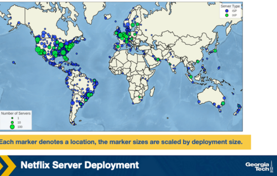

### Increased Demand for Content

The Internet was originally a research network, not designed for large-scale content delivery.

- **Content demand**:
    - Content and video account for the largest fraction of today's Internet traffic
    - This demand spurred the development and growth of CDNs in place of single, massive data centers

### Topological Flattening

The Internet's traditional hierarchical topology has transitioned to a flatter structure.

- **Traditional hierarchy**:
    - Tier-1 ISPs formed the backbone, connecting at relatively few direct points
- **IXPs**:
    - Infrastructures that offer interconnections between networks
    - Have grown in number and popularity due to lower network operation and interconnection costs
    - Have grown so large and complex that more research is needed to update understanding of AS-level topology

### Effects of These Shifts

Together, these shifts have changed where traffic flows and who drives infrastructure decisions.

- **Local traffic exchange**:
    - More traffic is generated and exchanged locally instead of traversing the full hierarchy
    - Driven partly by major players like Google and Facebook
    - Focus has shifted from traditional tier-1 ISPs to the edge and end users
- **Netflix Open Connect example**:
    - A January 2018 figure shows the locations and number of Netflix servers worldwide
    - Servers are strategically placed to serve end users locally
    - This bypasses tier-1 networks for content distribution
    - Marker size in the figure is scaled by deployment size

### Challenges of Operating a CDN

Running a CDN comes with its own set of challenges.

- **Operational challenges**:
    - Cost
    - Real estate and physical devices
    - Power consumption
    - Must be well-connected to the greater Internet to be useful
    - Ongoing maintenance and upgrades

### Types of CDNs

CDNs can be categorized by who owns and operates them.

- **Private CDNs**:
    - Owned by the content provider
    - Example: Google's CDN, which distributes YouTube videos and other content
- **Third-party CDNs**:
    - Distribute content on behalf of multiple content providers
    - Examples: Akamai and Limelight

## CDNs Server Placement Approaches
- CDNs must decide where to place server clusters in the Internet topology, choosing between many small clusters or fewer large ones.

### Enter Deep

This philosophy places many smaller server clusters deep into access networks around the world.

- **Enter Deep**:
    - Goal is to minimize the distance between a user and the closest server cluster
    - Reduces delay and increases available throughput for each user
    - Example: Akamai, with clusters in over 1700 locations
    - Downside: much more difficult to manage and maintain so many clusters

### Bring Home

This philosophy places fewer, larger server clusters at key points, typically at IXPs rather than access networks.

- **Bring Home**:
    - Fewer clusters means easier management and maintenance
    - Downside: users experience higher delay and lower throughput

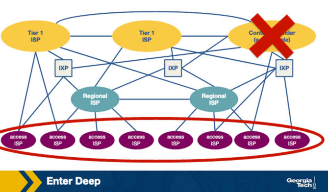
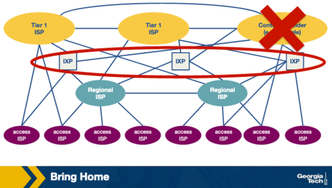

### Hybrid Approach

CDNs often combine both philosophies.

- **Google example**:
    - 16 mega data centers
    - ~50 clusters of hundreds of servers at IXPs
    - Hundreds of clusters of tens of servers at access ISPs
    - Different clusters deliver different types of content
        - Access network clusters store static portions of search result web pages
    - Uses a hybrid of enter deep and bring home approaches

## How a CDN Operates
- CDNs use DNS as an interception point to decide which server cluster should service a user's content request.

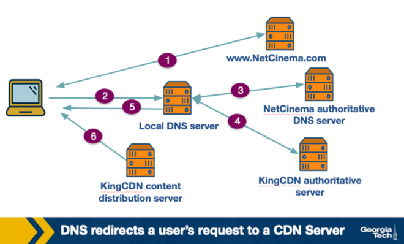

### Traditional vs. CDN Approach

With the traditional approach, only one server cluster could service any request.

- **CDN complexity**:
    - CDNs must intercept requests to decide which server cluster should respond
    - Decision depends on user location, server load, and current traffic
    - DNS plays a large role in this interception process

### Example Scenario: ExampleMovies and ExampleCDN

ExampleMovies pays ExampleCDN to distribute its content, and video URLs include a video ID.

- **Setup**:
    - Example URL: http://video.examplemovies.com/R2D2C3PO37
    - ExampleMovies is the content provider
    - ExampleCDN is the third-party CDN

### Six Steps of a Content Request

These steps trace what happens when a user requests to watch a video.

- **Step 1**:
    - User visits examplemovies.com and navigates to the Star Wars 37 page
- **Step 2**:
    - User clicks the video link
    - User's host sends a DNS query for "video.examplemovies.com"
- **Step 3**:
    - Query goes to the user's local DNS server (LDNS), often run by their access ISP
    - LDNS issues an iterative DNS query to ExampleMovies's authoritative DNS server
    - ExampleMovies's DNS server knows "video" is stored on ExampleCDN
    - It returns a hostname in ExampleCDN's domain, like a1130.examplecdn.com
- **Step 4**:
    - User's LDNS performs an iterative DNS query to ExampleCDN's name server for a1130.examplecdn.com
    - ExampleCDN's name server system returns the IP address of an appropriate content server
- **Step 5**:
    - User's LDNS returns the ExampleCDN IP address to the user
    - From the user's perspective, they simply asked for an IP address and got one back
- **Step 6**:
    - User's client connects via TCP directly to the returned IP address
    - Client sends an HTTP GET request for the video

### Significance

The interplay of DNS requests and responses is what enables CDN redirection.

- **DNS interception**:
    - Gives CDNs the opportunity to choose where to direct users
    - Decision can be based on location and/or current conditions

## CDN Server Selection
- Selecting the right server to serve content is a two-step process that significantly impacts user performance.

### Why Server Selection Matters

Picking a poor server can degrade the user's experience.

- **Performance impact**:
    - A cluster that's too far away or overwhelmed causes video playback to freeze
    - Frustrated users may leave, resulting in lost business

### The Two Steps

Server selection breaks down into two sequential steps.

- **Step 1: Cluster mapping**:
    - The client is mapped to a geographically distributed cluster
- **Step 2: Server selection**:
    - A specific server is chosen from within that cluster
    - Policies and mechanisms for this step will be covered nextWant to be notified when Claude responds?
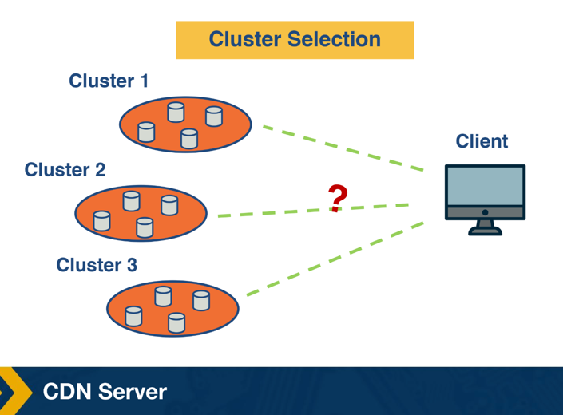
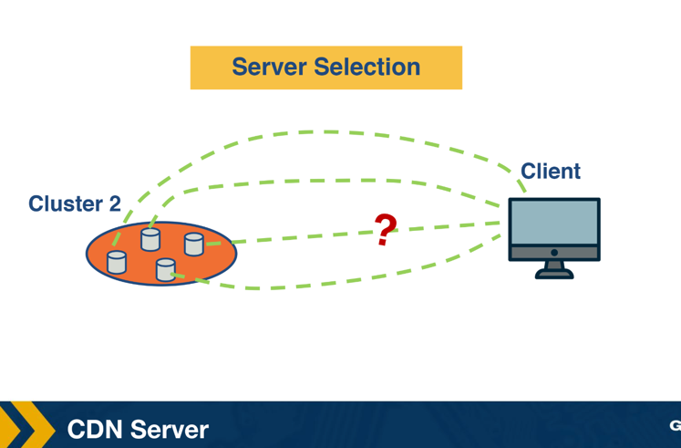

## Cluster Selection Strategies
- Clusters can be selected geographically or based on real-time end-to-end performance measurements.

### Geographic Proximity Strategy
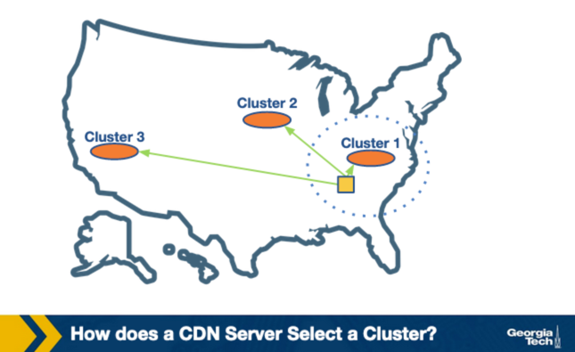

The simplest strategy is to pick the geographically closest cluster.

- **Closest cluster ("as the crow flies")**:
    - Example: a user in Atlanta with clusters in Charlotte, Boston, and Los Angeles would be served from Charlotte
    - Works well in many cases

### Limitations of Geographic Proximity
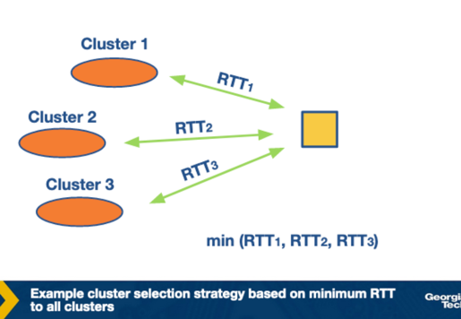
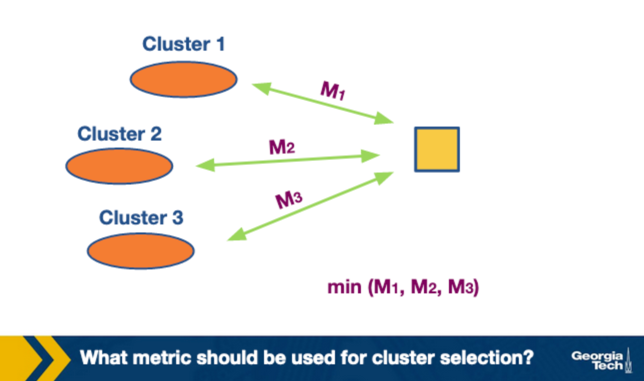

This simple strategy has notable drawbacks.

- **LDNS vs. actual user location**:
    - The CDN name server interacts with the user's LDNS, not the user directly
    - So the strategy really picks the cluster closest to the LDNS, not the user
    - Works fine unless the customer uses a remote LDNS
    - Suggested fix: include the client IP in the interaction between the CDN name server and the LDNS
- **Geographic distance vs. network performance**:
    - The geographically closest cluster may not offer the best actual network performance
    - Routing inefficiencies in protocols like BGP can make the path to the closest cluster longer than an alternative
        - This can lead to higher RTT despite shorter geographic distance
    - The path to the closest cluster, or the cluster itself, could be congested
    - Static geography-based selection can be suboptimal since network conditions are dynamic

### Real-Time Performance-Based Selection

Instead of static geography, cluster selection can use real-time measurements of end-to-end performance.

- **Choosing which metrics to use**:
    - Network-layer metrics, such as delay or available bandwidth
    - Application-layer metrics, which can better reflect user experience
        - Video: re-buffering ratio, average bitrate
        - Web browsing: page load time

### Obtaining Real-Time Measurements
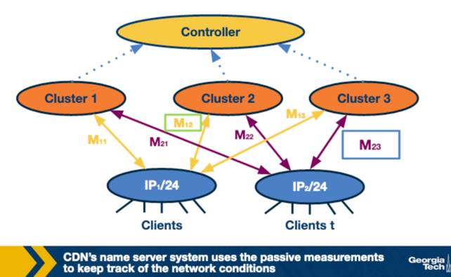

There are two main approaches to gathering the performance data used for selection.

- **Active measurements**:
    - LDNS probes multiple clusters, such as sending pings to monitor RTT
    - Then routes to the "closest" performing server
    - Limitation: most LDNS are not equipped for this
    - Limitation: creates a lot of extra traffic
- **Passive measurements**:
    - CDN's name server system tracks network conditions from existing sessions
    - Data can be aggregated, such as by grouping IPs from the same subnet
        - Same-subnet IPs likely share similar paths to clusters, so they experience similar performance
    - The best cluster for a subnet is noted based on observed session performance
    - New clients from that subnet are routed to the best-performing cluster

### Limitations and Distributed System Design
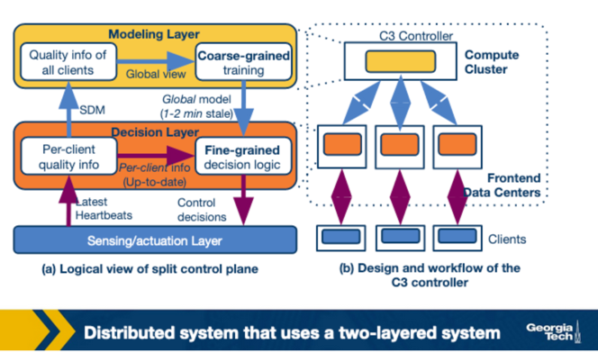

Passive measurement approaches introduce their own challenges.

- **Centralized controller limitation**:
    - Requires a centralized controller with a real-time view of all client-cluster pairs
    - Difficult to design purely centrally at today's network scale
- **Proposed two-layered distributed system**:
    - Coarse-grained global layer
        - Operates at larger timescales, tens of seconds to minutes
        - Has a global view of client quality measurements
        - Builds a data-driven prediction model of video quality
    - Fine-grained per-client decision layer
        - Operates at millisecond timescale
        - Makes actual decisions per client request
        - Based on the latest global model and up-to-date per-client state
- **Data coverage challenge**:
    - The system needs data for different subnet-cluster pairs
    - Some clients must deliberately be routed to suboptimal clusters to gather this data

## Policy for Server Selection
- Selecting a server within a cluster requires balancing load with content locality, since not every server caches every piece of content.

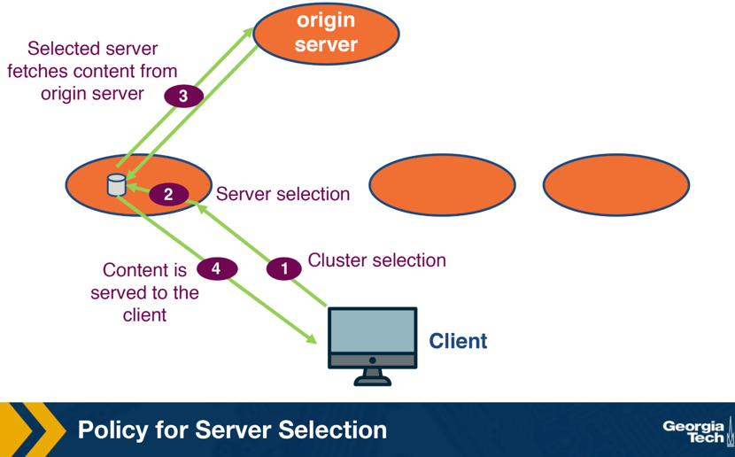

### Random Assignment Strategy

The simplest strategy is to assign a server randomly.

- **Random assignment**:
    - Simple, but not optimal
    - Might select a highly loaded server when a less loaded one was available

### Load-Balancing Strategy

A better approach routes clients to the least-loaded server.

- **Least-loaded routing**:
    - Solves the workload imbalance problem of random assignment
    - Still not optimal

### Why Load Balancing Alone Falls Short

Understanding this requires looking at how a server actually fetches and serves content.

- **Limited disk space**:
    - A cluster serves content for many providers and content types
    - Not all servers hold all content at once
    - Proactively fetching all content to every server is not feasible
- **Lazy fetching from origin**:
    - Content is fetched from an origin server only when requested
    - Request flow:
        - Request is routed to a server within the selected cluster
        - That server requests the content from the origin server if not cached
        - This fetch step adds extra delay
        - Content is then served to the client and cached for future requests
- **Problem with pure load balancing**:
    - A different server might already have the content cached, but isn't chosen because it's more loaded
    - This causes unnecessary delay for the client
    - Also causes unnecessary requests from CDN servers to the origin server

### Content-Based Hashing Solution

A simple fix maps requests based on content rather than load.

- **Content-based hashing**:
    - Requests for the same content are mapped to the same machine via a hash function
    - Example: a hash of "contentFoo" always returns the same server
    - All requests for that content go to the same server

### Challenges with Content-Based Hashing

The dynamic nature of clusters creates problems for simple hashing.

- **Dynamic cluster environment**:
    - Frequent machine failures and load changes occur
    - When the cluster changes, such as a machine failing, the hash table must be recomputed
    - Recomputing the hash for all objects is expensive and suboptimal
    - Ideal solution: only move the objects assigned to the failed server
        - Open question: how to achieve this with a hash table

## Consistent Hashing
- Consistent hashing is a distributed hash table that balances load across servers while requiring minimal content movement when servers join or leave.

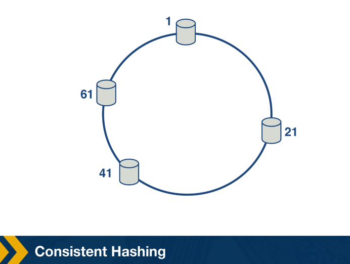
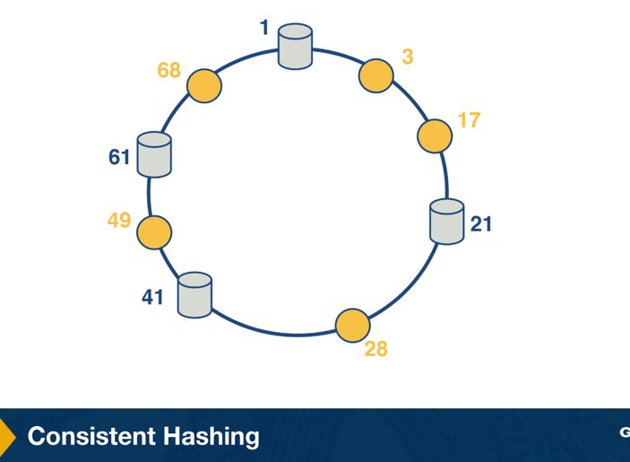
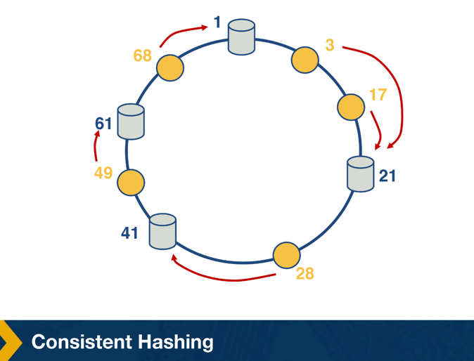
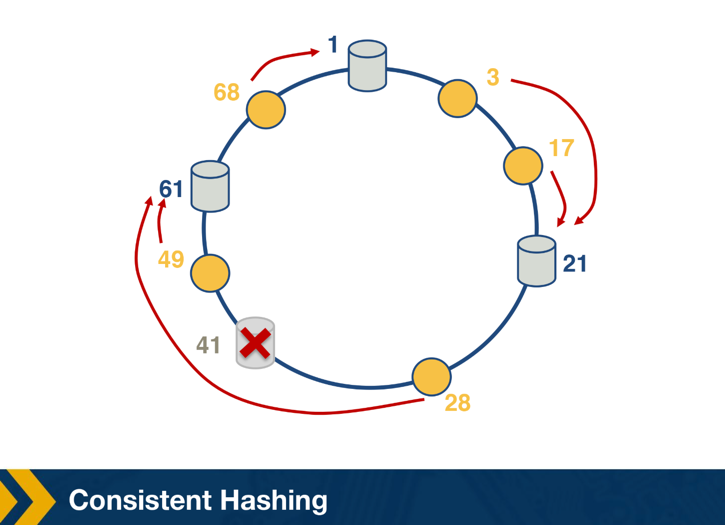

### Motivation

Consistent hashing solves the recomputation problem of simple content-based hashing.

- **Consistent hashing**:
    - Assigns roughly the same number of content IDs to each server, balancing load
    - Requires relatively little movement of content IDs when nodes join and leave the system

### How It Works

Servers and content objects are mapped to the same ID space.

- **Mapping to a circle**:
    - Servers are mapped to points on the edge of a circle, roughly uniformly
    - Content objects are also mapped to points on the same circle
    - The successor server for an object, the next server found by moving clockwise, is responsible for serving that object

### Handling Server Failure

The ring structure limits the impact when a server leaves.

- **Server departure example**:
    - When server #41 leaves, the objects it was responsible for are reassigned to the next server clockwise
    - Other objects on the ring are unaffected

### Why It's Optimal

The design minimizes disruption during changes to the cluster.

- **Optimality**:
    - It can be proven that this approach requires the least number of keys to be remapped on average to maintain load balance

### Real-World Use

Consistent hashing originated in and spread to several major systems.

- **Origins and applications**:
    - Proposed as part of the Chord distributed lookup protocol
    - Also used for content lookup in peer-to-peer applications such as BitTorrent and Napster

## Network Protocols Used for Cluster/Server Selections
- Beyond selection policies, CDNs rely on specific network protocols to actually direct clients to a chosen server.

### Three Network Protocols
CDNs use one of three main mechanisms to implement server selection decisions.

- **DNS**:
- **HTTP redirection**:
- **IP Anycast**:

## Server Selection Strategies: The DNS Protocol
- DNS translates human-readable hostnames into IP addresses using a distributed, hierarchical database of servers.

### Why DNS Is Needed

Internet hosts are identified by IP addresses and hostnames.

- **Hostnames vs. IP addresses**:
    - Hostnames like www.gatech.edu are easy for humans to remember
    - Hostnames have variable characters, making them difficult for routers to process
    - DNS translates hostnames to IP addresses

### How DNS Works

DNS is a distributed database implemented over a hierarchy of servers, accessed via an application layer protocol.

- **Basic query steps**:
    - The user host runs the client side of the DNS application
    - The browser extracts the hostname and passes it to the DNS client
    - The DNS client sends a query containing the hostname
    - The DNS client receives a reply containing the IP address
    - The host initiates a TCP connection to the HTTP server at that IP address

### Other Services DNS Offers

Beyond basic hostname resolution, DNS supports additional functions.

- **Mail server/host aliasing**:
    - Email servers need simple, mnemonic names, such as @hotmail.com
    - The canonical hostname, such as relay2.west-coast.hotmail.com, can be hard to remember
    - DNS finds the canonical hostname and IP address for an alias hostname
    - A host can have multiple names, typically a canonical name and a mnemonic alias
- **Load distribution**:
    - Busy websites may be replicated across multiple servers
    - DNS responds with the entire set of addresses, rotating the order with each reply
    - This helps distribute traffic across servers

### Why Not a Centralized DNS?

A single centralized DNS server would be simple but impractical.

- **Problems with centralization**:
    - Single point of failure for the entire Internet
    - A single server cannot handle the volume of global query traffic
    - A single, geographically distant database causes delays for far-away clients
    - Maintaining one huge, constantly updated database is impractical

### The DNS Hierarchy
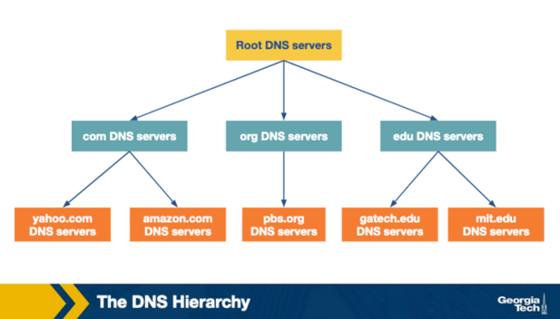

DNS solves scalability with a distributed, hierarchical scheme of server types.

- **Root DNS servers**:
    - 13 servers, each a network of replicated servers, mostly in North America
    - As of May 2019, 984 total server instances
- **Top level domain (TLD) servers**:
    - Responsible for domains like .com, .org, .edu
    - Also responsible for country domains like .uk, .fr, .jp
- **Authoritative servers**:
    - Keep an organization's publicly accessible DNS records
    - Store domain name to IP mappings for web and mail servers
- **Local DNS servers**:
    - Not strictly part of the DNS hierarchy, but central to its architecture
    - Each ISP has one or more local DNS servers
    - Hosts are provided the IP addresses of local DNS servers when they connect
    - Acts as a proxy, forwarding queries into the DNS hierarchy

### Recursive and Iterative Queries
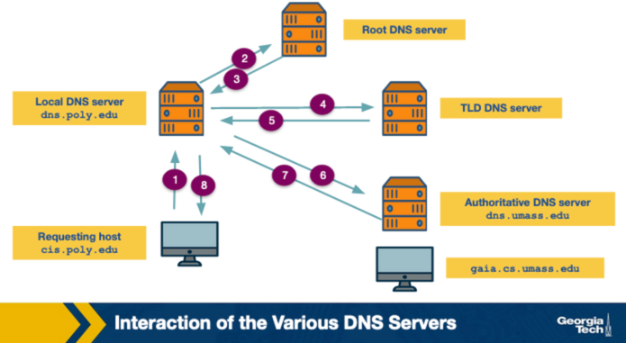
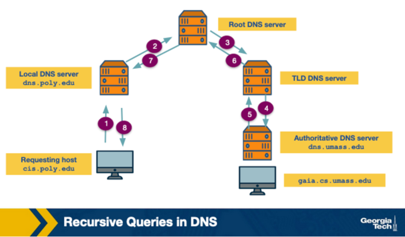

Name-address resolution uses two types of queries as a host interacts with the DNS hierarchy.

- **Iterative query**:
    - The querying host is referred to a different DNS server in the chain
    - This continues until the request is fully resolved
- **Recursive query**:
    - The querying host, and each DNS server in the chain, queries the next server and delegates the query to it
    - The usual pattern: the first query to the local DNS server is recursive, and the remaining queries are iterative

## More on DNS: Making Responses Faster with Caching
- DNS caching stores hostname-to-IP mappings so repeated queries for the same hostname can be answered immediately, without a full hierarchy lookup.

### The Idea Behind DNS Caching

Caching speeds up DNS resolution and reduces performance delay.

- **Caching mechanism**:
    - Applies to both iterative and recursive queries
    - After a server receives a DNS reply mapping a hostname to an IP address, it stores this information in cache memory
    - This happens before sending the reply to the client

### Example of DNS Caching

A concrete scenario illustrates the benefit.

- **Two hosts, same query**:
    - Host A (apricot.poly.edu) queries local DNS server dns.poly.edu for the IP of cnn.com
    - Later, Host B (kiwi.poly.fr) queries the same local DNS server for the same hostname
    - Because of caching, dns.poly.edu immediately sends the response for cnn.com to Host B

## More on DNS: Resource Records and Messages
- DNS servers store hostname-to-IP mappings as resource records, exchanged inside structured DNS messages.

### Resource Records

Resource records are contained inside DNS reply messages and have four fields.

- **Resource record fields**:
    - name
    - value
    - Type
    - TTL
        - Specifies the time, in seconds, a record should remain in the cache
    - The meaning of name and value depends on the record's Type

### Common Resource Record Types

There are four common resource record types.

- **TYPE=A**:
    - name is a domain name, value is the IP address of the hostname
    - Example: (abc.com, 190.191.192.193, A)
- **TYPE=NS**:
    - name is the domain name, value is the authoritative DNS server for that domain
    - Example: (abc.com, dns.abc.com, NS)
- **TYPE=CNAME**:
    - name is the alias hostname, value is the canonical name
    - Example: (abc.com, relay1.dnsserver.abc.com, CNAME)
- **TYPE=MX**:
    - name is the alias hostname of a mail server, value is the canonical name of the email server
    - Example: (abc.com, mail.dnsserver.abc.com, MX)

### DNS Message Format
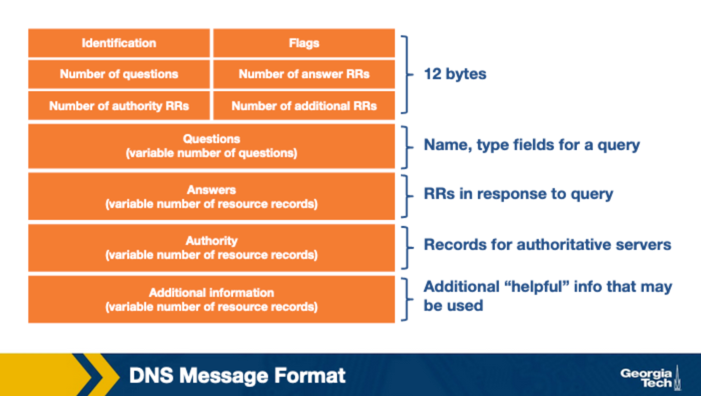

A DNS message is organized into several sections.

- **ID field**:
    - Identifier for the query, allows the client to match queries with responses
- **Flags section**:
    - Contains multiple fields
        - One field specifies if the message is a query or a response
        - Another field specifies if a query is recursive or not
- **Question section**:
    - Contains information about the query being made
        - The hostname being queried
        - The type of the query, such as A or MX
- **Answer section**:
    - If the message is a reply, contains the resource records for the originally queried hostname
- **Authority section**:
    - Contains resource records for more authoritative servers
- **Additional section**:
    - Contains other helpful records
        - Example: for an MX query, the answer section holds the mail server's canonical hostname, and the additional section holds the IP address for that canonical hostname

## Server Selection Strategies: IP Anycast
- IP anycast routes each client to its BGP-closest server by assigning the same IP address to multiple servers across different clusters.

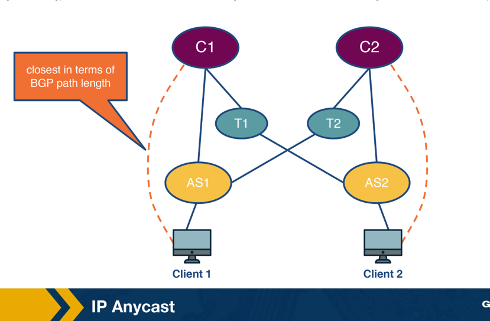

## How IP Anycast Works

IP anycast leverages BGP to route clients to a nearby server.

- **Mechanism**:
    - The same IP address is assigned to multiple servers belonging to different clusters
    - Each server advertises this IP address using standard BGP
    - Multiple BGP routes for the same IP address, corresponding to different physical locations, propagate across the Internet
    - A BGP router receiving multiple advertisements treats them as multiple paths to the same location
    - The shortest path is stored and used for routing packets

### Example: Routing Clients to the Closest Cluster

Different clients end up routed to different clusters based on BGP path length.

- **Cluster routing example**:
    - A client in AS1 is routed to cluster C1, only one AS hop away
    - A client in a different AS, AS2, is routed to a different, closer cluster

### Limitations

BGP-based closeness doesn't always match true network performance.

- **Dynamic Internet limitation**:
    - Typically, the BGP-closest path offers the best end-to-end performance
    - However, this isn't always true due to the Internet's dynamic nature
        - Example: a link could be congested, making a different cluster actually better for a new client
    - Anycast-based server selection doesn't account for this
    - As a result, it is not commonly used in practice by CDNs

### Real-World Use: DNS Resolution

IP anycast is used for something other than content delivery: routing to DNS servers.

- **Google Public DNS example**:
    - Google provides public DNS servers distributed across multiple geographic locations
    - All of these DNS servers are assigned the same IP address
    - A client using Google's public DNS is routed to the closest server by BGP path
    - This makes DNS queries faster

## Server Selection Strategies: HTTP Redirection
- HTTP redirection operates at the application layer, letting a server redirect a client to a different server for load balancing, at the cost of extra delay.

### How HTTP Redirection Works

The protocol works at the HTTP layer of the network stack.

- **Redirection mechanism**:
    - Client sends a GET request to server A
    - Server A can redirect the client to server B by sending an HTTP response with a 3xx code and the new server's name
    - The client then fetches content from server B instead
    - This incurs at least one additional HTTP request, corresponding to one or more RTTs
    - The extra round trip makes this protocol inefficient in general

### Use Case: Load Balancing

Despite its inefficiency, HTTP redirection is useful in specific situations.

- **Popular video scenario**:
    - A popular video may be requested by many clients from the same region
    - Server selection policies could route most of these requests to the same server, overwhelming it
    - The server can send HTTP redirects to some clients to offload demand
    - Benefit: this method requires no central coordination

### Real-World Example: YouTube

A measurement study found YouTube uses this mechanism.

- **YouTube's approach**:
    - First tries HTTP redirection to share load within a cluster
    - If that's not enough, also uses it to redirect clients to a different cluster

## 

## 