# Lesson 2: Transport and Application Layers

## Intro

The network layer makes a best-effort attempt to deliver packets — it does not guarantee delivery or data integrity. The **transport layer** fills this gap by providing a standard set of communication services that applications can rely on regardless of the underlying network.

The two most common transport protocols are:

1. **TCP** — reliable, connection-oriented
2. **UDP** — lightweight, connectionless

---

## Key concepts:
* The role of the transport layer above IP
* Application-to-application communication
* UDP versus TCP
* Multiplexing and demultiplexing with ports and sockets
* TCP connection establishment and teardown
* Reliable delivery, sequence numbers, ACKs, and retransmissions
* Fast retransmit and duplicate ACKs
* Flow control and the receive window
* Congestion control and the congestion window
* Slow start, congestion avoidance, AIMD, and TCP CUBIC

---

## Segment

Sockets are identified by special fields in the segment header — specifically the **source port** and **destination port** number fields.

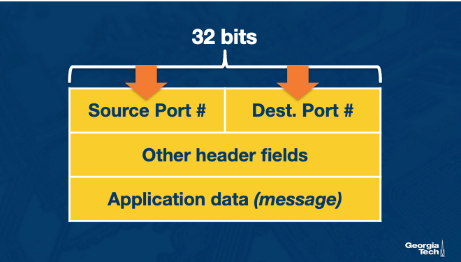

---

## Multiplexing

Multiplexing is the ability for a host to run multiple applications using the network simultaneously.

- A single device has one IP address, but **port numbers** identify which application each packet belongs to (e.g., Facebook and Spotify running at the same time)
- The sending host gathers data from different sockets, encapsulates each chunk with header information, creates segments, and forwards them to the network layer

**Two types of multiplexing:**
- Connectionless (UDP)
- Connection-oriented (TCP)

---

## De-multiplexing

De-multiplexing is the process of delivering data from a transport-layer segment to the **correct socket**, as identified by the segment's port fields.

---

## Connectionless Multiplexing and De-multiplexing

A **UDP socket** is identified by a **two-tuple**: destination IP address + destination port number.

### How It Works

- Host A creates a segment with source port, destination port, and data, then forwards it to the network layer
- The network layer encapsulates it into a datagram and delivers it with best-effort to Host B
- Host B's transport layer identifies the correct socket by reading the **destination port** field
- If Host B runs multiple processes, each has its own UDP socket with a distinct port number
- Segments arriving at the same destination port are forwarded to the **same socket**, even if they come from different source hosts or ports

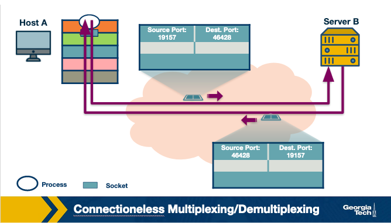


---

## Connection-oriented Multiplexing and De-multiplexing

A **TCP socket** is identified by a **four-tuple**: source IP, source port, destination IP, destination port.

### Connection Setup

- The TCP server maintains a **listening socket** waiting for client connection requests
- The client creates a socket and sends a segment with: its chosen source port, destination port 12000, and the connection-establishment bit set
- The server receives the request and creates a new socket identified by the full four-tuple
- The server uses this four-tuple to **demultiplex** all subsequent data to the correct socket

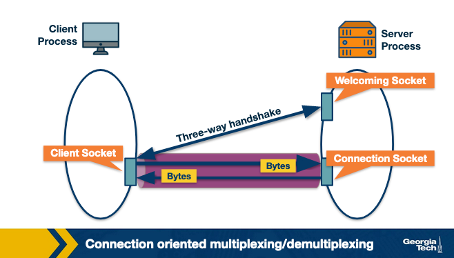

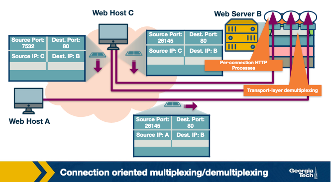

### Multi-Client Example (Hosts A, B, C)

- Host C initiates **two** HTTP sessions to server B; Host A initiates **one**
- Hosts assign port numbers independently — Host C uses ports 26145 and 7532
- If Host A happens to use the same port number as Host C, Host B can still demultiplex correctly because the **source IP addresses differ**

### HTTP Session Notes

- A web server on port 80 demultiplexes incoming data using unique source IP + source port combinations
- **Persistent HTTP**: client and server reuse the same socket across multiple requests
- **Non-persistent HTTP**: a new TCP connection and socket is created and torn down for every request/response pair
  - Can cause significant performance overhead on a busy web server

---

## UDP Protocol
- UDP is an unreliable protocol that lacks the mechanisms that TCP has. It is a **connectionless** protocol that does not require the establishment of a connection (e.g., the three-way handshake) before sending packets.
- Pros:
  - fewer delays 
  - better control over sending data
- UDP has no congestion control or similar mechanisms.
  - As soon as the application passes data to the transport layer, UDP encapsulates it and sends it over to the network layer.
  - In contrast, TCP “intervenes” with a congestion-control mechanism or retransmission of unacknowledged packets. These TCP mechanisms cause further delays.
- UDP has no connection management overhead
  - We will see that TCP uses a three-way handshake before it begins transferring data. 
  - UDP forgoes the connection and starts sending data immediately. The lack of connection establishment and maintenance means even fewer delays will occur.
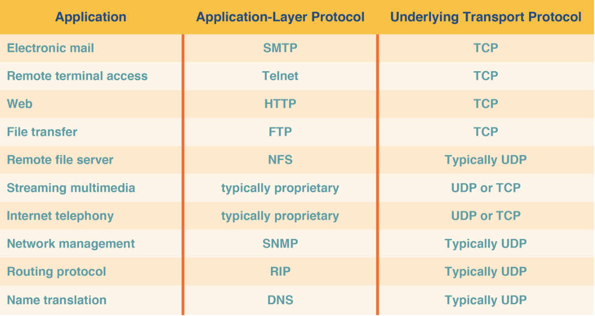

- UDP has 64-bit header consisting of
  - Source port number 
  - Destination port number 
  - Length of the UDP segment (header and data). 
  - Checksum (an error checking mechanism): provides a basic error checking since there is no guarantee for link-by-link reliability. **The UDP sender adds the bits of the source port, the destination port, the packet length and the application data**. It performs a 1's complement on the sum (all 0s are turned to 1 and all 1s are turned to 0s), which is the value of the checksum. The receiver adds all the four 16-bit words (including the checksum). The result should be all 1's unless an error has occurred
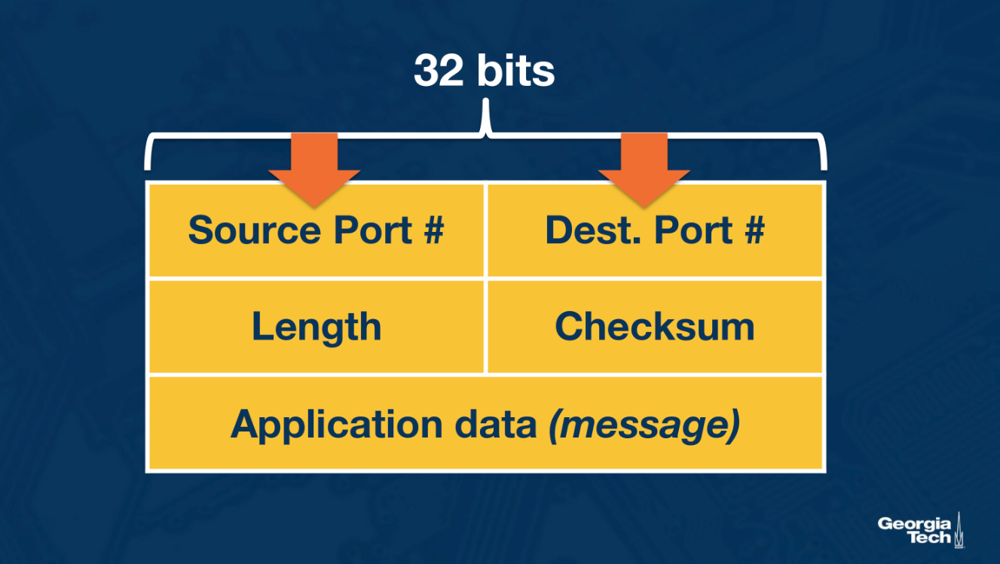

---

## The TCP Three-Way Handshake

### Connection Establishment

1. **SYN** — The client sends a special segment (no data) with the SYN bit set to 1 and an initial sequence number (`client_isn`)
2. **SYNACK** — The server allocates resources and replies with SYN=1, `ack = client_isn+1`, and its own initial sequence number (`server_isn`)
3. **ACK** — The client allocates buffers/resources and sends an acknowledgment with SYN=0; the connection is now established

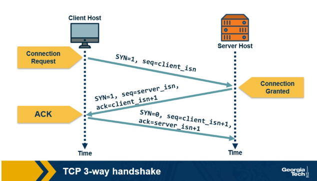

### Connection Teardown

1. **FIN** — The client sends a segment with FIN=1 to signal it wants to close the connection
2. **ACK** — The server acknowledges the close request and begins closing
3. **FIN** — The server sends its own FIN=1 segment
4. **ACK** — The client sends a final ACK and waits briefly to resend it if the first is lost

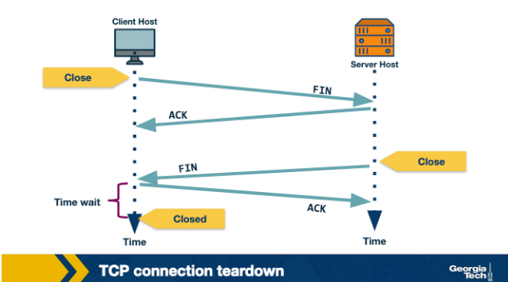


---

## Reliable Transmission

The network layer is unreliable — packets can be lost or arrive out of order. **TCP guarantees in-order, loss-free delivery** of application data.

### ARQ: Automatic Repeat Request

The core mechanism: the receiver sends **acknowledgments (ACKs)**. If the sender doesn't receive an ACK within a timeout period, it assumes the packet was lost and retransmits.

- **Stop-and-Wait ARQ** — send one packet, wait for its ACK before sending the next
  - Simple but very low throughput
  - Timeout must be carefully tuned: too short → unnecessary retransmissions; too long → unnecessary delays
  - Timeout is typically based on the estimated **Round Trip Time (RTT)**

### Windowed Transmission

To improve performance, the sender can transmit up to **N unacknowledged packets** at once — this is called the **window size**.

- Each packet is tagged with a **byte sequence number** so the receiver can detect gaps
- Both sender and receiver must **buffer packets**:
  - Sender buffers transmitted-but-unacknowledged packets
  - Receiver buffers out-of-order packets until missing ones arrive

### Handling Missing Packets

**1. Go-Back-N** — The receiver ACKs the most recently received in-order packet and discards all out-of-order packets. The sender retransmits everything from the last unacknowledged packet onward.

- A single lost packet can trigger many unnecessary retransmissions

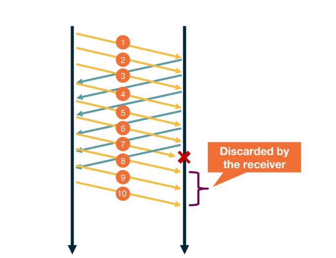

**2. Selective ACKing (TCP's approach)** — The receiver ACKs correctly received packets even if out of order. Out-of-order packets are buffered, and only the missing packets are retransmitted.

### Fast Retransmit

TCP doesn't always wait for a timeout to detect loss. A **duplicate ACK** is re-sent by the receiver for each out-of-order packet received. When the sender receives **3 duplicate ACKs**, it immediately retransmits the missing packet — this is **fast retransmit**.

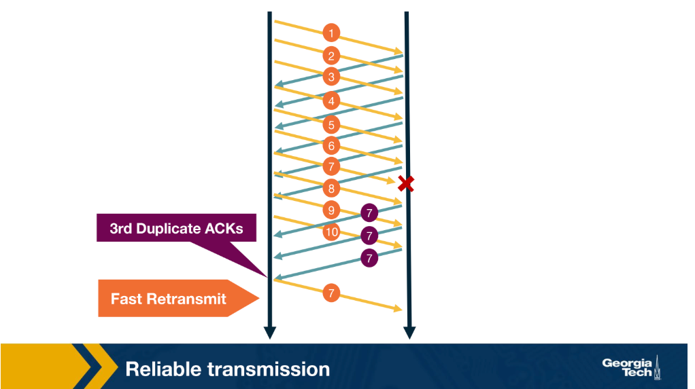


---

## Transmission Control

Transmission control limits the rate at which data is sent, preventing both the receiver and the network from being overwhelmed.

- **Why?** — Sending too fast causes packet loss, buffer overflow, and congestion
- **Where?** — At the transport layer, since transmission control is fundamental to most applications and is easier to implement end-to-end than inside the network

---

## Flow Control
- Flow control: Controlling the Transmission Rate to Protect the Receiver buffer
- It helps match the sender’s rate against the receiver’s rate of reading the data
- In addition, the sender maintains a variable receive window rwnd. It provides the sender an idea of how much data the receiver can handle at the moment.
- Why?
  - protect the receiver buffer from overflowing
    - Recall that TCP uses a buffer at the receiver end to buffer packets that have not been transmitted to the application. The receiver might be involved with multiple processes and does not read the data instantly. This can cause the accumulation of a massive amount of data and overflow the receive buffer.
- Example
  - Consider two hosts, A and B, communicating with each other over a TCP connection. Host A wants to send a file to Host B. Host B allocates a receive buffer of size RcvBuffer to this connection. The receiving host maintains two variables:
    - LastByteRead: the number of the last bytes in the data stream read from the buffer by the application process in B
    - LastByteRcvd: the number of the last bytes in the data stream that has arrived from the network and has been placed in the receive buffer at B
  - to not overflow the buffer, TCP needs to make sure that `LastByteRcvd` - `LastByteRead` <= `RcvBuffer`
  - The extra space that the receive buffer has is specified using a parameter termed as receive window. `rwnd = RcvBuffer - [LastByteRcvd - LastByteRead]`
- The receiver advertises the value `rwnd` in every segment/ACK it sends back to the sender.
- The sender keeps track two vars
  - LastByteSent
  - LastByteAcked
- `UnACKed Data Sent = LastByteSent - LastByteAcked`
- To not overflow the receiver’s buffer, the sender must ensure that the maximum number of unacknowledged bytes it sends is no more than the `rwnd`. Thus we need
  - `LastByteSent – LastByteAcked  <= rwnd`
- Caveat:
  - Consider a scenario where the receiver had informed the sender that rwnd = 0, and thus the sender stops sending data. Also, assume that B has nothing to send to A. Now, as the application processes the data at the receiver, the receiver buffer is cleared. Still, the sender may never know that new buffer space is available and will be blocked from sending data even when the receiver buffer is empty.
  - TCP resolves this problem by making the sender **continue sending segments of size 1** byte even after rwnd = 0. When the receiver acknowledges these segments, it will specify the rwnd value, and the sender will know as soon as the receiver has some room in the buffer.

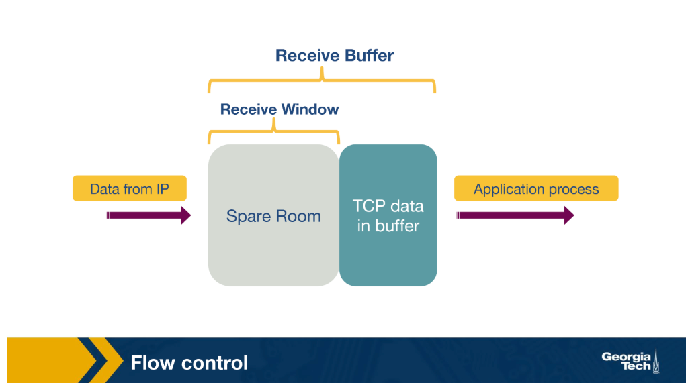

---

## Congestion Control Introduction

Congestion control limits the transmission rate to **protect the network** from overload.

### Goals

- **Efficiency** — maximize network throughput and utilization
- **Fairness** — every flow sharing a bottleneck link should get an equal share of bandwidth
- **Low delay** — avoid filling buffers and creating long queues (critical for latency-sensitive apps like video conferencing)
- **Fast convergence** — flows should quickly reach their fair share (important because most network traffic consists of many short flows)

### Approaches

| Approach | Description |
|---|---|
| **Network-assisted** | Routers explicitly signal congestion (e.g., via ICMP). Unreliable under severe congestion since ICMP packets can be dropped. |
| **End-to-end** | Hosts infer congestion from network behavior (e.g., packet loss, RTT). **TCP uses this approach**, consistent with the end-to-end principle. |

> Modern networks can provide explicit feedback via **ECN** and **QCN**, but classic TCP relies purely on end-to-end inference.

### Signs of Congestion

- **Packet delay** — growing router queues increase RTT; however, delay is variable and hard to use reliably
- **Packet loss** — routers drop packets when buffers overflow; TCP already handles loss for reliability, so it naturally uses this as a congestion signal

### How TCP Limits the Sending Rate

TCP uses a **congestion window (`cwnd`)** — the maximum number of unacknowledged bytes the sender may have in transit.

```
LastByteSent – LastByteAcked <= min{cwnd, rwnd}
```

The sender cannot exceed either the network's capacity (`cwnd`) or the receiver's capacity (`rwnd`) — whichever is smaller.

TCP uses a **probe-and-adapt** strategy: increase `cwnd` when the network is clear, decrease it when congestion is detected.

### AIMD: Additive Increase / Multiplicative Decrease

AIMD is TCP's core congestion control algorithm — it grows the window slowly but shrinks it fast.

**Additive Increase:**
- Start with a small initial window (typically 2 packets)
- Add 1 packet worth of `cwnd` per RTT when no loss is detected
- In practice, `cwnd` is increased incrementally as each ACK arrives:
  - `Increment = MSS × (MSS / CongestionWindow)`
  - `CongestionWindow += Increment`

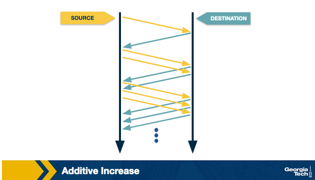

**Multiplicative Decrease:**
- On detecting a loss event, halve `cwnd`
- Example: `cwnd` = 16 → loss detected → `cwnd` = 8 → further loss → 4 → 2 → 1

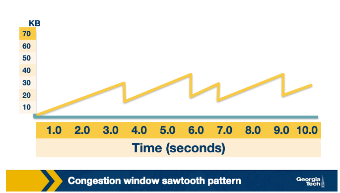

**TCP Reno — two levels of congestion response:**

| Signal | Severity | Response |
|---|---|---|
| 3 duplicate ACKs | Mild | Halve `cwnd` |
| Timeout (no ACK) | Severe | Reset `cwnd` to initial window size |

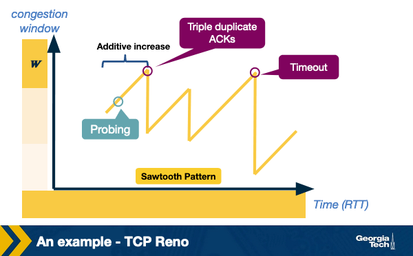

> **Probing:** TCP continually increases its rate to find the congestion point, backs off, then probes again — this is the "probe-and-adapt" cycle.

---

## Slow start in TCP
- When we have a new connection that starts from a cold start, the sending host can take much longer to increase the congestion window by using AIMD. So for a new connection, we need a mechanism that can rapidly increase the congestion window from a cold start.
- To handle this, TCP Reno has a slow start phase where the congestion window is increased exponentially instead of linearly, as in the case of AIMD.
  - The source host starts by setting `cwnd` to 1 packet. When it receives the ACK for this packet, it adds 1 to the current `cwnd` and sends 2 packets. 
  - When it receives the ACK for these two packets, it adds 1 to `cwnd` for each ACK it receives. So it now sends 4 packets.
  - Once the congestion window becomes more than a threshold, often called the slow start threshold, it starts using AIMD.
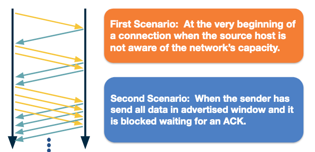
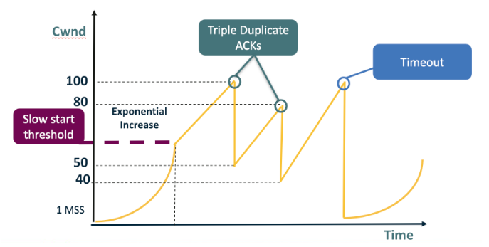
- Slow start is called “slow” start despite using an exponential increase because, in the beginning, it sends only one packet and starts doubling it after each RTT. Thus, it is slower than starting with a large window.
- Finally, we note that there is one more scenario where slow start kicks in: 
  - when a connection dies while waiting for a timeout to occur. This happens when the source has sent enough data as allowed by the flow control mechanism of TCP but times out while waiting for the ACK. 
  - Thus, the source will eventually receive a cumulative ACK to reopen the connection. Then, instead of sending the available window size worth of packets at once, it will use the slow start mechanism.
- In this case, the source will have a fair idea about the congestion window from the last time it had a packet loss.
  - It will now use this information as the “target” value to avoid packet loss in the future. This target value is stored in a temporary variable, `CongestionThreshold`.
  - Now, the source performs slow start by doubling the number of packets after each `RTT` until the value of `cwnd` reaches the **congestion threshold (a knee point)**.
  - After this point, **it increases the window by 1** (additive increase) each `RTT` until it experiences packet loss (cliff point). After which, it multiplicatively decreases the window.

  
---

## TCP Fairness

Fairness means that for **k connections** sharing a link of capacity R bps, each connection receives an average throughput of **R/k**.

### AIMD Convergence to Fairness

Consider two TCP connections sharing a single link with bandwidth R (same RTT, TCP-only traffic):

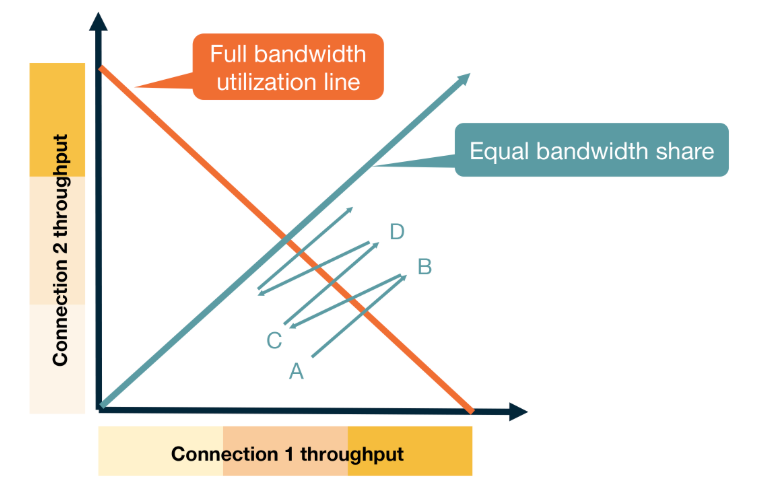

- **Point A** — total bandwidth < R, no loss → both connections increase `cwnd`, moving toward B
- **Point B** — total bandwidth > R, packet loss → both halve `cwnd`, moving toward C
- **Point C** — total bandwidth < R again → both grow, moving toward D
- This oscillation **converges toward the equal-share line**

**AIMD naturally leads to fair bandwidth sharing.**

---

## Caution About Fairness

TCP fairness does **not** always hold in practice.

### Case 1: Different RTTs

TCP Reno adapts `cwnd` based on ACKs. Connections with **shorter RTTs** receive ACKs faster and grow their window more quickly — leading to an unequal share of bandwidth.

### Case 2: Multiple Parallel Connections

A single application can open multiple TCP connections to claim a larger share:

- 9 applications, 1 connection each, on a link of rate R → each gets **R/10**
- A 10th application opens **11 connections** → it gets more than **R/2**, starving others

---

## Congestion Control in Modern Networks: TCP CUBIC

TCP Reno has poor utilization on **high bandwidth-delay product (BDP)** networks (high bandwidth + high latency). TCP CUBIC, used in the Linux kernel, addresses this with a cubic polynomial growth function.

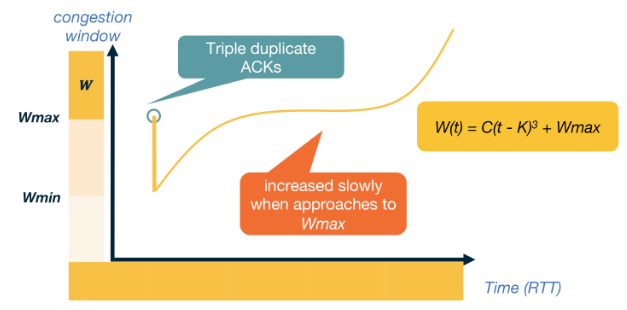

### How TCP CUBIC Works

1. TCP detects congestion at window = **Wmax** (triple duplicate ACK)
2. Multiplicatively decrease to **Wmin = Wmax / 2** for fairness
3. The optimal window is somewhere between Wmin and Wmax — so CUBIC grows **aggressively at first**
4. As the window approaches Wmax, growth **slows down** (this is where loss was last seen)
5. If no loss occurs around Wmax, growth **speeds up again** — the previous loss may have been transient

### CUBIC Growth Function

```
W(t) = C × (t - K)³ + Wmax
```

| Variable | Meaning |
|---|---|
| `t` | Time elapsed since the last congestion event |
| `K` | Time for W to grow back to Wmax from Wmin (= ∛(Wmax × β / C)) |
| `C` | Scaling constant |
| `β` | Multiplicative decrease factor |

> Unlike TCP Reno (ACK-based timer), CUBIC uses **elapsed time** since the last loss event — making it **RTT-fair** across connections with different round-trip times.

---

## TCP Throughput Model

Given TCP's AIMD behavior, we can build a simple model to predict throughput.

- Let **p** = probability of packet loss
- Assume the network delivers **1/p consecutive packets** followed by one loss

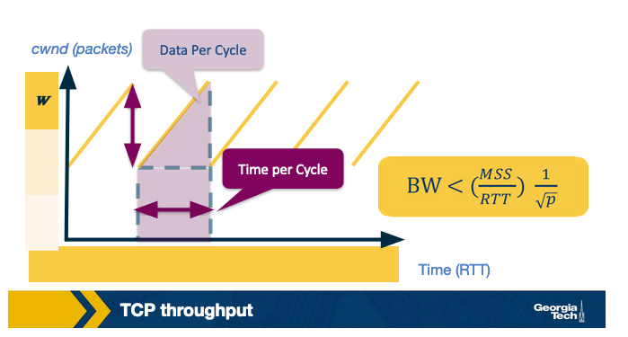

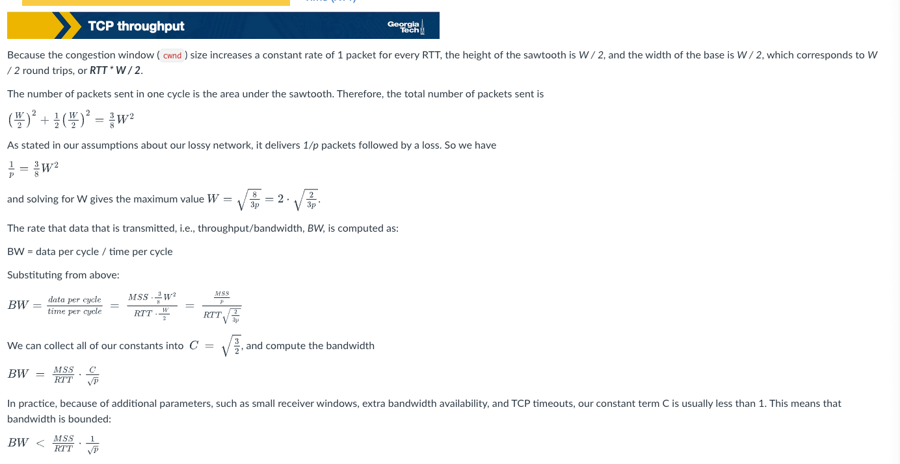


---

## Optional Reading: Datacenter TCP

Data center (DC) networks have unique characteristics that motivate **specialized TCP congestion control algorithms**.

### Why DC Networks Are Different

- **Flow characteristics** — many short, latency-sensitive flows; congestion control must optimize for both delay and throughput
- **Private ownership** — DC networks are owned by a single entity, making it easier to deploy new transport algorithms without needing to coexist with older ones

### Notable DC TCP Algorithms

- **DCTCP** — hybrid approach using both implicit feedback (packet loss) and explicit feedback from the network via **ECN** (Explicit Congestion Notification)
- **TIMELY** — uses the **gradient of RTT** to detect and respond to congestion before packet loss occurs

---

## Key Terms

| Term | Definition |
|---|---|
| **Segment** | A transport-layer packet — the application message plus a transport header added by TCP/UDP |
| **De-multiplexing** | Delivering data from a segment to the correct application socket based on port numbers in the header |
| **cwnd** | Congestion window — limits how many unacknowledged bytes the sender may have in flight |
| **rwnd** | Receive window — the receiver's available buffer space, advertised back to the sender |
| **ssthresh** | Slow start threshold — the point at which TCP switches from exponential to linear window growth |
| **RTT** | Round Trip Time — estimated from ACK timing; used to set retransmit timeouts |
| **MSS** | Maximum Segment Size — the largest TCP payload allowed on a connection |


---

## Quiz
- Q1: As we have seen, UDP and TCP use port numbers to identify the sending application and destination application. Why don’t UDP and TCP just use process IDs rather than define port numbers?
  - A1: Process IDs are specific to operating systems and therefore using process IDs rather than a specially defined port would make the protocol operating system dependent. Also, a single process can set up multiple channels of communications and so using the process ID as the destination identifier wouldn’t be able to properly demultiplex, Finally, having processes listen on well-known ports (like 80 for http) is an important convention. 
- Q2: UDP and TCP use 1’s complement for their checksums. But why is it that UDP takes the 1’s complement of the sum – why not just use the sum? Exploring this further, using 1’s complement, how does the receiver compute and detect errors? Using 1’s complement, is it possible that a 1-bit error will go undetected? What about a 2-bit error?
  - A2: To detect errors, the receiver adds the four words (the three original words and the checksum). If the sum contains a zero, the receiver knows there has been an error. While all one-bit errors will be detected, but two-bit errors can be undetected (e.g., if the last digit of the first word is converted to a 0 and the last digit of the second word is converted to a 1).
- Q3: TCP utilizes the Additive Increase Multiplicative Decrease (AIMD) policy for fairness. Other possible policies for fairness in congestion control would be Additive Increase Additive Decrease (AIAD), Multiplicative Increase Additive Decrease (MIAD), and Multiplicative Increase Multiplicative Decrease (MIMD). Would these other policies converge? If so, how would their convergence behavior differ from AIMD?
  - In AIAD and MIMD, the plotted throughput line will oscillate over the full bandwidth utilization line but will not converge as was shown for AIMD. On the other hand, MIAD will converge.
  - None of the alternative policies are as stable. The decrease policy in AIAD and MIAD is not as aggressive as AIMD, so those will not effectively address congestion control. In contrast, the increase policy in MIAD and MIMD is too aggressive.
- Q4: Explain how in TCP Cubic the congestion window growth becomes independent of RTTs.
    - The key feature of CUBIC is that its window growth depends only on the time between two consecutive congestion events. One congestion event is the time when TCP undergoes fast recovery. This feature allows CUBIC flows competing in the same bottleneck to have approxi- mately the same window size independent of their RTTs, achieving good RTT-fairness.


