# Lesson 3: Intra-domain routing

## Key concepts:
* Forwarding versus routing
* Data plane versus control plane
* Administrative domains
* Intradomain routing versus interdomain routing
* Internal Gateway Protocols
* Link-state routing
* Network topology as a graph
* Dijkstra’s shortest-path algorithm
* OSPF and hierarchical routing areas
* Distance-vector routing
* Bellman-Ford updates
* Routing convergence
* Count-to-infinity problem
* Poison reverse
* Hot-potato routing

## Routing Algorithms (RA)
Overview of how routers cooperate via routing protocols to determine paths for packets within a single administrative domain, covering forwarding vs. routing distinctions and the two major algorithm classes.

### Forwarding vs. Routing

These two terms are often confused but refer to distinct operations in the network layer.

- **Forwarding**:
    - Transferring a packet from an incoming link to an outgoing link within a single router
    - Each router consults its **forwarding table** to determine the correct outgoing link based on the packet's destination address
- **Routing**:
    - The process by which routers work together using **routing protocols** to determine good paths from source to destination
    - Operates across multiple routers, not within a single one

### Routing Scope

Routing is categorized by whether the routers involved share the same administrative domain.

- **Intradomain routing**:
    - Routing among routers within the same administrative domain
    - Also called **Interior Gateway Protocols (IGPs)**
    - Focus of this lecture
- **Interdomain routing**:
    - Routing among routers belonging to different administrative domains

### Graph Abstraction

Routing algorithms use a graph model to reason about network topology and path costs.

- **Nodes**:
    - Represent routers in the network
- **Edges**:
    - Represent links between routers
    - Each edge carries an associated **cost**

### Algorithm Classes

The two major categories of intradomain routing algorithms differ in what information each router maintains and how that information is shared.

- **Link-state algorithms**:
    - Each router has complete knowledge of the entire network topology and link costs
- **Distance-vector algorithms**:
    - Each router knows only the costs to its immediate neighbors and exchanges estimates with them iteratively

## RA: Link-state Routing Algorithm
A link-state routing algorithm where all nodes have full knowledge of network topology and link costs, used to compute the least-cost path from a source node to all other nodes.

### Key Properties

In link-state routing, topology and link costs are distributed to all nodes (e.g., via broadcasting) before the algorithm runs.

- **Global knowledge**:
    - Every node knows the complete network topology and all link costs
    - This information is shared across the network before path computation begins

### Terminology

The algorithm operates on a graph with the following variables defined relative to a source node.

- **u** — the source node
- **v** — any other node in the network
- **D(v)** — cost of the current least-cost path from u to v
- **p(v)** — the previous node along the current least-cost path from u to v
- **c(u,v)** — the direct link cost from u to its immediately attached neighbor v
- **N'** — the subset of nodes whose least-cost path from u has been finalized

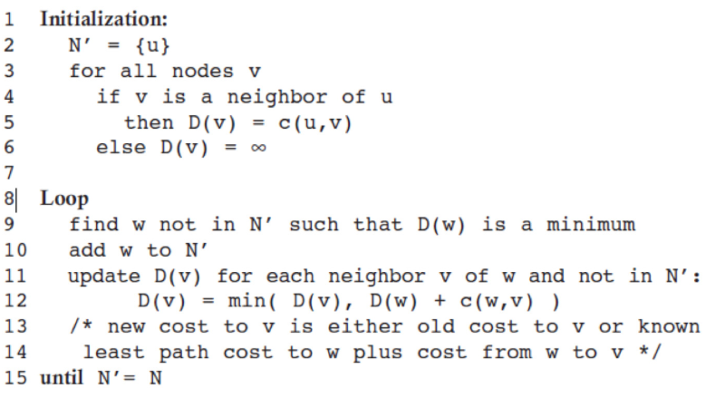

### Initialization Step

The algorithm begins by seeding known costs before any iterations run.

- Set **N'** to contain only the source node u
- For each node v directly attached to u:
    - Set D(v) = c(u,v)
- For every other node v not directly attached to u:
    - Set D(v) = ∞
- Set **p(v)** for all directly attached neighbors to u

### Iteration Step

The algorithm loops once per destination node, progressively finalizing least-cost paths.

- At each iteration:
    - Among all nodes not yet in N', find node **w** with the minimum D(w)
    - Add w to N'
    - For every neighbor v of w, update D(v) using:
        - D(v) = min( D(v), D(w) + c(w,v) )
        - If the new path via w is cheaper, update **p(v) = w**
- Loop continues until all nodes are included in N'

### Output
After all iterations complete, the algorithm returns the finalized results.

- Shortest path **cost** from u to every other node v in the network
- The **previous-hop node p(v)** for each v, which can be traced back to reconstruct the full path

## Linkstate Routing Algorithm - Example
A step-by-step trace of Dijkstra's algorithm on a sample graph with source node u, showing how D(v) and N' evolve across each iteration until all least-cost paths are finalized.

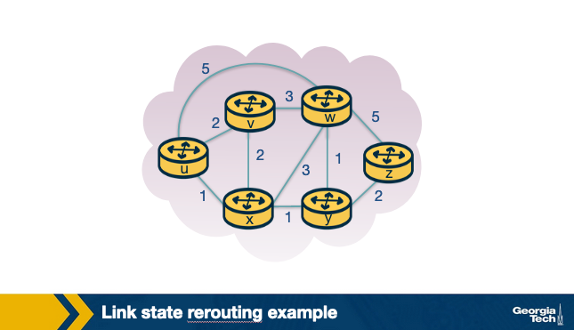

### Graph Setup
The network has source node u with three directly attached neighbors: v, x, and w.

- Goal: compute least-cost paths from u to all other nodes in the network

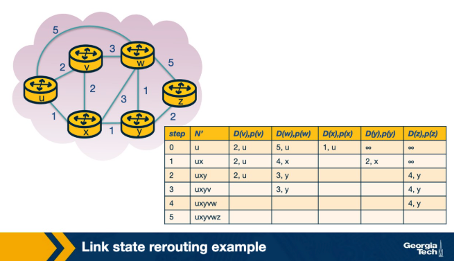

### Initialization (Step 0)
D(v) is set for all directly attached neighbors of u; all other nodes are initialized to infinity.

- **N'** = {u}
- D(v), D(x), D(w) set to their direct link costs from u
- D(y) = ∞, D(z) = ∞ — not immediate neighbors of u

### Iteration 1
The node outside N' with the smallest D from the previous iteration is selected first.

- Select **x** — lowest cost among nodes not in N'
- Add x to N' → N' = {u, x}
- Update D for all immediate neighbors of x: v, w, and y
    - D(w) = min(5, D(x) + c(x,w)) = min(5, 1+3) = **4**
    - D(v) and D(y) updated similarly

### Iterations 2–5
The same process repeats — select the minimum-cost node outside N', add it, and relax its neighbors.

- Each iteration adds one node to N' and updates D(v) for that node's neighbors
- The algorithm exits after the **5th iteration** when all nodes have been added to N'


## Linkstate Routing Algorithm - Computational Complexity
Dijkstra's algorithm has a worst-case complexity of O(n²), derived from the total number of node searches across all iterations.

### Deriving the Complexity
At each iteration, the algorithm searches through all nodes not yet in N' to find the one with minimum path cost.

- Iteration 1: search through **n** nodes
- Iteration 2: search through **n-1** nodes
- Each subsequent iteration searches one fewer node
- Total nodes searched across all iterations: **n(n+1)/2**

### Result
- Summing all searches across iterations gives the overall complexity.
- Total computations grow with n(n+1)/2, which is **O(n²)**

## RA: Distance Vector Routing
An iterative, asynchronous, and distributed routing algorithm where each node maintains and exchanges distance vectors with neighbors to converge on least-cost paths across the network.

### Algorithm Properties
The DV algorithm has three core characteristics that distinguish it from link-state approaches.

- **Iterative**:
    - Continues until no neighbor has a new update to send
- **Asynchronous**:
    - Nodes do not need to be synchronized with each other
- **Distributed**:
    - Nodes send information directly to neighbors, who perform their own calculations and send results back
    - No centralized computation

### Basis: Bellman-Ford Equation
Each node x computes its least-cost path to every destination y by considering paths through each of its neighbors v.

- Dx(y) = min_v { c(x,v) + Dv(y) } for each destination node y
    - c(x,v) — direct cost from x to neighbor v
    - Dv(y) — neighbor v's known least cost to reach destination y
    - The minimum is taken over all neighbors v

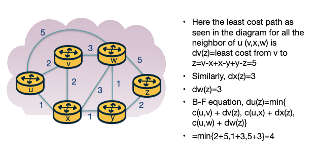

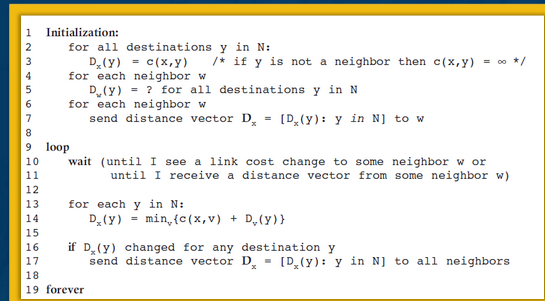

### How Distance Vectors Are Maintained and Exchanged
Each node keeps a local distance vector and periodically shares it with direct neighbors.

- Each node maintains its own **distance vector** with estimated costs to every other node
- From time to time, each node sends its distance vector to its **neighbor nodes**
- Neighbors receive the vector and use it to update their own distance vectors
- This exchange repeats iteratively until the network **converges** (no further updates)

## RA: Distance Vector Routing (Example)
Now, let’s see an example of the distance vector routing algorithm. Let’s consider the three node network shown here:
- 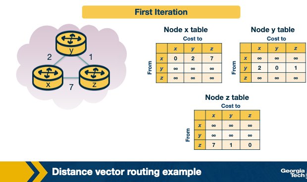

### Iteration 1: Initialization
Each node starts with only its own direct link costs; costs to non-neighbors are unknown.

- Each node maintains its own table where every row is a **distance vector**
- Node x knows only its direct costs to y and z; all other values set to ∞
- Same applies to nodes y and z — no knowledge of non-neighbor distance vectors yet

- 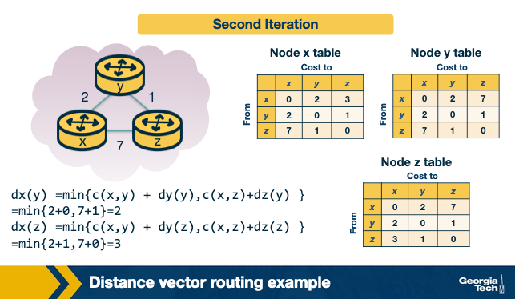

### Iteration 2: First Exchange and Update
Nodes share their distance vectors with neighbors and apply the Bellman-Ford equation for each destination.

- Node x computes its updated distance vector:
    - Dx(y) = min{ c(x,y) + Dy(y), c(x,z) + Dz(y) } = min{ 2+0, 7+1 } = **2**
    - Dx(z) = min{ c(x,y) + Dy(z), c(x,z) + Dz(z) } = min{ 2+1, 7+0 } = **3**
- Node x also receives distance vectors from y and z and updates its table accordingly
- Nodes y and z repeat the same steps to update their own tables

### Iteration 3: Second Exchange and Convergence
Nodes process any changed distance vectors received from the previous iteration and repeat calculations.

- Each node recalculates its distance vector only if received vectors have changed
- After this iteration, each node has its final **routing table**

- 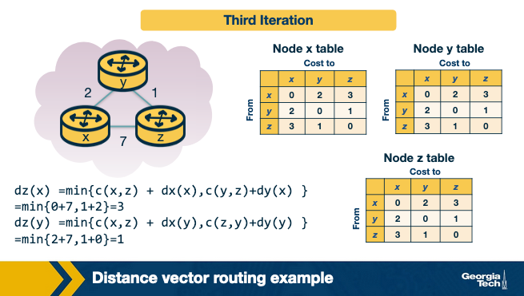

### Waiting Mode
Once no further updates are sent, the algorithm halts until a link cost change triggers a new round.

- No new updates → nodes perform no further calculations
- Nodes enter a **waiting mode** until a link cost change occurs

## Link Cost Changes and Failures in DV - Count to Infinity Problem
When link costs change, DV routing converges quickly for cost decreases but can suffer from the count-to-infinity problem when costs increase significantly.


### Scenario 1: Link Cost Decrease (y-x changes from 4 to 1)
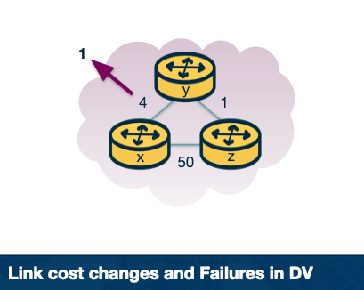

A cost decrease propagates quickly and converges in a few iterations.

- **t0**: y detects cost to x changed from 4 → 1, updates its distance vector and notifies neighbors
- **t1**: z receives update from y, computes it can reach x through y at cost 2, sends updated vector to neighbors
- **t2**: y receives update from z, no change to its distance vector, no further update sent
- Result: change propagates quickly across the network in only a few iterations

### Scenario 2: Link Cost Increase (y-x changes from 1 to 60)
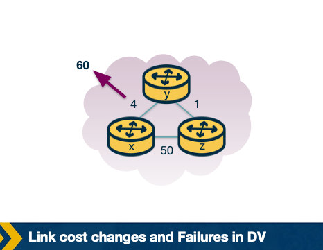

A large cost increase causes a routing loop and slow convergence.

- **t0**: y detects the cost increase but sees that z still advertises a path to x at cost 5
    - y recomputes: Dy(x) = min{ c(y,x), c(y,z) + Dz(x) } = min{ 60, 1+5 } = **6**
    - y believes it can still reach x through z at cost 6
- **t1**: a **routing loop** forms — y thinks it can reach x through z, and z thinks it can reach x through y
    - Packets bounce back and forth between y and z
- Ongoing: y and z keep updating each other iteratively
    - y advertises cost 6 → z updates to cost 7 → y updates to cost 8, and so on
    - This continues for **44 iterations** until z's cost exceeds 50
    - At that point z prefers to reach x directly rather than through y

### The Count-to-Infinity Problem

The slow convergence in Scenario 2 arises because nodes rely on stale information from each other.

- Node z's distance vector still stores the old cost to x (cost 5) when y detects the change
- y uses z's stale value to compute a new (incorrect) least-cost path:
    - Dy(x) = c(y,z) + Dz(x) = 1 + 5 = **6**
- y then advertises cost 6 → z updates to 7 → y updates to 8 → loop continues
- Nodes slowly **count up to infinity** before reaching the correct path cost
- This is known as the **count-to-infinity problem**

## Poison Reverse
Poison reverse solves the count-to-infinity problem between two nodes by having a node advertise infinity back to the neighbor it uses to reach a destination, preventing routing loops.

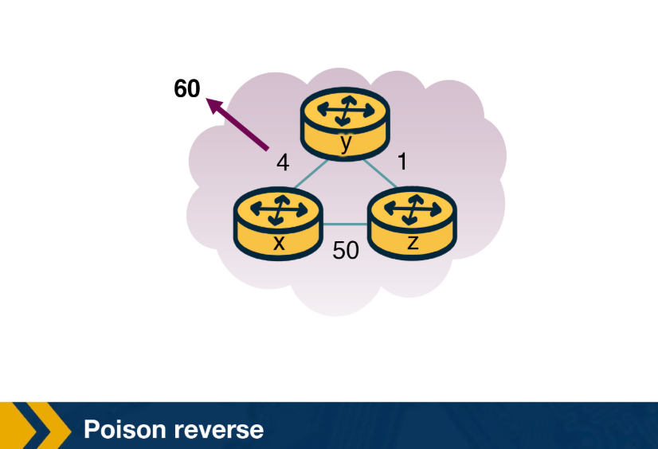

### The Poison Reverse Idea
A node lies to its upstream neighbor about its path cost to prevent that neighbor from routing back through it.

- z reaches x through y, so z advertises Dz(x) = ∞ to y
    - z knows this is false (Dz(x) = 5), but tells this lie as long as it routes to x via y
    - y assumes z has no path to x except through y, so y will never send packets to x via z
- This is called **poisoning the reverse path** from z to y

### How It Resolves the Cost Increase (y-x changes to 60)
When the link cost changes, poison reverse allows nodes to converge immediately instead of counting to infinity.

- y detects the cost change and updates Dy(x) = 60, routing directly to x
- y informs z of its new cost to x
- z immediately shifts its route to x via the direct (z,x) link at cost 50
- z informs y that Dz(x) = 50
- y receives z's update and computes Dy(x) = c(y,z) + Dz(x) = 1 + 50 = **51**
- Since z is now on y's least-cost path to x, y poisons the reverse:
    - y advertises Dy(x) = ∞ to z, even though y knows Dy(x) = 51

### Limitation
Poison reverse solves the two-node routing loop but does not generalize to all topologies.

- Poison reverse **will not solve** the count-to-infinity problem when it involves 3 or more nodes that are not directly connected to each other

## Distance Vector Routing Protocol Example: RIP
- A distance vector-based routing protocol that uses hop count as its metric and exchanges routing advertisements periodically between neighbors to maintain least-cost paths to all subnets in an AS.

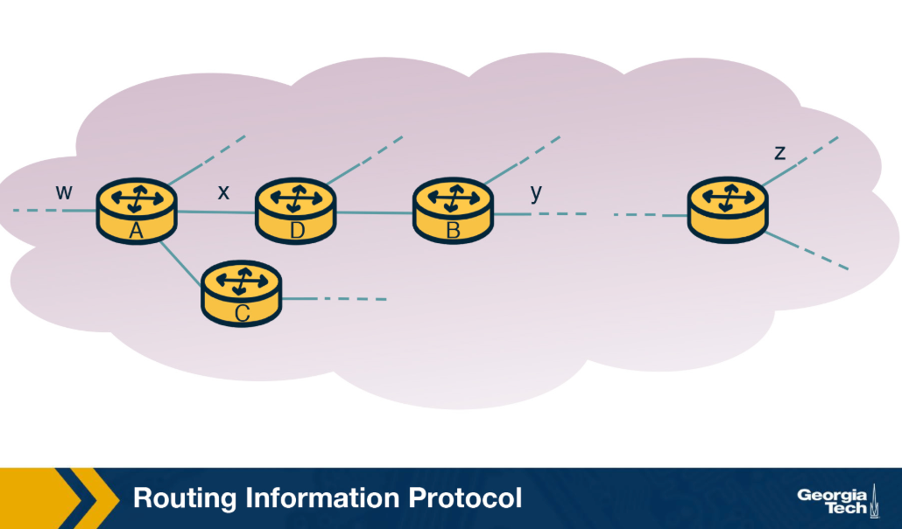


### Basic Properties
RIP is built on the distance vector protocol with a simplified cost metric.

- Uses **hop count** as the link cost metric (each link cost = 1)
- First version released as part of the **BSD Unix** distribution
- Path selection metric can be `shortest distance`, `lowest cost`, or `load-balanced path`
- Routing updates exchanged periodically between neighbors via **RIP response messages** (called RIP advertisements)
    - Advertisements contain the sender's distances to destination subnets

### Routing Table Structure
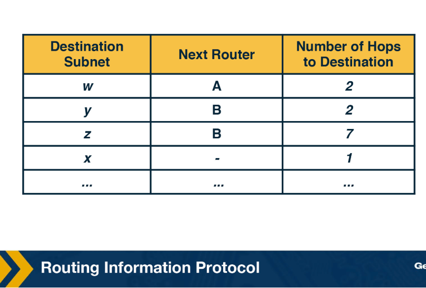

Each router maintains a routing table that serves as both its distance vector and forwarding table.

- Each row in the table represents one **subnet** in the AS
- Three columns per row:
    - **Destination subnet**
    - **Next router** along the shortest path to that destination
    - **Number of hops** to reach that destination along the shortest path
- **RIP version 2** allows subnet entries to be aggregated using **route aggregation** techniques

### Example: Route Advertisement and Table Update
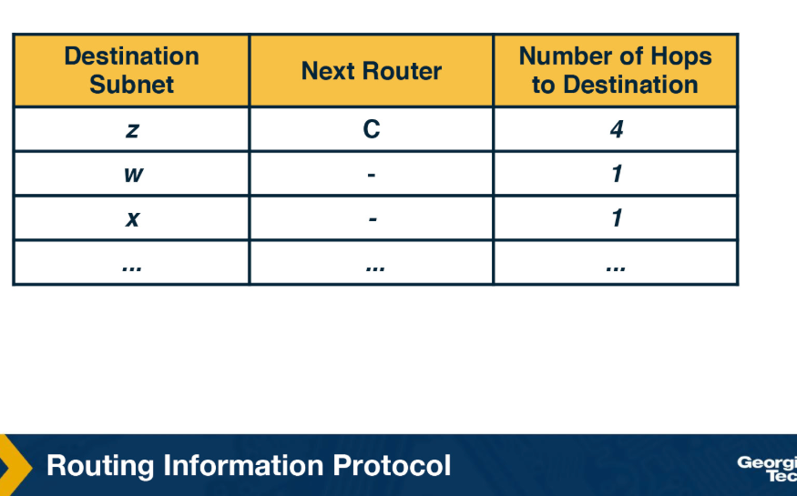
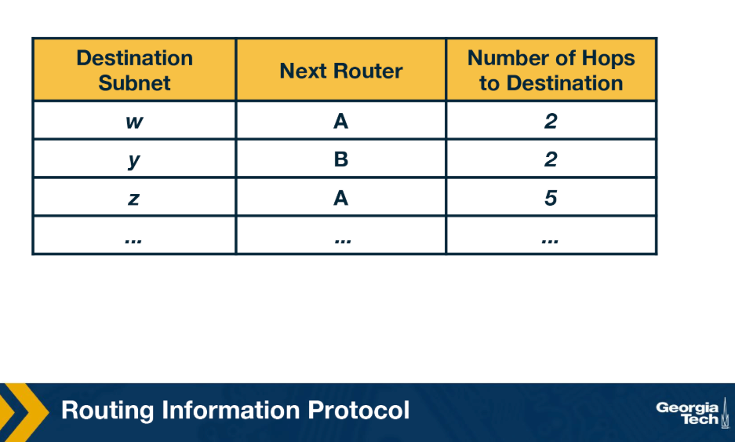
When router D receives an advertisement from router A, it merges the new information with its existing routing table.

- Router D's original table shows: to reach subnet w, forward to router A at 2 hops
- Router A sends its routing table to router D as an advertisement
- Router D learns there is a shorter path to subnet z through router A than through router B
- Router D updates its table to reflect the new shortest path
- This process repeats as the **Distance Vector algorithm converges** or as new links and routers are added to the AS

### Failure Detection
RIP detects broken links using a timeout mechanism.

- If a router does not hear from a neighbor within **180 seconds**, that neighbor is considered unreachable
- The local routing table is modified and changes are **propagated** to other routers

### Implementation Details
RIP operates at the application layer despite being a network routing protocol.

- Messages sent over **UDP** using port **520**
- UDP is layered on top of the network-layer **IP protocol**
- RIP is implemented as an **application-level process**

### Challenges
- Updating routes efficiently as the network changes
- Reducing **convergence time**
- Avoiding routing loops and the **count-to-infinity problem**

## Linkstate Routing Protocol Example: OSPF
A link-state routing protocol that uses Dijkstra's algorithm and LSA flooding to compute least-cost paths, with support for hierarchical routing within a single autonomous system.

### Overview and Advances Over RIP
OSPF was introduced as an advancement of RIP, operating in upper-tier ISPs.

- Uses **link-state routing** with flooding of link-state information and Dijkstra's algorithm
- Advances over RIP include:
    - **Authentication** of messages exchanged between routers
    - Option to use **multiple same-cost paths**
    - Support for **hierarchy** within a single routing domain

### Hierarchy: Areas
An OSPF autonomous system can be configured hierarchically into areas to reduce routing overhead.

- Each **area** runs its own OSPF link-state routing algorithm
    - Routers within an area broadcast link-state only to other routers in the same area
    - One or more **area border routers** handle routing packets outside the area
- Exactly one area is designated the **backbone area**
    - Primary role: route traffic between all other areas in the AS
    - Always contains all area border routers; may also contain non-border routers
- Packet routing between two different areas:
    - Packet travels through an area border router → backbone → area border router of destination area → destination

### Operation
Each router independently builds a complete topology map and computes shortest paths using Dijkstra's algorithm.

- A graph (topological map) of the entire AS is constructed
- Each router treats itself as the **root node** and runs Dijkstra's algorithm locally to compute shortest path tree to all subnets
- Link costs are **pre-configured by a network administrator**
    - Example choices: inversely proportional to link capacity, or all set to 1
- Whenever a link's state changes, the router **broadcasts routing information to all routers** in the AS, not just neighbors
- Link state is also **periodically broadcast** even if it has not changed

### Link State Advertisements (LSAs)
LSAs are the mechanism by which routers share local topology information across the OSPF area.

- Every router in an OSPF domain generates **LSAs** to communicate its local routing topology to all other routers in the same area
- LSAs are **flooded to every router** in the domain, building a consistent network topology view
- All LSAs are stored in a **link state database**
- Any change in topology requires corresponding changes in LSAs

### LSA Refresh Rate
OSPF uses a periodic refresh mechanism to keep link state information current.

- Default LSA refresh period: **30 minutes**
- If a link comes alive before the refresh period, routers connected to that link trigger **immediate LSA flooding**
- Since flooding can occur multiple times, routers may receive duplicate LSAs
    - First received copy is stored as **new**
    - Subsequent copies are treated as **duplicates**

## Processing OSPF Messages in the Router
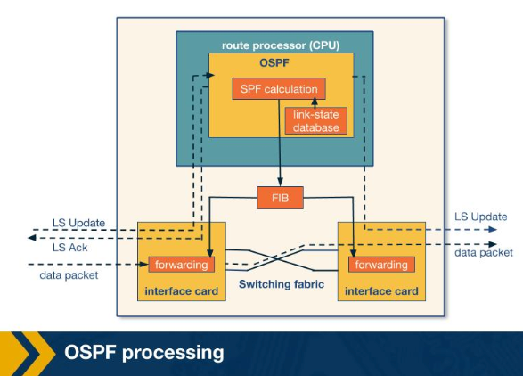

### Router Model
A router consists of two main components involved in OSPF processing.

- **Route processor** — main processing unit that runs OSPF and SPF calculation
- **Interface cards** — receive incoming data packets and forward them via a switching fabric

### High-Level Processing Steps
OSPF processing in a router follows three broad stages from receiving an LSA to forwarding data packets.

- Step 1: LS update packets containing LSAs arrive from a neighboring router at the route processor
    - A consistent view of the topology is formed and stored in the **link-state database**
    - LSA entries correspond to the topology visible from the current router
- Step 2: The router uses the link-state database to compute shortest paths via the **SPF algorithm**
    - Result is fed into the **Forwarding Information Base (FIB)**
- Step 3: When a data packet arrives at an interface card, the FIB is consulted to determine the next hop
    - Packet is forwarded to the appropriate outgoing interface card

### Detailed Processing Flow (T1–T7)
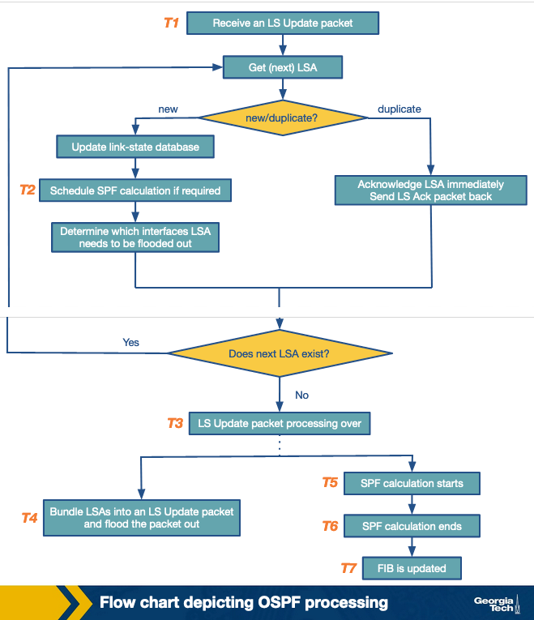

OSPF processing can be broken into time slices showing each stage from LSA receipt to FIB update.

- **T1** — LS update packet is received; processing begins
    - For each LSA unpacked from the update, OSPF checks whether it is **new or duplicate**
    - Done by comparing the LSA's **sequence number** against matching entries in the link-state database
- **T2** — For every new LSA:
    - Link-state database is **updated**
    - SPF calculation is **scheduled**
    - Outgoing interface for LSA flooding is determined
    - In modern routers, the timing of LSA flooding can be **timer-based**
- **T3** — All LSAs from the LS update packet have been processed
- **T4** — LSAs are prepared and **flooded out** as an LS update packet to the next router
- **T5–T6** — SPF calculation is **executed**
    - SPF is a CPU-intensive task and is scheduled to run over a period of time, typically only when LSAs have changed, to offset CPU costs
- **T7** — SPF calculation completes and the **FIB is updated**


## RA: Hot Potato Routing
- A routing practice where a router forwards traffic to the closest egress point based on intradomain IGP path cost, getting traffic out of the network as quickly as possible.

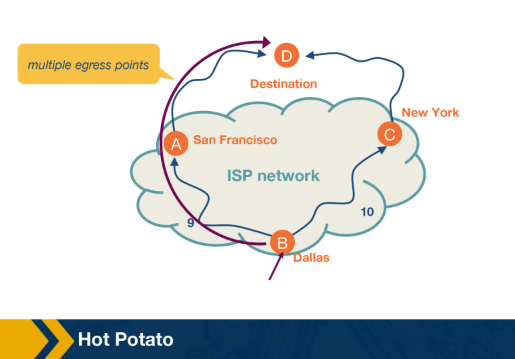

### Context
In large networks, routers use both intradomain and interdomain routing protocols together.

- Intradomain protocols find the best path to route traffic **within** the network
- When the destination is **outside** the network, traffic travels toward an egress point before leaving
- Multiple egress points may exist, and in some cases they are **equally good** in terms of external path cost (e.g., same number of AS hops to the destination via BGP)

### Hot Potato Routing
When multiple egress points are equally good externally, the router uses IGP cost to break the tie.

- Choose the egress point with the **lowest intradomain IGP path cost**
- The router does not consider what happens to the packet after it leaves the network

### Example
A router in Dallas must forward traffic and can exit via New York or San Francisco, both offering equal BGP path costs.

- IGP path cost to SF = **9**
- IGP path cost to NY = **10**
- Dallas router selects **SF** as the egress point via hot potato routing

### Advantages
- **Simplifies computation** — routers already know IGP path costs, no additional calculation needed
- **Path consistency** — the next router along the path will also choose the same egress point
- **Reduces resource consumption** — traffic exits the network as soon as possible, freeing up internal network resources

## Quiz
- Q: In this lecture, we discuss intradomain routing, where all the nodes and subnets are owned and managed by the same organization. (In contrast, interdomain routing is about routing between different organizations – such as between two ISPs.) Before we begin talking about intradomain routing algorithms, what could the weights on the graph edges represent in these diagrams, when we are seeking the least-cost path between two nodes?
  - Length of the cable
  - Time delay to traverse the link
  - Monetary cost of using the link
  - Link Capacity
  - Current load on the link
- Q: A packet is __________ when it is moved from a router’s input link to the appropriate link. 
  - Forwarded
- Q: Determine which action is network-wide (i.e. involves multiple routers). 
  - Routing
- Intradomain routing must involves multiple administrative domains.
  - False


- Q: In the previous example, node u was the source node, and distances were calculated from u to each other node. Consider the same example, but let x be the source node. Notice that node x has more direct neighbors than u does. Suppose x is executing the linkstate algorithm as discussed, and has just finished the initialization step. Which of the following statements are true?

  - Node x will execute the same number of iterations that node u did, as the number of immediate neighbors has no impact on the number of iterations the algorithm requires.. 
```
Note that the algorithm continues iterating for N-1 steps until

    N’ = N
    
    that is, until every node is the graph is in N’. As there are 6 nodes, there will always be 5 iterations after initialization.
```
- Q: In Dijkstra's algorithm, all nodes in a network are aware of the entire network topology only after the algorithm's termination.
  - False
- Q: Consider the following topology. Let b be the source node. Use Dijkstra’s algorithm to determine the cost of the least cost path from node b to all other nodes in the network upon termination of the algorithm.
  - 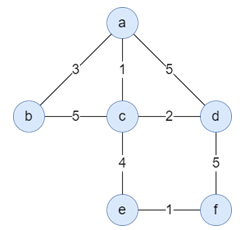
  - a: 3
  - c: 4
  - d: 6
  - e: 8
  - f: 9

- Q: Select the words that can be used to describe the distance vector algorithm.
  - Iterative
  - Asynchronous
  - Distributed
- Q: Determine which of the following can cause the count-to-infinity problem.
  - Routing Loops 

- Q: Dijkstra’s algorithm is a ___  routing algorithm, which is also referred to as a ___ algorithm.
  - Global, Link-state
- Q: The Bellman Ford equation is used by the ______________ algorithm.
  - distance vector
- Q: Select all statements that correctly complete the sentence.  The Routing Information Protocol (RIP) is an example of ______________.
  - a distance vector algorithm
  - an intradomain routing algorithm 


