# Lesson 3: Intra-domain routing

## Intro

## Key concepts:
* Autonomous Systems and interdomain routing
* Intra-domain routing versus interdomain routing
* BGP as the “glue” of the Internet
* Prefix reachability and border routers
* Customer-provider and peering relationships
* Import and export routing policies
* LocalPref, MED, and BGP path selection
* eBGP and iBGP
* BGP updates, withdrawals, and instability
* Internet Exchange Points and route servers
* Route filtering, misconfiguration, and operational risks

## Autonomous Systems and Internet Interconnection
- The basis of internet ecosystem includes Internet Service Providers (ISPs), Internet Exchange Points (IXPs), and Content Delivery Networks (CDNs).
  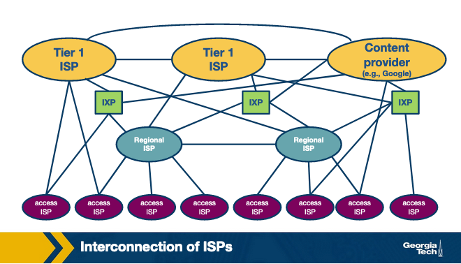
- There are three types of ISPs
  - large global scale ISPs (or Tier-1)
    - E.g. AT&T, CenturyLink, Sprint, Verizon, NTT, Level 3, Tata Communications, Telia, and Telus
  - regional ISPs (or Tier-2)
    - Connect to Tier-1 ISPs and other Tier-2 ISPs
  - access ISPs (or Tier-3)
    - Connect to Tier-2 ISPs and provide access to end users
- Second, IXPs are interconnection infrastructures that provide the physical infrastructure where multiple networks (e.g., ISPs and CDNs) can interconnect and exchange traffic locally
  - As of 2019, there are approximately 500 IXPs around the world.
- Third, CDNs are networks that content providers create with the goal of having greater control of how the content is delivered to the end-users while reducing connectivity costs. 
  - E.g. of CDNs are Google and Netflix.
  - These networks have multiple data centers, and each one of them may be housing hundreds of servers that are distributed across the world.

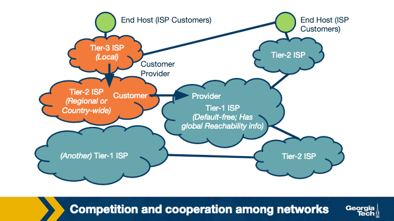
- Since they are multi-tiered, each tier has their own competition and the companies strategize based on number of customersin their network and the geographical coverage of their network.
- More interconnection options in the Internet ecosystem
  - ISPs may also connect through Points of Presence (PoPs), multi-homing, and peering. PoPs are one (or more) routers in a provider's network, which a customer network can use to connect to that provider
  - ISP may choose to multi-home by connecting to one or more provider networks
  - Two ISPs may choose to connect through a settlement-free agreement where neither network pays the other to directly send traffic to one another
- The Internet topology: hierarchical versus flat
  - Internet has been evolving, the dominant presence of IXPs and CDNs has caused the structure to begin morphing from hierarchical to flat
- Autonomous Systems
  - Each of the networks we discussed above (e.g., ISPs and CDNs) may operate as an Autonomous System (AS)
  - An **AS** is a group of routers (including the links among them) that operate under the same administrative authority
  - An ISP, for example, may operate as a single AS, or it may operate through multiple ASes. Each AS implements its own policies, makes its own traffic engineering decisions and interconnection strategies, and determines how the traffic leaves and enters its network.
- Protocols for routing traffic between and within ASes
  - The border routers of the ASes use the Border Gateway Protocol (BGP) to exchange routing information with one another
  - In contrast, the Interior Gateway Protocols (IGPs) operate within an AS, and they are focused on "optimizing a path metric" within that network
  - Example IGPs include Open Shortest Paths First (OSPF), Intermediate System - Intermediate System (IS-IS), Routing Information Protocol (RIP), and E-IGRP

## AS Business Relationships
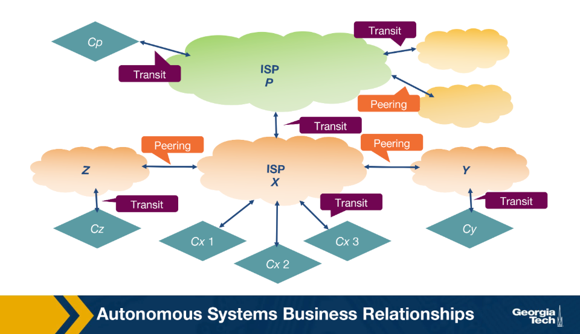
- Forms of business relationships between ASes
  -  Provider-Customer relationship (or transit)
    - This relationship is based on a financial settlement that determines how much the customer will pay the provider
    - The provider forwards the customer's traffic to destinations found in the provider's routing table (including the opposite direction of the traffic)
  - Peering relationship
    - two ASes share access to a subset of each other's routing tables 
    - The routes shared between two peers are often restricted to the respective customers of each one
    - The agreement holds as long as the traffic exchanged between the two peers is not highly asymmetric
    - Peering relationships are formed between Tier-1 ISPs but also between smaller ISPs. In the case of Tier-1 ISPs, the two peers need to be of similar size and handle proportional amounts of traffic.
    - Otherwise, the larger ISP would lack the incentive to enter a peering relationship with a smaller size ISP
    - When two small ISPs peer, they both save the money they would otherwise pay to their providers by directly forwarding traffic between themselves instead of through their providers
    - This arrangement is primarily beneficial when a significant amount of traffic is destined for each other

### How do providers charge customers?
While peering allows networks to have their traffic forwarded without cost, provider ASes have a financial incentive to forward as much of their customers' traffic as possible. One major factor determining a provider's revenue is the data rate of an interconnection
- Based on a fixed price, given that the bandwidth used is within a predefined range
- Based on the bandwidth used. The bandwidth usage is calculated based on periodic measurements, e.g., five-minute intervals. The provider then charges by taking the 95th percentile of the distribution of the measurements.

## BGP Routing Policies: Importing and Exporting Routes
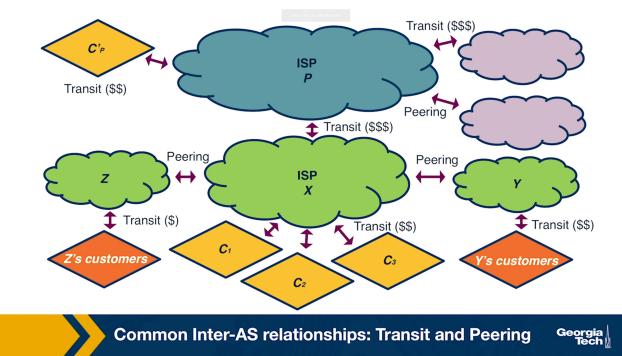

### Exporting routes
- deciding which routes to advertise is a policy decision, which is implemented through route filters.
- **Route filters** are rules that determine which routes an AS's router should advertise to the routers of neighboring ASes
- Types of routes an AS(let's call it X) decides whether to export
  - Routes learned from customers
    - These are the routes X receives as advertisements from its customers
    - Since provider X is getting paid to provide reachability to a customer AS, it makes sense that X wants to advertise these customer routes to as many neighboring ASes as possible. 
    - This will likely cause more traffic toward the customer (through X) and, hence, more revenue for X.
  - Routes learned from providers
    - These are the routes X receives as advertisements from its providers
    - Advertising these routes does not make sense since X has no financial incentive to carry traffic for its provider's routes.
    - Therefore, these routes are withheld from X's peers and X's other providers, but they are advertised to X's customers.
  - Routes learned from peers
    - These are routes that X receives as advertisements from its peers
    - As we saw earlier, it does not make sense for X to advertise to provider A the routes it receives from provider B
    - Because in that case, providers A and B will use X to reach the advertised destinations without X making revenue. The same is true for the routes that X learns from peers.

### Importing routes
- When an AS receives multiple route advertisements towards the same destination from multiple ASes, it needs to rank the routes before selecting which one to import. 
- In order of preference, the imported routes are the customer routes, then the peer routes, and finally, the provider routes.
- The reasoning behind this ranking is as follows:
  - An AS wants to ensure that routes toward its customers do not traverse other ASes, unnecessarily generating costs.
  - An AS uses routes learned from peers since these are usually "free" (under the peering agreement).
  - An AS resorts to importing routes learned from providers only when necessary for connectivity since these will add to costs.

## BGP and Design Goals
- Design goals of BGP
  - Scalability
    - manage the complications of internet growth while achieving convergence in reasonable timescales and providing loop-free paths
  - Express routing policies
    - BGP has defined route attributes that allow ASes to implement policies (which routes to import and export) through route filtering and route ranking
    - Each ASes routing decisions can be kept confidential, and each AS can implement them independently.
  - Allow cooperation among ASes
    - Each AS can still make local decisions (which routes to import and export) while keeping these decisions confidential from other ASes.
  - Security
    - There have been several efforts to enhance BGP security ranging from protocols (e.g., S-BGP), additional infrastructure (e.g., registries to maintain up-to-date information about which ASes own which prefixes ASes), public keys for ASes, etc. Also, there has been extensive research to develop machine learning-based approaches and systems
    - 

## BGP Protocol Basics
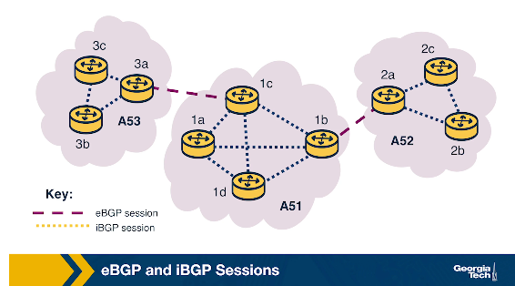

### BGP Sessions
- BGP peers exchange routing information over a semi-permanent TCP connection called a **BGP session**
- To begin a session, a router sends an **OPEN message** to another router
    - Both routers then exchange announcements from their routing tables
    - Time to exchange routes varies from a few seconds to several minutes
- Types of BGP sessions
    - **eBGP** - session between routers in two different ASes
    - **iBGP** - session between routers in the same AS

### BGP Messages
- Two types of BGP messages 
- UPDATE Messages
  - Contain information about routes that have changed since the previous update
  - Two kinds
      - **Announcements** - advertise new routes and updates to existing routes; include standardized attributes
      - **Withdrawals** - inform that a previously announced route is no longer available (due to failure or routing policy change)
- KEEPALIVE Messages
  - Exchanged between peers to keep a current session going

### BGP Prefix Reachability
- Destinations are represented by **IP prefixes** (a subnet or collection of subnets an AS can reach)
- Gateway routers running eBGP advertise reachable IP prefixes to neighboring ASes (per export policy)
- Gateway routers then use iBGP to disseminate those external routes to internal routers (per import policy)
- Internal routers run iBGP to propagate external routes to other internal iBGP-speaking routers

### Path Attributes and BGP Routes
- BGP routes consist of a reachable IP prefix plus several attributes
- Two notable attributes
    - **AS-PATH** - as an announcement passes through ASes, their ASNs are added to this attribute
        - Prevents loops
        - Used to choose the route with the shortest path to the same destination
    - **NEXT-HOP** - the IP address of the next-hop router along the path to the destination
        - Internal routers use it to store the IP address of the border router
        - If multiple border routers advertise a path to the same destination, NEXT-HOP allows the internal router to store the best path in the forwarding table

## iBGP and eBGP
- Two flavors
  - eBGP - session between routers in two different ASes
  - iBGP - session between routers in the same AS
- The eBGP speaking routers learn routes to external prefixes and disseminate them to all routers within the AS. This dissemination is happening with iBGP sessions
-  For example, as the figure below shows, the border routers of AS1, AS2, and AS3 establish eBGP sessions to learn external routes. Inside AS2, these routes are disseminated using iBGP sessions.
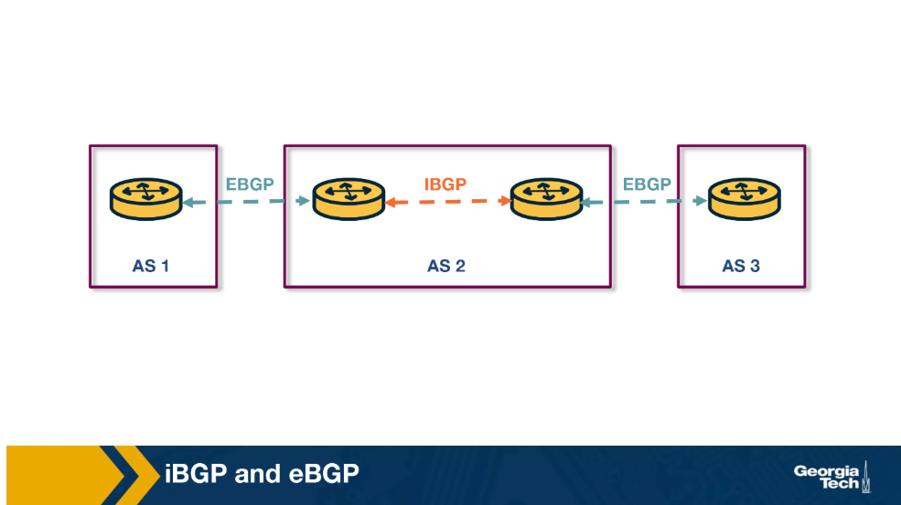

- The dissemination of routes within the AS is done by establishing a full mesh of iBGP sessions between the internal routers
- Each eBGP speaking router has an iBGP session with every other BGP router in the AS to send updates about the routes it learns (over eBGP).
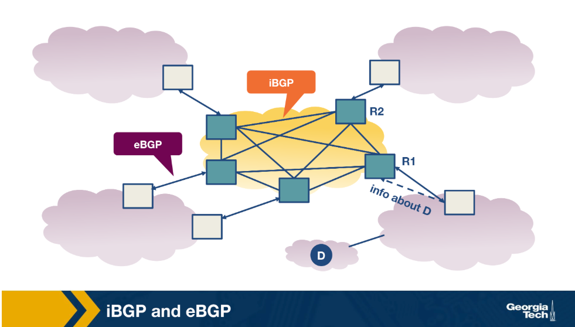
- Note that iBGP is not another IGP-like protocol (e.g., RIP or OSPF)
- IGP-like protocols are used to establish paths between the internal routers of an AS based on specific costs within the AS.
- In contrast, iBGP is only used to disseminate external routes within the AS

## BGP Decision Process: Selecting Routes at a Router
- A router receives incoming BGP messages and processes them
- Steps a router follows
    - Applies **import policies** to exclude routes from further consideration
    - Runs the **decision process** to select the best routes
    - Installs newly selected routes in the **forwarding table**
    - Applies **export policy** to decide which neighbors to export the route to
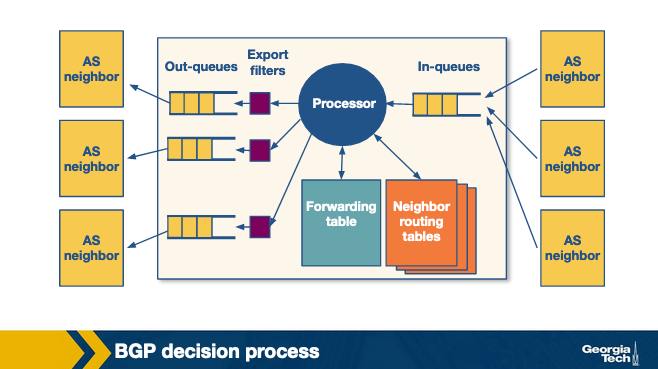

### Selecting Routes at a Router
- When a router receives multiple route advertisements to the same destination, it compares them by going through a list of attributes
- For each attribute, it selects the route with the value that best applies the policy
- If values are the same for an attribute, it moves to the next one
- In the simplest case (no policy), the router selects the route with the **fewest hops** (shortest path length)
    - This simple scenario rarely occurs in practice

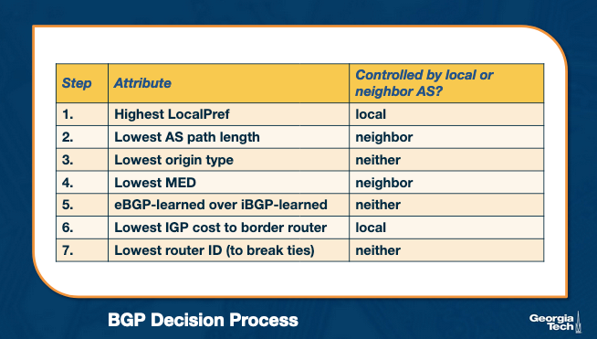

### Influencing Route Decision Using LocalPref
- **LocalPref** is used to prefer routes learned through a specific AS over others
- Example: if AS B learns a route to destination x via A and C, and prefers A, it assigns a **higher LocalPref** to routes learned from A
- LocalPref controls where traffic **exits** the AS (outbound traffic)
- An AS ranks routes by preference
    - Routes from **customers** (highest preference)
    - Routes from **peers**
    - Routes from **providers** (lowest preference)
- Operators assign non-overlapping LocalPref value ranges to reflect these business relationships

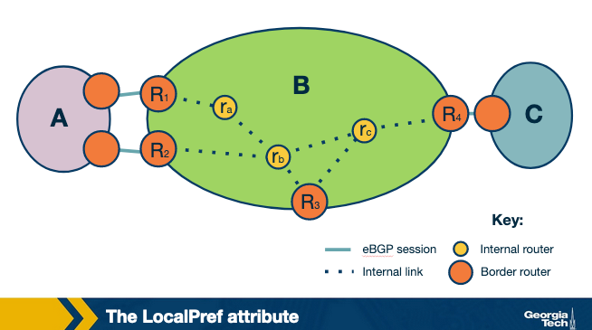

### Influencing Route Decision Using MED
- **MED (Multi-Exit Discriminator)** is used by ASes connected by multiple links to designate which links are preferred for **inbound traffic**
- Example: AS B assigns different MED values to routes advertised to AS A via R1 and R2
    - AS A will prefer R1 if it **has a lower MED value** (all other attributes being equal)
- MED can be used to "staple" the type of business relationship to a route
- An AS filters routes with specific MED values before exporting to other ASes
- Influencing route exports also affects how traffic **enters** an AS

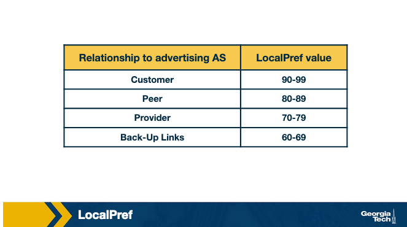

### Where Attributes Are Controlled
- **Locally by the AS** - e.g., LocalPref
- **By the neighboring AS** - e.g., MED
- **By the protocol** - e.g., whether a route is learned via eBGP or iBGP

## Challenges with BGP: Scalability and Misconfigurations
- BGP can suffer from two significant limitations: **misconfigurations** and **faults**
- A misconfiguration or error can result in
    - Excessively large number of updates
    - Route instability
    - Router processor and memory overloading
    - Outages and router failures
- ASes can reduce risk by **limiting routing table size** and **limiting the number of route changes**

### Limiting Routing Table Size
- ASes can use **filtering** to limit routing table size
    - Long, specific prefixes can be filtered to encourage **route aggregation**
    - Routers can limit the number of prefixes advertised from a single source on a per-session basis
- Small ASes can configure **default routes** into their forwarding tables
- ASes can protect other ASes by using route aggregation and exporting less specific prefixes where possible
### Limiting Route Changes (Flap Damping)
- ASes can limit propagation of unstable routes using **flap damping**
- How it works
    - An AS tracks the number of updates to a specific prefix over a certain amount of time
    - If the tracked value reaches a configurable threshold, the AS **suppresses** that route until a later time
- Because this can affect reachability, ASes can be strategic about thresholds
    - More specific prefixes can be more aggressively suppressed (lower thresholds)
    - Routes to known destinations requiring high availability can be allowed higher thresholds

## Peering at IXPs
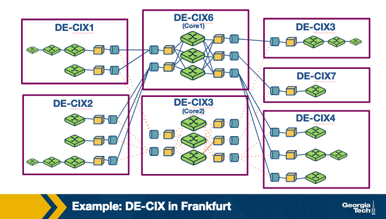
### What are IXPs?
- IXPs are **physical infrastructures** that provide the means for ASes to interconnect and directly exchange traffic
- ASes that interconnect at an IXP are called **participant ASes**
- Physical infrastructure is usually a network of switches located in the same location or distributed over a region or globally
- Infrastructure has a fully redundant switching fabric that provides **fault tolerance**
- Equipment is located in facilities such as data centers (reliability, sufficient power, physical security)
### Why are IXPs Important?
- **Large traffic volumes** - some large IXPs have daily traffic volumes comparable to global Tier 1 ISPs
- **DDoS mitigation** - IXPs can observe traffic to/from participant ASes and act as a "shield" to stop DDoS traffic before it hits a participant AS
- **Research opportunities** - IXPs provide a research playground for applications such as BGP blackholing and Software Defined Networking
- **Technology innovation hubs** - IXPs are active marketplaces providing an expanding list of services beyond interconnection (e.g., DDoS mitigation, SDN-based services)
### Steps for an AS to Peer at an IXP
- Each participating network must have a public **ASN**
- Each participant brings a router to the IXP facility and connects one of its ports to the IXP switch
- The router must be able to run **BGP** (routes are exchanged via BGP only)
- Each participant must agree to the IXP's **General Terms and Conditions (GTC)**
- Costs involved
    - One-time cost to establish a circuit from premises to the IXP
    - Monthly charge for using a chosen IXP port (higher speeds are more expensive)
    - Possible annual membership fee
- Exchanging traffic over a public peering link is **settlement-free** (IXPs do not charge for traffic volume)
- IXPs do not interfere with bilateral relationships between participants unless the GTC is violated
- Time to establish a public peering link ranges from **a few days to a couple of weeks**
### Why Do Networks Peer at IXPs?
- **Keep local traffic local** - traffic between two networks in the same IXP does not need to travel through other networks
- **Lower costs** - peering at an IXP is cheaper than relying on third parties who charge based on volume
- **Improved performance** - reduced delay
- **Incentives** - critical players (e.g., content providers) may require a network to be present at a specific IXP to peer with them
### Services Offered at IXPs
- **Public peering** - two networks use the IXP infrastructure to exchange traffic based on their bilateral relations and requirements
- **Private peering** - direct traffic exchange between two parties without using the IXP's public infrastructure; used for high-volume, bidirectional, stable traffic
- **Route servers and SLAs** - allows participants to arrange instant peering with many co-located networks using a single BGP session
- **Remote peering through resellers** - third parties resell IXP ports remotely, enabling networks in distant areas or with little traffic to use the IXP
- **Mobile peering** - scalable interconnection solution for mobile GPRS/3G networks
- **DDoS blackholing** - customer-triggered blackholing to alleviate DDoS attacks
- **Free value-added services** - e.g., IRR, DNS root name servers, NTP (offered by some IXPs such as Netnod)

## Peering at IXPs: How Does a Route Server Work?
- Two ASes normally exchange traffic using a **bilateral BGP session** (two-way BGP session)
- With many ASes peering at an IXP, the number of BGP sessions does not scale
- Some IXPs operate a **Route Server (RS)** to make peering more manageable
- A Route Server
    - Collects and shares routing information from its peers (IXP participants connected to the RS)
    - Executes its own BGP decision process and re-advertises the resulting information to all RS peer routers
- This setup is called a **multi-lateral BGP peering session**

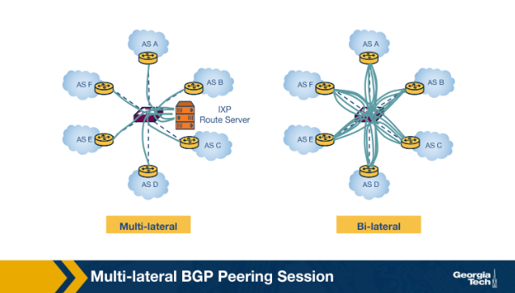

### Route Server Architecture
- A routing daemon maintains a **Master RIB (Routing Information Base)** - contains all BGP paths received from peers
- The RS also maintains **AS-specific RIBs** to track individual BGP sessions with each participant AS
- Two types of route filters
    - **Import filters** - ensure each member AS only advertises routes it is allowed to advertise
    - **Export filters** - triggered by IXP members to restrict which other member ASes receive their routes
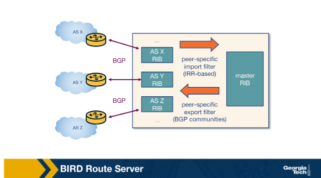

### How Route Exchange Works (Example: AS X → AS Z)
1. AS X advertises prefix p1 to the RS → added to the RS's AS X-specific RIB
2. RS applies the **import filter** to check if AS X is allowed to advertise p1 → if it passes, p1 is added to the Master RIB
3. RS applies the **export filter** to check if AS X allows AS Z to receive p1 → if true, p1 is added to the AS Z-specific RIB
4. RS advertises p1 to AS Z with **AS X as the next hop**

## Optional Reading: Remote Peering
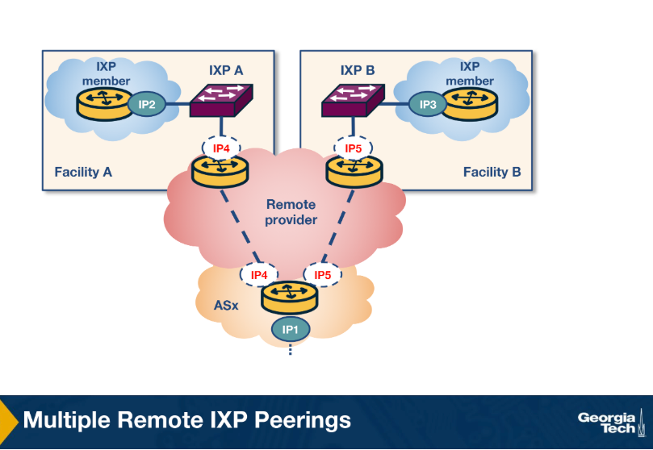
### What is Remote Peering?
- **Remote peering (RP)** is peering at a peering point without the necessary physical presence
- A **remote peering provider** is an entity that sells access to IXPs through their own infrastructure
- RP removes the barrier to connecting to IXPs around the world
- Can be a more cost-effective solution for localized or regional network operators
### How to Detect Remote Peering?
- The problem: determining if an AS is directly connected to an IXP or connected through remote peering
- Primary method: measure the **round-trip time (RTT)** between a vantage point inside the IXP and the IXP peering interface of a member
    - Fails to account for the changing landscape of IXPs today
    - Can misinfer latencies of remote members as local and local members as remote
- A combination of methods can achieve more accurate detection
### Detection Methods
1. **Port capacity** - resellers usually offer connectivity through virtual ports with smaller capacities and lower prices than standard IXP ports (typically 1–100 Gbit/s); port capacity can be obtained through the IXP website or PeeringDB
2. **Colocation information** - an AS must be physically present in at least one colocation facility where the IXP has deployed switching equipment; locating where both AS and IXP are colocated can help infer local vs. remote
3. **Multi-IXP router inference** - if a router is connected to multiple IXPs and is inferred as local or remote to one, the inference can be extended to the other IXPs based on whether they share colocation facilities
4. **Private connectivity with multiple existing AS participants** - if an AS has private peers over the same router connecting it to an IXP, and those private peers are physically colocated at the same IXP facilities, the AS can be inferred as local to the IXP

## Optional Reading: BGP Configuration Verification
- BGP configuration is complex and easily misconfigured at both the eBGP and iBGP levels
- iBGP route propagation happens via **full mesh** or **route reflectors**
- Configuration languages vary among routing manufacturers and may not be well-designed
- BGP's distributed nature adds further complexity
### Two Aspects of BGP Correctness
- **Path visibility** - route destinations are correctly propagated through the available links in the network
- **Route validity** - traffic meant for a given destination actually reaches it
### Router Configuration Checker (rcc)
- **rcc** is a tool that detects BGP configuration faults using **static analysis**
- Checks for correctness before running configuration on an operational network (before deployment)
- Analyzes router configuration settings and outputs a list of configuration faults
- To analyze a configuration, rcc first "factors" it into a normalized model focusing on
    - Route dissemination
    - Route filtering
    - Route ranking
- Can also be used to analyze live systems and potentially detect live faults
- Limitations: does not offer completeness or soundness; may generate **false positives** and may not detect all faults
### Path Visibility Faults
- Problems with **full mesh** and route reflector configurations in iBGP leading to signaling partitions
- Route reflector cluster problems
- Incomplete iBGP sessions (active on one router but not the other)
### Route Validity Faults
- Filtering problems
    - Legacy filtering policies not fully removed when changes occur
    - Inconsistent export to peer behavior
    - Inconsistent import policies
    - Undefined references in policy definitions
    - Non-existent or inadequate filtering
- Dissemination problems
    - Unorthodox AS prepending practices
    - iBGP sessions with "next-hop self"

## Quizzes
- Q1: The internet topology has been evolving from a _________ structure into a _________ structure. 
    - A. hierarchical, flat
- Q2: An Autonomous System is a group of routers that operate under _________ administrative _________. 
    - A. the same, authority
- Q3: Autonomous Systems implement their own set of policies, make their own traffic engineering decisions and interconnection strategies, and determine how traffic leaves and enters the network. 
    - A. True
- Q4: The BGP protocol is used within an AS and focuses on optimizing a path metric within the network. Examples of BGP protocols are Open Shortest Paths First (OSPF) and Routing Information Protocol. 
    - A. False

- Q5: In a peering relationship, the traffic exchanged between the two peers must be highly asymmetric so that there is enough incentive for both parties to peer with each other.
  - False
- Q7: A customer-provider relationship between ASes is based on a financial settlement, which determines how much the customer will pay the provider. The provider takes care of connecting the customer network with destinations found in the provider's routing table. The customer pays regardless of the direction of the traffic.
  - True
- Q8: There is no incentive for smaller ISPs to peer with each other.
  - False. Smaller ISPs can peer with each other to save the money they would otherwise pay to their providers by directly forwarding traffic between themselves instead of through their providers. This arrangement is primarily beneficial when a significant amount of traffic is destined for each other.
- Q9: Provider ASes have a financial incentive to forward as much of their customers’ traffic as possible.
  - True
- Q10: Select the correct order for an AS to import its routes based on their incentive.
  - Routes learned from: customers -> peers -> providers 

- Q11: What is the difference between iBGP and eBGP?
    - Both flavors (iBGP and eBGP) take care of disseminating *external* routes. An eBGP session is established between two border routers that belong to different ASes. An iBGP session is established between routers that belong to the same AS. Once a router hears about a route that is learned through eBGP, then it disseminates that route to other internal routers in the same AS, using iBGP.
- Q12: What is the difference between iBGP and IGP?
    - IGP-like protocols are used to establish paths between the internal routers of an AS based on specific costs within the AS. In contrast, iBGP is only used to disseminate external routes within the AS.

- Q13: A router within an AS decides which route to export by first applying import policies to exclude routes entirely from further consideration.
  - True. The router applies import policies to exclude routes from further consideration. Then, it runs the decision process to select the best routes, installs newly selected routes in the forwarding table, and applies export policy to decide which neighbors to export the route to.
- Q14: The LocalPref attribute is used to prefer routes learned through a specific AS over other ASes for ________ traffic.
  - outbound
- Q15: Assume that AS X learns of a route to the same destination a via AS Y and AS Z. If X prefers to route its traffic through Z due to peering or business, it can assign a ________ LocalPref value to routes it learns from Z, and thus using LocalPref, AS X can control where traffic exits the AS.
  - Higher
- Q16: The MED (Multi-Exit Discriminator) value is used by ASes connected by multiple links to designate with of those links are preferred for ________ traffic.
  - inbound
- Q17: Assume that AS X prefers routes advertised to AS Y to go through R1 as opposed to R2. For AS Y to be influenced to choose R1 to forward traffic to AS X, R1 must have a _________ MED value, assuming that all other attributes are equal.
  - lower

- Q18: One of the services offered by IXPs is protection against ________ attacks.
  - DDos
- Q19: Participation of an AS in an IXP is free.
  - False
- Q20: IXPs handle large volumes of traffic.
  - True
- Q21: One of the reasons why networks choose to peer at IXPs is because critical players in today’s Internet ecosystem often “incentivize” other networks to connect at IXPs.
  - True
- Q22: Private peering PIs do not use the IXP’s public peering infrastructure.
  - True
- Q23: IXPs users may use route servers for an additional cost. 
  - False

- Q24: Route Servers keep track of the BGP sessions they maintain with each participant AS through RIBs.
  - True
- Q25: _________ filters are applied to ensure that each member AS only advertises routes that it should advertise. 
  - Import

