# Lesson 5

## Intro

---

## Key concepts:
* Router architecture and packet-processing pipeline
* Control plane versus data plane
* Input ports, output ports, and switching fabric
* Forwarding Information Base and longest-prefix matching
* Switching via memory, bus, and crossbar
* Throughput bottlenecks, contention, delay, and loss
* Queueing, scheduling, and head-of-line blocking
* Virtual output queues and crossbar scheduling
* Unibit tries, multibit tries, and prefix expansion
* Packet classification and quality of service
* Traffic policing and traffic shaping
* Token bucket and leaky bucket mechanisms

---

## What's Inside a Router?
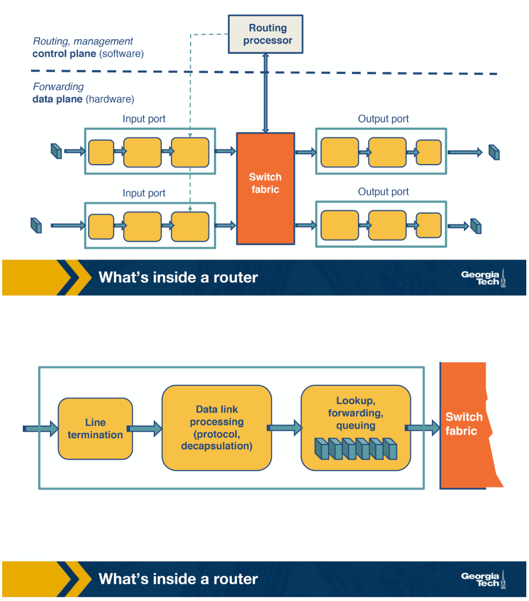
- Main job: implement the forwarding plane functions and the control plane functions
- **Forwarding plane functions**: receive packets, determine output port, and transmit packets
  - This is the router’s action to transfer a packet from an input link interface to the appropriate output link interface. 
  - Forwarding occurs at very short timescales (typically a few nanoseconds) and is typically implemented in hardware.
  - Main components are: 
    - input ports
      - Physically terminate the incoming links to the router. 
      - The data link processing unit decapsulates the packets.
      - The input ports perform the lookup function. At this point, the input ports consult the forwarding table to ensure that each packet is forwarded to the appropriate output port through the switch fabric.
    - output ports
      - to receive and queue the packets from the switching fabric and then send them over to the outgoing link
    - switching fabric
      - moves the packets from input to output ports, and it makes the connections between the input and the output ports.
      - Three types of switching fabrics: memory, bus, and crossbar.
    - routing processor

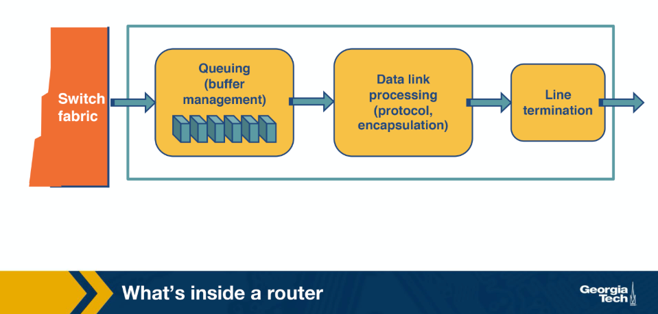
- **control plane functions**: Implementing the routing protocols, maintaining the routing tables, computing the forwarding table
  - All these functions are implemented in software in the routing processor, or as we will see in the SDN chapter, these functions could be implemented by a remote controller
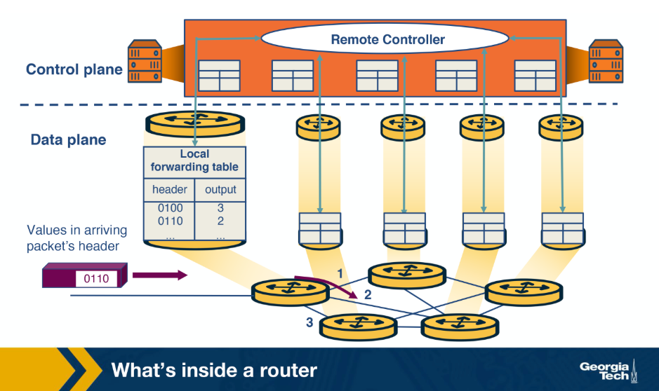

---

## Router Architecture
- Main task: to switch a packet from an input link to the appropriate output link based on the destination address. Input and output links are logically separate but are often physically combined.

- 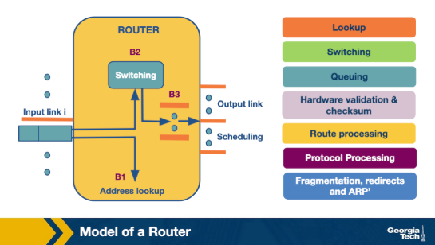

### Time-Sensitive Tasks
These are the most critical operations that occur when a packet arrives at an input link.

- Lookup:
  - The router examines the destination IP address and determines the correct output link by consulting the **Forwarding Information Base (FIB)**, which maps destination prefixes to output links.
  - Longest prefix matching algorithms are used to resolve ambiguities
  - Some routers support **packet classification**, a more complex lookup based on destination/source IP, port, and other criteria
- Switching 
  - After lookup, the switching system transfers the packet from the input link to the output link.
  - Modern fast routers use **crossbar switches**
  - Scheduling is challenging because multiple inputs may target the same output simultaneously
- Queuing
  - Once a packet is switched to an output link, it is queued if the link is congested.
  - Simple queuing uses **First-In-First-Out (FIFO)**
  - More complex schemes (e.g., **weighted fair queuing**) provide delay guarantees or fair bandwidth allocation

### Less Time-Sensitive Tasks
These operations are still essential but are not on the critical forwarding path.

- Header Validation and Checksum
  - Checks the packet's version number
  - Decrements the **Time-to-Live (TTL)** field
  - Recalculates the header checksum
- Route Processing 
  - The routers build their forwarding tables using routing protocols such as RIP, OSPF, and BGP. These protocols are implemented in the **routing processor**:
- Protocol Processing 
  - Routers implement several protocols to support their functions:
    - **Simple Network Management Protocol (SNMP)** — provides a set of counters for remote inspection
    - **TCP and UDP** — used for remote communication with the router
    - **Internet Control Message Protocol (ICMP)** — sends error messages (e.g., when TTL is exceeded)

---

## Different Types of Switching
- The switching fabric is the brain of the router, as it performs the main task to switch (or forward) the packets from an input port to an outport port.

### Switching Methods
There are three main ways the switching fabric can forward packets.

- Switching via Memory:
    - Input/output ports operate as I/O devices controlled by the routing processor
    - When an input port receives a packet, it sends an **interrupt** to the routing processor
    - The packet is copied to the processor's memory
    - The processor extracts the destination address, looks up the forwarding table, and finds the output port
    - The packet is then copied into the output port's buffer
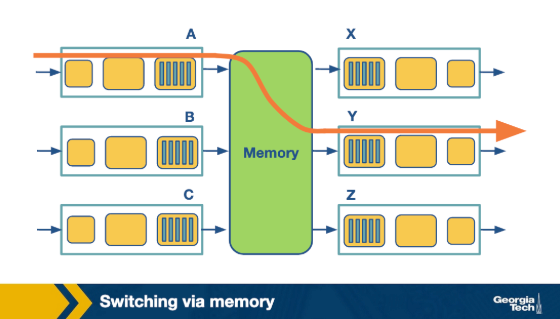
- Switching via Bus:
    - The routing processor does not intervene
    - The input port attaches an **internal header** designating the output port, then sends the packet onto a shared bus
    - All output ports receive the packet, but only the designated one keeps it
    - The internal header is removed once the packet arrives at the correct output port
    - Only one packet can cross the bus at a time — bus speed limits overall router speed
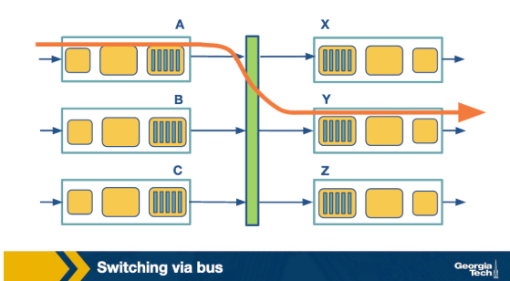
- Switching via Interconnection Network:
    - Uses a **crossbar switch** — connects N input ports to N output ports using 2N buses
    - Horizontal and vertical buses meet at **crosspoints** controlled by the switching fabric
    - To forward a packet from input A to output Y, the fabric closes the crosspoint where the two buses intersect
    - Can carry multiple packets simultaneously, as long as they use different input and output ports
        - e.g., packets can travel A→Y and B→X at the same time
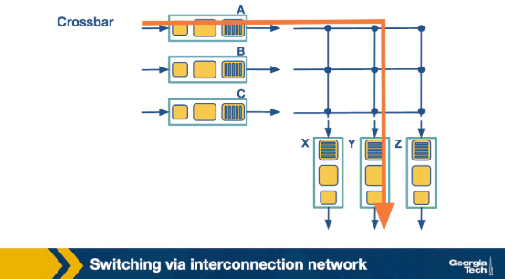

---

## The Challenges Routers Face
- Routers face fundamental challenges around bandwidth/internet population scaling and delivering services at high speeds.

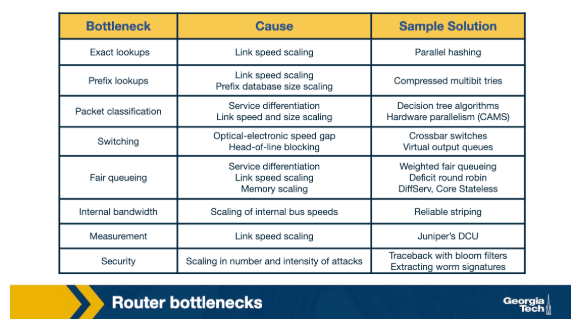

### Scaling Challenges
- Two high-level problems drive the bottlenecks routers face.

- Bandwidth and Internet population scaling:
  - Increasing number of devices connecting to the Internet
  - Increasing volumes of network traffic due to new applications
  - New technologies such as optical links that accommodate higher traffic volumes
- Services at high speeds:
  - New applications require services such as protection against delays during congestion and protection during attacks or failures
  - Offering these services at very high speeds is a challenge for routers

### Bottlenecks in Detail
- Longest Prefix Matching:
  - The growing number of Internet hosts makes it impossible to have explicit entries for all destinations
  - Routers group destinations into prefixes instead
  - This introduces more complex algorithms required for efficient longest prefix matching
- Service Differentiation:
  - Routers can offer different **quality-of-service (QoS)** or security guarantees to different packets
  - Requires classifying packets based on criteria beyond just the destination (e.g., source address, application/service)
- Switching Limitations:
  - Crossbar switching uses parallelism to handle high-speed traffic
  - At high speeds, this introduces its own problems (e.g., **head-of-line blocking**)
- Bottlenecks about Services:
  - Providing performance guarantees (QoS) at high speeds is nontrivial
  - Supporting new services such as measurements and security guarantees adds further complexity

---

## Prefix-Match Lookups
- Routers group multiple IP addresses by the same prefix to address the scalability problem caused by the continuous growth of networks and IP addresses on the Internet.

### Prefix Notation
There are three ways to denote a prefix.

- Dot Decimal:
    - Represents a prefix using dotted octets with a wildcard `*` for remaining bits
    - Example 16-bit prefix: `132.234`
        - First octet binary: `10000100`
        - Second octet binary: `11101010`
        - Binary prefix: `1000010011101010*` — `*` means remaining bits do not matter
- Slash Notation:
    - Standard format: `A/L` where A = Address, L = Length
    - Example: `132.238.0.0/16` — only the first 16 bits are relevant for prefixing
- Masking:
    - Uses a subnet mask instead of prefix length
    - Example: `123.234.0.0/16` is written as `123.234.0.0` with mask `255.255.0.0`
    - The mask `255.255.0.0` indicates only the first 16 bits are important

### Need for Variable-Length Prefixes
- Earlier Internet used a class-based addressing model with **fixed-length prefixes**
- Rapid IP address exhaustion led to **Classless Inter-Domain Routing (CIDR)** in 1993
- CIDR assigns IP addresses using **arbitrary-length prefixes**
    - Decreased router table size
    - Introduced the **longest-matching-prefix lookup** problem

### Why Better Lookup Algorithms Are Needed
- To forward a packet, a router checks the forwarding table for the output port, then switches the packet
- Key challenges in lookup revolve around **lookup speed**, **memory**, and **update time**

### Key Observations on Network Traffic
- Concurrent flows:
    - Studies show hundreds of thousands of concurrent short-duration flows (e.g., ~250,000 in early measurements)
    - This number has only grown — **caching solutions are not efficient** at this scale
- Lookup speed:
    - Speed is the most critical element of any lookup operation
    - A large portion of lookup computation cost comes from **memory access**
- Update time:
    - Unstable routing protocols can adversely impact the time to add, delete, or replace a prefix
    - Inefficient protocols can add up to additional milliseconds of delay
- Memory trade-off:
    - Fast but expensive memory: **SRAM** (hardware), cache (software)
    - Slow but cheap memory: **DRAM**, **SDRAM**
    - Balancing cost vs. speed is a vital design consideration

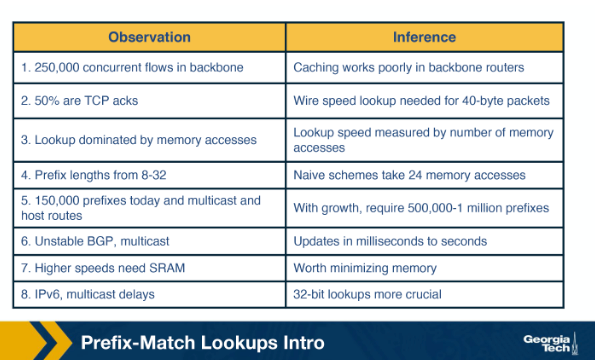

---

## Uni-bit Tries
- One of the simplest prefix lookup techniques — builds a binary trie where each node has a 0-pointer and a 1-pointer, and prefixes are stored along paths from the root.

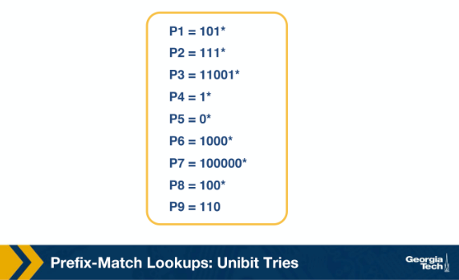

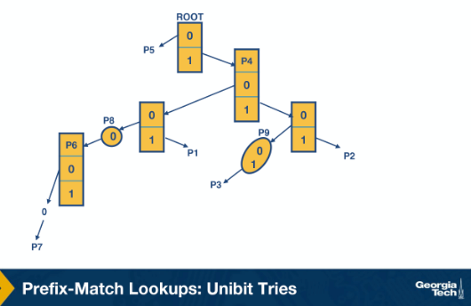

### Structure
- Every node has a **0-pointer** and a **1-pointer**
- Starting from the root:
    - 0-pointer leads to a subtrie for all prefixes beginning with `0`
    - 1-pointer leads to a subtrie for all prefixes beginning with `1`
- Remaining bits of each prefix are allocated down subsequent subtries

### Prefix Matching Steps
- Begin the search by tracing the trie path from the root, following bits of the destination address
- Continue until the search fails (no match or empty pointer)
- The last known successful prefix traced in the path is returned as the match

### Matching Examples
- P1 = `101*`:
    - Root → 1-pointer (right) → 0-pointer (left) → 1-pointer (right)
- P7 = `100000*`:
    - Root → 1-pointer (right) → five 0-pointers (left)

### Special Cases
- Prefix as substring:
    - If a prefix is a substring of another, the shorter prefix is stored along the path to the longer one
    - Example: P4 = `1*` is a substring of P2 = `111*`, so P4 is stored in a node on the path to P2
- One-way branches:
    - Nodes that contain only one pointer (e.g., after matching `110` for P3 = `11001`, no other prefix shares more than the first 3 bits)
    - For efficiency, consecutive one-way branch nodes are **compressed into a single node** storing the bit string
    - Example: P9 is represented as a compressed 2-bit node

---

## Multi-bit Tries
- An alternative to unibit tries that checks multiple bits at each step (called a **stride**) to reduce memory accesses during lookup.

### Problem with Uni-bit Tries
- Unibit tries are efficient and support fast lookup and easy updates
- Key limitation: number of memory accesses required per lookup
    - For 32-bit addresses, worst case requires **32 memory accesses**
    - Assuming 60 ns latency per access → worst-case search time is **1.92 microseconds**
    - This is too slow for high-speed links

### Multi-bit Trie Structure
- Each node has **2^k children**, where k is the stride
- The **stride** is the number of bits checked at each step
- Two flavors of multibit tries:
    - Fixed-length stride tries
    - Variable-length stride tries

---

## Prefix Expansion
- To use fixed-length strides, prefixes must be expanded so their lengths are multiples of the chosen stride — a process called **controlled prefix expansion**.

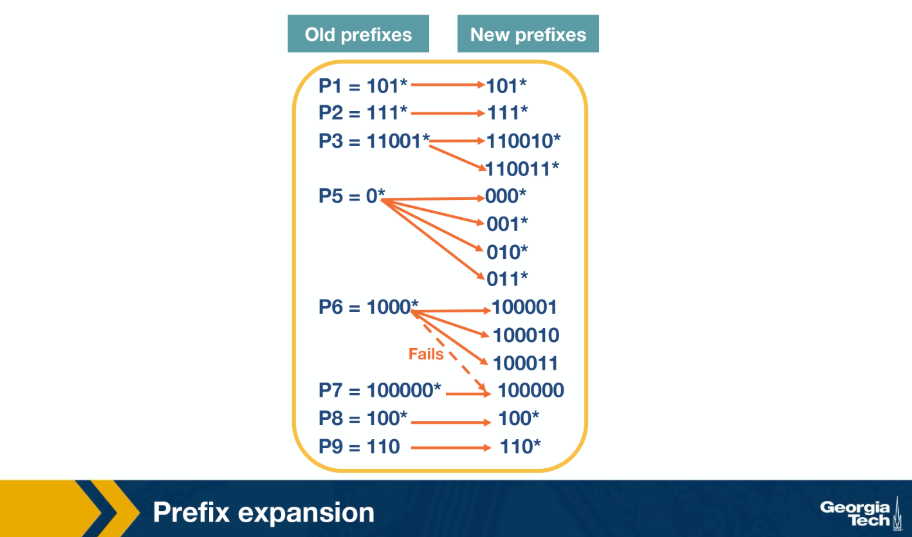

### Controlled Prefix Expansion
- Problem: a stride of 2 bits would miss prefixes like `101*` (length 3) since it is not a multiple of 2
- Solution: expand each prefix to match the nearest multiple of the stride length
    - Remove all prefix lengths that are not multiples of the chosen stride
    - Expand remaining prefixes to fill the gap
- Trade-off: more prefixes in the database, but fewer distinct lengths → **faster lookups at the cost of larger database size**

### Example (Stride = 3)
- Original database had five prefix lengths: 1, 3, 4, 5, and 6
- After expansion: only **two lengths remain (3 and 6)**, but with more total prefixes
- Example expansion:
    - P3 = `11001*` → expanded to `110010*` and `110011*`

### Collision Handling
- A collision occurs when an expanded prefix matches an existing prefix in the database
- The expanded prefix is **dropped** in favour of the existing one
- Example: the fourth expansion of P6 = `1000*` collides with P7 and is removed

---

## Multi-bit tries: Fixed-Stride
- A multibit trie where every node stores 3 bits, allowing the lookup to advance 3 bits at a time through the prefix database.

### Key Properties
- Every node element stores two pieces of information:
    - A **pointer** to the next node
    - A **prefix value**
- Prefix search advances by the fixed stride length (3 bits) at each step
- The last matched prefix is remembered as the path is traced
- Search ends when an **empty pointer** is encountered — the last matched prefix is returned

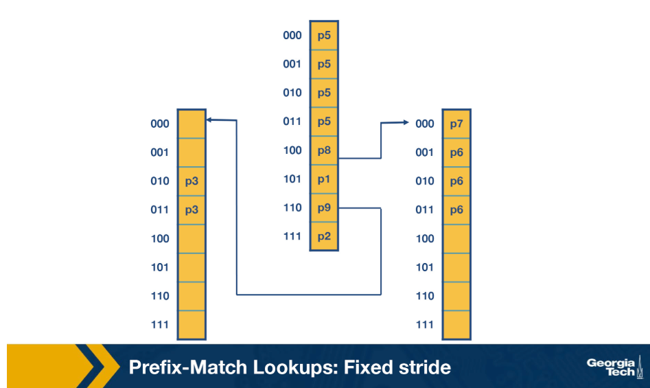


### Lookup Examples
- Address starting with `001`:
    - Search begins at the `001` entry at the root node
    - No outgoing pointer exists → search terminates
    - Returns **P5**
- Address `100000`:
    - Search traces the path for `100000`
    - Terminates and returns **P7**

### Prefixes in the Expanded Trie
- All prefixes from the expanded database are represented: P1, P2, P3, P5, P6, P7, P8, and P9

---

## Multi-bit Tries: Variable Stride
- A more flexible multibit trie scheme where each node can examine a different number of bits, optimizing for memory usage and fewer memory accesses.

### Motivation
- Fixed-stride tries allocate the same number of bits at every node, which can waste memory
- Variable strides allow nodes to examine only as many bits as needed
    - Example: the rightmost node still examines 3 bits (required by P7)
    - Example: the leftmost node only needs 2 bits (since P3 has 5 bits total)
- Result: **four fewer entries** compared to the fixed-stride scheme

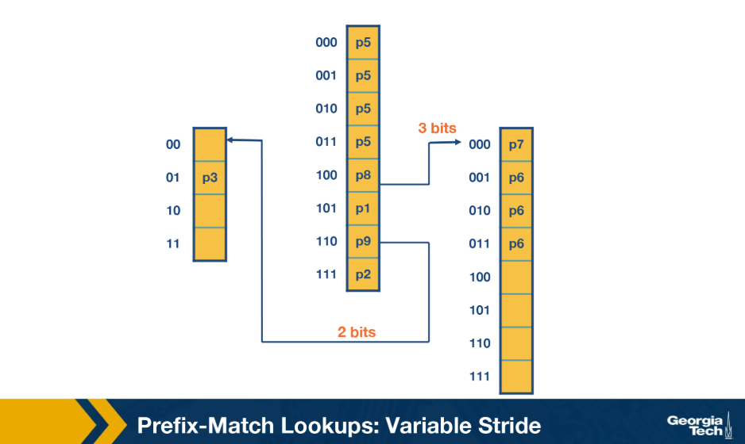

### Key Properties
- Every node can have a **different number of bits** to explore
- The stride at each node is encoded using a pointer to that node
- Root node remains unchanged from the fixed-stride scheme
- Optimizations to stride length at each node target:
    - Reduced trie memory
    - Fewer memory accesses per lookup
- The optimum variable stride per node is selected using **dynamic programming**

---

## Quiz

- Q: The data plane functions of a traditional router are implemented in _______________.
  - A: hardware
- Q: The control plane functions of a traditional router are implemented in _______________.
  - A: software
- Q: Which plane operates on a shorter timescale?
  - A: Data
- Q: Classify each function as an operation of either the data plane or control plane.
  * Computing paths based on a protocol = Control Plane
  * Forwarding packets at Layer 3 = Data Plane
  * Switching packets at Layer 2 =  Data Plane
  * Running protocols to build a routing table = Control Plane
  * Running the Spanning Tree protocol = Control Plane
  * Decrementing Time To Live (TTL) = Data Plane
  * Computing an IP header checksum = Data Plane
  * Running a protocol/logic to configure a middle box device for load balancing = Control Plane
  * Forwarding packets according to installed rules in a middlebox device = Data Plane
- Q: Which, if any, of the following types of switching can send multiple packets across the fabric in parallel? 
  - A: Interconnection Network / Crossbar
- Q: 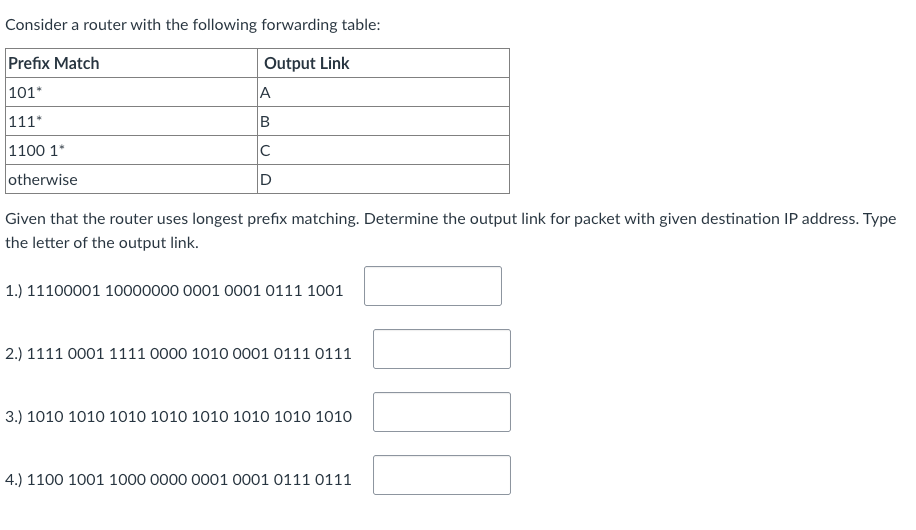
  - 11100001 10000000 0001 0001 0111 1001: B
  - 1111 0001 1111 0000 1010 0001 0111 0111: B
  - 1010 1010 1010 1010 1010 1010 1010 1010: A
  - 1100 1001 1000 0000 0001 0001 0111 0111: C
- Q: Determine the mask for the address 192.168.0.1/24
  - A: 255.255.255.0
- Q: 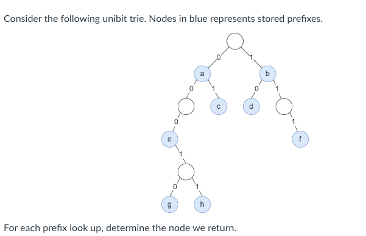
  * 0*: a
  * 1*: b
  * 01*: c
  * 00*: a, because 00* is a substring of 0*
  * 0000*: e
  * 00011*: h
- Q: Consider the following prefix database.  
```
P1   =>   101* 
P2   =>   0* 
P3   =>   1* 
P4   =>   10101* 
```
Consider expanding each prefix with stride length 3, so that we construct a fixed length multibit trie.
Which of the following prefixes are associated with P3? Select all that apply.  
  - A: 110*, 100*, 111*. Wrong answers are 10*, 101*, 001*
- Q: 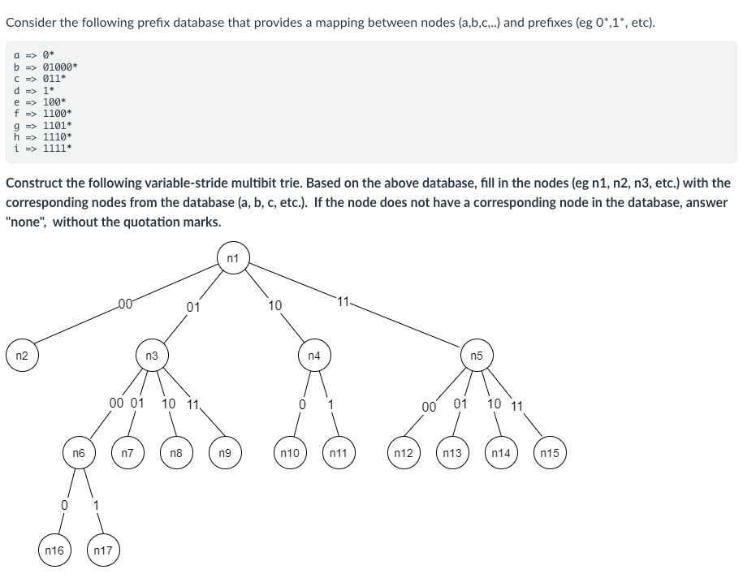
  - A: 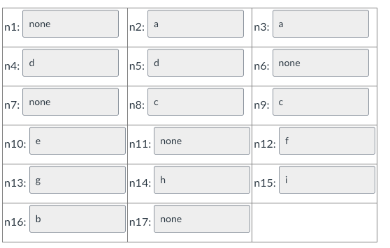
- Q: A multibit trie is ____  than a unibit trie representing the same prefix database and requires ____ memory accesses to perform a lookup.
    - A: shorter, fewer
- Q: Fixed-length multibit tries can support an arbitrary number of prefix lengths.
    - A: False, To use a given multibit trie, the prefix set must be transformed into an equivalent set with the prefix lengths allowed by the new structure.