# Lesson 6

## Intro

---

## Key concepts:
* Router architecture and packet-processing pipeline
* Control plane versus data plane
* Input ports, output ports, and switching fabric
* Forwarding Information Base and longest-prefix matching
* Switching via memory, bus, and crossbar
* Throughput bottlenecks, contention, delay, and loss
* Queueing, scheduling, and head-of-line blocking
* Virtual output queues and crossbar scheduling
* Unibit tries, multibit tries, and prefix expansion
* Packet classification and quality of service
* Traffic policing and traffic shaping
* Token bucket and leaky bucket mechanisms

---

## Why We Need Packet Classification?
- An extension beyond destination-based forwarding — packets are handled based on multiple criteria (e.g., TCP flags, source addresses) to support quality-of-service and security guarantees.

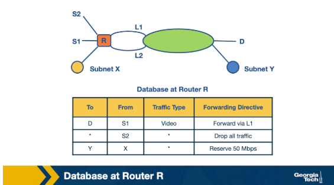

### Motivation

- Longest prefix matching on destination IP alone is insufficient for modern network requirements
- Networks need finer control over traffic for:
    - **Quality-of-service (QoS)** guarantees
    - **Security** enforcement
- Packet classification enables handling based on multiple fields simultaneously

### Examples of Packet Classification

- Firewalls:
    - Implemented at entry and exit points of a network
    - Filter unwanted traffic or enforce security policies
- Resource reservation protocols:
    - Example: **DiffServ** is used to reserve bandwidth between a source and destination
- Routing based on traffic type:
    - Routes specific traffic types to avoid delays for time-sensitive applications

### Traffic Type Routing Example

- Topology: networks connected through router R, with destinations S1, S2, X, Y, and D; connection points L1 and L2
- Example classification rules:
    - Route video traffic from S1 to D via L1
    - Drop all traffic from S2 (e.g., S2 is an experimental site)
    - Reserve 50 Mbps for traffic from prefix X to prefix Y (resource reservation)

---

## Packet Classification: Simple Solutions
### Simple Approaches

- Linear Search:
    - Firewall implementations scan the rules database sequentially, tracking the best-match rule
    - Reasonable for small rule sets
    - Becomes prohibitively slow for large databases with thousands of rules
- Caching:
    - Cache results so future searches run faster
    - Two key problems:
        - Cache-hit rate can be high (80–90%), but missed hits still require a full search
        - Even at 90% hit rate, slow linear search makes overall performance poor
            - Example: cache access = 100 ns, linear search of 10,000 rules = 1 ms
            - Average search time at 90% hit rate = **0.1 ms** — still too slow
- Passing Labels:
    - Used by **Multiprotocol Label Switching (MPLS)** and **DiffServ**
    - MPLS workflow:
        - A label-switched path is set up between sites A and B
        - A router at site A classifies packets and maps traffic into an **MPLS header**
        - Intermediate routers between A and B apply the label without redoing classification
    - DiffServ follows a similar approach:
        - Packet classification is applied at the **edges**
        - Packets are marked for special quality-of-service treatment

---

## Fast Searching Using Set-Pruning Tries
- Let's assume that we have a two-dimensional rule. For example, we want to classify packets using both the source and the destination IP addresses. 
- For example, let's consider the table below as our two-dimensional rule.
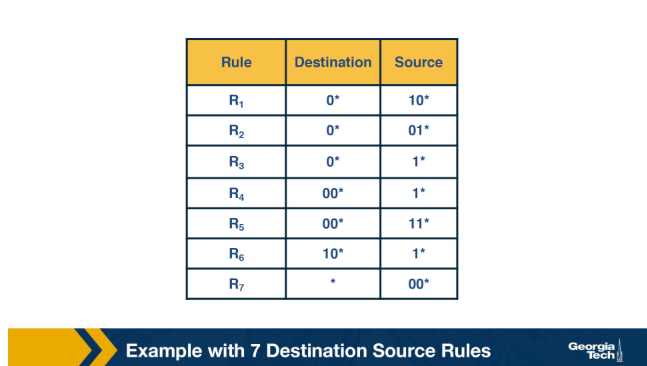
- The simplest way to approach the problem would be to build a trie on the destination prefixes in the database, and then for every leaf-node at the destination trie to "hang" source tries.
- We start building a trie that looks like this figure below:
- 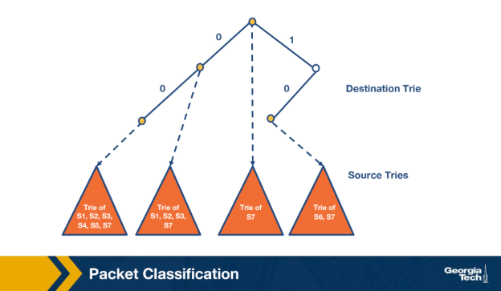

### How It Works

- Match the destination IP address in the **destination trie**
- Traverse the corresponding **source trie** to find the longest prefix match for the source IP
- The algorithm tracks the **lowest-cost matching rule** throughout the traversal
- Final result is the **least-cost rule** found

### Source Prefix Assignment

- For every destination prefix D, the source trie stores only rules compatible with D
    - Example: for D = `00*`, rules R4 and R5 have this as their destination prefix
    - So the source trie for D must include source prefixes `1*` and `11*`
- However, restricting to only direct matches is insufficient:
    - Prefix `0*` also matches `00*`, and appears in rules R1, R2, R3, R7
    - All corresponding source prefixes from those rules must also be included

### Key Challenge

- **Memory explosion**: a source prefix can appear in multiple destination tries
    - As the number of rules grows, the same source prefixes are duplicated across many destination tries
    - This leads to significant memory overhead

---

## Reducing Memory Using Backtracking
- The opposite trade-off to set-pruning tries — pays in lookup time to reduce memory usage by storing each rule exactly once.

### How It Works

- Each destination prefix D points to a source trie containing only rules whose destination field is **exactly D**
- Lookup steps:
    - Traverse the destination trie to find the longest matching destination prefix D
    - Backtrack up the destination trie and search the source trie for every **ancestor prefix of D** that points to a nonempty source trie
    - Track the lowest-cost matching rule throughout
    - Return the least-cost rule found

### Trade-offs vs Set-Pruning Tries

- Memory: each rule is stored **exactly once** → significantly lower memory requirements
- Lookup cost: backtracking through ancestor source tries is **slower** than set-pruning
    - Set-pruning reduces time at the cost of memory
    - Backtracking reduces memory at the cost of time

---

## Grid of Tries
- Improves on backtracking by precomputing **switch pointers** that skip directly to the next relevant source trie, avoiding redundant backtracking.

### Motivation
- Set-pruning tries: high memory cost
- Backtracking: high time cost — must traverse back up the destination trie to check every ancestor's source trie
- Grid of tries reduces wasted time through precomputation

### How It Works
- When a source trie lookup fails at a node, a **switch pointer** is precomputed pointing directly to the next possible source trie that could contain a matching rule
- The algorithm still tracks the current best source match
- Switch pointers skip source tries with source fields **shorter than the current best match** — avoiding redundant searches

### Lookup Example (Destination = `001`, Source = `001`)
- Search the destination trie → best match is D = `00`
- Search the source trie for `00` → fails
- Follow switch pointer (labeled `0`) → arrives at node x → fails again
- Follow another switch pointer → arrives at node y → algorithm terminates

### Trade-offs vs Backtracking
- Memory: slightly higher than backtracking due to precomputed switch pointers
- Time: faster than backtracking — switch pointers eliminate the need to manually traverse ancestor source tries
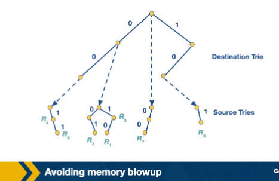
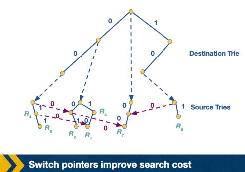

---

## Scheduling and Head of Line Blocking
- Scheduling determines how an N×N crossbar switch connects input lines to output lines, maximizing parallel communication while ensuring each input connects to at most one output at a time.

### Crossbar Switch Setup

- N input lines, N output lines, N² crosspoints
- Each crosspoint is controlled (on/off)
- Goal: maximize the number of input/output pairs communicating in parallel

### Take-a-Ticket Algorithm

- Each output line maintains a **distributed queue** for all input lines that want to send to it
- When an input line wants to send to a specific output:
    - It requests a **ticket** from that output line
    - It waits until its ticket is served
    - Once served, the crosspoint is turned on and the packet is sent

### Example Walkthrough (3 inputs → 4 outputs)
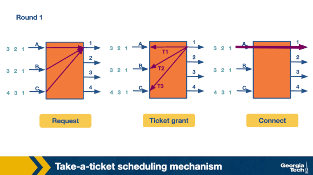
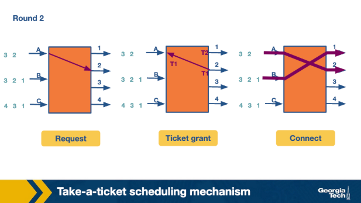
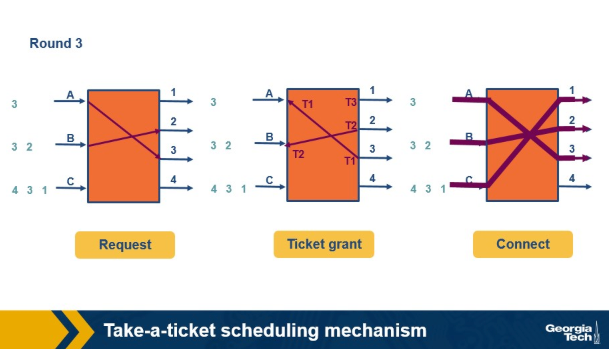

- Input lines A and B both want to connect to output lines 1, 2, and 3
- Round 1:
    - A, B, and C all request tickets for output link 1
    - Output link 1 grants tickets in order: A first, then B, then C
    - A's ticket is served → A connects to output 1 and sends its packet
- Round 2:
    - A requests a ticket for output link 2
    - B uses its ticket from round 1 to connect to output link 1
- Round 3:
    - A and B continue to their next connections
    - C finally gets its first chance to connect to output link 1
    - C was blocked the entire time waiting for A and B

### Head-of-Line (HOL) Blocking
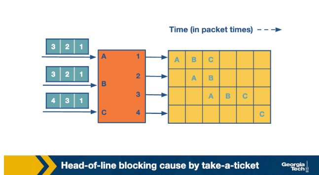

- While A sends in the first iteration, the **entire queue for B and C is waiting**
- The whole queue is blocked by the progress of the head of the queue
- This problem is called **head-of-line (HOL) blocking**
- Empty slots in the timeline indicate no packet was sent at that time

---

## Avoiding Head of Line Blocking
- HOL blocking can be avoided either by using output queuing (so packets never wait at input) or by parallel iterative matching (so virtual queues make progress even when the head is blocked).

### Approach 1: Output Queuing (Knockout Scheme)

- Key idea: run the fabric N times faster than input links so packets go directly to the output link without queuing at the input
- A packet arriving at an output link can only block other packets destined for the **same output link**
- Practical implementation uses the **Knockout scheme**:
    - Breaks packets into fixed-size **cells**
    - Assumes the same output rarely receives N cells simultaneously — expected number is **k (where k < N)**
    - Fabric runs **k times faster** than an input link instead of N times
- To handle cases where the expected k is exceeded, primitive switching elements randomly pick the output:
    - k = 1, N = 2: randomly pick one of two outputs — this element is called a **concentrator**
    - k = 1, N > 2: one output chosen from N using multiple 2×2 concentrators
    - k and N arbitrary: create **k knockout trees** to determine the first k winners
- Drawback: **complex to implement**

### Approach 2: Parallel Iterative Matching

- Allows input queuing but avoids HOL blocking by breaking a single input queue into **virtual queues** — one per output link
- Each input can schedule both the head of queue and other packets, so the queue makes progress even if the head is blocked
- Algorithm runs in three phases per round:
    - Request phase: all inputs send requests **in parallel** to all outputs they want to connect with
    - Grant phase: outputs that receive multiple requests **randomly pick one input**
        - Example: output 1 randomly chooses B; output 2 randomly chooses A
    - Accept phase: inputs that receive multiple grants **randomly pick one output** to send to
        - Example: A picks port 2 (over port 3); B picks port 1; C picks port 4

### Parallel Iterative Matching Example (Inputs A, B, C → Outputs 1, 2, 3, 4)
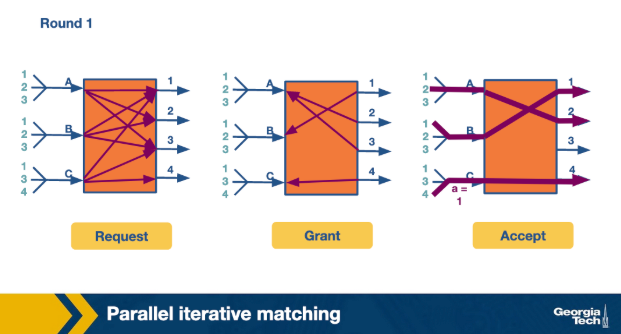
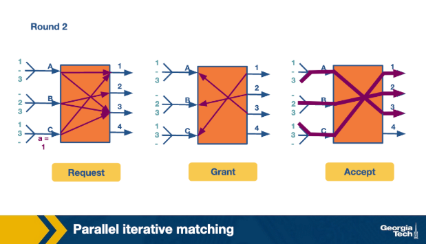
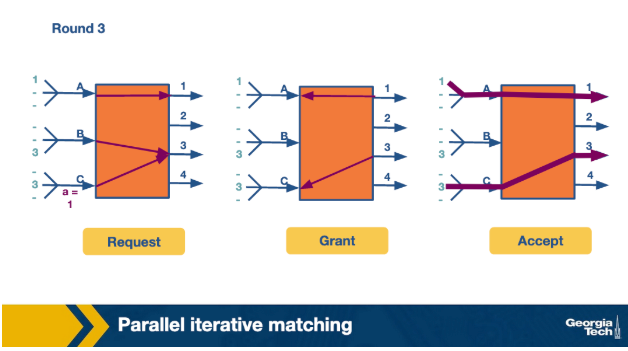
- Round 1: each input sends requests to multiple outputs → grant and accept phases resolve conflicts
- Round 2: each input sends to two outputs
- Round 3: each input sends to one output
- All traffic is sent in **four cell times** — more efficient than take-a-ticket
    - Fourth cell time is sparsely used and could carry additional traffic

---

## Scheduling Introduction
- Routers rely on real-time scheduling to handle routing updates, management queries, and data packets — with increasing link speeds (over 40 Gbps), scheduling decisions must be made within minimum inter-packet times.

### FIFO with Tail Drop

- Simplest scheduling method:
    - Packets arrive on input links → address lookup determines output link → packet placed in output port's FIFO queue
    - If the output buffer is full, incoming packets at the **tail of the queue are dropped**
- Advantages: fast scheduling decisions
- Disadvantage: important packets may be lost

### Need for Quality of Service (QoS)

- Other scheduling methods (priority, round-robin, etc.) provide **QoS guarantees** to packet flows on measures such as delay and bandwidth
- A **flow** is a stream of packets that:
    - Travels the same route from source to destination
    - Requires the same level of service at each intermediate router and gateway
    - Is identifiable using packet header fields (e.g., all packets with source or destination port 23)

### Reasons to Go Beyond FIFO with Tail Drop

- Router support for congestion:
    - Internet congestion is increasingly common as usage has grown faster than link speeds
    - Most traffic uses TCP (which handles congestion internally), but additional router support can improve source throughput
- Providing QoS guarantees to flows:
    - During congestion, packets flood output link buffers
    - FIFO with tail drop blocks other flows, causing important connections to freeze on the client side
    - Results in a sub-optimal user experience
- Fair sharing of links among competing flows:
    - Guarantee certain **bandwidth** to a flow
    - Guarantee a **maximum delay** through a router for a flow
    - Especially critical for video — without bounded delays, live video streaming degrades significantly

---

## Deficit Round Robin
Round-robin scheduling introduces fairness by alternating between flows, but requires refinements to handle variable packet sizes and complexity at high speeds.

### Problem with Simple Round Robin

- Alternating between flows is fairer than FIFO with tail drop
- However, variable packet sizes mean some flows get serviced more frequently than others
- Solution: **bit-by-bit round robin**

### Bit-by-Bit Round Robin

- Imaginary system where one bit from each active flow is transmitted per round — ensures fair bandwidth allocation
- Since splitting packets is impossible in practice, the system is used to calculate **packet finishing times**, then packets are sent as a whole
- Let R(t) = current round number at time t, µ = bits per second, N = number of active flows:
    - Rate of round number increase: `dR/dt = µ/N`
    - Rate is inversely proportional to number of active flows
    - Rounds required to transmit a packet does **not** depend on number of backlogged queues
- For a packet of size p bits arriving as the i-th packet in flow α:
    - Round it reaches the head of queue: `S(i) = max(R(t), F(i-1))`
    - Round it finishes: `F(i) = S(i) + p(i)`

### Packet-Level Fair Queuing
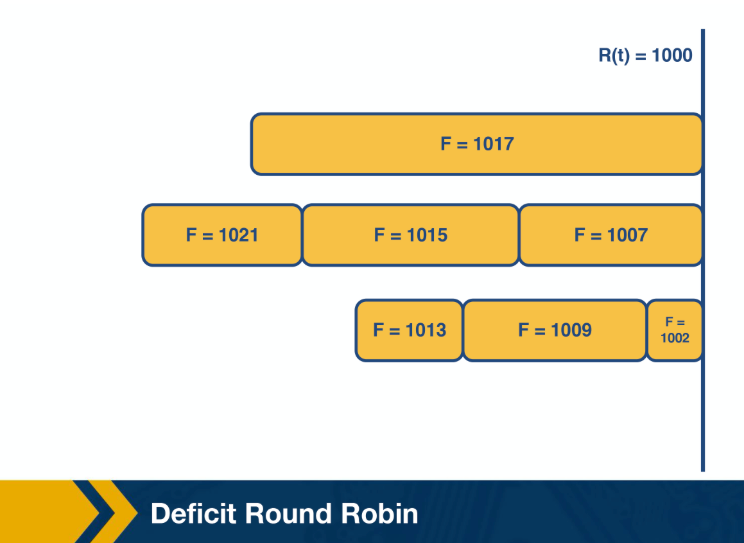

- Emulates bit-by-bit fair queuing by always sending the packet with the **smallest finishing round number**
- The packet most starved during the previous round is chosen next
- 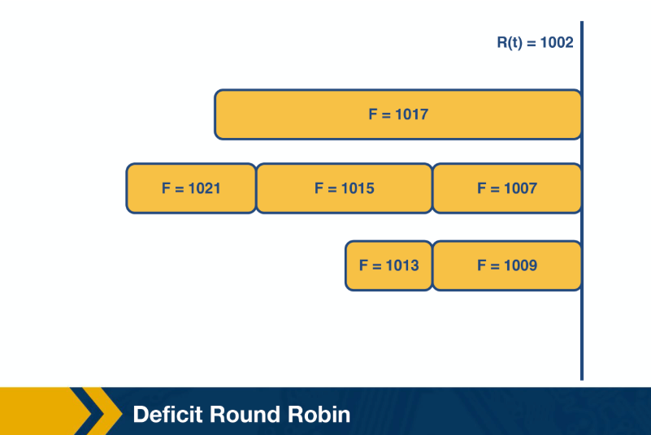
- 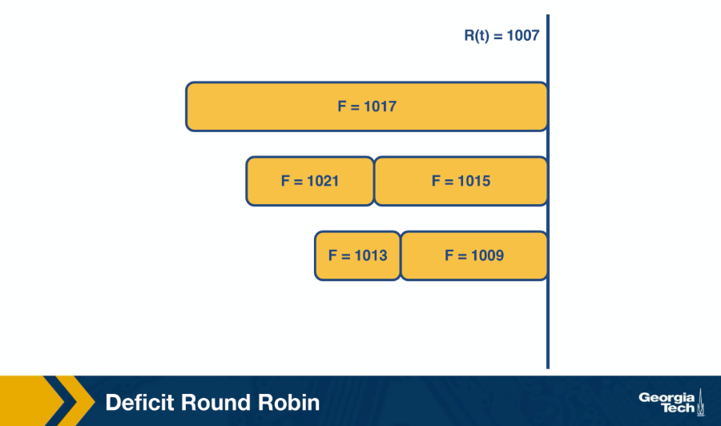
- 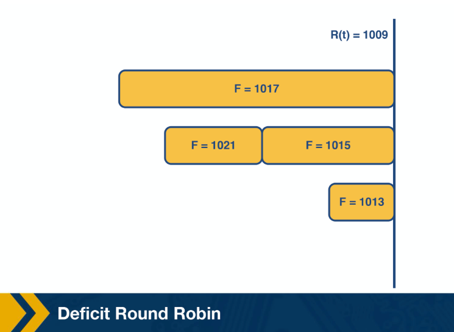
- Example progression:
    - Packet with F=1002 is sent first
    - Then F=1007, then F=1009
- Drawbacks:
    - Requires a **priority queue** to track finishing times → time complexity **O(log N)** per operation
    - If a new queue becomes active, all timestamps may need updating → **O(N)** complexity
    - Too complex to implement at gigabit speeds

### Deficit Round Robin (DRR)

- Simplifies bit-by-bit round robin to **constant time** while still providing bandwidth guarantees
- Assigns each flow i:
    - **Quantum size Q(i)**: determines the share of bandwidth allocated to the flow
    - **Deficit counter D(i)**: carries over unused bandwidth to the next round
- Each round: serve as many packets in flow i with size ≤ `Q(i) + D(i)`
    - If packets remain in the queue → store leftover bandwidth in D(i) for next round
    - If all packets are served → reset D(i) to 0

### DRR Example (4 flows, Q = 500 for all, initial D = 0)
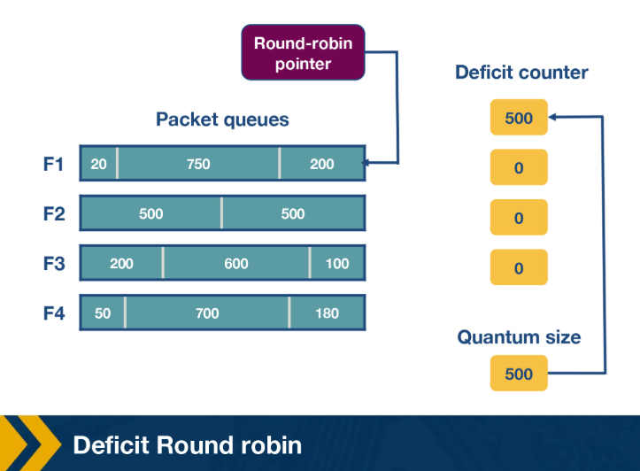
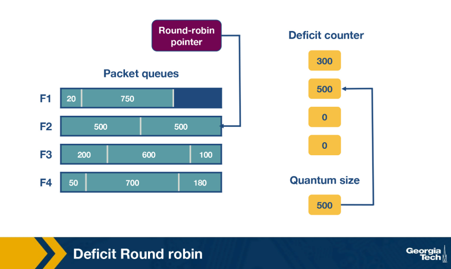
- Round 1:
    - F1: sends packet of size 200; insufficient funds for next packet (size 750) → D1 = 300
    - F2: sends packet of size 500 → D2 = 0
    - F3: sends first packet → D3 = 400
    - F4: sends first packet → D4 = 320
- Round 2:
    - F1: D1 + Q1 = 800 → sufficient to send second and third packets
    - No remaining packets → D1 reset to 0 (not 30, the actual remainder)

---

## Traffic Scheduling: Token Bucket
- Token bucket shaping limits the burstiness of a flow by enforcing both an average rate and a maximum burst size, without requiring flows to be placed in separate queues.

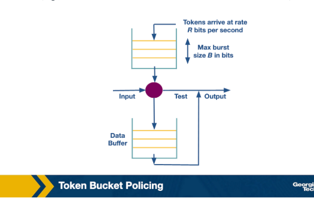

### Token Bucket Shaping
- Each flow has a **bucket** that:
    - Fills with tokens at a rate of **R tokens per second**
    - Holds a maximum of **B tokens** at any time — excess tokens are dropped
- When a packet arrives:
    - If enough tokens exist (≥ packet size in bits) → packet passes through, tokens are decremented
    - If not enough tokens → packet **waits** until sufficient tokens accumulate
- Maximum burst size is limited to **B bits**
- Practical implementation uses:
    - A **counter** (max value B, decremented as bits arrive)
    - A **timer** (increments the counter at rate R)
- Problem: requires **one queue per flow**
    - A flow with a full token bucket can proceed, while flows with empty buckets must wait
    - This separation is necessary but costly

### Token Bucket Policing
- A modified version of token bucket shaping that maintains a **single queue**
- Key difference: if a packet arrives and there are **no tokens in the bucket**, the packet is **dropped immediately** rather than waiting

---

## Traffic Scheduling: Leaky Bucket
- Traffic policing and shaping both limit the output rate of a link but respond to violations differently — policing drops excess traffic while shaping delays it.
- 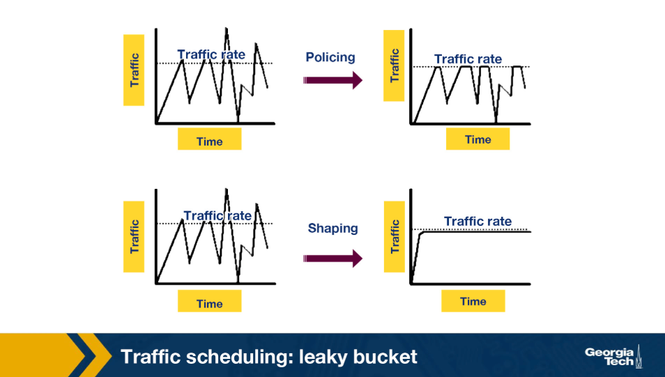

### Policing vs Shaping
- Policer:
    - When traffic rate reaches the maximum configured rate, excess traffic is **dropped** or the packet's marking is changed
    - Output rate appears as a **saw-toothed wave**
- Shaper:
    - Excess packets are retained in a **queue or buffer** and scheduled for later transmission
    - Excess traffic is **delayed instead of dropped**
    - Output is smoothed when data rate exceeds the configured rate
- Both mechanisms can work in tandem

### Leaky Bucket Algorithm
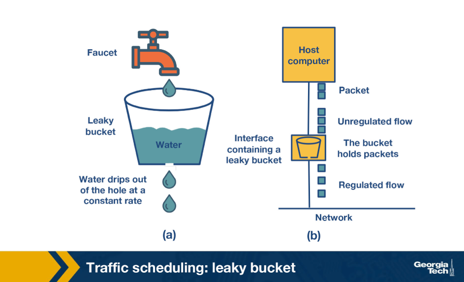

- Analogy: water flows into a leaky bucket at any rate, but leaks out at a **constant rate**
- Bucket capacity **b** represents a buffer holding packets; incoming packets correspond to water
- Leak rate **r** = constant rate at which packets are allowed into the network, regardless of arrival rate
- Packet classification:
    - **Conforming**: arriving packet does not cause overflow → added to the bucket
    - **Non-conforming**: arriving packet would cause overflow → **discarded**
- If the bucket is full, any newly arriving packet is dropped
- Output rate is always **constant** → uniform packet distribution into the network
- Can be implemented as a **single server queue**

### Leaky Bucket for Policing vs Shaping
- Traffic policing: non-conforming packets are **dropped immediately** (bucket overflow = discard)
- Traffic shaping: excess packets are **queued and transmitted later** at the constant leak rate, smoothing out bursts

