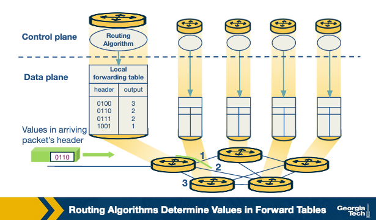
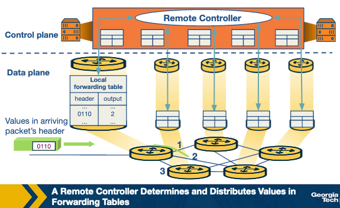
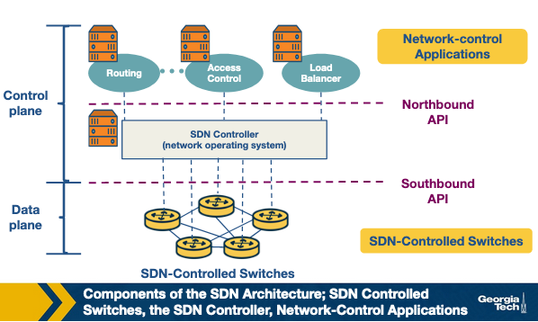
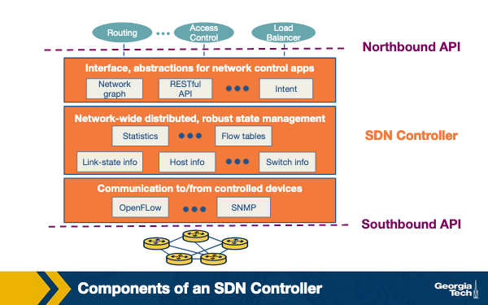
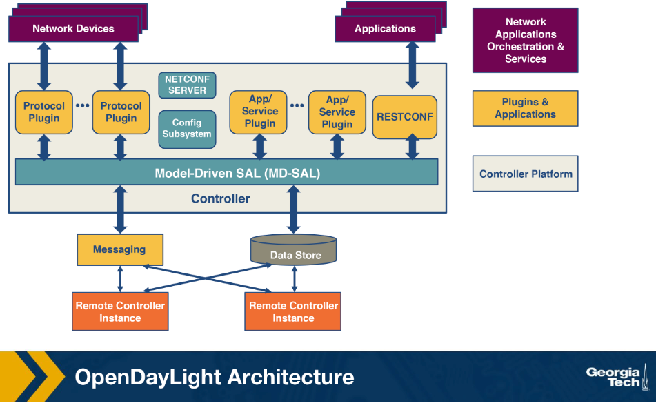

# Lesson 7

## Key concepts:
* Why traditional networks are hard to manage and change
* Control plane and data plane separation
* SDN controllers and network-wide control
* Northbound and southbound interfaces
* OpenFlow-style forwarding rules
* Centralized and distributed controller designs
* ONOS and controller scalability
* Programmable data planes and P4
* SD-WAN and modern enterprise networking
* Software-defined Internet exchanges
* SDN for traffic engineering, security, and automation

## What led us to SDN?
- SDN makes networks more manageable by separating the control plane from the data plane.

### Why Networks Are Hard to Manage
Computer networks are complex due to two core challenges.

- **Diversity of Equipment**:
    - Networks include routers, switches, and middleboxes
        - **Middleboxes** — firewalls, NATs, load balancers, IDSs
    - Each device runs different software adhering to different protocols
    - Even centralized management tools must operate at the level of individual protocols and config interfaces

- **Proprietary Technologies**:
    - Routers and switches run closed, proprietary software
    - Configuration interfaces vary between vendors
    - Interfaces can even differ between products from the same vendor
    - Makes centralized management of all devices very difficult

### Consequences of Network Complexity
These characteristics created significant operational problems.

- **High Complexity**:
    - Difficult to manage diverse equipment and protocols centrally
- **Slow Innovation**:
    - Proprietary systems limit experimentation and new features
- **High Costs**:
    - Complexity and lock-in drive up the expense of running a network

### How SDN Addresses This
SDN applies the principle of separation of tasks to network design.

- **Core Idea**:
    - Divides the network into two distinct planes
        - **Control Plane** — handles decision-making and network management logic
        - **Data Plane** — handles the actual forwarding of traffic
- **Benefits**:
    - Simplifies network management
    - Speeds up innovation by decoupling logic from hardware

## A Brief History of SDN: The Milestones
The history of SDN can be divided into three phases: active networks, control and data plane separation, and OpenFlow API and network operating systems.

### Phase 1: Active Networks (Mid-1990s to Early 2000s)
The internet's rapid growth pushed researchers to find faster ways to innovate beyond the slow IETF standardization process.

- **Context**:
    - Internet takeoff increased demand for new network services
    - IETF standardization was slow and frustrating
    - Dominant networking approaches were **IP** and **ATM** (Asynchronous Transfer Mode)

- **Core Idea**:
    - Envisioned a network API that exposed resources at network nodes
    - Supported customization of functionalities for subsets of packets

- **Programming Models**:
    - **Capsule Model** — code carried in-band in data packets
    - **Programmable Router/Switch Model** — code established via out-of-band mechanisms

- **Technology Pushes**:
    - Reduction in computation cost enabled more processing in the network
    - Advances in languages like **Java** offered platform portability, code execution safety, and VM protection
    - Advances in rapid code compilation and formal methods
    - DARPA funding promoted interoperability among projects

- **Use Pulls**:
    - Network service provider frustration with slow deployment timelines
    - Third-party interest in dynamic, application-specific control
    - Researcher interest in large-scale experimentation
    - Desire for unified control over middleboxes — foreshadows **NFV** (Network Functions Virtualization)

- **Contributions to SDN**:
    - Programmable functions in the network to lower the barrier to innovation
        - Focused on **data-plane** programmability
        - Introduced isolating experimental traffic from normal traffic
    - **Network virtualization** — demultiplexing to software programs based on packet headers
    - Vision of a unified architecture for middlebox orchestration

- **Downfall**:
    - Too ambitious — required end users to write Java code
    - Insufficient emphasis on performance and security
    - No clear short-term problems solved, limiting widespread deployment

### Phase 2: Control and Data Plane Separation (2001–2007)
Rising traffic volumes made network reliability and traffic engineering critical, leading researchers to separate the tightly coupled control and data planes.

- **Technology Pushes**:
    - Higher backbone link speeds pushed packet forwarding into hardware, separating it from control-plane software
    - ISPs struggled to meet demands for reliability and new services like **VPNs**
    - Servers had more memory and processing power, enabling a single server to store all routing state for a large ISP
    - Open source routing software lowered the barrier to building prototype centralized controllers

- **Key Innovations**:
    - **Open interface** between control and data planes
    - **Logically centralized control** of the network

- **Differences from Active Networking**:
    - Focused on network administrators rather than end users
    - Emphasized **control-plane** programmability rather than data-plane
    - Targeted network-wide visibility rather than device-level configuration

- **Use Pulls**:
    - Selecting network paths based on current traffic load
    - Minimizing disruptions during planned routing changes
    - Redirecting or dropping suspected attack traffic
    - Giving customer networks more control over traffic flow
    - Offering value-added services for VPN customers

- **Contributions to SDN**:
    - Logically centralized control using an open interface to the data plane
    - **Distributed state management** — helped researchers think clearly about managing state across a network

### Phase 3: OpenFlow API and Network Operating Systems (2007–2010)

OpenFlow balanced the vision of fully programmable networks with the practicality of real-world deployment by building on existing hardware.

- **How OpenFlow Works**:
    - Each switch contains a table of packet-handling rules
    - Each rule has a pattern, list of actions, set of counters, and a priority
    - On receiving a packet, the switch finds the highest-priority matching rule, performs the action, and increments the counter

- **Technology Pushes**:
    - Switch chipset vendors already allowed programmers to control some forwarding behaviors
    - More companies could build switches without fabricating their own data plane
    - Early OpenFlow versions built on existing switch capabilities — enabling it was as simple as a firmware upgrade

- **Use Pulls**:
    - Need for large-scale experimentation on network architectures
        - OpenFlow testbeds deployed across college campuses and wide area backbone networks
    - Data-center networks needed to manage traffic at large scales
    - Companies invested more in programmers writing control programs and less in proprietary switches

- **Key Effects**:
    - Generalizing network devices and functions
    - Vision of a **network operating system**
    - Distributed state management techniques

## Why Separate the Data Plane from the Control Plane?
- Separating the control and data planes allows independent evolution of each, simplifies network management, and enables higher-level software control.

### The Two Planes Defined
Each plane has a distinct role in how a network operates.

- **Control Plane**:
    - Contains logic that controls forwarding behavior
        - Routing protocols
        - Network middlebox configurations
- **Data Plane**:
    - Performs actual forwarding as dictated by the control plane
        - **IP forwarding**
        - **Layer 2 switching**

### Reasons for Separation
Two core motivations drive the separation of planes.

- **Independent Evolution and Development**:
    - Traditional routers handle both routing and forwarding — changing either required a hardware upgrade
    - In SDN, routers only focus on forwarding
        - Innovations in forwarding can proceed independently of routing considerations
        - Improvements in routing algorithms can occur without affecting existing routers
    - Limiting interplay between the two functions makes each easier to develop

- **Control from High-Level Software Programs**:
    - Forwarding tables are computed in software
    - Higher-order programs can easily control router behavior
    - Decoupling makes debugging and checking network behavior easier

### Opportunities Created by Separation
The separation of planes opens up improvements across several network domains.

- **Data Centers**:
    - Large data centers with thousands of servers and VMs are hard to manage
    - SDN simplifies management of such large-scale networks

- **Routing**:
    - Today's interdomain protocol **BGP** constrains routes and offers limited control over inbound/outbound traffic
    - SDN makes it easier to update router state and provides more control over path selection
    - Enables routing decisions based on multiple criteria

- **Enterprise Networks**:
    - SDN improves security applications for enterprise networks
    - Example: easier to defend against volumetric attacks like **DDoS** by dropping attack traffic at strategic network locations

- **Research Networks**:
    - SDN allows research networks to coexist with production networks

## Control Plane and Data Plane Separation
- Forwarding and routing are the two core network layer functions, separated in SDN between the data plane (routers) and the control plane (remote controller).

### Forwarding

Forwarding is a local, hardware-level function that determines where each incoming packet should go.

- **Definition**:
    - When a router receives a packet, it determines which output link to send it through
    - Consults the **forwarding table** based on the packet's header
- **Additional Behaviors**:
    - Can block a packet if suspected to be from a malicious router
    - Can duplicate a packet and send it along multiple output links
- **Characteristics**:
    - Local function — operates at the individual router level
    - Implemented in **hardware**
    - Operates in **nanoseconds**
    - Function of the **data plane**

### Routing

Routing is a network-wide, software-level process that determines the end-to-end path from sender to receiver.

- **Definition**:
    - Determines the path a packet takes across the network from source to destination
    - Routers rely on **routing algorithms** for this purpose
- **Characteristics**:
    - End-to-end process — operates across the entire network
    - Implemented in **software**
    - Operates in **seconds**
    - Function of the **control plane**

### Traditional vs SDN Approach

The two approaches differ in how tightly the control and data planes are coupled.

- **Traditional Approach**:
    - Routing algorithms and forwarding are tightly coupled within the same router
    - The router runs routing algorithms, builds the forwarding table, and performs forwarding
- **SDN Approach**:
    - A **remote controller** computes and distributes forwarding tables to all routers
    - The controller is physically separate from routers — located in a remote data center managed by an **ISP** or third party
    - Routers are solely responsible for **forwarding**
    - Remote controllers are solely responsible for **computing and distributing forwarding tables**
    - Controller is implemented in software — hence the network is **software-defined**
    - Software implementations are increasingly open and publicly available, speeding up innovation

## The SDN Architecture
- SDN architecture consists of three main components and four defining features that together enable programmable, centrally controlled networking.

### Main Components
The SDN network is built from three distinct layers that interact with one another.

- **SDN-Controlled Network Elements (Infrastructure Layer)**:
    - Responsible for forwarding traffic based on rules computed by the control plane

- **SDN Controller**:
    - A logically centralized entity
    - Acts as an interface between network elements and network-control applications

- **Network-Control Applications**:
    - Programs that manage the underlying network
    - Collect information about network elements with the help of the SDN controller

### Four Defining Features
These features distinguish SDN architecture from traditional networking approaches.

- **Flow-Based Forwarding**:
    - Forwarding rules can be computed based on any number of header field values across multiple layers
        - Transport layer, network layer, link layer
    - Differs from traditional approach where only the destination IP address determines forwarding
    - **OpenFlow** allows up to 11 header field values to be considered

- **Separation of Data Plane and Control Plane**:
    - SDN-controlled switches operate solely on the data plane
    - Switches only execute rules in the **flow tables**
    - Rules are computed, installed, and managed by software running on separate servers

- **Network Control Functions**:
    - SDN control plane runs on multiple servers for increased performance and availability
    - Consists of two components:
        - **Controller** — maintains up-to-date state information about network devices and elements (hosts, switches, links) and provides it to network-control applications
        - **Network Applications** — use controller-provided information to monitor and control network devices

- **A Programmable Network**:
    - Network-control applications act as the "brain" of the SDN control plane
    - Example applications:
        - Network management, traffic engineering, security, automation, analytics
    - Example: an application can determine end-to-end paths between sources and destinations using **Dijkstra's algorithm**
  

## The SDN Controller Architecture
- The SDN controller is split into three layers: the communication layer, network-wide state-management layer, and interface to network-control applications.

### Overview
The controller acts as the central interface between network elements and network-control applications.

- **External view** — appears as a monolithic service to external devices and applications
- **Internal implementation** — runs on distributed servers to achieve:
    - Fault tolerance
    - High availability
    - Efficiency
- Modern controllers like **OpenDayLight** and **ONOS** have solved synchronization challenges across servers to provide highly scalable services

- 

### Layer 1: Communication Layer (Southbound Interface)
This layer handles communication between the SDN controller and the network-controlled elements.

- **Function**:
    - Devices send locally observed events to the controller to provide a current view of network state
- **Example Events**:
    - A new device joining the network
    - Heartbeat signals indicating a device is up
- **Interface Name**: **Southbound** interface
- **Example Protocol**: **OpenFlow** — broadly used by SDN controllers today

### Layer 2: Network-Wide State-Management Layer
This layer stores and maintains all information about the current state of the network.

- **What It Stores**:
    - State of hosts, links, switches, and other controlled elements
    - Copies of the flow tables of the switches
- **Purpose**:
    - Network-state information is needed by the SDN control plane to configure flow tables

### Layer 3: Interface to Network-Control Application Layer (Northbound Interface)
This layer handles communication between the controller and the network-control applications.

- **Function**:
    - Network-control applications can read/write network state and flow tables in the controller's state-management layer
    - Controller can notify applications of changes in network state based on events from SDN-controlled devices
    - Applications take appropriate actions based on received events
- **Interface Name**: **Northbound** interface
- **Example API**: **REST** interface

## Optional: OpenDayLight Architecture Overview

## Quiz
- Q: The main reason why SDNs were created was because of the increase of internet users. 
  - False
- Q: SDNs divide the network in two planes: control plane and data plane, to ease management and speed up innovation. 
  - True