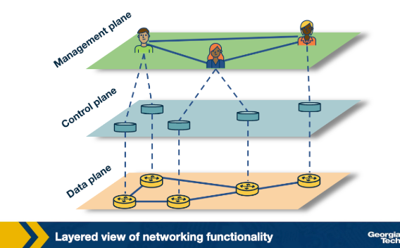
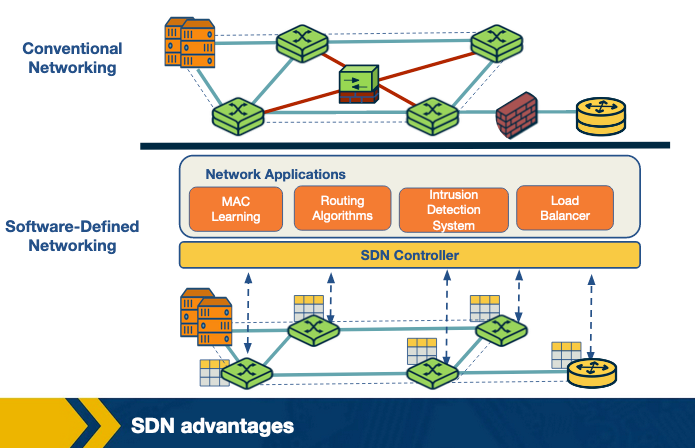
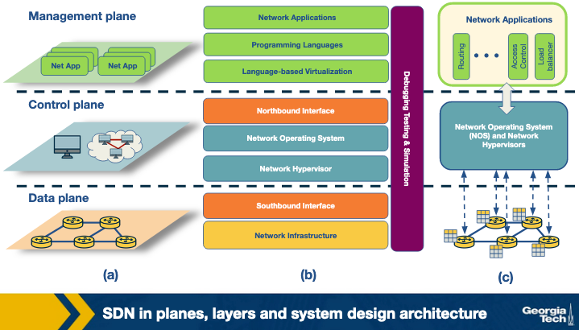
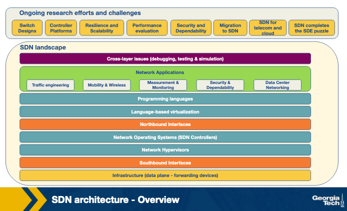
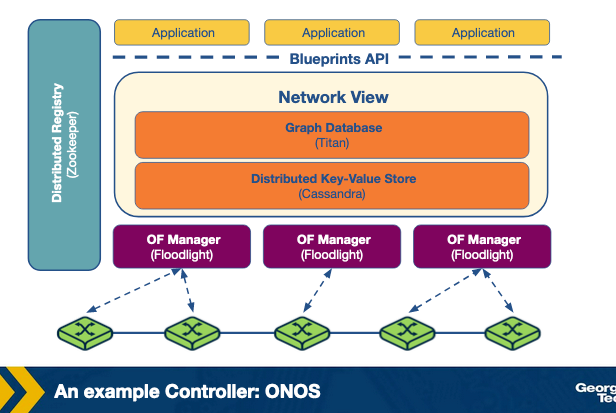
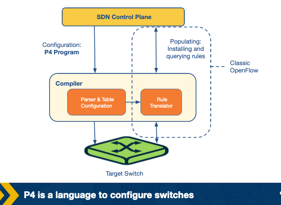
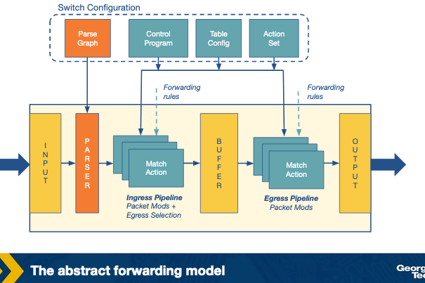
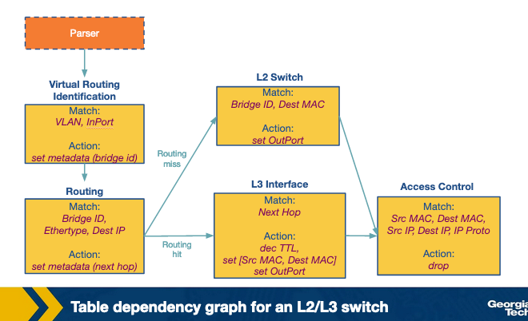
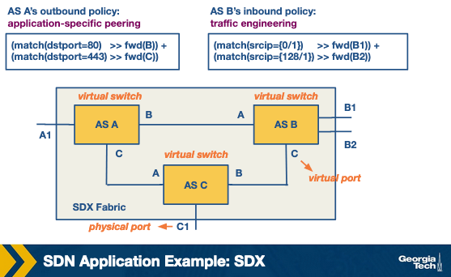
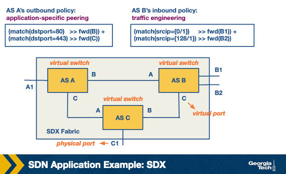

# Lesson 8

## Key concepts:
* Why traditional networks are hard to manage and change
* Control plane and data plane separation
* SDN controllers and network-wide control
* Northbound and southbound interfaces
* OpenFlow-style forwarding rules
* Centralized and distributed controller designs
* ONOS and controller scalability
* Programmable data planes and P4
* SD-WAN and modern enterprise networking
* Software-defined Internet exchanges
* SDN for traffic engineering, security, and automation

## Revisiting the Motivation for SDN
- SDN emerged to overcome the complexity, inflexibility, and tight coupling of traditional IP networks by separating control logic from data forwarding.

### Challenges with Traditional IP Networks
Two core problems drove the need for a new networking paradigm.

- **Ever-Growing Complexity and Dynamic Nature**:
    - Implementing network policies required changes to each individual network device
    - Changes were carried out via vendor-specific commands and manual configurations
    - Heavy upkeep burden on operators
    - Traditional IP networks lack automatic response mechanisms to dynamic network environment changes

- **Tightly Coupled Architecture**:
    - Control plane and data plane are bundled together inside networking devices
    - Not flexible to work on or modify
    - Any new protocol update takes as long as **10 years** because changes must percolate down to every networking device in the IP network

### How SDN Addresses These Challenges


SDN separates control logic from the data plane to enable flexibility and innovation.

- **Core Separation**:
    - Network switches solely perform forwarding
    - Control logic is implemented in a logically centralized **controller** (network OS)
    - Enables innovation in network reconfiguration and policy enforcement
- **Physical Distribution in Practice**:
    - Despite logically centralized control, production-level SDNs use a physically distributed control plane
        - Achieves performance, reliability, and scalability

- **Programming Interface**:
    - Separation is achieved via a programming interface between the SDN controller and switches
    - Example: **OpenFlow**
        - A switch has one or more tables for packet-handling rules
        - Each rule matches a subset of network traffic and performs actions — dropping, forwarding, modifying, etc.
        - An OpenFlow switch can be instructed to behave as a firewall, switch, router, load balancer, traffic shaper, etc.

- **Separation of Concerns**:
    - Separates the definition of networking policies, their implementation in hardware, and the forwarding of traffic
    - Allows networking control problems to be viewed as tractable pieces
    - Enables newer networking abstractions, simpler management, and faster innovation

### Three Planes of Network Functionality

Traditional networks are described through three abstract logical planes.

- **Data Plane**:
    - Functions and processes that forward data in the form of packets or frames

- **Control Plane**:
    - Functions and processes that determine which path to use
    - Uses protocols to populate forwarding tables of data plane elements

- **Management Plane**:
    - Services used to monitor and configure control functionality
    - Example: **SNMP**-based tools

- **How They Interact**:
    - A policy defined in the **management plane** is enforced by the **control plane** and executed by the **data plane**

## SDN Advantages
- SDN overcomes the rigidity of conventional networks by decoupling the control plane, enabling flexible and programmable middlebox services through a centralized controller.



### Conventional Networks

Traditional networks are constrained by tight physical coupling of control and data planes.

- **Tightly Coupled Architecture**:
    - Control and data planes are physically embedded in networking components
    - Adding a new networking feature requires modifying all control plane devices
        - Installing new firmware or performing hardware upgrades on every device
- **Middleboxes as a Workaround**:
    - Specialized equipment introduced to avoid modifying every device
    - Used to implement features like load balancers, intrusion detection systems, firewalls, etc.
    - Must be carefully placed in the network topology
    - Hard to change or reconfigure once deployed

### SDN Approach

SDN isolates the control plane as an external entity, treating middlebox services as controller applications.

- **Core Difference**:
    - Control plane is decoupled from physical networking devices
    - Exists as an external **SDN controller**
    - Middlebox services are viewed as SDN controller applications

### Advantages of SDN over Conventional Networks

The SDN model introduces four key advantages for network management and flexibility.

- **Shared Abstractions**:
    - Middlebox services can be programmed easily
    - Abstractions provided by the control platform and network programming languages are shared across functionalities

- **Consistency of Network Information**:
    - All network applications share the same global network information view
    - Leads to consistent policy decisions
    - Enables reuse of control plane modules

- **Locality of Functionality Placement**:
    - Previously, middlebox placement was a strategic and constraining decision
    - In SDN, middlebox applications can take actions from anywhere in the network

- **Simpler Integration**:
    - Networking applications integrate more smoothly with one another
    - Example: load balancing and routing applications can be combined sequentially

## The SDN Landscape
- The SDN landscape is decomposed into eight layers, each with distinct technologies spanning infrastructure, interfaces, virtualization, operating systems, programming languages, and applications.




### Layer 1: Infrastructure

Physical networking equipment in SDN serves only as forwarding elements directed by a centralized control system.

- **Role**:
    - Routers, switches, and middlebox hardware perform simple forwarding tasks
    - All logic is directed from the centralized control system
- **Examples**: SwitchLight, Open vSwitch, Pica8

### Layer 2: Southbound Interfaces

These interfaces act as bridges between control and forwarding elements, playing a crucial role in separating the two planes.

- **Role**:
    - Connect control plane to data plane elements
    - Tightly coupled with the forwarding elements of the underlying physical or virtual infrastructure
- **Most Popular Implementation**: **OpenFlow**
- **Other Examples**: ForCES, OVSDB, POF, OpFlex, OpenStack

### Layer 3: Network Virtualization

Full network virtualization requires support for arbitrary network topologies and addressing schemes.

- **Existing Constructs**: **VLAN**, **NAT**, **MPLS**
    - Provide full network virtualization but are configured on a box-by-box basis
    - No unifying abstraction for global configuration
    - Current network provisioning tasks can take months or years
- **New SDN Advancements**: VxLAN, NVGRE, FlowVisor, FlowN, NVP

### Layer 4: Network Operating Systems

A network OS (NOS) provides the logically centralized controller that simplifies network management.

- **Value of a NOS**:
    - Provides abstractions, essential services, and common APIs to developers
    - Developers do not need to worry about low-level data distribution among routing elements
    - Reduces complexity of creating new network protocols and applications
    - Propels innovation
- **Examples**: OpenDayLight, OpenContrail, Onix, Beacon, HP VAN SDN

### Layer 5: Northbound Interfaces

Northbound interfaces connect the controller to network-control applications and are primarily software ecosystems.

- **Key Characteristics**:
    - Mostly software ecosystems, unlike southbound interfaces
    - Must guarantee programming language and controller independence
- **Current State**:
    - A standard for northbound interfaces is still an open problem
    - Contrast with southbound interfaces where **OpenFlow** is a widely accepted norm
- **Examples**: Floodlight, Trema, NOX, Onix, SFNet

### Layer 6: Language-Based Virtualization

Virtualization at the language level allows modularity and different levels of abstraction without compromising security.

- **Key Characteristic**:
    - A single physical device can be viewed in different ways through virtualization
    - Takes complexity away from application developers
    - Security is inherently guaranteed
- **Examples**: Pyretic, libNetVirt, AutoSlice, RadioVisor, OpenVirteX

### Layer 7: Network Programming Languages

High-level programming languages improve modularity, reusability, and development speed in SDNs.

- **Low-Level Languages**:
    - Difficult to write modular or reusable code
    - Generally leads to more error-prone development
- **High-Level Languages**:
    - Provide abstractions and modularity
    - Make code more reusable in the control plane
    - Eliminate device-specific and low-level configurations
    - Allow faster development
- **Examples**: Pyretic, Frenetic, Merlin, Nettle, Procera, FML

### Layer 8: Network Applications

Network applications implement control plane logic and translate it into data plane commands.

- **Deployment Contexts**:
    - Traditional networks, home area networks, data centers, IXPs, etc.
- **Example Application Types**:
    - Routing, load balancing, security enforcement, end-to-end **QoS** enforcement
    - Power consumption reduction, network virtualization, mobility management
- **Examples**: Hedera, Aster*x, OSP, OpenQoS, Pronto, FortNOX, FlowSense

## SDN Infrastructure Layer
- The SDN infrastructure layer consists of networking equipment performing simple forwarding tasks, directed by a logically centralized NOS using open, standard interfaces.

### Key Characteristics

SDN infrastructure differs from traditional networks in how intelligence and interfaces are handled.

- **No Embedded Intelligence**:
    - Physical devices (routers, switches, appliance hardware) only perform forwarding
    - Network intelligence is delegated to a logically centralized control system — the **NOS** (Network Operating System)
- **Open and Standard Interfaces**:
    - Built on open interfaces that ensure configuration and communication compatibility
    - Ensures interoperability among different control plane and data plane devices
    - Contrasts with traditional networks that use proprietary and closed interfaces
    - Enables dynamic programming of heterogeneous network devices as forwarding devices

### Data Plane Devices and Controllers

The two core entities in SDN infrastructure have distinct roles and implementations.

- **Data Plane Device**:
    - A hardware or software entity that forwards packets
- **Controller**:
    - A software stack running on commodity hardware

### OpenFlow Data Plane Model

OpenFlow is the most widely accepted design for SDN data plane devices, based on a pipeline of flow tables.

- **Flow Table Entry Structure**:
    - **Matching Rule** — defines which packets this entry applies to
    - **Actions** — operations to be executed on matching packets
    - **Counters** — keep statistics of matching packets

- **Lookup Process**:
    - Starts at the first table in the pipeline when a packet arrives
    - Ends with either a match in one of the pipeline tables or a **miss** (no rule found)

- **Possible Actions on a Packet**:
    - Forward the packet to an outgoing port
    - Encapsulate the packet and forward it to the controller
    - Drop the packet
    - Send the packet to the normal processing pipeline
    - Send the packet to the next flow table

### Other SDN Forwarding Device Specifications

Alternative specifications exist beyond OpenFlow for SDN-enabled forwarding devices.

- **POF** — Protocol-Oblivious Forwarding
- **NDMs** — Negotiable Datapath Models

## SDN Southbound Interfaces
- Southbound interfaces are the APIs that separate control and data plane functionality, with OpenFlow being the most widely accepted standard.

### Role and Importance

Southbound APIs serve as the critical bridge between the control and data planes.

- **Function**:
    - Act as the separating medium between control plane and data plane functionality
- **Legacy Context**:
    - Developing a new switch traditionally takes up to two years for commercialization
    - Additional time required for upgrade cycles and software development
    - Southbound APIs represent one of the major barriers to introducing new networking technology
- **Impact of Standardization**:
    - Standards like OpenFlow promote interoperability and deployment of vendor-agnostic devices
    - Already achieved through OpenFlow-enabled equipment from different vendors

### OpenFlow

OpenFlow is the most widely accepted southbound standard for SDNs.

- **What It Provides**:
    - Specifications for implementing OpenFlow-enabled forwarding devices
    - Specifications for the communication channel between data and control plane devices

- **Three Information Sources**:
    - **Event-Based Messages** — sent by forwarding devices to the controller when a link or port change occurs
    - **Flow Statistics** — generated by forwarding devices and collected by the controller
    - **Packet Messages** — sent by forwarding devices to the controller when they do not know what to do with a new incoming flow
    - All three channels provide flow-level information to the **NOS**

### Other Southbound API Proposals

Several alternatives to OpenFlow exist, each with distinct approaches and use cases.

- **ForCES** (Forwarding and Control Element Separation):
    - Provides a more flexible approach to traditional network management
    - Does not require a logically centralized controller
    - Control and data planes are separated but can also be kept in the same network element

- **OVSDB** (Open vSwitch Database):
    - Acts as a complement to OpenFlow or Open vSwitch
    - Capabilities:
        - Create multiple vSwitch instances
        - Set **QoS** policies on interfaces
        - Attach interfaces to switches
        - Configure tunnel interfaces on OpenFlow data paths
        - Manage queues and collect statistics

- **Other Proposals**: POF, OpFlex, OpenState

## SDN Controllers: Centralized vs Distributed
- SDN controllers provide the logically centralized control logic that generates network configuration based on operator-defined policies, and can be designed as centralized or distributed systems.

### Why Controllers Matter

Traditional networks are limited by low-level, device-specific configurations and proprietary operating systems.

- **Problem with Traditional Networks**:
    - Configured using low-level, device-specific instruction sets
    - Run mostly proprietary network operating systems
    - Challenges device-agnostic development and abstraction
- **Role of the Controller**:
    - Critical element in SDN architecture
    - Key supporting piece for control logic (applications)
    - Generates network configuration based on policies defined by the network operator

### Core Controller Functions

All controllers should provide a base set of essential network service functions.

- **Essential Functions**:
    - Topology management
    - Statistics collection
    - Notifications
    - Device management
    - Shortest path forwarding
    - Security mechanisms
- **Security Mechanisms**:
    - Provide basic isolation and security enforcement between services and applications
    - High priority services' rules always take precedence over rules from low-priority applications

### Centralized Controllers

A single entity manages all forwarding devices in the network.

- **Characteristics**:
    - Single point of failure
    - May have scaling issues
    - A single controller may not handle a large number of data plane elements
- **Design Approach**:
    - Use multi-threaded designs to exploit parallelism of multi-core architectures
- **Examples**:
    - **Maestro**, **Beacon**, **NOX-MT** — enterprise class networks and data centers
        - Beacon can handle more than 12 million flows per second using large cloud computing nodes
    - **Trema**, **Ryu NOS** — target specific environments such as data centers and cloud infrastructure
    - **Rosemary** — offers security and isolation of applications using a container-based architecture called **micro-NOS**

### Distributed Controllers

A distributed NOS can scale to meet the requirements of any network environment.

- **Characteristics**:
    - Overcomes the scaling limitations of single controller architectures
    - Can serve small or large networks
- **Distribution Models**:
    - **Centralized cluster of nodes** — controllers grouped within the same location
    - **Physically distributed set of elements** — controller nodes spread across different sites
    - **Hybrid approach** — used by cloud providers spanning multiple data centers across a WAN
        - Clusters of controllers inside each data center
        - Distributed controller nodes across different sites
- **Properties**:
    - **Weak consistency semantics**
    - **Fault tolerance**

## An example Controller: ONOS
- ONOS is a distributed SDN control platform that provides a global network view, scale-out performance, and fault tolerance across a cluster of controller instances.


### Overview

ONOS was built to overcome the limitations of single-instance SDN controllers.

- **Goal**:
    - Provide a global view of the network to applications
    - Achieve scale-out performance and fault tolerance
- **Origin**:
    - Prototype built based on **Floodlight**, an open-source single-instance SDN controller

### Architecture

ONOS runs as multiple instances in a cluster, sharing network state through a global network view.

- **Global Network View**:
    - Built using network topology and state information discovered by each instance
        - Port, link, and host information
    - Applications consume information from the view to make forwarding and policy decisions
    - Decisions are updated back to the view
    - **OpenFlow managers** receive application changes to the view and program the appropriate switches

- **Implementation Technologies**:
    - **Titan** — a graph database used to implement the view
    - **Cassandra** — a distributed key-value store used to implement the view
    - **Blueprints graph API** — used by applications to interact with the network view

### Scale-Out Performance

ONOS distributes workload across instances to handle growing network demands.

- Each ONOS instance serves as the **master OpenFlow controller** for a group of switches
- State changes between a switch and the network view are handled solely by that switch's master instance
- Additional instances can be added to the ONOS cluster to distribute workload when:
    - Data plane capacity increases
    - Control plane demand goes up

### Fault Tolerance

ONOS redistributes work from failed instances to maintain continuity.

- **Normal Operation**:
    - Each switch connects to multiple ONOS instances
    - Only one instance acts as **master** for each switch
    - Each ONOS instance acts as master for a subset of switches
- **Upon Instance Failure**:
    - An election is held on a consensus basis to choose a new master for each affected switch
    - A master is selected among remaining instances that had an established connection with the switch
    - At the end of the election, each switch has at most one new master instance
- **Mastership Management**:
    - **Zookeeper** is used to maintain mastership between switches and controllers

## Programming the Data Plane: The Motivation
- P4 is a high-level programming language for configuring switches that enables flexible, protocol-independent, and target-independent packet processing in the data plane.

### Motivation

The growing complexity of OpenFlow exposed the need for a more flexible approach to data plane programmability.

- **OpenFlow's Evolution**:
    - Started with a simple rule table matching packets based on a dozen header fields
    - Grew over the years to include multiple stages of rule tables with an increasing number of header fields
    - This growth was needed to better expose switch functionalities to the controller
- **Need for P4**:
    - Demand for an extensible, flexible approach to parse packets and match header fields
    - Required an open interface to controllers to leverage these capabilities

### What P4 Does

P4 acts as a general interface between switches and the controller.

- Configures switches programmatically
- Main aim: allows the controller to **define how the switches operate**
- Works in conjunction with SDN control protocols
- Targets to populate forwarding rules in fixed function switches alongside existing APIs like **OpenFlow**

### Primary Goals of P4

P4 is designed around three core goals for data plane programmability.

- **Reconfigurability**:
    - The way parsing and processing of packets in switches should be modifiable by the controller

- **Protocol Independence**:
    - Switches are independent of any particular protocol
    - The controller defines:
        - A **packet parser** — extracts header fields from incoming packets
        - A set of **match+action tables** — maps extracted header fields to actions to be processed
    - Workflow:
        - Packet parser extracts header fields
        - Fields are passed to match+action tables for processing

- **Target Independence**:
    - Packet processing programs are written independent of underlying target devices
    - Generalized P4 programs are converted into target-dependent programs by a **compiler**
    - Compiled programs are then used to configure the switch

## Programming the Data Plane: P4's Forwarding Model
- The P4 forwarding model uses a programmable parser and flexible match+action tables to generalize packet processing across diverse forwarding devices.


### P4 vs OpenFlow Parsing and Tables

P4 extends beyond OpenFlow's fixed approach to packet parsing and table arrangement.

- **OpenFlow**:
    - Supports only fixed parsers based on predetermined header fields
    - Only supports match+action tables in series combination
- **P4**:
    - Uses a **programmable parser**
    - Match+action tables can be accessed in multiple stages in either:
        - **Series** — sequential processing
        - **Parallel** — simultaneous processing

### Generalization Across Forwarding Devices

P4 provides a common language for packet processing across a wide range of hardware.

- **Supported Forwarding Devices**: routers, load balancers, etc.
- **Supported Technologies**: fixed function switches, NPUs, etc.
- A **compiler** maps generalized P4 programs to different forwarding devices
- Allows packet processing programs to be written independent of underlying devices

### Two Main Operations of the P4 Forwarding Model

The P4 model operates through two distinct types of operations.

- **Configure**:
    - Programs the parser
    - Specifies header fields to be processed in each match+action stage
    - Defines the order of these stages
    - Determines packet processing and supported protocols in a switch

- **Populate**:
    - Alters entries in the match+action tables specified during configuration
    - Allows addition and deletion of table entries
    - Decides the policies to be applied to packets

## Optional: An introduction To The P4 Programming Language
- P4 defines switch configuration and packet processing through header declarations, control flow programs, and Table Dependency Graphs compiled to target-specific switch configurations.


### Characteristics of P4

P4 has three core characteristics that define how packet processing is specified and executed.

- **Header Type Declarations**:
    - Legal header types are declared to inform the parser of possible packet formats
    - Example: format of an **IPv4** header may be specified along with the list of headers allowed to follow it

- **Control Flow Program**:
    - Uses declared header types and a set of actions to specify how headers are processed
    - Example operations:
        - Computing checksums
        - Adding new tunnel headers

- **Table Dependency Graphs (TDGs)**:
    - Used to identify dependencies between header fields
    - Help determine the order in which tables can be executed
    - Tables with no dependencies may be executed in **parallel**
    - Structure of a TDG:
        - Each **node** maps to a match+action table
        - Nodes contain the match and action
        - **Edges** between nodes represent control flow between tables
    - Analysis of dependencies between nodes determines where a table may be placed in the pipeline
    - TDGs are not directly available to the programmer

### Compilation Process

P4 programs are translated and mapped to target switches through a compiler.

- Control flow logic to process packets is written in **P4**
- P4 is translated to **TDGs** by a compiler for dependency analysis
- The compiler then maps the TDG to a specific target switch

## SDN Applications: Overview
- SDN enables innovation across five major domains: traffic engineering, mobility and wireless, measurement and monitoring, security and dependability, and data center networking.

### Traffic Engineering

SDN optimizes traffic flow to minimize power consumption, use network resources efficiently, and perform load balancing.

- **Power Consumption**:
    - Optimization algorithms combined with data plane monitoring via southbound interfaces can drastically reduce power consumption
    - **ElasticTree** — identifies and shuts down specific links and devices based on traffic load
- **Load Balancing**:
    - **Plug-n-Serve** and **Aster*x** — create rules based on wildcard patterns to handle large numbers of requests from particular groups
- **Routing Table Management**:
    - SDN automates router configuration management to reduce routing table growth due to data duplication
- **Dynamic Scaling**:
    - Large-scale service providers use SDN for traffic optimization
    - **ALTO VPN** — enables dynamic provisioning of VPNs in cloud infrastructure

### Mobility and Wireless

SDN simplifies the deployment and management of wireless networks and addresses control plane challenges.

- **Challenges in Traditional Wireless Networks**:
    - Management of limited spectrum
    - Allocation of radio resources
    - Load balancing
- **SDN-Based Wireless Features**:
    - On-demand virtual access points (**VAPs**)
    - Dynamic spectrum usage
    - Sharing of wireless infrastructure
- **Key Technologies**:
    - **OpenRadio** — considered the OpenFlow for wireless; decouples wireless protocols from underlying hardware via an abstraction layer
    - **LVAPs** (Light Virtual Access Points) — offer improved wireless network management using a one-to-one mapping between LVAPs and clients
    - **Odin Framework** — leverages LVAPs to provide mobility management, channel selection algorithms, etc.
        - Users can move between APs without visible lag as the mobility manager automatically moves the client LVAP to a different AP

### Measurement and Monitoring

SDN applications in this domain either add new measurement features or improve existing SDN capabilities.

- **First Class — Adding New Features**:
    - New functions can be added to measurement systems like **BISmark** in SDN-based broadband connections
    - Enables systems to respond to changing network conditions
- **Second Class — Improving Existing Features**:
    - Reduces control plane load from collecting data plane statistics using sampling and estimation techniques
- **Examples**:
    - **OpenSketch** — a southbound API offering flexibility for network measurements
    - **OpenSample** and **PayLess** — monitoring frameworks

### Security and Dependability

SDN applications focus on improving network security through policy enforcement, threat detection, and anomaly monitoring.

- **Security Policy Enforcement**:
    - Impose security policies at the entry point to the network
    - Use programmable devices to enforce policies across a wider network
- **Threat Detection and Mitigation**:
    - **DDoS Detection** — identifies and mitigates DDoS flooding attacks using timely network information
    - **OF-RHM** — randomly mutates IP addresses of hosts to present fake dynamic IPs to attackers
    - **CloudWatcher** — monitors cloud infrastructures
- **Anomaly Detection**:
    - SDN can detect anomalies in network traffic
- **Improving SDN's Own Security**:
    - Simple approaches like rule prioritization for applications exist
    - Significant room for further research and improvement remains

### Data Center Networking

SDN revolutionizes data center networking through live migration, real-time monitoring, and anomaly detection.

- **Key Services**:
    - Live migration of networks
    - Troubleshooting
    - Real-time monitoring
- **Anomaly Detection**:
    - SDN applications define models and build application signatures from network device data
    - Deviations from signature history are identified and appropriate measures are taken
- **Virtual Network Reconfiguration**:
    - SDN supports dynamic reconfiguration of virtual networks during live virtual network migration — an important cloud feature
- **Examples**:
    - **LIME** — provides live migration of networks
    - **FlowDiff** — detects abnormalities in data center networks

## SDN Application Example: A Software Defined Internet Exchange
- SDX is an SDN-based architecture proposed for Internet Exchange Points that overcomes BGP limitations by enabling flexible, application-aware routing and traffic management.


### BGP Limitations at IXPs

Traditional Internet routing via BGP has two key limitations that SDN can address.

- **Routing Only on Destination IP Prefix**:
    - Routing decisions are based solely on the destination prefix IP of the incoming packet
    - No flexibility to customize rules based on traffic application or source/destination network
- **Limited Control Over End-to-End Paths**:
    - Networks can only select paths advertised by direct neighbors
    - Cannot directly control preferred paths
    - Must rely on indirect mechanisms such as **AS Path prepending**

### SDX Architecture

SDX replaces the traditional IXP model with a virtualized SDN-based approach.

- **Traditional IXP**:
    - Participant ASes connect their BGP-speaking border router to a shared layer-2 network and a BGP route server
    - Layer-2 network handles forwarding (data plane)
    - BGP route server handles routing information exchange (control plane)

- **SDX Model**:
    - Each AS has the illusion of its own **virtual SDN switch** connecting its border router to every other participant AS
    - Each AS defines forwarding policies as if it is the only participant at the SDX
    - Each AS can have its own SDN applications for dropping, modifying, or forwarding traffic
    - The SDX combines policies from multiple participants into a single policy for the physical switch
    - Policies can be direction-specific:
        - **Inbound policy** — applied to traffic coming from other SDX participants on a virtual switch
        - **Outbound policy** — applied to traffic from the participant's virtual switch port towards other participants
    - Uses **Pyretic** language to match header fields and express actions on packets

### SDX Applications

SDX enables four key traffic management capabilities.

- **Application-Specific Peering**:
    - Custom peering rules for specific applications
    - Example: high-bandwidth video applications like Netflix or YouTube

- **Traffic Engineering**:
    - Controls inbound traffic based on source IP or port numbers by setting forwarding rules

- **Traffic Load Balancing**:
    - Destination IP address can be rewritten based on any field in the packet header to balance load

- **Traffic Redirection Through Middleboxes**:
    - Targeted subsets of traffic can be redirected to middleboxes

### Policy Expression in Pyretic

SDX uses the Pyretic language to define and combine forwarding policies.

- **Example — Application-Specific Peering (AS A Outbound Policy)**:
    - HTTP traffic (destination port 80) forwarded to AS B
    - HTTPS traffic (destination port 443) forwarded to AS C

- **Pyretic Operators**:
    - **match()** — filters and returns packets matching specified header fields
    - **>>** (sequential operator) — forwards returned packets to the next function
    - **fwd()** — modifies the location of the packet to the corresponding switch
    - **+** (parallel operator) — applies each policy to the packets and returns the combined output
        - If neither policy matches, the packet is dropped

- **Example Expression**:
```
    (match(dstport = 80) >> fwd(B)) +
    (match(dstport = 443) >> fwd(C))
```

## SDN Applications: Wide Area Traffic Delivery
- SDX enables four wide area traffic delivery applications: application-specific peering, inbound traffic engineering, wide-area server load balancing, and middlebox redirection.

### Application-Specific Peering

ISPs can use SDX to direct high-bandwidth application traffic through dedicated ASes without configuring individual edge routers.

- **Problem**:
    - High-bandwidth applications like YouTube and Netflix require dedicated ASes to handle large traffic volumes
    - Traditionally requires configuring additional rules in edge routers of the ISP — a significant overhead
- **SDX Solution**:
    - Identify application traffic using packet classifiers at the SDX
    - Configure custom rules for flows matching certain criteria directly at the exchange point
    - Eliminates the need to configure individual edge routers

### Inbound Traffic Engineering

SDX enables ASes to control how traffic enters their network based on source information, unlike BGP which only routes on destination address.

- **Problem**:
    - BGP performs routing based solely on the destination address of a packet
    - BGP workarounds have limitations:
        - **AS path prepending** and **selective advertisements** can control inbound traffic but selective advertisements can pollute global routing tables
        - An AS's local preference takes higher priority for outgoing traffic
- **SDX Solution**:
    - Install forwarding rules based on **source IP address** and **source port** of packets
    - Enables an AS to directly control how traffic enters its network

### Wide-Area Server Load Balancing

SDX enables more efficient load balancing by modifying packet headers at the exchange point, avoiding the limitations of DNS-based approaches.

- **Problem**:
    - Existing approach relies on a client's local DNS server issuing a request to the service's DNS server
    - Service DNS returns an IP address to balance load
    - DNS caching can lead to slower responses in case of a failure
- **SDX Solution**:
    - Assign a single **anycast IP** to a service
    - Modify destination IP addresses of packets at the exchange point to the desired backend server based on request load
    - More efficient and responsive than DNS-based load balancing

### Redirection Through Middleboxes

SDX can identify and selectively redirect traffic through a sequence of middleboxes, overcoming the rigidity of traditional approaches.

- **Problem**:
    - Middleboxes (firewalls, load balancers, etc.) are placed at important junctions like enterprise network boundaries
    - Geographically large ISPs cannot place middleboxes at every location due to high expense
    - Traffic is directed through a fixed set of middleboxes by manipulating routing protocols such as **internal BGP**
        - This approach can redirect unnecessary additional traffic
        - Limited by a fixed set of available middleboxes
- **SDX Solution**:
    - SDX identifies the desired subset of traffic
    - Redirects it through a targeted sequence of middleboxes
    - Overcomes both the inefficiency and inflexibility of traditional middlebox redirection

## Quiz
- Q: 