# Lesson 9

## Key concepts:
* Security goals: confidentiality, integrity, authentication, and availability
* DNS abuse
* Round-robin DNS as a DNS abuse technique
* Malicious hosting infrastructure
* Network reputation and evidence of abuse
* Bulletproof hosting and rogue networks
* BGP hijacking and traffic attraction
* Prefix hijacking and AS-path manipulation
* Data-plane traffic interception or disruption
* BGP hijack detection and mitigation
* Prefix deaggregation and MOAS-based mitigation
* Distributed Denial-of-Service attacks, reflection and amplification attacks
* BGP blackholing (RTBH)
* IXP-based DDoS defense
* Limits and tradeoffs of blackholing

## Properties of Secure Communication
- Secure communication requires four key properties to protect against attackers who may eavesdrop, modify, impersonate, or disrupt.

- 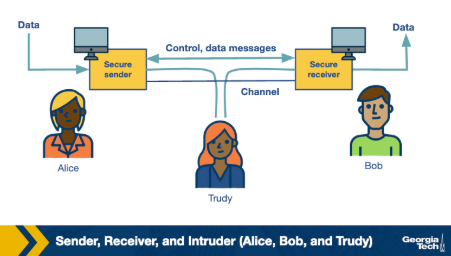

### Confidentiality

Confidentiality ensures that exchanged messages are only accessible to the intended sender and receiver.

- **Confidentiality**:
    - Goal: keep message content hidden from unauthorized parties
    - Attack: intruder eavesdrops by sniffing or recording traffic
    - Countermeasure: encrypt the message so intercepted data is meaningless to the attacker

### Integrity

Integrity ensures that a message has not been altered in any way during transit.

- **Integrity**:
    - Goal: guarantee the message received is exactly what was sent
    - Attack: intruder modifies, inserts, or deletes parts of the message in transit
    - Countermeasure: integrity-checking mechanisms detect unauthorized changes

### Authentication

Authentication ensures that each party in a communication is genuinely who they claim to be.

- **Authentication**:
    - Goal: verify the identity of both communicating parties
    - Attack: intruder impersonates a legitimate entity to steal information
    - Countermeasure: authentication mechanisms validate user identity before communication proceeds

### Availability

Availability ensures that the communication channel and its services remain operational and accessible.

- **Availability**:
    - Goal: keep systems and services reliably accessible to legitimate users
    - Attack: denial of service (DoS) attacks aim to render the system unavailable
    - Other threats: power outages, hardware failures, or other infrastructure disruptions
    - Countermeasure: design systems to cope with failures and resist availability-targeted attacks

### Relationship to Protocol Attacks

Each property can be violated by attackers exploiting weaknesses in existing protocols.

- **Protocol abuse**:
    - Attackers can exploit learned protocols for malicious purposes
    - A single attack may violate one or more of the four properties simultaneously

## DNS Abuse
- Attackers abuse DNS to extend the uptime of malicious domains and remain undetectable for longer.

### Round Robin DNS (RRDNS)

RRDNS distributes incoming request load across several servers at a single physical location.

- **RRDNS**:
    - Responds to DNS requests with a list of A records, cycling through them in round-robin
    - DNS client chooses a record using different strategies:
        - Choose the first record each time
        - Use the closest record by network proximity
    - Each A record has a **TTL** specifying how many seconds the mapping is valid
    - Repeated lookups return the same set of records in a different order

### DNS-Based Content Delivery

CDNs use more complex DNS-based strategies to distribute content across multiple locations worldwide.

- **Content Distribution Networks (CDNs)**:
    - Distribute load across multiple servers at multiple global locations
    - Compute the nearest **edge server** and return its IP to the DNS client
    - Use network topology and current link characteristics to determine nearest server
    - Result: content moves closer to the client, increasing responsiveness and availability
    - TTL is lower than RRDNS, allowing faster reaction to link changes

### Fast-Flux Service Networks
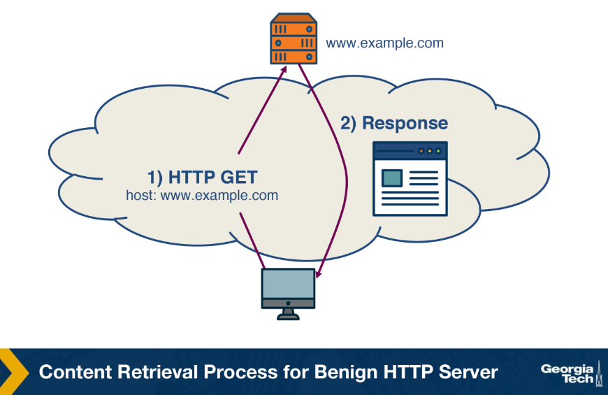
FFSNs extend RRDNS and CDN ideas to make malicious infrastructure harder to shut down.

- **Fast-Flux Service Networks (FFSN)**:
    - Based on rapid change in DNS answers with a TTL lower than RRDNS and CDN
    - After TTL expires, returns a different set of A records from a larger pool of compromised machines
    - Compromised machines act as **flux agents** — proxies between the client and the control node
    - Forms a resilient, robust one-hop overlay network
    - Flux agents are typically located in different countries and belong to different **Autonomous Systems (AS)**

- **Benign HTTP content retrieval**:
    - DNS lookup returns the IP of the control node
    - HTTP GET is sent directly to the control node
    - Control node responds directly with the content

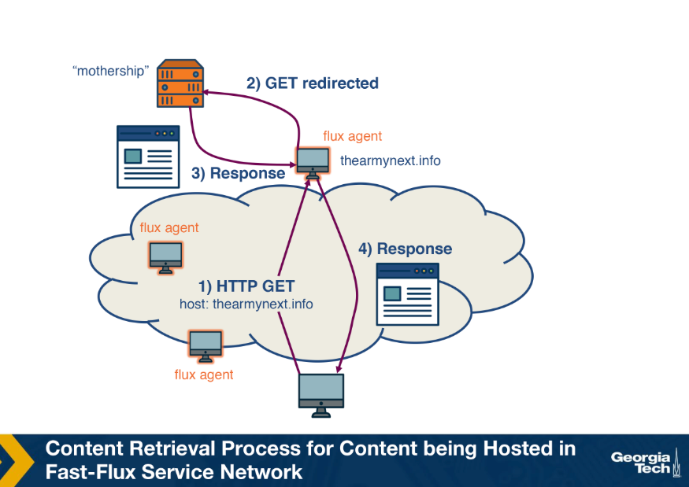
- **FFSN content retrieval**:
    - DNS lookup returns multiple IPs belonging to flux agents
    - Each TTL expiry returns completely different IP addresses
    - Flux agent relays the HTTP GET to the mothership (control node)
    - Mothership sends content to the flux agent, which delivers it to the client

- **Why FFSN is effective for attackers**:
    - Makes shutdown complex — if one IP is functional, the scam still works
    - Spreading across servers increases resilience
    - Supports illegal content hosting, C&C infrastructure, phishing, spamming, and illegal businesses

## How to Infer Network Reputation: Evidence of Abuse
- FIRE monitors the Internet for rogue networks by identifying networks whose primary purpose is malicious activity.

### Data Sources

FIRE uses three main data sources to identify hosts that likely belong to rogue networks.

- **Botnet C&C providers**:
    - Several botnets rely on centralized **command and control (C&C)**
    - Bot-masters prefer to host C&C on networks unlikely to take them down
    - Two main botnet types considered:
        - IRC-based botnets
        - HTTP-based botnets

- **Drive-by-download hosting providers**:
    - Malware installation method requiring no user interaction
    - Occurs when a victim visits a web page containing an exploit for a vulnerable browser

- **Phish housing providers**:
    - Contains URLs of servers hosting phishing pages
    - Phishing pages mimic authentic sites to steal login credentials, credit card numbers, and personal information
    - Hosted on compromised servers and usually active for only a short period

### Identifying Rogue Networks

The key difference between rogue and legitimate networks is the longevity of malicious behavior.

- **Longevity distinction**:
    - Legitimate networks remove malicious content within a few days
    - Rogue networks may let content remain up for weeks to over a year
    - Short-lived malicious IPs are disregarded to filter out temporarily abused servers and legitimate networks

- **Identification approach**:
    - Each data source produces a daily list of malicious IP addresses
    - FIRE combines the three lists to identify rogue **Autonomous Systems (AS)**
    - Organizations are considered equivalent to autonomous systems
    - Most malicious networks are identified by the highest ratio of malicious IPs to total owned IPs in that AS

## How to Infer Network Reputation: Interconnection Patterns
- ASwatch identifies malicious networks using routing behavior from the control plane rather than data plane monitoring.

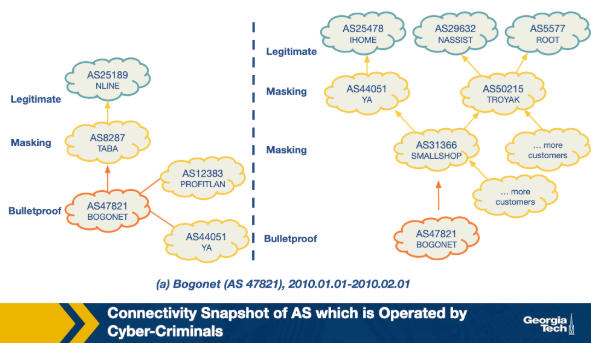
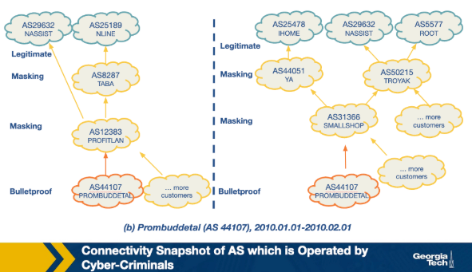
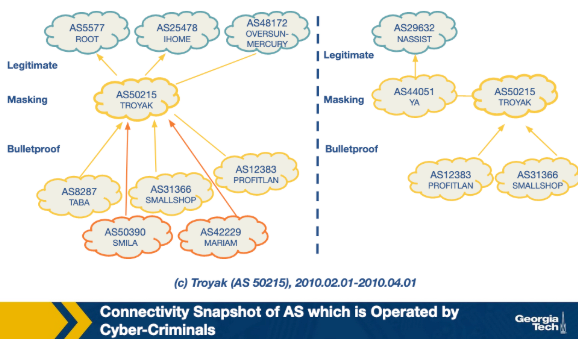

### Limitations of Data Plane Monitoring

Data plane monitoring requires observing a large concentration of blacklisted IPs before flagging a network as malicious.

- **Data plane monitoring**:
    - Flags a network only after a large enough concentration of blacklisted IPs is observed
    - Disadvantages:
        - Not feasible to monitor traffic of all networks
        - May take a long time for a large fraction of IPs to appear on a blacklist
        - Struggles to distinguish between legitimately misused networks and those run by malicious actors

### Bulletproof AS Behavior

Bulletproof ASes have distinct interconnection patterns and control plane behavior compared to legitimate networks.

- **Rewiring behavior**:
    - Change upstream providers more aggressively than legitimate networks
    - Maintain customer-provider or peering relationships with other shady networks
    - Avoid connecting directly with legitimate networks
    - When complaints arise, they switch upstream providers to remain undetected

### ASwatch Design

ASwatch monitors global BGP routing activity and operates in two phases.

- **Training phase**:
    - Given a list of known malicious and legitimate ASes
    - Tracks business relationships and BGP update/withdrawal patterns over time
    - Computes statistical features across three families:
        - **Rewiring Activity**:
            - Frequent changes in customers/providers
            - Connecting with less popular providers
            - Extended periods of downtime
        - **IP Space Fragmentation and Churn**:
            - Malicious ASes use small BGP prefixes to partition IP space
            - Only advertise a small section at a time to avoid full takedown if detected
        - **BGP Routing Dynamics**:
            - Announcements and withdrawals follow different patterns from legitimate ASes
            - Periodically announce prefixes for short periods of time
    - Uses supervised learning to capture known behaviors in a trained model

- **Operational phase**:
    - Calculates features for an unknown AS
    - Uses the trained model to assign a reputation score
    - If a low reputation score is assigned for several consecutive days, the AS is identified as malicious

## How to Infer Network Reputation: Likelihood of Breach
- A system that predicts the likelihood of a security breach within an organization using only externally observable features, trained on a Random Forest classifier.

### Mismanagement Symptoms

Misconfigurations in an organization's network indicate a lack of policies or capability to prevent attacks, increasing breach likelihood.

- **Open Recursive Resolvers**: misconfigured open DNS resolvers
- **DNS Source Port Randomization**: many servers still do not implement this
- **BGP Misconfiguration**: short-lived routes cause unnecessary updates to the global routing table
- **Untrusted HTTPS Certificates**: certificate validity detected via TLS handshake
- **Open SMTP Mail Relays**: servers should filter messages so only those in the same domain can send mail

### Malicious Activities

The level of malicious activity originating from an organization's network is measured using spam traps, darknet monitors, and DNS monitors to build a reputation blacklist.

- **Spam activity**: CBL, SBL, SpamCop
- **Phishing and malware activity**: PhishTank, SURBL
- **Scanning activity**: Dshield, OpenBL

### Security Incident Reports

Actual security incident data provides the ground truth for training the model.

- **VERIS Community Database**: public collection of cyber security incidents in a common format, maintained by the Verizon RISK team, containing over 5000 incident reports
- **Hackmageddon**: independently maintained blog aggregating security incidents monthly
- **Web Hacking Incidents Database**: actively maintained repository for cyber security incidents

### Model Design

The system uses a Random Forest classifier compared against a Support Vector Machine baseline.

- **Features**:
    - 258 total features including:
        - Mismanagement and malicious activity features divided by timespan validity
        - Secondary statistical features derived from other features
        - Size of the organization
- **Process**:
    - Features are processed and fed to a Random Forest
    - Output is a risk probability (float)
    - Binary class label obtained by thresholding the probability
    - Training and testing splits are strictly time-based due to sequential nature of data
- **Performance**: best parameter combination achieves 90% accuracy

## Traffic Attraction Attacks: BGP Hijacking
- BGP hijacking attacks are classified by how they target prefixes, manipulate AS-path announcements, or interfere with data-plane traffic.

### Classification by Affected Prefix

These attacks target the IP prefixes advertised by BGP.

- **Exact prefix hijacking**:
    - Two ASes (one genuine, one counterfeit) announce a path for the same prefix
    - Traffic is routed toward the hijacker wherever the AS-path is shortest

- **Sub-prefix hijacking**:
    - Hijacking AS announces a sub-prefix of the genuine prefix
    - Exploits BGP's preference for more specific prefixes
    - Routes large or entire amounts of traffic to the hijacking AS
    - Example: AS2 announces 10.10.0.0/24, a sub-prefix of 10.10.0.0/16 owned by AS1

- **Squatting**:
    - Hijacking AS announces a prefix that has not yet been announced by the owner AS

### Classification by AS-Path Announcement

An illegitimate AS announces an AS-path for a prefix it does not own.

- **Type-0 hijacking**:
    - AS announces a prefix not owned by itself

- **Type-N hijacking**:
    - Counterfeit AS announces an illegitimate path to create a fake link between ASes
    - N denotes the position of the rightmost fake link in the announcement
    - Example: `{AS2, ASy, AS1 – 10.0.0.0/23}` is a Type-2 hijacking

- **Type-U hijacking**:
    - Hijacking AS does not modify the AS-PATH but may change the prefix

### Classification by Data-Plane Traffic Manipulation

The attacker hijacks and manipulates redirected network traffic on its way to the receiving AS.

- **Blackholing (BH)**:
    - Intercepted traffic is dropped and never reaches the intended destination

- **Man-in-the-middle (MM)**:
    - Traffic is eavesdropped or manipulated before reaching the receiving AS

- **Imposture (IM)**:
    - Traffic of the victim AS is impersonated and responses are sent back to the sender

## Traffic Attraction Attacks: Motivations
- BGP hijacking attacks are motivated by different goals, ranging from accidental misconfiguration to deliberate large-scale disruption.

### Causes of BGP Hijacking

- **Human Error**:
    - Accidental routing misconfiguration due to manual errors
    - Can lead to large-scale exact-prefix hijacking
    - Example: China Telecom accidentally leaked a full BGP table, causing large-scale Type-0 hijacking

- **Targeted Attack**:
    - Hijacking AS intercepts network traffic using a man-in-the-middle attack
    - Operates in stealth mode to remain undetected on the control plane using Type-N and Type-U attacks
    - Example: Visa and Mastercard traffic hijacked by Russian networks in 2017

- **High Impact Attack**:
    - Attacker is deliberate in causing widespread disruption of services
    - Example: Pakistan Telecom performed a Type-0 sub-prefix hijacking that blackholed YouTube's services worldwide for nearly 2 hours

### Summary

The motivation behind every hijacking attempt is different, so there is no single best attack method. Depending on the scenario and intent, a hijacker may employ one or a combination of methods

## Example BGP Hijack Attacks
- BGP hijacking can target either the prefix origin or the AS-path by sending false announcements to neighboring ASes.

### Legitimate BGP Prefix Announcement

In a normal scenario, a new prefix propagates through ASes via BGP announcements.

- **Process**:
    - AS1 announces a new prefix (10.10.0.0/16) to its neighbors
    - AS2, AS3, AS4, and AS5 check their RIB for the entry; if new, add it and forward to neighbors
    - AS5 eventually receives the full path (4,2,1) from AS4
    - If multiple routes exist for a prefix, the best route is selected and announced to neighbors

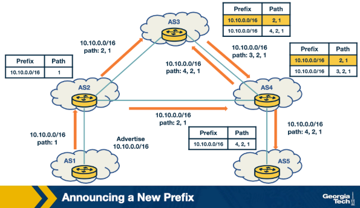

### Attack Scenario: Hijacking a Prefix

The attacker uses a router at AS4 to send false announcements and hijack prefix 10.10.0.0/16 belonging to AS1.

- **Process**:
    - AS4 announces prefix 10.10.0.0/16 with itself as the new origin, pretending the prefix belongs to AS4
    - This causes a **Multiple Origin AS (MOAS)** conflict for receiving ASes
    - AS2, AS3, and AS5 receive the false advertisement and compare it with existing RIB entries
    - AS2 does not select the false route as it has the same path length as the existing entry
    - AS3 and AS5 update their entries from (10.10.0.0/16, path 4,2,1) to (10.10.0.0/16, path 4)
    - AS3 and AS5 now send all traffic for 10.10.0.0/16 to AS4 instead of AS1

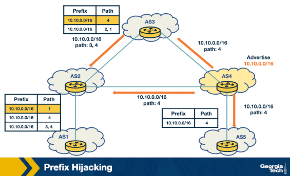

### Attack Scenario: Hijacking a Path

The attacker manipulates received BGP updates before propagating them to neighbors, without announcing a new prefix.

- **Process**:
    - AS1 advertises prefix 10.10.0.0/16
    - AS2 and AS3 legitimately receive and propagate the path
    - AS4 compromises the update by changing the path to (4,1), falsely claiming a direct link to AS1
    - AS4 propagates the false path to AS3, AS2, and AS5
    - AS5 receives and adopts the false path (4,1)
    - Other ASes do not adopt the false path as they already have a shorter or equally long path to AS1
- **Key observation**: the attacker manipulates an existing advertisement rather than announcing a new prefix

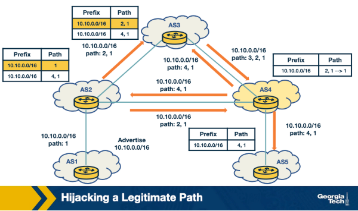

## Defending against BGP Hijacking: An example detection system
- ARTEMIS is a locally operated system that allows network operators to detect BGP hijacking attempts against their own prefixes.

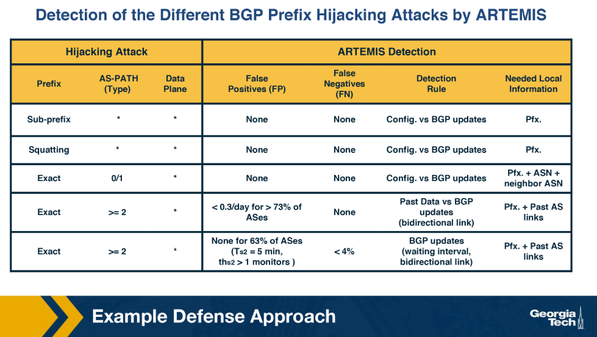

### Key Components

ARTEMIS uses two main components to detect prefix hijacking.

- **Configuration file**:
    - Lists all prefixes owned by the network operator
    - Populated manually by the network operator
    - Serves as the reference for detecting anomalies

- **BGP update mechanism**:
    - Receives updates from local routers and monitoring services
    - Built into the system
    - Checks received updates against the configuration file for anomalies in prefix and AS-PATH fields
    - Triggers alerts when anomalies are detected

### Detection Performance Considerations

The choice of detection criteria affects the rate of false positives and false negatives.

- **False Positive (FP)**: incorrectly flagging legitimate BGP updates as hijacking attempts
- **False Negative (FN)**: failing to detect an actual hijacking attempt
- **Ideal system**: minimizes both FP and FN rates
- **ARTEMIS tradeoff**: network operator can choose between:
    - Accuracy and speed
    - Fewer FPs at the cost of FNs that are inconsequential and have less impact on the control plane

## Defending against BGP Hijacking: Example Mitigation Techniques
- ARTEMIS uses two automated techniques to mitigate BGP hijacking attacks with minimal manual intervention.

### Prefix Deaggregation

The affected network counteracts an attack by announcing more specific sub-prefixes of the hijacked prefix.

- **Prefix deaggregation**:
    - Affected network announces more specific prefixes of the targeted prefix
    - Exploits BGP's preference for more specific prefixes to reclaim traffic
    - Example: YouTube's prefix 208.65.153.0/24 was hijacked by Pakistan Telecom
        - Within 90 minutes, YouTube announced 208.65.153.128/25 and 208.65.153.0/25
        - This immediately mitigated the attack and restored services

### Mitigation with Multiple Origin AS (MOAS)

Third-party organizations perform BGP announcements on behalf of the affected network to attract and scrub traffic.

- **MOAS mitigation process**:
    - Third party receives a notification when a BGP hijacking event occurs
    - Third party immediately announces the hijacked prefix from their locations
    - Network traffic from across the world is attracted to the third party
    - Third party scrubs the traffic and tunnels it to the legitimate AS

### Key Findings from ARTEMIS Research

- **Outsourcing BGP announcements**:
    - Having even a single external organization perform BGP announcements is highly effective against hijacking attacks
- **Outsourcing vs prefix filtering**:
    - Prefix filtering is the current standard defense mechanism
    - BGP announcement outsourcing outperforms prefix filtering

## DDoS: Background and Spoofing
- DDoS attacks flood a victim with traffic using compromised servers, often amplified through IP spoofing to obscure the source and increase impact.

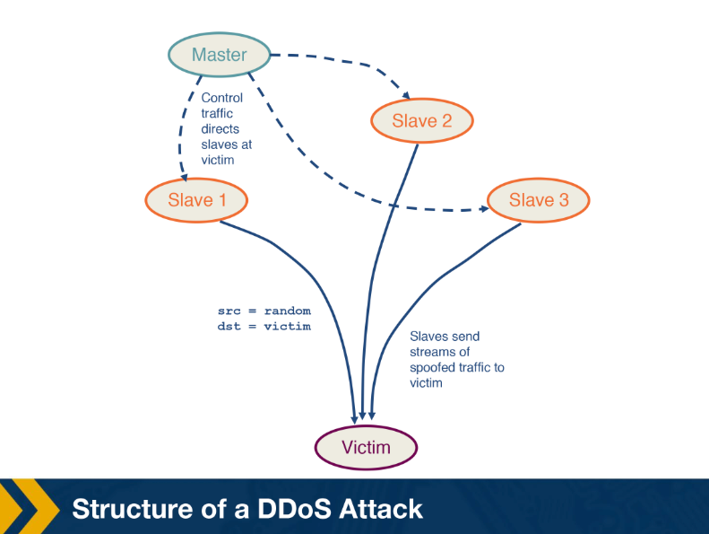

### Distributed Denial of Service (DDoS)

A DDoS attack compromises multiple flooding servers to overwhelm a victim with traffic.

- **DDoS structure**:
    - Attacker compromises and deploys flooding servers called **slaves**
    - A **master host** controlled by the attacker sends control messages to the slaves
    - Slaves send a high volume of traffic to the victim
    - Result: victim host becomes unreachable or its bandwidth is exhausted

- **Why DDoS is difficult to defend against**:
    - Slave packets contain spoofed source addresses, making it hard to track the slaves
    - Traffic originates from multiple sources, making it harder to isolate and block

### IP Spoofing

IP spoofing sets a false IP address in the source field of a packet to impersonate a legitimate server.

- **Type 1 – Spoofed source address**:
    - Source IP is set to a false address
    - Server responses are sent to another client instead of the attacker's machine
    - Results in wastage of network and client resources
    - Causes denial of service to legitimate users

- **Type 2 – Same source and destination address**:
    - Attacker sets the same IP address in both source and destination fields
    - Server sends replies to itself
    - Results in the server crashing

## DDoS: Reflection and Amplification
- Reflection attacks use third-party servers to redirect traffic toward a victim, and amplification increases the size of that traffic to overwhelm the victim further.

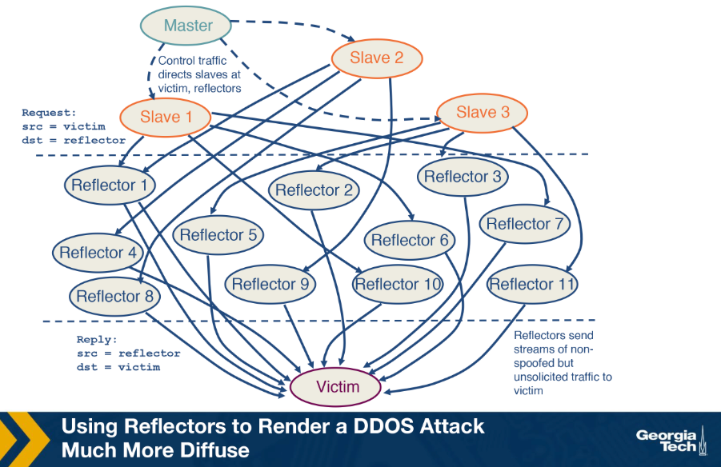

### Reflection Attacks

A reflection attack uses reflectors to initiate an attack on the victim instead of sending traffic directly.

- **Reflector**:
    - Any server that sends a response to a request
    - Examples: web servers, DNS servers responding with SYN ACK, query responses, Host Unreachable messages

- **Attack process**:
    - Master directs slaves to send spoofed requests to a large number of reflectors, typically around 1 million
    - Slaves set the source address of packets to the victim's IP address
    - Reflectors send their responses to the victim instead of the slaves
    - Victim receives responses from millions of reflectors, exhausting its bandwidth
    - Victim's resources are further wasted processing these responses, preventing it from handling legitimate requests

- **Contrast with conventional DDoS**:
    - In conventional DDoS, slaves send traffic directly to the victim
    - In reflection attacks, slaves send spoofed requests to reflectors, which then send traffic to the victim
    - Victim can identify reflectors from response packets, but reflectors cannot identify the slaves sending spoofed requests

### Amplification Attacks

Amplification extends reflection by choosing requests that cause reflectors to send large responses to the victim.

- **Reflection and amplification**:
    - Requests are chosen such that reflectors generate large responses
    - Victim receives both high-volume traffic from millions of servers and large individual response sizes
    - Combination makes it significantly harder for the victim to handle the attack

## Defenses Against DDoS Attacks
- Several tools exist to help mitigate or deter DDoS attacks, each with different trade-offs in effectiveness, scalability, and cost.
### Traffic Scrubbing Services

A scrubbing service diverts incoming traffic to a specialized server where it is filtered into clean and unwanted traffic.

- **Traffic scrubbing**:
    - Clean traffic is forwarded to its original destination after filtering
    - Offers fine-grained per-packet filtering
    - Limitations:
        - Monetary costs for subscription, setup, and recurring fees
        - Reduced effectiveness due to per-packet processing
        - Challenges handling Tbps-level attacks
        - Traffic rerouting may decrease performance and create susceptibility to evasion attacks

### ACL Filters

Access Control List filters are deployed by ISPs or IXPs at AS border routers to filter unwanted traffic.

- **ACL filters**:
    - Implementation depends on vendor-specific hardware
    - Most effective when hardware is homogeneous and filter deployment is automated
    - Limitations:
        - Limited scalability
        - Filtering does not occur at ingress points, so bandwidth to a neighboring AS can still be exhausted

### BGP Flowspec
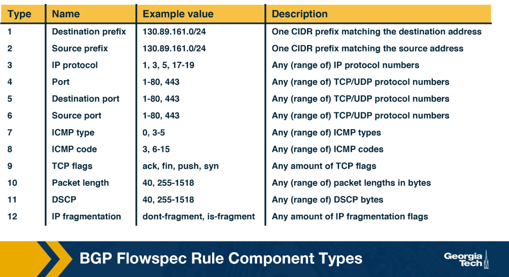

Flowspec is a BGP extension that deploys and propagates fine-grained filters across AS domain borders.

- **Flowspec capabilities**:
    - Matches packets in a specific flow based on parameters such as:
        - Source IP, destination IP, packet length, protocol, port
    - Can also match based on packet attributes like length and fragment, or drop rate limit
    - Possible actions: discard, rate limiting, redirecting, or filtering
    - Default action if no rule is specified: accept incoming traffic

- **Flowspec example**:
    - Filters all HTTP/HTTPS traffic from subnet 130.89.161.0/24 to Google server 172.217.19.195
    - Uses a traffic-rate action with value 0 to discard the traffic

- **Advantages over ACL filters**:
    - Leverages the BGP control plane, making it easier to add rules to all routers simultaneously

- **Limitations**:
    - Effective in intra-domain environments but not widely adopted in inter-domain environments
    - Depends on trust and cooperation among competitive networks
    - May not scale for large attacks with traffic from multiple sources, requiring multiple rules or prefix aggregation

## DDoS Mitigation Techniques: BGP Blackholing
- BGP blackholing is a DDoS countermeasure that drops all attack traffic to a targeted destination at a null location, stopping it closer to the source before it reaches the victim.

### Overview

Blackholing is implemented with the help of either an upstream provider or an IXP.

- **Blackholing provider**:
    - Responsible for providing the blackholing community that should be used
    - Network or customer providers act as blackholing providers at the network edge
    - ISPs or IXPs act as blackholing providers at the Internet core
- **Blackhole community attribute**:
    - A specific BGP community attribute tagged on blackhole messages
    - Differentiates blackhole messages from regular routing updates
    - Usually publicly available

### Blackholing with an Upstream Provider
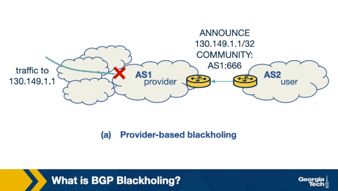

The victim AS communicates the attacked prefix to its upstream provider, which drops traffic toward that prefix.

- **Process**:
    - Victim AS announces a blackholing message to its upstream provider AS
    - Message contains:
        - The attacked host IP (e.g. 130.149.1.1/32)
        - Community field set to the provider's blackholing community (e.g. AS1:666)
    - Provider identifies the message as a blackholing message via the community field
    - Provider sets the next-hop of the attacked IP to a blackholing IP
    - All incoming traffic to the attacked host is dropped

### Blackholing with an IXP
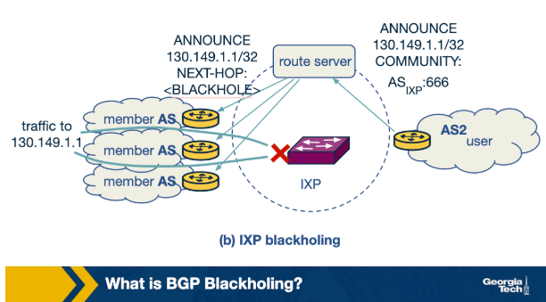

The victim AS sends blackholing messages to the IXP route server, which propagates the drop instruction to all member ASes.

- **Process**:
    - Victim AS connects to the IXP route server and sends a BGP blackholing message
    - Message contains:
        - The attacked host IP (e.g. 130.149.1.1/32)
        - Community field set to the IXP's blackholing community (e.g. ASIXP:666)
    - Route server identifies it as a blackholing message and sets the next-hop to a blackholing IP
    - Route server propagates the announcement to all connected IXP member ASes
    - All member ASes drop traffic toward the blackholed prefix
    - Null interface to which traffic is sent is specified by the IXP

## DDoS Mitigation Techniques: BGP Blackholing Limitations and Problems
- BGP blackholing drops all traffic including legitimate traffic to the attacked destination, and its effectiveness depends on peer participation.

### The Collateral Damage Problem

Blackholing makes the attacked destination unreachable to all users, not just attackers.

- **Without mitigation**:
    - Prefix 100.10.10.0/24 is advertised by AS1
    - A web service on IP 100.10.10.10 comes under attack
    - Network port in AS1 becomes overloaded, making the service unreachable to users from AS2 and AS3

- **With blackholing via IXP**:
    - AS1 sends a blackholing update to the IXP route server with prefix 100.10.10.10/32 and community IXP_ASN:666
    - Route server propagates the update to AS2 and AS3
    - AS2 accepts the announcement:
        - Next-hop IP for the attacked prefix is changed to the IXP's blackholing IP
        - All traffic via AS2 toward 100.10.10.10/32 is dropped, including legitimate traffic
    - AS3 rejects the announcement:
        - All traffic including attack and legitimate traffic continues to flow via AS3
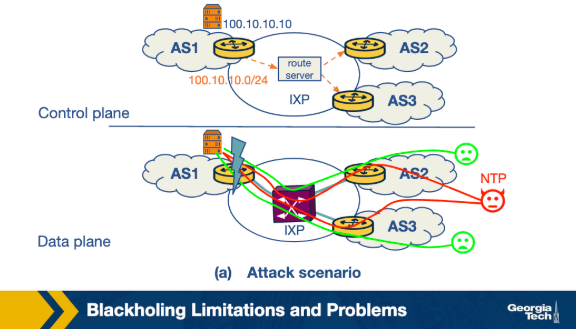
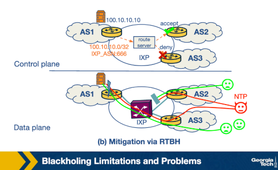
### Reasons for Ineffectiveness

Blackholing mitigation can fail or cause unintended harm under certain conditions.

- **Reasons an AS may reject a blackholing announcement**:
    - Voluntarily choosing not to participate in blackholing
    - Rejecting updates that require additional configuration changes
    - Misconfiguration

- **When mitigation fails**:
    - If majority of attack traffic flows through ASes that reject the announcement, mitigation is ineffective
    - Same outcome if a large number of peers do not accept blackholing announcements

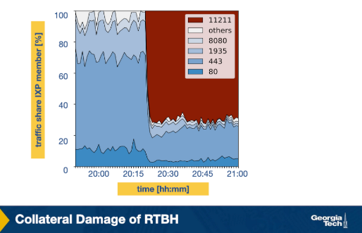
### Traffic Analysis at a Large IXP

Blackholing is a blunt instrument that drops all traffic, even when only a specific portion is malicious.

- **Traffic composition during an attack**:
    - Majority of traffic is web traffic on ports 80 (HTTP) and 443 (HTTPS)
    - Attack traffic originates primarily from UDP port 11211 and occupies approximately 70% of total traffic
    - Traffic pattern suggests an amplification attack

- **Ideal vs actual mitigation**:
    - Ideal: block only traffic from UDP port 11211 while allowing all other traffic
    - Actual: blackholing drops all traffic including legitimate traffic from other ports

