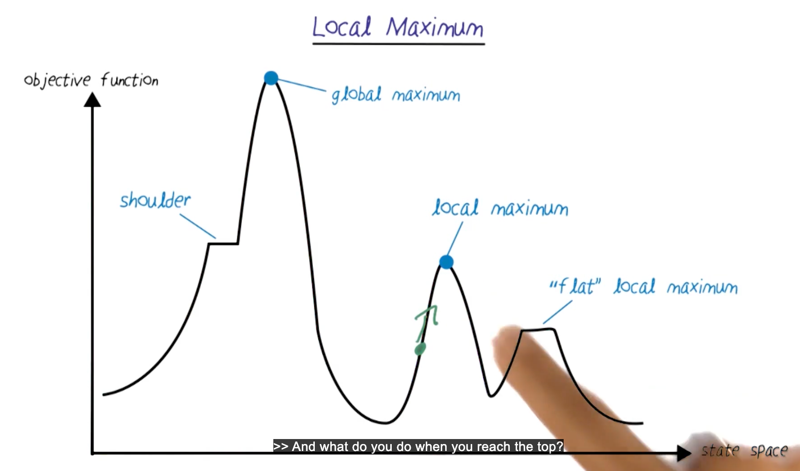
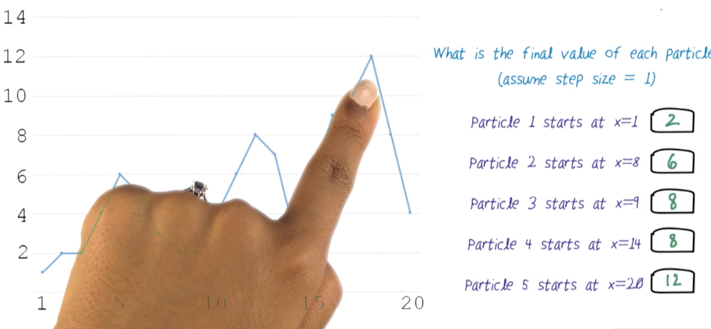
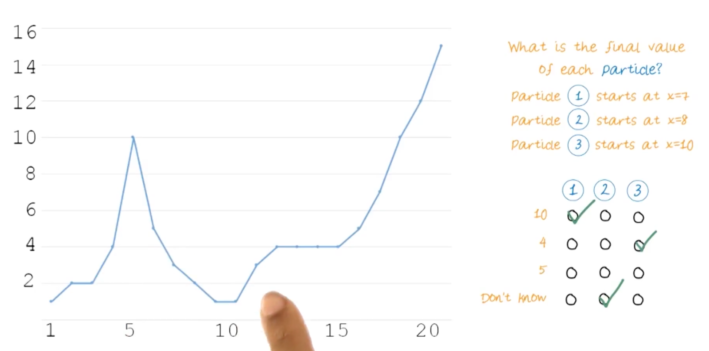
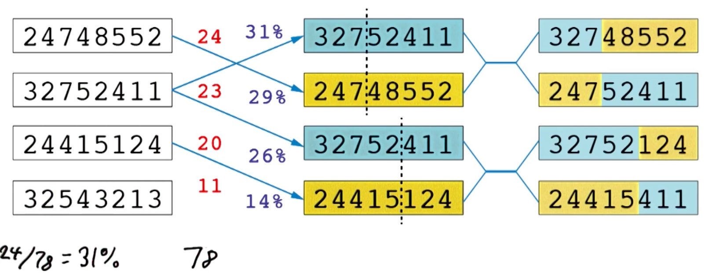
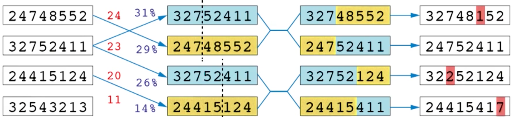
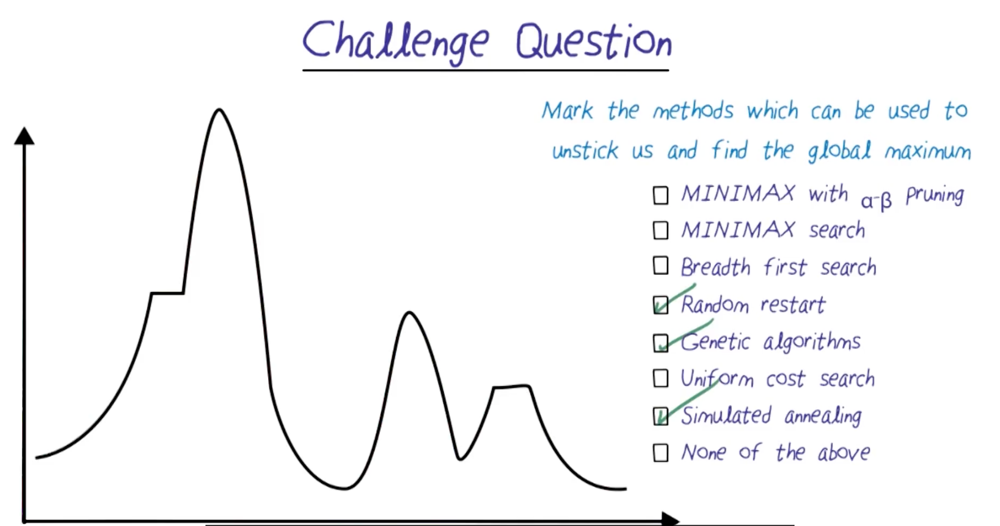

# Simulated Annealing

## Readings
Required
- None

Optional
- None

## Iterative Improvement Problems 1: Travelling Salesman Problem (TSP)
- Given a list of cities and the distances between each pair of cities, what is the shortest possible route that visits each city exactly once and returns to the origin city?
- First connect randomly, then see where the path cross
- If the path cross, then swap the two edges
- This will always reduce the total distance
- Do the process iteratively, until no more crossing

## Iterative Improvement Problems 2: 4 Queens/
- Place 4 queens on a 4x4 chessboard such that no two queens threaten each other
- Start with a random configuration
- Count the number of pairs of queens that are attacking each other
- Pick a queen and move it to a position that reduces the number of attacking pairs
- Repeat until no attacking pairs remain

## n-Queen Heuristic Function
- Same as above, but for n queens on an n x n chessboard
- What happens if there is no move that reduces the number of attacking pairs?
- 

## Hill Climbing/Local Maximum

- We want to get to actually global maximum
- Computer agent doesnt know where the global maximum is
- We can do random restart. Start from different random states, and do hill climbing from there
- Take the maximum of all the local maximums we found
- This is expensive, because we have to do hill climbing multiple times
- Taboo Search: keep track of previous states, and dont go back to them

What happens is steps is small and we're stuck at the shoulder/flat area?
- hill climbing may fail to move toward a better solution because it cannot detect an uphill direction, causing the algorithm to stall at a local maximum or plateau.
Then, why don't we just increase the step size?
- Increasing the step size can lead to overshooting the optimal solution, causing the algorithm to miss the peak of the hill and potentially oscillate around it without converging.
- Larger step sizes can also skip over narrow peaks or valleys, leading to suboptimal solutions.
- In certain situation, algo can go in infinite loop. Oscillate between two states of the same hill/peak
- What happen if it oscillate between two states?
  - We can start with large size, and gradually decrease the step size
  - This is called SIMULATED ANNEALING

## Hill Climbing Quiz


## Hill Climbing Quiz 2

- We don't know for particle 2(start at 8) because the step size is 2. It steps over the peak, and keep oscillating between 4 and 6.

## Annealing
- External conditions allow molecules to move around
- When mobility slows down, molecules settle into a low-energy configuration
- Often these results in a regular patters like mud cracks, crystal structures, honeycombs, columnar basalts

## Simulated Annealing
```python
for t=1 to infinity:
    T = schedule(t)
    if T = 0, then return current state
    next <- a randomly selected successor of current
    if delta_E > 0, then current -> next
    else current <- next with probability e^(delta_E/T)
```
- We start with T high, and gradually decrease T
- When T is high, we have lot of randomness, and we can explore the state space
- Ability to escape local maximum
- The next point that's fixed random can make it move down the slope and make sure we get off the local maximum
- We never want T to be zero, causing undefined answer
- When T is small, we are more likely to go uphill
  - `e^(delta_E/T) = e^(-1/0.01) = e^(-100) = 0`
- We'll keep generating new random positions until we find one that gives better e
- We just slowly change T from very large, where we're going to move over the graph randomly, to very small where we're going to move uphill to the peak 
- If we happen to stuck at plateau and delta_E = 0, that makes the equation to be 1, so we always move 
- Guaranteed to converge to the global maximum if:
  - Start T high
  - T decreases slowly enough

## Local Beam Search
- Instead of using one position, we use k positions
- At each timeframe, we generate randomly generated neighbor of these k positions
- Keep the k-best one for the next iteration
- If any of the k positions is the goal, then we're done
- Not like random restart, because we are comparing the neighbours of all k positions

Stochastic beam search
- Same thing
- But success is chosen based on randomness, not just based on their fitness to not get stuck at the local maximum


## Genetic Algorithm
- 8-queens problem
- 28 possible pairs of queens that can attack each other
- 8! / (8-2)! * 2! 
- Fitness function = 28 - number of attacking pairs
- When the fitness function is 28, then we have a solution

Four random boards
- 24748552 - 4 attacking pairs - 28 - 4 = 24 = normalized fitness = 24/78 = 0.3077
- 32752411 - 5 attacking pairs - 28 - 5 = 23 = 23 /78 = 0.2949
- 24415124 - 8 attacking pairs - 28 - 8 = 20 = 20 / 78 = 0.2564
- 32543213 - 17 attacking pairs - 28 - 17 = 11 = 11 / 78 = 0.1410



- The one with more attacking queens has lower fitness, thus less likely to be chosen
- The ones with higher fitness are more likely to be chosen

## GA Mutation
- What if there's a critical part of the solution is none of the parents?
  - More randomness, just like biology, we have mutations
  - For each digit, we going to have a small digit chance of mutation to a random number
- This mutation step is like ocassionally choosing a random direction in simulated annealing or randomness in stochastic beam search
- Given enough generation, we will eventually find the solution
- 


## GA crossover quiz


## Challange Question


##

##

