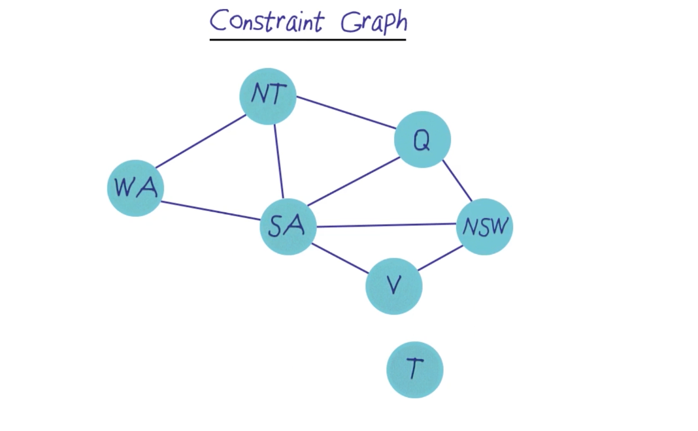
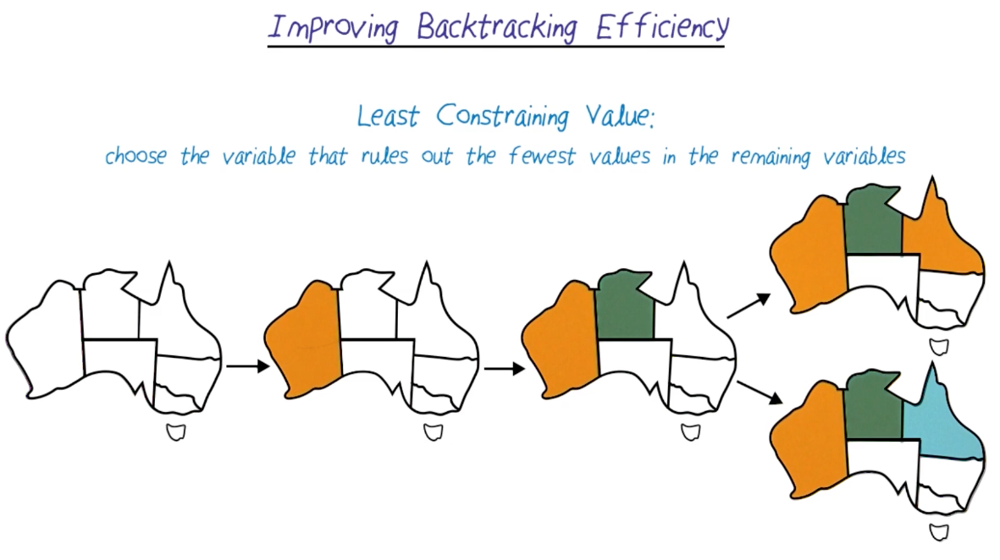

# Constraint Satisfaction Problems

## Readings
week 5:
- Chapter 6 "Constraint Satisfaction Problems" AIMA
- R&N slides on Constraint Satisfaction Problems (https://gatech.instructure.com/courses/478222/files/63899645/download)

## Atlanta is home to the busiest airport in the world. 
- How do they schedule all those flights? Runways put out planes every 30 seconds
- Above is an example of a constraint satisfaction problem (CSP)

## Map Coloring
- 
- A solution is an assignment of colors to each region such that no two adjacent regions have the same color

## Constraint Graph
- Unary constraints restrict the value of a single variable
- Binary constraints restrict the values of, at most, two variables
- We can represent those with a constraint graph
- 
- Nodes are variables, like, WA, NT, Q, NSW, V, SA, T
- Arc shows the constraint between the variables
- We can apply general purpose CSP algo to speed up search for an answer

## Constrain Types
- Besides unary and binary constraints, we could havve involve 3 or more variables 
- or soft constraints, like the fact i prefer to teach on a Tuesday/Thursday schedule
- Problems with preference constraints are called "Constraint Optimization Problems"
  - Solved with linear programming
- Many other CSPs
  - Sudoku
  - Car assembly
  - Class assembling
  - Floor planning
  - Transportation scheduling

## Backtracking Search
- Backtracking Search is "stupidest" method to CSP
- More like brute force search
- Assign a value to a variable, check if it is consistent with the constraints
- If it is consistent, assign a value to the next variable
- If it is not consistent, backtrack to the previous variable and assign a different value

## Improving backtracking search efficiency
- Choose Least Constraining Value
  - 
  - Choose the value that rules out the fewest values in the remaining variables
  - In the above example, we choose orange for Queensland, because it leaves more options for New South Wales
- Choose Minimum Remaining Values
  - 
  - Choose the variable with the fewest legal values
  - In the above example, after WA and NT are assigned, we choose SA next because it has only 2 legal values left
  - What if there is a tie?
    - Choose the variable with the most constraints on remaining variables or see next;
- Choose Degree Heuristic
  - 
  - Choose the variable involved in the largest number of constraints on other unassigned variables
  - In the above example, when there is a tie between WA and Queensland, we choose Queensland because it is connected to more unassigned variables
  - WA is less constraining

## Forward Checking
- For each unassigned variable, keep track of remaining legal values
- If we ever make a decision that leaves any unassigned variable with no legal values, we backtrack immediately
- Example
- 
- We're stucked at step 4, so we backtrack, or....
- We could've stop our search earlier by

## Constraint Propagation and Arc Consistency
- At step 3, we say NT and SA are light blue, but they are adjacent!
- We could use constraint propagation repeatedly to enforce all the local constraints
- We can use Arc Consistency, a simple version of constraint propagation, to do that
- **A variable, and a csp is arc-consistent with respect to another variable if there is some value for the second variable, after we assign a value to the first variable**
- **If all variables in the graph satisfy this condition, the whole graph is arc-consistent**
- Example
  - 
  - We choose green for Queensland
  - We remove green from SA, NT, NSW
  - Then we propagate the constraint, 
    - Since SA has only blue option left, we look at NT and NSW
      - At NSW, we remove blue, now NSW can only be orange and look at adjacent territory V
        - At V, we remove orange from V
      - At NT, since it can only be blue, and now SA can only be blue, we have a conflict!
  - So, we need to backtrack and change different color for Queensland

## Structured CSPs
- 
- Another powerful trick is to look at the structure of the constraint graph and see if we can decompose it into smaller subproblems
- For example,
  - Tasmania is disconnected from the rest of the graph, so we can solve it separately
- Even better if we have CSP with no loop,
  - We can solve the problem in O(nd^2), instead of O(d^n)
  - Pick any root in the tree, and choose ordering of the variable such that each variable appeared after its parent in the tree
- 
- Sometimes, we can condition a problem by assigning values to some variables to break all the loops in the graph, improving the efficiency 
- n the Australia CSP problem, we can pick SA as the root, and remove from the graph. Then it becomes a tree
- 

## Iterative Algorithms
- Works when there are many solutions and when they are very few
- 
- However, there are problems with the number of constraints versus the number of variables hit a critical ratio
- Then the problem becomes very hard to solve