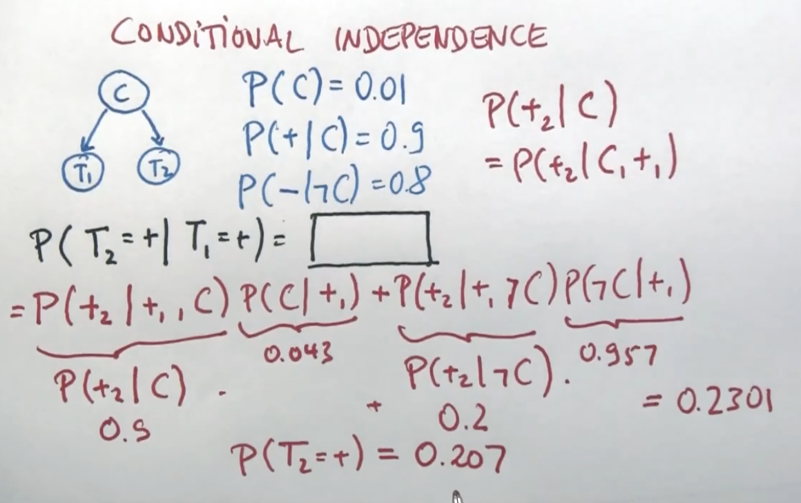
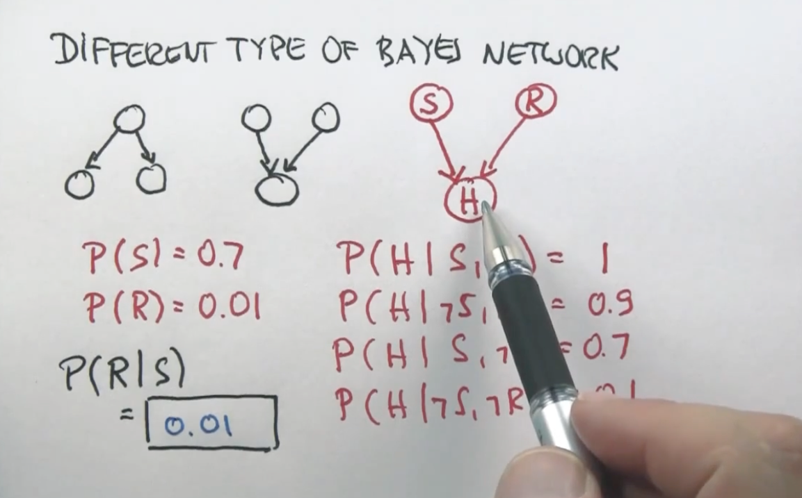
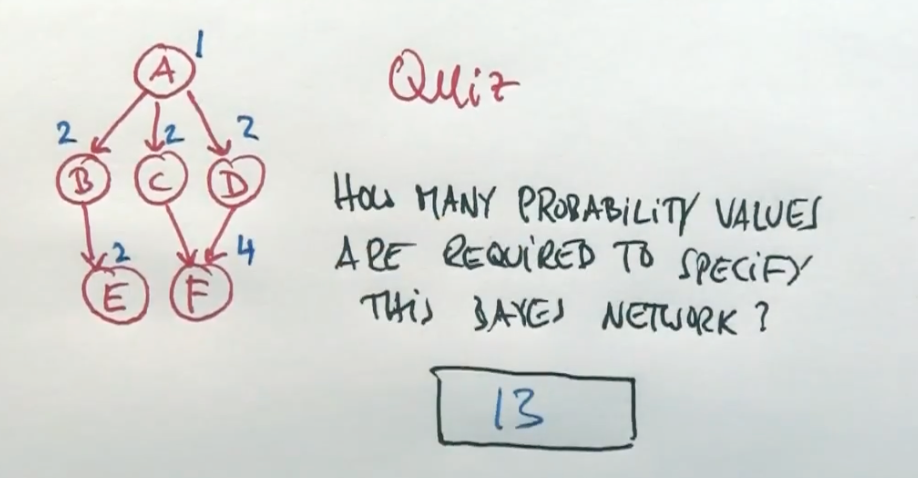
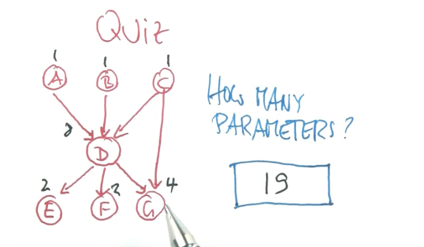
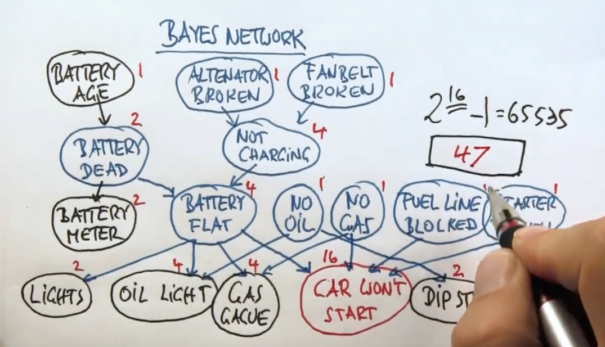
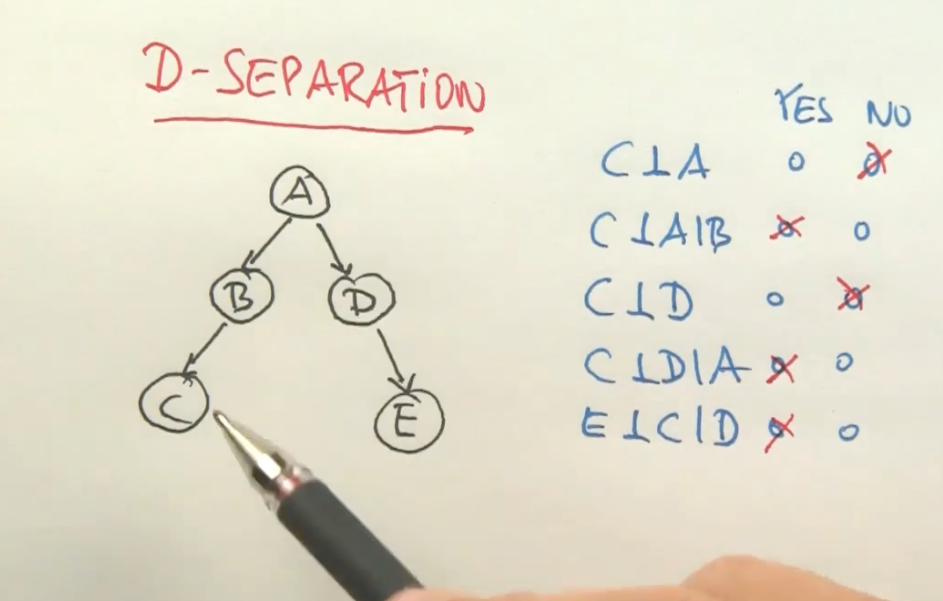
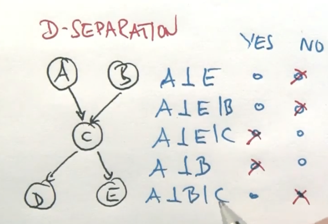
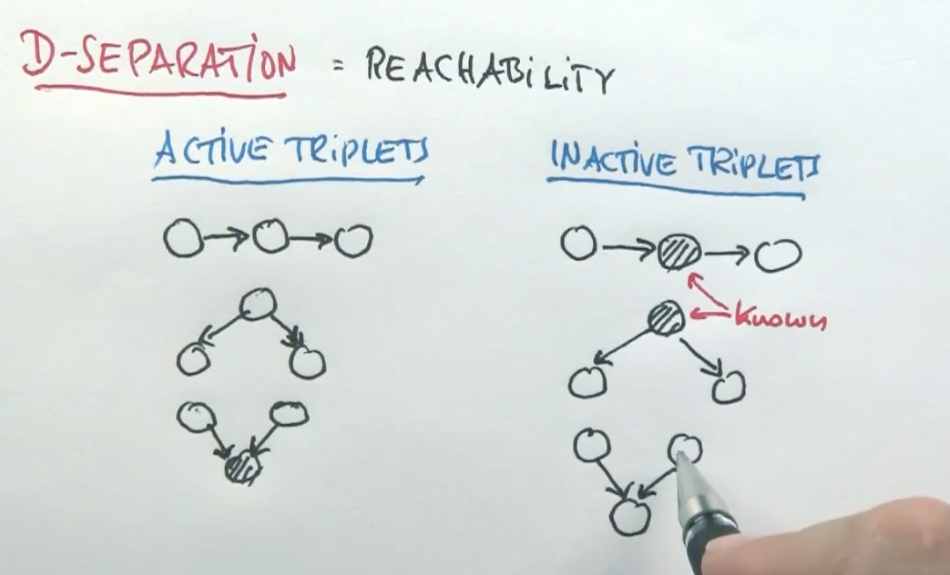
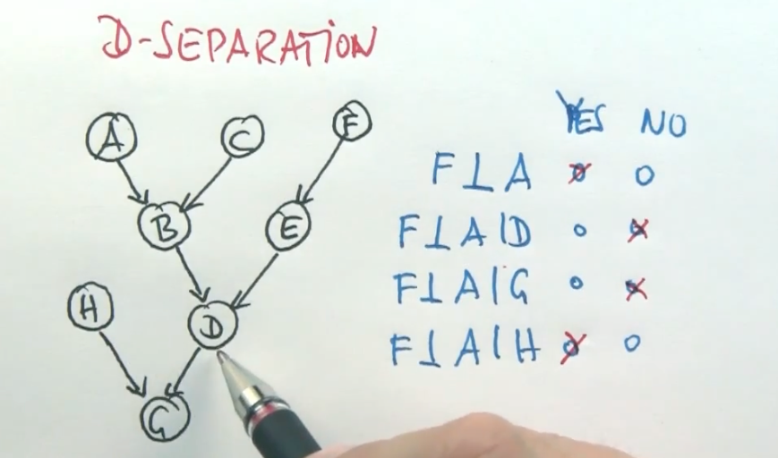

# Probability

## Readings
week 6:
- Chapter 12: AIMA AIMA
- R&N slides on Probability (https://gatech.instructure.com/courses/478222/files/63899987/download)

## Bayes Network
- A (not observable) -> B (observable)
- P(A) -> P(B|A) P(B|!A)
- How many parameters do we need to specify this distribution?
- P(A) = 1 parameter
- P(B|A) = 1 parameter
- P(B|!A) = 1 parameter
- Total = 3 parameters
- 
## Markov Blanket
- The Markov blanket of a node is the set of nodes consisting of its parents, its children, and any other parents of its children.

## Computing Bayes Rule
- $P(A \mid B) = \frac{P(B \mid A) \cdot P(A)}{P(B)}$
- $P(!A \mid B) = \frac{P(B \mid !A) \cdot P(!A)}{P(B)}$

- $P(A \mid B) + P(!A \mid B) = 1$

- $P'(A \mid B) = P(B \mid A) \cdot P(A)$
- $P'(!A \mid B) = P(B \mid !A) \cdot P(!A)$

- $P(A \mid B) = \eta(normalizer) \cdot P'(A \mid B)$
- $P(!A \mid B) = \eta(normalizer) \cdot P'(!A \mid B)$
- $\eta = \frac{1}{P'(A \mid B) + P'(!A \mid B)}$

##  Two Test Cancer Example 1
- P(C) = 0.01
- P(+|C) = 0.9
- P(-|!C) = 0.8

- P(!C) = 0.99
- P(-|C) = 0.1
- P(+|!C) = 0.2

- P(C|T1=+, T2=+) = P(C|++) = ?

| | prior | + | + | P' |
|------|-------|------|------|------|
| C | 0.01 | 0.9 | 0.9 | 0.0081 |
| !C | 0.99 | 0.2 | 0.2 | 0.0396 |

- P(C|++) = 0.0081 / (0.0081 + 0.0396) = 0.1698
- P(!C|++) = 0.0396 / (0.0081 + 0.0396) = 0.8302

##  Two Test Cancer Example 2

- P(C) = 0.01
- P(+|C) = 0.9
- P(-|!C) = 0.8

- P(!C) = 0.99
- P(-|C) = 0.1
- P(+|!C) = 0.2

- P(C|T1=+, T2=-) = P(C|+-) = ?

| | prior | + | -   | P'     |
|------|-------|------|-----|--------|
| C | 0.01 | 0.9 | 0.1 | 0.0009 |
| !C | 0.99 | 0.2 | 0.8 | 0.1584 |

- P(C|+-) = 0.0009 / (0.0009 + 0.1584) = 0.00568181818
- P(!C|+-) = 0.1584 / (0.0009 + 0.1584) = 0.99431818181

##  Conditional Independence
- P(T2|C,T1) = P(T2|C)
- Given C, T1 does not provide any additional information about T2
- Consider the graph 
- C -> T1, C -> T2
- If we know C, T1 and T2 are independent

- Given graph A -> B, A -> C
- Given A, B and C are independent
- Is (B ind C | A) == B ind C? **No**

- P(C) = 0.01
- P(+|C) = 0.9
- P(-|!C) = 0.8
- What is P(T2+|T1+) = P(+|+) = ?
- 

- A⊥B⇒A⊥B∣C? False
- A⊥B∣C⇒A⊥B? False

- 0.01 because R and S are independent

##  Explaining Away
- Take a look at happy, raise and sunny above
- If my wife sees that I am happy, she may infer that it's sunny outside
- If she then sees that it is not sunny, she may infer that I am happy because I got a raise
- If we see a certain effect that could be caused by multiple causes, seeing one of the causes can explain away any other potential causes
- What is P(R|H,S) = ? = **0.0142**
- P(H|R,S) P(R|S) / P(H|S)
- P(H|R,S) P(R) / P(H|R,S) P(R) + P(H|!R,S) P(!R)
- 1 * 0.01 / 1 * 0.01 + 0.7 * 0.99 = 0.0142

##  Explaining Away 2
- What is the P(R|H) = ?
- P(H) = P(H|S,R) P(S,R) + P(H|S,!R) P(S,!R) + P(H|!S,R) P(!S,R) + P(H|!S,!R) P(!S,!R)
- P(H) = 1*0.7*0.01 + ...  = 0.5245

- P(H|R) = P(H|R,S) P(S) + P(H|R,!S) P(!S) = 1 * 0.7 + 0.9 * 0.3 = 0.97

- P(R|H) = P(H|R) P(R) / P(H) = 0.97 * 0.01 / 0.5245 = 0.0185

##  Explaining Away 3
- What is P(R|H,!S) = ? = 0.0833
- P(R|H,!S) = P(H|R,!S) P(R|!S) / P(H|!S) = 0.9 * 0.01 / P(H|!S,R)P(R) + P(H|!S,!R)P(!R)
- P(R|H,!S) = 0.009 / 0.9 * 0.01 + 0.1 * 0.99 = **0.0833**

## Conditional Dependence  
- S -> H <- R
- P(R|H,S) = 0.0142
- P(R|S) = 0.01
- P(R|H,!S) = 0.0833
- In the absence of H, probability of R is independent of S, P(R|S) = P(R)
- R ind S
- However, if we know H, then R and S are dependent, P(R|H,S) != P(R|H)
- A knowledge of H makes 2 variable, that were previously independent, non-independent
- Two variables that are independent may not be, in certain cases, conditionally independent
- Independence DOES NOT imply conditional independence

##  General Bayes Networks
- Bayes networks define probability diestributions over graphs or random variables
- A -> C, B -> C, C -> D, C -> E
- P(A), P(B), P(C|A,B), P(D|C), P(E|C)
- P(A,B,C,D,E) = P(A) P(B) P(C|A,B) P(D|C) P(E|C)
- The joint distribution over any 5 variables requires 2^5 - 1 = 31 parameters
- P(A) = 1 parameter
- P(B) = 1 parameter
- P(C|A,B) = 4 parameters, combination of A and B
- P(D|C) = 2 parameters combination of C
- P(E|C) = 2 parameter combination of C
- Total = 10 parameters

- 65535 vs 47 structured parameters

## D Separation 1

- C is not independent of A, infact A influcnes C by virtue of B
- If we know B, which means the only determinate into C is B
- If you know B for sure, then knowledge of A won't really tell you anything about C
- C is also not independent of D, just the same way C is nto independent of A
- But if I do know A, then it's hard to imagine how knowledge of D would help me with C
- If we know D, E and C are independent

## D Separation 2
- Any 2 variables are independent if they are are not linked by just ubnkown variable
- If we know B, everything downstream of B is independent of everything upstream of B
- However, knowledge of B does not render A and E are independent

- A ind B givem C, is known as EXPLAIN AWAY EFFECT
- If we know C to be true true, then knowledge of A will substantially affect what wwe believe about B
- If there's 2 joint causes for C and we happen to know A is true, we will discredit cause B
- IF there's 2 joint causes for C and we happen to know A is false, we will increase our belief in B

## D Separation 3

##  

## 