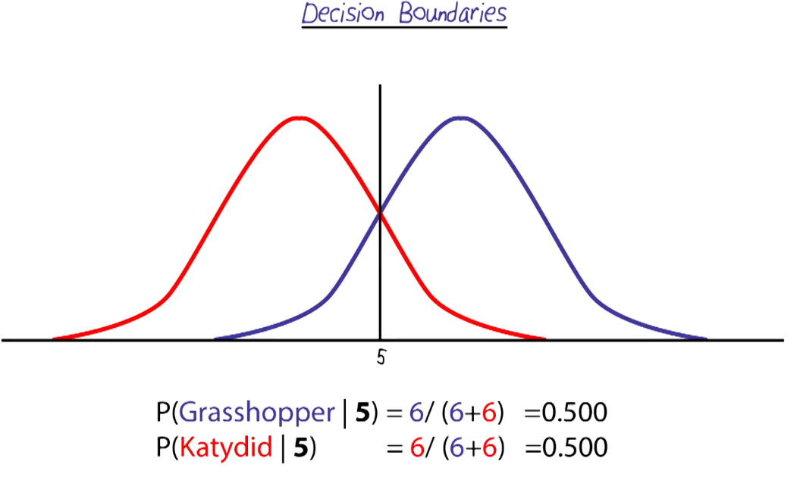

# Machine Learning

## Readings
- Read AIMA: Chapter 19.1-19.5, 19.7, 20.1-20.2
- R&N slides on Learning from Observation: Decision Trees (18.1-18.3); http://www.cc.gatech.edu/~thad/6601-gradAI-fall2015/chapter18.pdf  
- R&N slides Statistical Learning (20.1-20.2) https://faculty.cc.gatech.edu/~thad/6601-gradAI-fall2015/chapter20a.pdf

- On Campus sides: https://faculty.cc.gatech.edu/~thad/6601-gradAI-fall2015/decision-trees.pdf

## K-Nearest Neighbors (KNN)
- 
- KNN is based on the idea that similar examples should have similar classifications.
- To classify a new instance, KNN looks at the 'k' closest training examples in
- Try multiple values of k and see which one works best on a validation set.

## Cross Validation
- Often a researchers spend a lot of time to make recognizer only to find out the data does not represent the problem
- Use 80% of data for training, and 20% for testing to avoid overfitting
- With k = 1 and training and testing on same data, accuracy is 100% but it is not a good model
- Always choose randomly chosen training and testing data to avoid bias
- Shark example:
- 

Steps:
1. We select 80%, and 20% randomly
2. For each example in the 20% independent test est, we compare it to training data
3. Sicne we use k = 3, we find 3 nearest neighbors
4. We label each test example based on majority vote of its neighbors and compare to actual label
5. Then, we calculate percentage correct and report the accuracy
6. Not done yet, we could've gotten lucky
7. Repeat the process multiple times with different random splits of training and testing data
8. 100 iterations, and average the accuracy over all iterations to get a better estimate of true accuracy

- If we dont know the value of K, we can use cross validation to find the best K
- K = 1, 100 iterations, then do the same for K = 2,3,..., do cross validations
- Then, choose the K with the highest average accuracy

Netflix prize (Million dollar prize to improve movie recommendation system):
- Use the same strategy we talk about above 
- Netflix has millions of dataset, what if we have few? Do leave-one-out cross validation
- LOOCV, Leave one out for cross-validation
- Training on 8, test on 2 leaves 10 choose 2 possibilities which is 45
- If we are using KNN, and if we see a huge difference in K = 10 and K = 11, there is a problem with data

Quiz: 

- Not A because we might be lucky with training and testing data

## Gaussian Distribution
- The bell curve, also known as normal distribution

## Central Limit Theorem
- Very loosely, if we have enough independent random variables, their sum tends toward a Gaussian distribution
- If we have enough factors influencing students grade, the distribution of grades will be Gaussian

## Pattern recognition with Gaussion Distribution
- 
- 
- 
- 
- Suppose I get an insect with length of 3 units, is it a grasshopper or katydid?
- Probably a grasshopper because the height of the blue curve at 3 is higher than the height of the red curve at 3
- The formula for P(X) is given by:
$$
P(X) = \frac{1}{\sigma \sqrt{2\pi}} \, e^{ -\frac{(X - \mu)^2}{2\sigma^2} }
$$
 

## Decision Boundaries
- What happen if x falls when X and Y have the same probability?
- 
- Anythihng on the left is classified as katydid, anything on the right is grasshopper
- 
- Both red and blue have the same mean, but different variances
- The one with lower SD is skinnier (red)
- On either side of the middle, the fatter one has higher probability and wins

## RECOGNITION QUIZ:
Given data consisting of 10% positive examples and 90% negative examples, should i believe that a recognizer that works 90% of the time is working?
- No, It is possible that the recognizer does really well on the negative examples, or even blindly predicts everything to be negative!
- This doesn't say anything conclusive about how it might work on the positive examples, and we can't be sure about its overall performance.

## Error
- WE can use graph to visualize error
- 
- To the left of decision boundary, we could measure error by integrating right gausion from -ve infinity to boundary
- Let's reimagine above as graph of mosquito carrying dengue fever (red) and NOT carrying dengue fever (blue)
- We want to spray pesticide only on mosquitos carrying dengue fever
- We want to error on the side of caution, we want to minimize false negatives (blue area on right)
- We can move the decision boundary to the right, reducing errors
- But how much can we move it? WE can weight our decision based on cost of errors

## Bayes Classifier 
$$
P(C_j \mid d) = \frac{P(d \mid C_j) \cdot P(C_j)}{P(d)}
$$

# BAYES QUIZ:
- Which is more likely, Drew is a male or female? 
- 

## Naive Bayes
- Assuming all features are independent, we can represent the problem as Bayes Nets
- The features are conditionally independent given the class
- We are assuming that each class has different distribution for the features
- Thus we can model a net such that C_j is at the top, with arrows pointing to each feature
- Because the class is the cause and feature distrbutions are the effects
- 
- 
- We can represent any Naive Bayes classifier in this sort of general framework witht he class pointing to the features

## Maximum likelihood
- Assume that all classes are equally likely, the one that maximize the equation is the one we assign the data
- Why we say all classes are equally likely? Because we dont trust and dont have any prior knowledge about the classes
- 

## NAIVE BAYES QUIZ: 

## No free lunch
- There is no one learning algorithm that is best for all problems
- Wolpert McReady: for any algorithm, any elevated performance over one class of problems is offset by performance of another class

## Naive Bayes VS KNN
- Shark bites problem: 
- 
- THe border between classification depends on the noisiness of data of the shark bites

- Mixture of Gausians to tackle the issue
- 
- Kernel Density Estimation: In between two extremes, we could use fewer Gaussians which would cause the decision boundary to be smooth, but still give good continous estimates for each class
- We could use cross Validation to find the best number of Gaussians to use
- 

## Generalization 
- We need to find a method that classifies data with the highest accuract, doesnt overfit, and generalize well with our training data to our unseen data without losing its discriminative power
- How do we choose methods in Machine Learning?

## Visualization
- One of the first things to do is to visualize the data
- if most of the classes from balls of data without many concavities, gaussian methods would work well
- if there are situations where classes interpenetrate but still have distinct boundaries, KNN or the Kernel methods would work well
- Sometimes data is high dimensional that it's hard to visualize
- For those methods, we could use decision trees and boosting methods
- 

##

##

##

##

##

##

##

