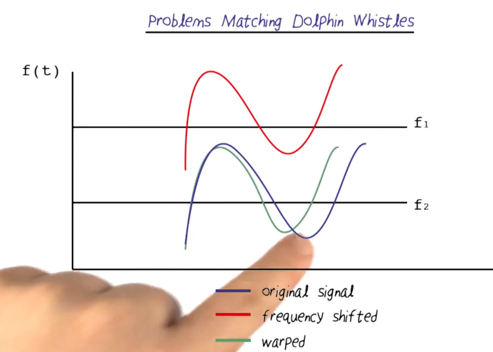
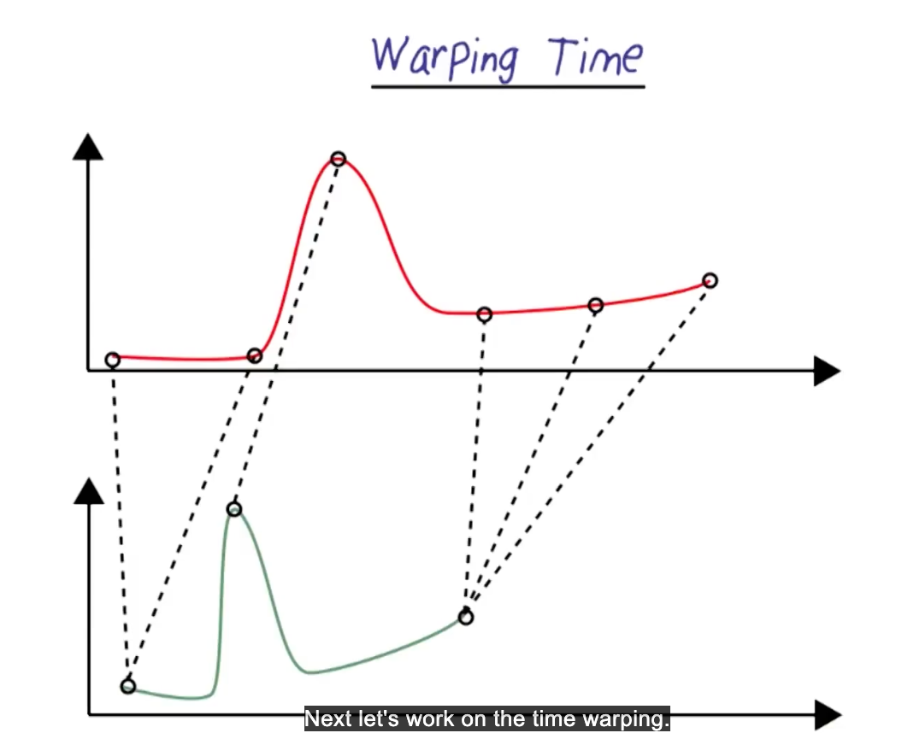
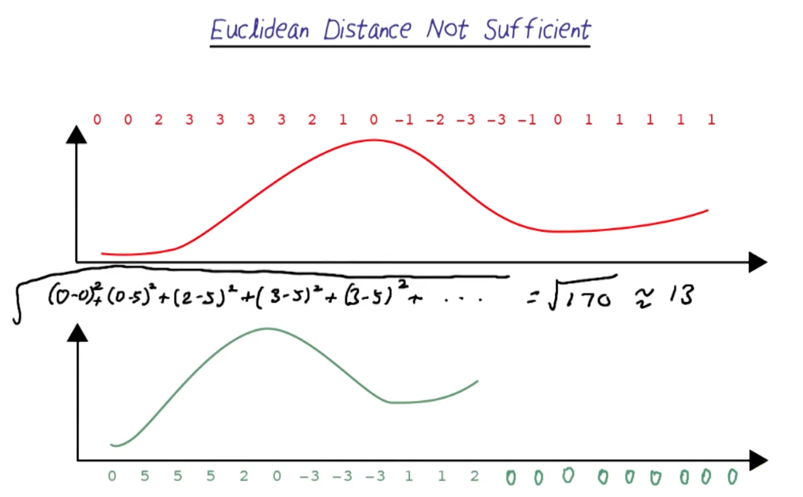
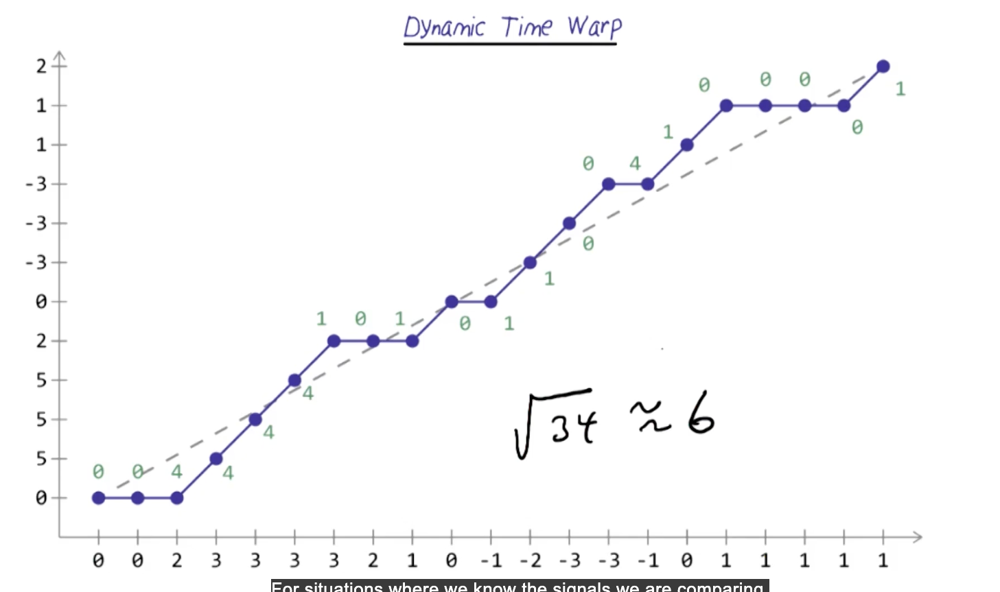
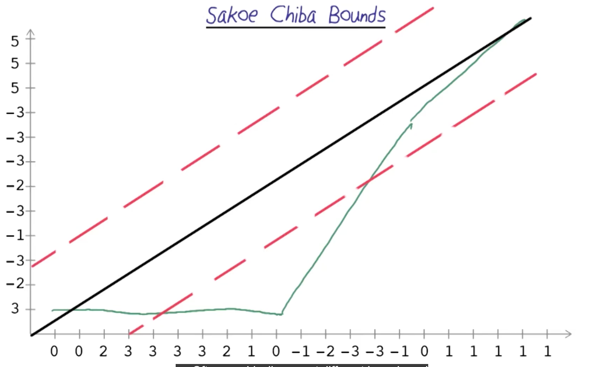
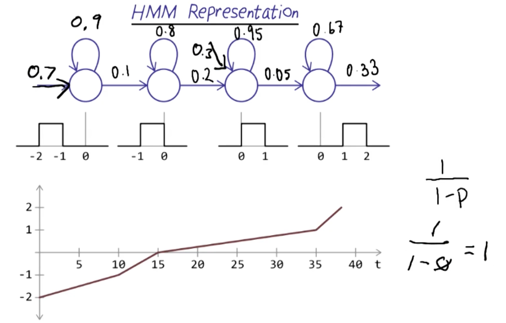
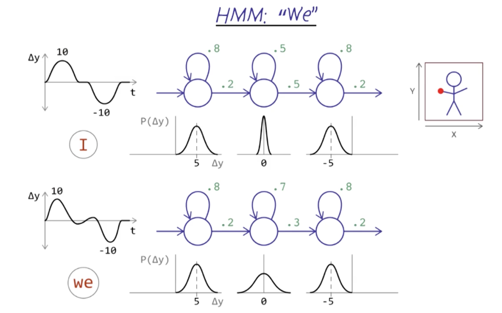
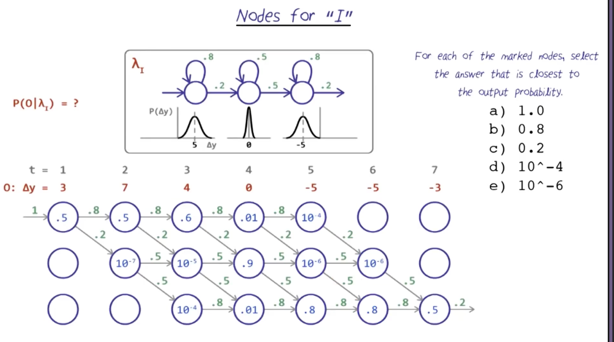
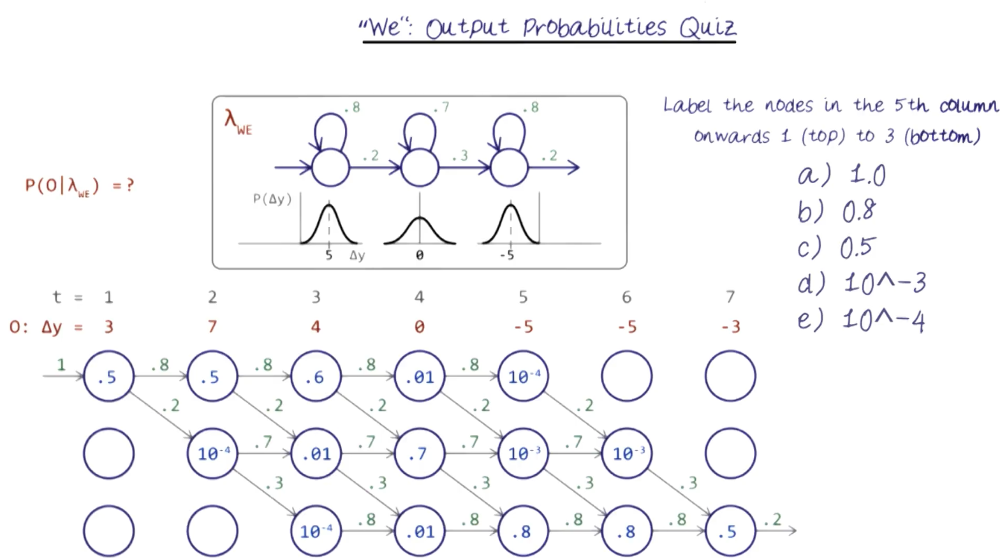
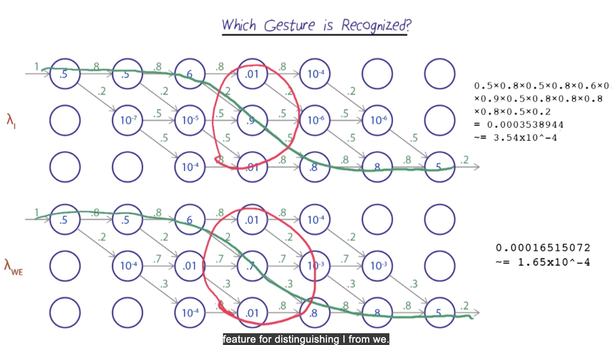

# Machine Learning

## Readings
- AIMA: Chapter 14 (3rd edition: Chapter 15)
- R&N slides for Temporal probability models: HMMs and Kalman filters

## Dolphin Whistle
- Whistles are the easiest to see in a spectrogram, compared to burt pulses and echo location
- Tend to range between 5 kHz and 17 kHz
- 5khz and below mostly ships
- OUr task is to recognize classes of whistles so that our marine mammal researchers

- Problems with Matching Dolphin Whistles

- Below will help recognizer to handle the whistle no matter what freq we start at
- Need to work on time warping, where we can stretch and compress the time axis to get a better match

## Euclidean Distance Not sufficient

- Now let's try dynamic time warping (DTW)

## Dynamic Time Warping
- Align two signals we try to compare, allowing for some stretching and compressing of the time axis
- Short one in on y-axis, the long one on x-axis

- For first 0, both are 0, so cost is 0
- For second 0, short is 5 but long is 0, do we do 5 or 0? We take the min cost path, which is 0
- For 2, short is 5 but long is 2, better we stay at 9
????

## Sakoe Chiba Bounds
- We won't allow matches outside a certain band around the diagonal
- 
- This would cause the matches to be worse
- We could try to have different Sakoe China Bounds for each section of the signal, but it's difficult to train

##  Hidden Markov Models (HMM)
- HMM are a vriant that are used for recognition of many types of signals that have a language-like structure
- We dont necessarily know which state matches which physical evenet
- Instead each state can yield certain output, we observe that output over time and determine a sequence of states based on how likely they were to produce that output
- Use to recognize speech, handwriting, gestures

## HMM Representation
- Below is left to right HMM, we never go back to a previous state
- 
- 0.1: spent 10 frames in state 1 before going to state 2, 1/10
- 0.9: 1-0.1 = 0.9
- 0.2: spent 5 frames in state 2 before going to state 3, 1/5
- 0.8: 1-0.2 = 0.8
- 0.05: spent 20 frames in state 3 before going to state 4, 1/20
- 0.95: 1-0.05 = 0.95

## Sign Languange Recognition with HMMs

HMM: "I" vs "WE

##  Viterbi Trellis: "I" vs "WE" QUIZ
- To see how likely each model generated samples in O, highest probability give us the proper match

- What is nodes at t = 5?

- What is nodes at t = 5, 6, 7?

## Which gesture is recognized?

- With "I", getting 0 in the middle state is higher at 0.9, with "WE" it's 0.7
- With "I", the transition probabilities for middle state is 0.5, with "WE" it's 0.3
- This shows how HMM can distinguish between two gestures
- 

## 

## 

## 

## 

## 

## 

## 

## 

## 

## 

## 

## 

## 

## 

