# Machine Learning

## Readings
- AIMA: Chapter 14 (3rd edition: Chapter 15)
- R&N slides for Temporal probability models: HMMs and Kalman filters

## Dolphin Whistle
- Whistles are the easiest to see in a spectrogram, compared to burt pulses and echo location
- Tend to range between 5 kHz and 17 kHz
- 5khz and below mostly ships
- OUr task is to recognize classes of whistles so that our marine mammal researchers

- Problems with Matching Dolphin Whistles

- Below will help recognizer to handle the whistle no matter what freq we start at
- Need to work on time warping, where we can stretch and compress the time axis to get a better match

## Euclidean Distance Not sufficient

- Now let's try dynamic time warping (DTW)

## Dynamic Time Warping
- Align two signals we try to compare, allowing for some stretching and compressing of the time axis
- Short one in on y-axis, the long one on x-axis

- For first 0, both are 0, so cost is 0
- For second 0, short is 5 but long is 0, do we do 5 or 0? We take the min cost path, which is 0
- For 2, short is 5 but long is 2, better we stay at 9
????

## Sakoe Chiba Bounds
- We won't allow matches outside a certain band around the diagonal
- 
- This would cause the matches to be worse
- We could try to have different Sakoe China Bounds for each section of the signal, but it's difficult to train

##  Hidden Markov Models (HMM)
- HMM are a vriant that are used for recognition of many types of signals that have a language-like structure
- We dont necessarily know which state matches which physical evenet
- Instead each state can yield certain output, we observe that output over time and determine a sequence of states based on how likely they were to produce that output
- Use to recognize speech, handwriting, gestures

## HMM Representation
- Below is left to right HMM, we never go back to a previous state
- 
- 0.1: spent 10 frames in state 1 before going to state 2, 1/10
- 0.9: 1-0.1 = 0.9
- 0.2: spent 5 frames in state 2 before going to state 3, 1/5
- 0.8: 1-0.2 = 0.8
- 0.05: spent 20 frames in state 3 before going to state 4, 1/20
- 0.95: 1-0.05 = 0.95

## Sign Languange Recognition with HMMs

HMM: "I" vs "WE

##  Viterbi Trellis: "I" vs "WE" QUIZ
- To see how likely each model generated samples in O, highest probability give us the proper match

- What is nodes at t = 5?

- What is nodes at t = 5, 6, 7?

## Which gesture is recognized?

- With "I", getting 0 in the middle state is higher at 0.9, with "WE" it's 0.7
- With "I", the transition probabilities for middle state is 0.5, with "WE" it's 0.3
- This shows how HMM can distinguish between two gestures
- 

## New Observation Sequence QUIZ

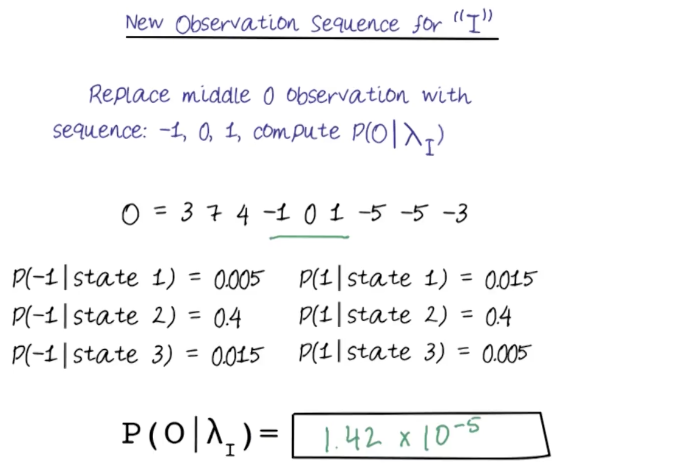

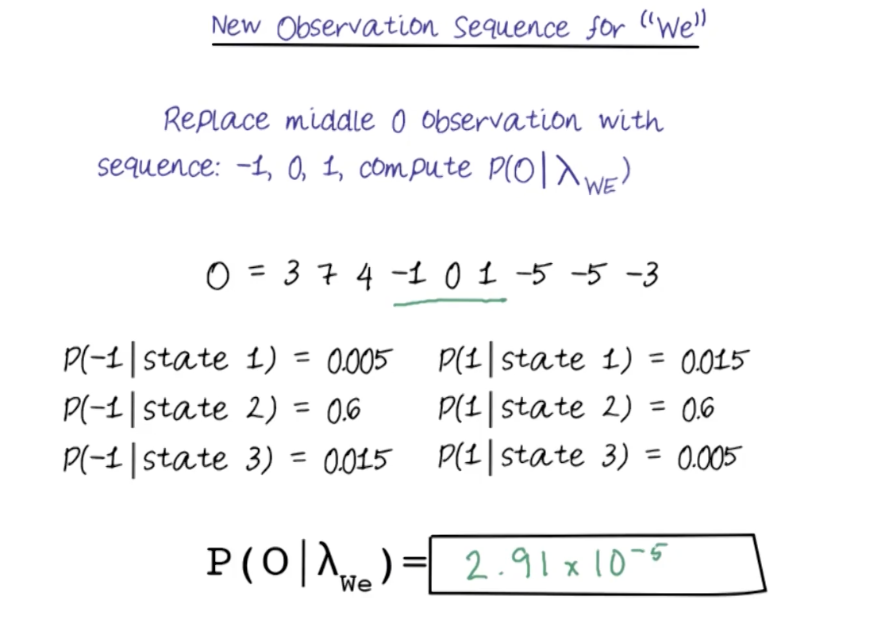

## HMM Training
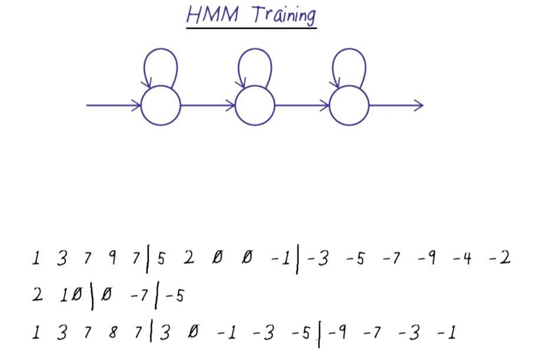 

| Iter |                                                                                                                          |                                                               |                                |
|------|--------------------------------------------------------------------------------------------------------------------------|---------------------------------------------------------------|--------------------------------|
| 1    | 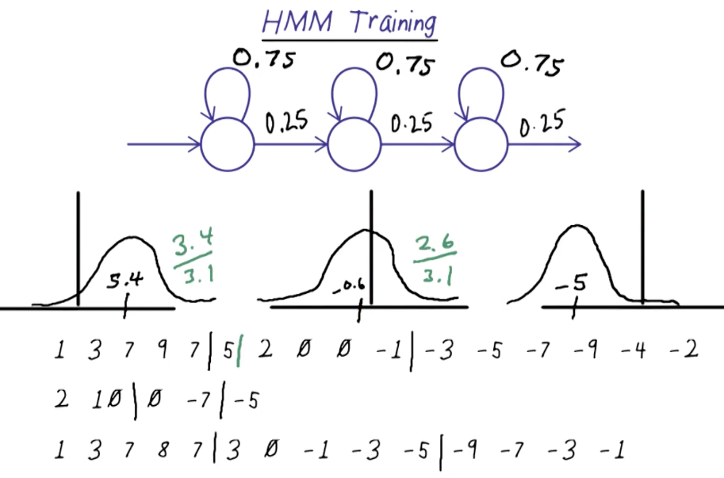                                                                                           | 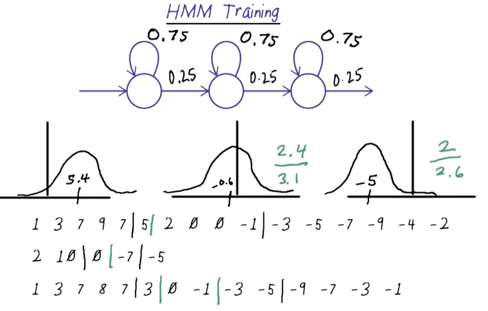                                |                                |
| 2    | 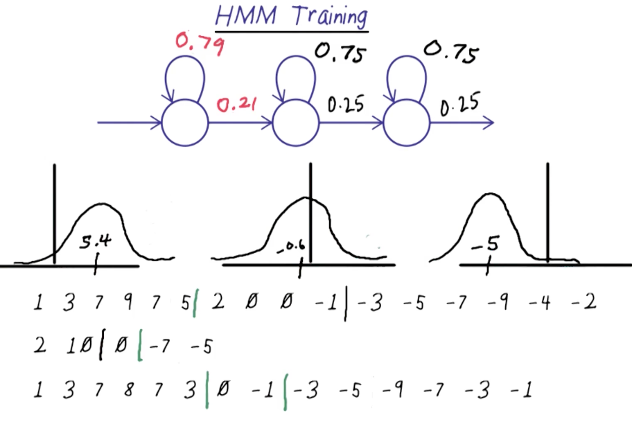 14 over 3 times frame in first state, transition probs is 3/14=1/4.7= 0.21                | 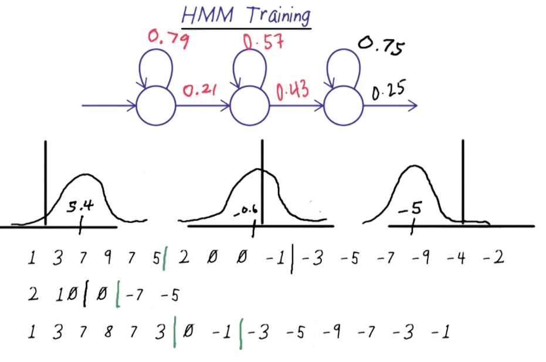 7 over 3 time frame, 3/7= 0.43 | 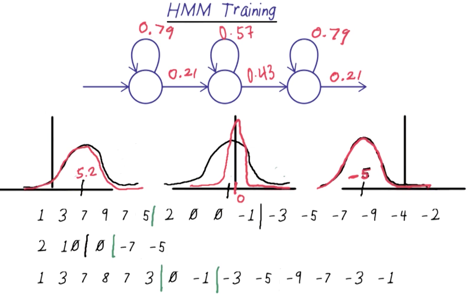 |
| 3    | 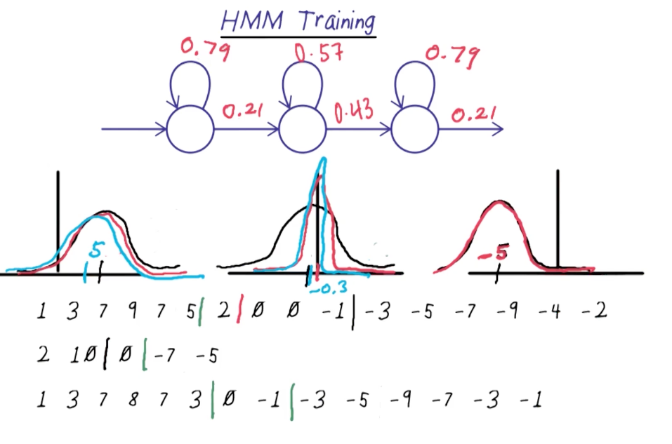 Converged, none of the boundaries going to move, nor the out put probability is to change |                                                               |                                |

## Baum-Welch Algorithm 
- Expectation-Maximization algorithm
- How does it differ? 
- Every sample of the data contributes to every state proportionately to the probability of that frame of that being in that state
- We have to weight everything appropriately
- We can use forward-backward algorithm to help keep track of the calculatiopns
- https://static.us.edusercontent.com/files/QPSqTSGMokud2k7g7ohyinlf 
- https://static.us.edusercontent.com/files/dJkNC7Way6frl0vxejPoIfrv
- https://static.us.edusercontent.com/files/9x9yW0VufpcelGHSRd5ZWTHL

## Multidimensional Output Probability
- In the hand sign example above, we use dy as a feature, but in reality dx would be better
- That's true, but for other signs, dy might be more useful feature e.g. 
  - size of the hand: hands moving away or towards the camera
  - orientation of the hand: palm up vs palm down
- Since hand signs are two handed, we should have both features for both hands
- Now we have 8 features, how do we integrate them into the HMM output probability model?
  - We just add more dimensions to the output probability distribution
  - Training and recognition work the same way
  - Calculate multidimensional distance, instead of 1D distance

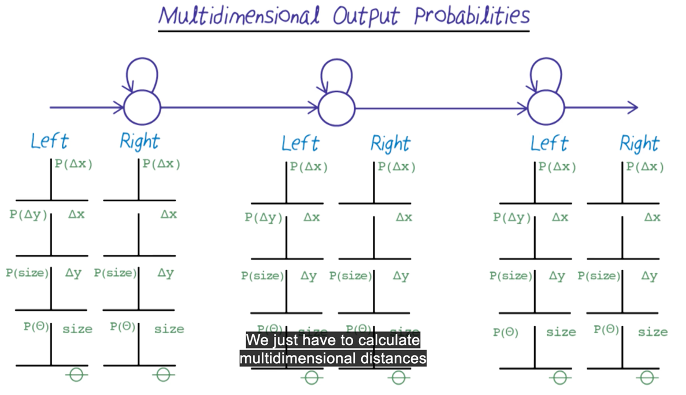

## Using a mixture of Gaussians
- Central Limit Theorem: We should get Gaussians, if enough factors are affecting the data
- Most of the time, data is not perfectly Gaussian e.g. binomial distribution
- Then we can use two Gaussians like below
- THe more Gaussians we use, the closer we will model it
- How many should we use? 
  - Depends on the data and the application
  - In practice, prof try to limit his 2-3 Gaussians, otherwise overfits
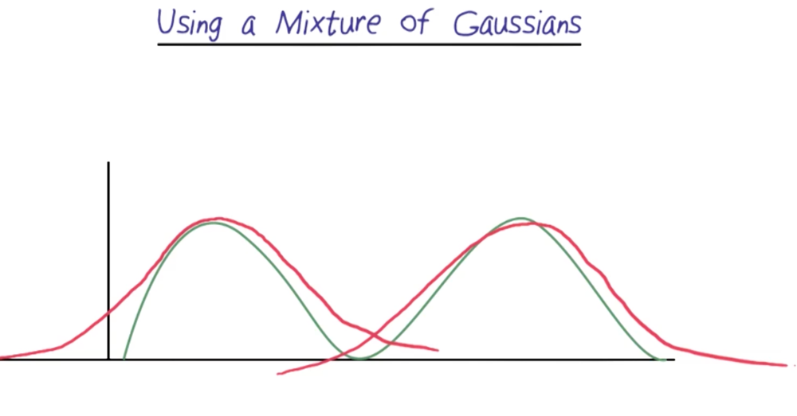

## HMM Topologies
- Hand-sign: Watch
- States: Bring hands up, dropping hands down, three states

- Hand-sign: Need
- States: Bring hands up, dropping hands down, three states

- Hand-sign: Table
- States: Bring hands up, moving hands side to side, dropping hands down, four states

- Like speaking where filler words (umm) can happen, in hand signs, extra movements can happen
- We can add loops to states to handle these extra movements

- Hand-sign: Cat
- States: With one hand, inch point finger and thumb together, move hand away from cheek, drop hand down, or;
- Use both hands, inch point fingers and thumbs together, move hands away from cheek, drop hands down
- In this case, we can train two different HMMs for the two different ways of signing "cat"
- If we detect cat 1 or cat 2, we can recognize it as "cat"

## Phrase Level Recognition
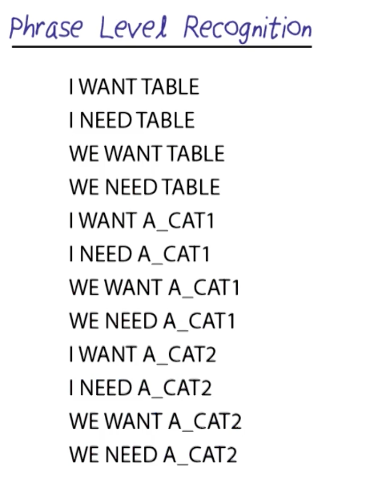
- 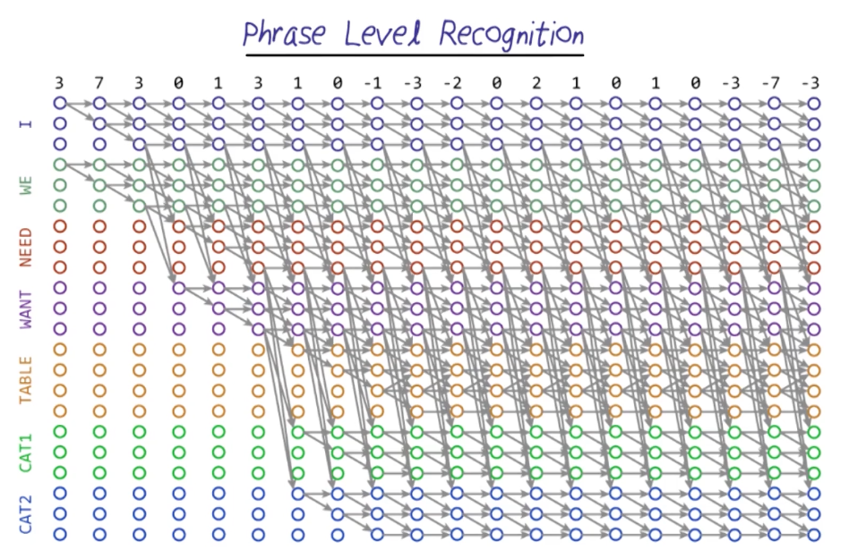
- HMM can take alot of memory
- Imagine if we had vocab that includes all 6000 signs in ASL
- Almost all language will have a hard time keeping Trellis in memory

## Stochastic Beam Search
- Prune some of those path e.g. staying in the first state until the end seems improbable so we prune
- Keeps the path randomly in proportion to their probability
- Has some idea with fitness function in genetic algorithms, and randomness in simulated annealing
- 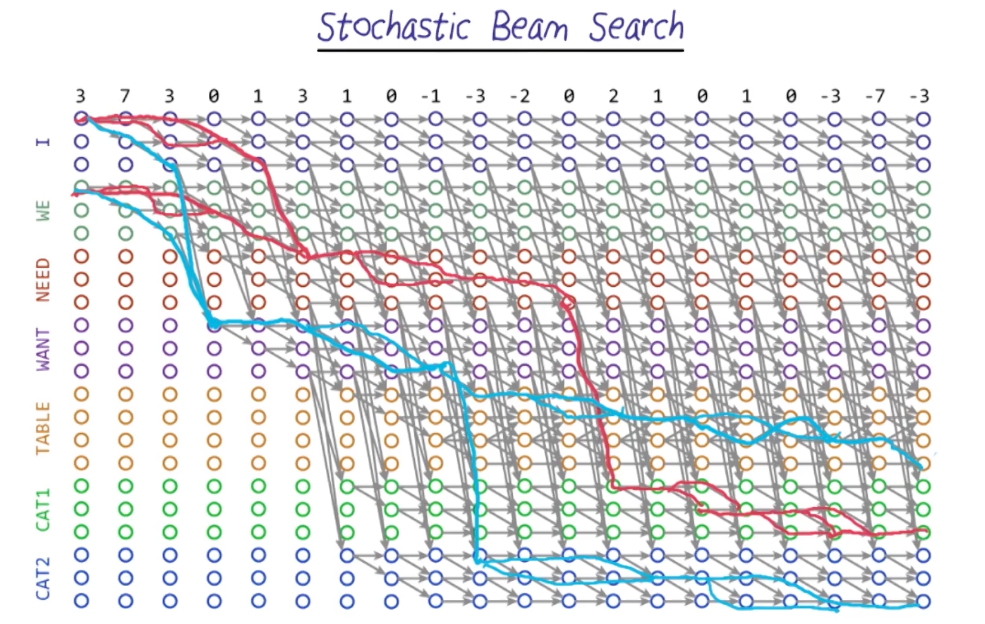
- High probability: Red
- Low probability: Blue

## Context Training
- When we moved from recognizing isolated words to recognizing phrases, combo of movement is different
- Need: Starts in rest position, moves up, then down to rest position
- I need cat: last part of I runs into first part of need, so movement is different (hands no longer moves that much)
- 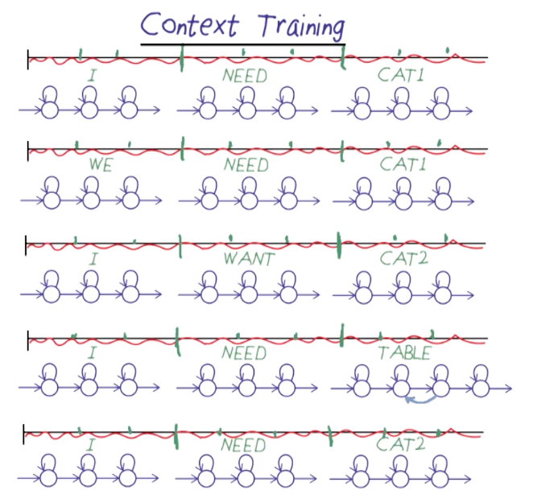
- We'll assume that data is evenly divided between each sign, and then we divide for each state in each sign
- Then we reiterate the same way we did before, adjusting the boundary in each state in each sign until we converge

- In speech, the effect of one phoneme on the adjacent another is called coarticulation
- This kind modelling is called context training
- 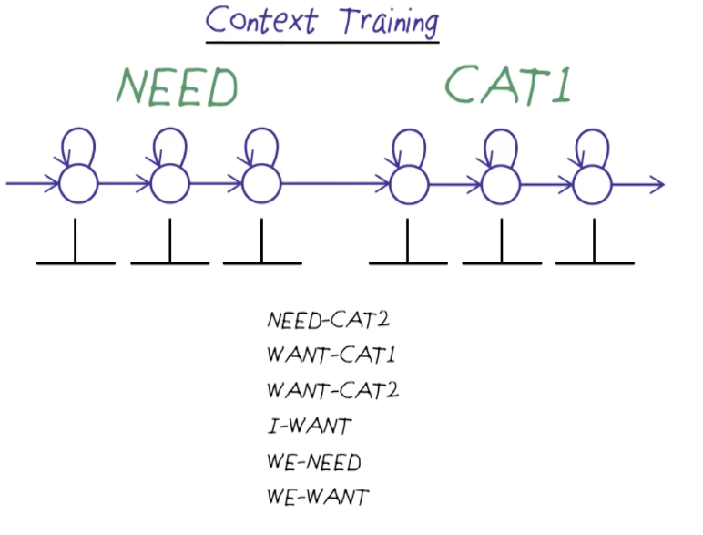
- We are going to reiterate using Baum-Welch algorithm until convergence
- Why not use 3-sign contexts? if we have enough data, we can 
- For recognition task where there's a language strucutre, With context training, we expect error rate drops in half

## Statistical Grammar
- < pronoun verb noun>
- < I need 6% >
- < I want 10% >
- < We want 4% >
- < we need 2% >
- Using statistical grammar, we can drop the error rate by another factor of four
- Context training: divides in half
- Statistical grammar: divides by four
- Overall, error rate drops by factor of 8

## State tying
- Combining training for states where states and models are close 
- 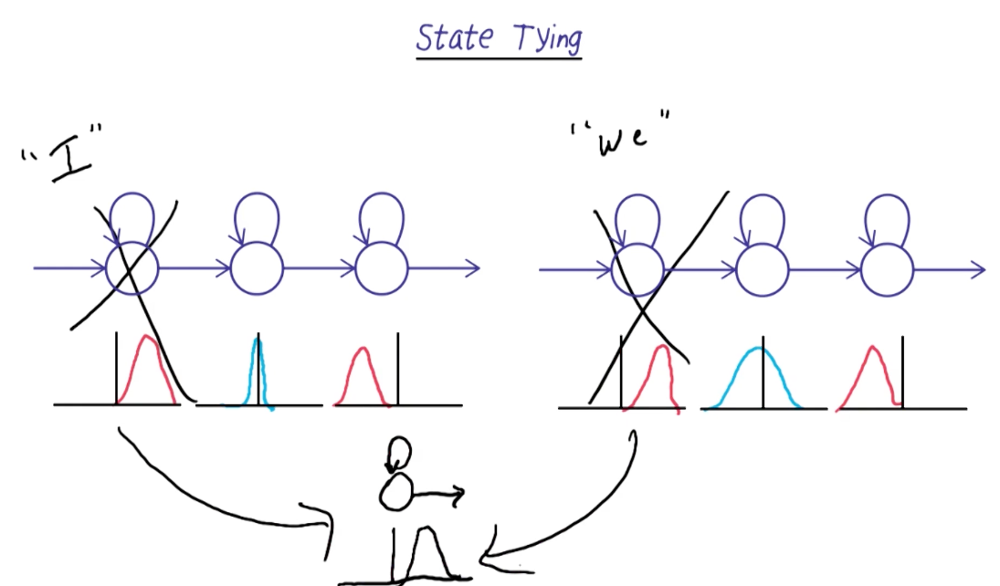
- We can define an initial state, define the I and We models such that they both include it
- That way, we we train the HMM, we have twice as much data in the initial state
- Need to be careful, especially in context training, 
- If we only look at one feature e.g. dy, it might be possible but when we look at all features, they might be different
- In practice, prof just look for states that seem to have close means and variances during training, and determine if tying them looks logical given movement he expects
- 

## Segmentally Boosted HMMs
- How many dimensions should we use in the output probability distribution?
- Up to hundreds, but The problems is there a lot noise and giving random results
- We can use boosting to give weight to feature vector to help
- Often 20% better than normal HMMs, some datasets gives 70%

1. First align and train the HMMs as normal
2. Use that training to align the data that belongs to each state as best as we can
3. Examine each state in each model iteratively
4. Booost by asking which feature help most in differentiating the data for our chosen data vs the rest of the stae
5. Weight the dimensions appropriately in that HMM

- This trick combines some advantages of discriminative models and generative models
- Not in the toolkit yet, but prof thinking to add to HTK and our Georgia TEch Gesture toolkit 

##  USing HMMs to Generate Data
- Not a good idea to use the speech recognizeing model we use for generating speech
- 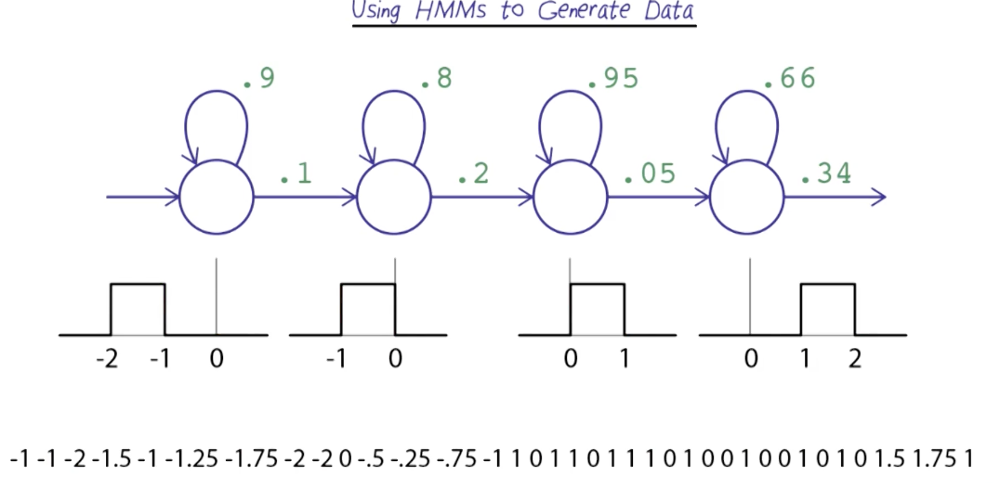
- 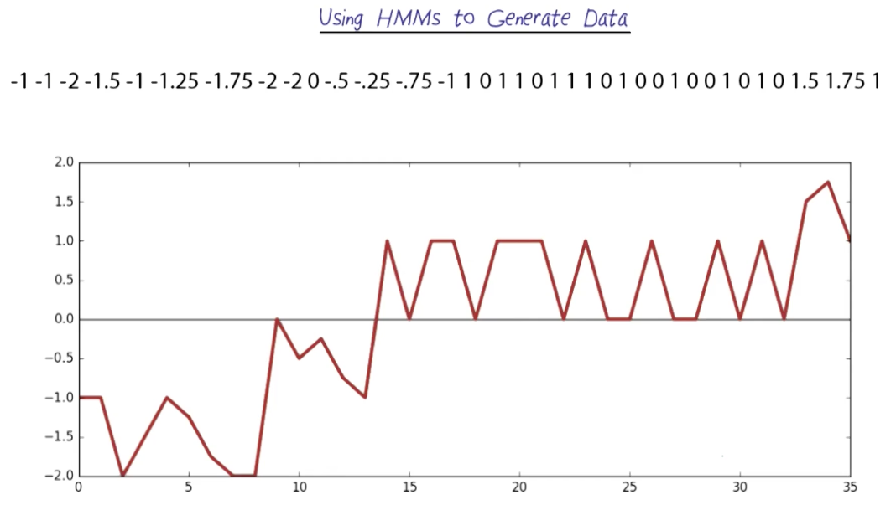
- Plotting this numbers looks nothing like the original example
- Output distribution doesnt know continuity between states
- Example: Google's how they are combining HMMs with deep learning to generate realistic speech

