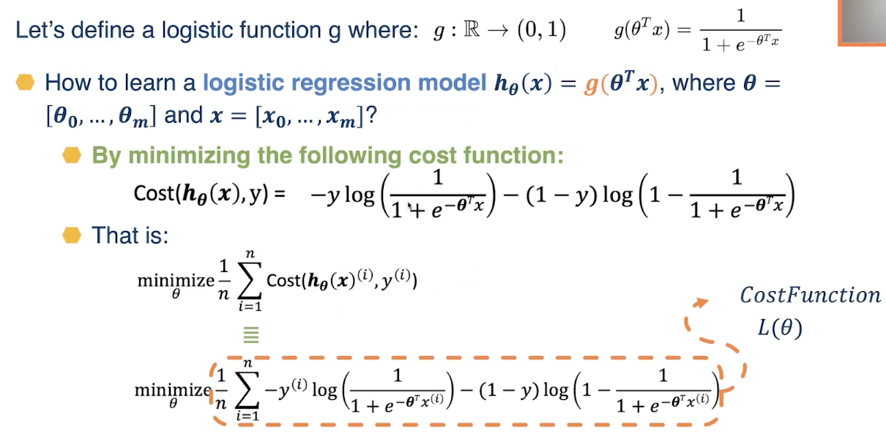
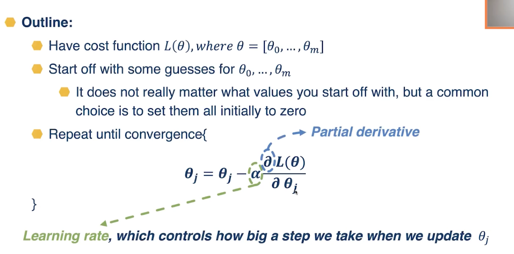
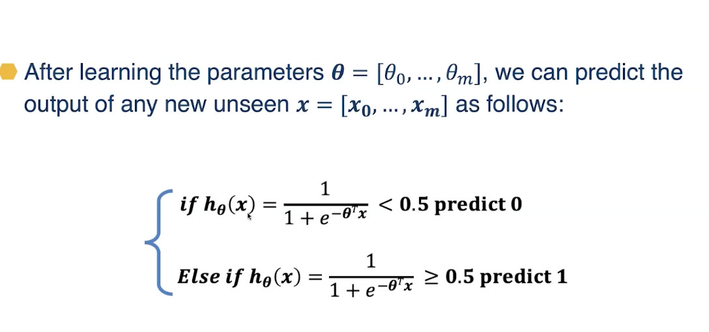
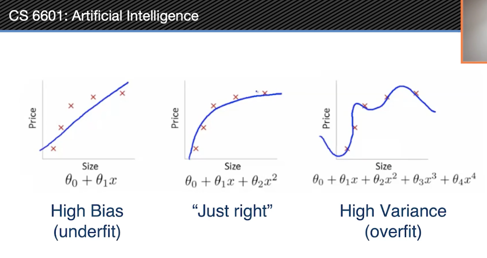
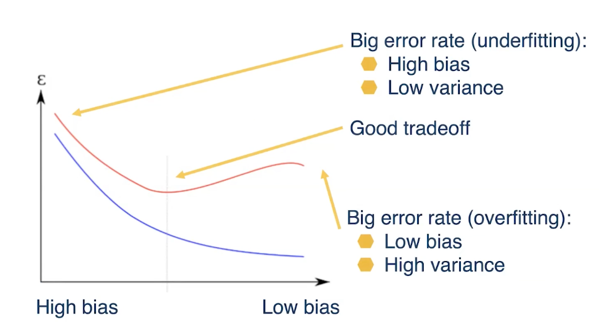

# Introduction to Supervised Learning

## Readings
Module/Lesson 9. Deep Learning AIMA: Chapter 21 (3rd edition: No equivalent

## General Concepts
- Supervised vs Unsupervised Learning
- Supervised Learning:
  - Learn a function by onserving examples containing inputs and desired outputs
  - Classification vs Regression
- Unsupervised Learning:
  - Find underlying relations in data by observing the raw data only, without labeled responses
  - Clustering, Dimensionality Reduction
- Weakly supervised learning:
  - We have even smaller subset of labels, learn how to generalize from that
  - Use label propagation, learn what type of labels we can extend to unlabeled data
  - Different from supervised learning where we have all labels
  

- Generally in the training set, we have excpected input and output features
- We convert these numeric or text features into a mathematical feature vector

Regression
- Learn a function mapping an input element to a real value
- e.g. Predict the temperature for tomorrow given some moetrological data

Classification
- Learn a function mapping an input element to a class
- Predict the weather for tomorrow (sunny, rainy, cloudy, etc), given some meteorological data

## K-Nearest Neighbor, KNN
- Classification and Regression model
- Supervised learning: we have annotated examples
- Requires a distance function between points
- Regression: average the values of the k nearest neighbors
- Classification: majority vote of the k nearest neighbors

- In the case of unbalanced data, we can rebalance across classes by giving weights to the examples
  - The weight of an under-represented class can be higher
  - The weight of an over-represented class can be lower
- When we do majority voting, we can take weight into consideration
  - Classification: weighted vote
  - Regression: weighted average

## DT and RF
- Same same thing from ML4T and earlier in the course
- Just remember on Entropy, Information Gain, Gini Impurity, etc.
- Splitting criteria based on highest IG
- When depth of DT is growing, the error on validation data tends to increase alot: high variance
- One way to exploit a lot data is to train multiple DTs and average them

Algo:
1. Select N points in the training data and k features
2. Learn a new DT
3. Stop when we have enough trees

## Gradient Descent
- Try to learn an optimization function  that is an interative method
1. Define a model depending on W (parameters of the model)
2. Define a loss function W that quantifies the error the models gets on training data
3. Compute the gradient of this loss
4. Adjust W to minimize the loss by following the direction of the computed gradient
5. Repeat until convergence, model is good enough, or spend all money on GP training XD

- Why do we spend money at all? from some closed solution? 
- Sometimes it;s not closed form solution, not enough dataset, input samples, algo CNN RNN doesnt have analytical solution
- Use GD to find local optimal solution, since GD is iterative, it will give us good enough solution, but wont be global optimal solution
- But we complete the requirements

## Logistic Regression
- Quick, simple classifier
- Outputs a probabilistic label confidence
- Use L2 or L1 regularization
  - L1 does feature selection and is robust to irrelevant features but slower to train

- What happens if we have class imbalance?
  - Need to ensure that there is no false negative or false positive
  - This threshold can be adjusted higher or lower to respond to the imbalance dataset
  - Eventho model accuracy might be low, worse than 0.5, app can ensure imbalanced dataset is handled and no false negative or false positive

## Bias and Variance
- When applying ML algo, we make asome assumptions while learning the model
  - KNN: neighborhood influence
  - linear model: linear mapping between input and output, loss func
  - perceptron: we can separte the data linearly loss func
  - support vector machine: kernel type, hyperparameters
- Those assumptions will influence the bias and the variance of the model

