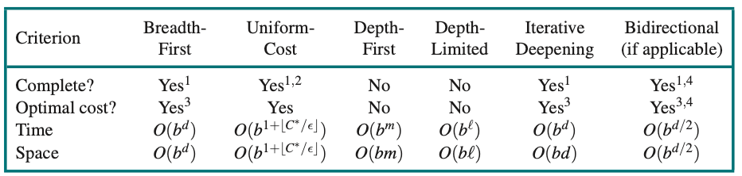

# Solving problems by Searching

- Informed algorithms, in which the agent can estimate how far it is from the goal
- Uninformed algorithms, where no such estimate is available

## Problem-Solving Agents

- A search problem can be defined formally as:
  - Set of possible states
  - The initial state
  - A set of one or more goal states
  - The actions to the agent
  - A transition model
  - Action cost function
- An optimal solution has the lowest path

## Example Problems

- A grid world problem (Similar to lecture)
- Sokoban puzzle (Similar to lecture)
- Route finding problem
  - States: E.g. an airport
  - Initial State: the user's home airport
  - Actions: Take any flight from current location
  - Transition Model: The state resulting from taking a flight will have the flight's destination as new location and arrival time as new time
  - Goal State: A goal airport
  - Action cost: Combination of monetary, waiting, flight and other costs
- TSP
- VLSI layout: chip layout
- Robot navigation
- Automatic assembly sequencing

## Search Algorithm

- A search algorithm takes a search problem as input and returns a solution, or an indication of failure.
- A Node consist of STATE, PARENT, ACTION, PATH-COST
- Queue is a good data structure to store FRONTIER

### Best First Search
  - We choose a node, n, with minimum value of some Best-first search
    evaluation function, f(n)
  - On each iteration we choose Evaluation function a node on the frontier with minimum f (n) value, return it if its state is a goal state, and 
  - Otherwise apply EXPAND to generate child nodes.
  - Each child node is added to the frontier if it has not been reached before, or is re-added if it is now being reached with a path that has a lower path cost than any previous path.
  - By employing different f(n) functions, we get different specific algorithms

### Evaluating performance
- Four ways:
  - Completeness: Is it guaranteed to find a solution, and report when no solution
    - Must be systematic in the way it explores an infinite state space, making sure it can connect any state to the initial state
  - Cost optimality: Lowest path cost
  - Time complexity: How long
  - Space complexity: how much memory

## Uninform Search Strategies
- No clue about how close a state is to the goal

### Breadth-First Search
- Can get additional efficiency:
  - A first-in-first-out queue will be faster than a priority queue, and will give us the correct order of nodes: new nodes (which are always deeper than their parents) go to the back of the queue, and old nodes, which are shallower than the new nodes, get expanded first
  - reached can be a set of states rather than a mapping from states to nodes, because once we’ve reached a state,
    we can never find a better path to the state
- Breadth-first search always finds a solution with a minimal number of action
- That means it is cost-optimal
- Suppose that the a node has `b` successor and solution is at depth `d`. Then the total number of nodes generated is
  1 + b + b^2 + b^3  +···+ b^d =O(b^d)
- All the nodes remain in memory, so both time and space complexity are O(b^d).
- The memory requirements are a bigger problem for breadth-first search ◭
  than the execution time
- exponential-complexity search problems cannot be solved by uninformed search for any but the smallest instances.

### Dijkstra's Algo or Uniform-Cost Search
- the algorithm’s worst-case time and space complexity is O(b(1^+⌊C∗/E⌋)), which can be much greater
  than b^d
- This is because uniform-cost search can explore large trees of actions with low costs
  before exploring paths involving a high-cost and perhaps useful action
- When all action costs are equal, b^(1+⌊C∗/E⌋)is just b^(d+1)
- Complete and is cost-optimal

### Dijkstra's Algo or Uniform-Cost Search
- Not cost-optimal; it returns the first solution it finds, even if it is not cheapest.
- In cyclic state spaces it can get stuck in an infinite loop
- in infinite state spaces, depth-first search is not systematic: it can get stuck going down an infinite path
- For problems where a tree-like search is feasible, depth-first search has much smaller needs for memory
- Frontier is small
- For a finite tree-shaped state space, DFS search takes time proportional to the number of states, and has memory complexity of only
  O(bm), where b is the branching factor and m is the maximum depth of the tree.

### Backtracking Search
- A DFS variant that uses less memory
- only one successor is generated at a time rather than all successors
- successors are generated by modifying the current state description directly rather than allocating memory for a brand-new state
- Memory one state description and a path ofO(m) actions; a significant savings over O(bm)
- Allow us to check for a cyclic path in O(1) time rather than O(m)

### Depth-limit Search
- Keep DFS from wandering down an infinite path
- The time complexity is O(b^ℓ) and the space complexity is O(b*ℓ)
- 

### Bidirectional Search
- Simultaneously searches forward from the initial state and backwards from the goal state
- Hoping the two searches will meet

### Comparing uninformed search algo

## Informed (heuristic) Search Strategies
- Usees heuristic functions, h(n) to hint about the location of goals

### Greedy BFS
- A form of best-first search that expands first the node with the lowest h(n) value

### A* Search
- f(n)=g(n)+h(n), g(n) is the path cost from the initial state to node n, h(n) is the estimated cost of shortest path
- Complete. Cost optimal based on heuristic function
- An admissible heuristic is one that never overestimates the cost to reach a goal.
  - WIth an admissible heuristic, A* is cost optimal
- Every consistent heuristic is admissible (but not vice versa), so with a consistent heuristic,A ∗is cost-optimal.
- With an inadmissible heuristic, A∗may or may not be cost-optimal.
  - First, if there is even one cost-optimal path on which h(n) is admissible for all
    nodes n on the path, then that path will be found, no matter what the heuristic says for states
    off the path.
- Bidirectional A* search is sometimes more efficient than A ∗itself.

### Satisficing Search: inadmissible heuristics and weighted A*
- Satisficing: explore fewer nodes (taking less time and space) if we are willing to accept solutions that are suboptimal, but are “good enough”
- If we allow A ∗ search to use an inadmissible heuristic—one that may overestimate—then we risk missing the optimal
  solution, but the heuristic can potentially be more accurate, thereby reducing the number of nodes expanded
- Weighted A* search, where we weight the heuristic value more heavily, giving us the evaluation function f (n)=g(n)+W ×h(n), for some W > 1

## Heuristic Function

### Characterizing Heuristic Functions
- Measure quality of heuristic function: **Effective branching Factor** b*
- N +1=1 +b∗+(b∗)^2 +···+(b∗)^d
- If A* finds a solution at depth 5 using 52 nodes, then the effective branching
  factor is 1.92.

##

##
##
##
##
##
##
##

