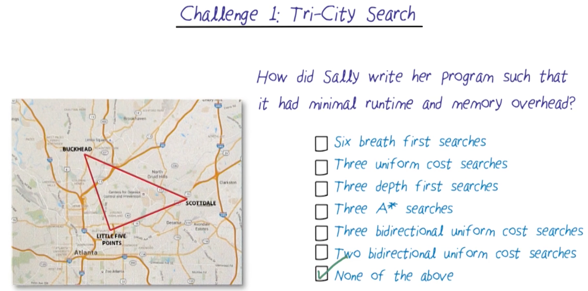

# Search

## Readings
Required:
- AIMA: Chapters 1-3
- https://www.cs.princeton.edu/courses/archive/fall06/cos402/papers/korfrubik.pdf
- https://faculty.cc.gatech.edu/~thad/6601-gradAI-fall2015/chapter03-clean.pdf
- https://faculty.cc.gatech.edu/~thad/6601-gradAI-fall2015/chapter04a.pdf

Optional:
- https://static.us.edusercontent.com/files/595MV3WJFZoEG13PO4R4rzAY
- https://static.us.edusercontent.com/files/LezaYpbxayZc1tWXDSvvFyI9
- https://static.us.edusercontent.com/files/CpLNNvd7dD48Z8fHhshceXAb

## Challenge 1

The answer is None of the above. We can use tri-directional search, with A*, with three simultaneous searches from each of the three nodes. The search will stop when any two of the three searches meet.

## Challenge 2

IDA* is a combination of depth-first search and A* search. It performs a series of depth-limited searches, increasing the depth limit with each iteration based on the cost function f(n) = g(n) + h(n), where g(n) is the cost to reach node n and h(n) is the heuristic estimate to the goal. This allows IDA* to use less memory than traditional A* while still finding an optimal solution.

Readings: https://www.cs.princeton.edu/courses/archive/fall06/cos402/papers/korfrubik.pdf

## Definition of a problem
- Initial State
- Action(s) -> Set of possible actions {a1, a2, ...}
- Result(s,a) -> s'
- Goal Test(s) -> True/False
- Path Cost(s -> s -> s) -> n, or Step Cost(s,a,s') -> n

## Route Finding
- Frontier = The endpoints of paths we have explored but not yet expanded
- Explored = Set of nodes already explored
- Unexplored = Set of nodes not yet explored

## Tree/Graph Search 
- As we start to explore the state, we keep track of the frontier and explored set to avoid duplicates or cycles.
 
### Breadth-First Search(BFS)
- The algorithms only stops when the destination is removed from the frontier. The reason is because it might not be the shortest path to the destination if we stop when we first reach it.
- BFS is optimal, guaranteed to find the cheapest path to the goal
- Frontier is a by level if visualized as a tree, FIFO queue
- BFS is complete, guaranteed to find a solution if one exists, assuming finite branching factor and finite depth of solution

### Uniform-Cost Search (UCS), cheapest-first
- Start with lowest total cost path
- UCS continues to search until we pop the goal node from the frontier. We continue looking to see if there is a cheaper path to the goal node.
- UCS is optimal, guaranteed to find the cheapest path to the goal
- Frontier is more complex than BFS, as it is ordered by path cost
- UCS is complete, guaranteed to find a solution if one exists, assuming finite branching factor and finite step cost > 0
- 

### Depth-First Search (DFS)
- DFS is not optimal. It can also give suboptimal solutions. 
- Frontier is a stack, LIFO
- DFS is not complete, it can get stuck in infinite loops. We can use depth-limited search to solve this problem.

### Greedy Best-First Search
- Moves towards the goal, but does not consider the cost to reach the node
- If there's a barrier, it will move around it, but it might not be the optimal path
- Solved by A* search

## A* Search
- f(n) = g(n) + h(n)
- g(path) = path cost
- h(path) = h(s) = estimated distance to goal
- Will A* always find the shortest path?
  - No, it depends on the heuristic function h(n)
- A* finds lowest cost path if:
  - h(n) < true cost to goal (admissible)
  - h never overestimates the cost to reach the goal
  - h optimistic
  - h admissable

## State space
What is the number of possible states?
- Cell B and B
- Power - on/off/sleep
- Camera - on/off
- Brush Height - 1/2/3/4/5
- Positions - 10
Answer: 3 * 2 * 5 * (2^10) dir position * 10 robot position = 307200

## Sliding blocks puzzle (15 puzzle)
- h1 = number of misplaced blocks
- h2 = sums(distances of blocks from their goal positions)
- **Which of this is admissible?**
Answer: Both, because every tile is the wrong position can be moved closer the correct position no faster than one space per move. h2 is always greater and equal to h1.
h2 will expand fewer nodes than h1, because it is more informed.

A block can move A->B if (A adjacent to B) and (B is empty). Generating a relaxed problem:
- h1 = A block can move A->B
- h2 = A block can move A->B if (A adjacent to B)
- h = max(h1,h2)
  - Guaranteed to be admissible, if h1 and h2 are admissible
  - Combining multiple heuristics has more cost

## Problem solving technology only works when:
- Fully observable - we must be able to see what the initial state we start out with
- Known - We have to know the sets of available actions, the results of those actions, and the cost of those actions
- Discrete - Finite number of actions to choose from
- Deterministic - we have to know the results of our actions
- Static - there must be nothing else in the world that can change the world, except four our actions

## 

## 

## 

## 

## 

## 