# 2.6: Mental Models and Representations
- An internal, simulatable understanding of external reality

## Mental Models
- A person's understanding of how something works in the real world
- We generate expectations based on our mental models
- When reality does not match our mental model, it makes us uncomfortable
- We wanna make sure our designs match users' mental models
- There are two ways
    - Designing systems that act the way the use expects them to act
    - Designing systems that teach users how they react, to minimize discomfort

## Mental Models and Education
- Our goal is to teach users through the design of the interface
- Teach users WHILE they are using damn

## 5 tips: Mental Models for Learnable Interfaces
- Predictability
    - Can the user predict what will happen next?
- Synthesizability
    - User should be able to see the sequence of actions that led to their current state
- Familiarity
    - Similar to affordances
- Generalizability
    - Knowledge of one user interface should transfer to another similar interface
- Consistency
    - Behavior of action should be consistent across interfaces

## Representations

- One example is assembly instructions
- Arrows, labels, and exploded views are all representations

## Characteristics of Good Representations
- Good representations:
    - make relationships explicit
    - bring objects and relations together
    - excludes extraneous details
    - expose natural constraints

## Design Challenge: Representations
- Switch box
    - Make the circuit breakers writeable what they control
    - Floor plan on the door with number labels
    - Switch arranged according to the floor plan (crazy)

## Metaphors and Analogies
- Metaphors
    - WSJ articles are the same for printed and online versions
- Analogies
    - We can think of a computer desktop like a real desktop
    - Comparing new concepts to familiar ones
    - When you use analogies, users may not know where the analogy ends

## Exploring HCI: Metaphors and Analogies
- 

## Design Principles Revisited
- We want to be consistent around analogies and metaphors
- They way system looks should match the way it works
- good representations are important because it maps the interface to the task at hand

## New Functionality Meets Old Interfaces
- Innovation
- While we need to leverage analogy and prior experience wherever possible, eventually we're going to do something and it gonna break down
- We gonna need to teach user how to use new functionality

## Learning Curves
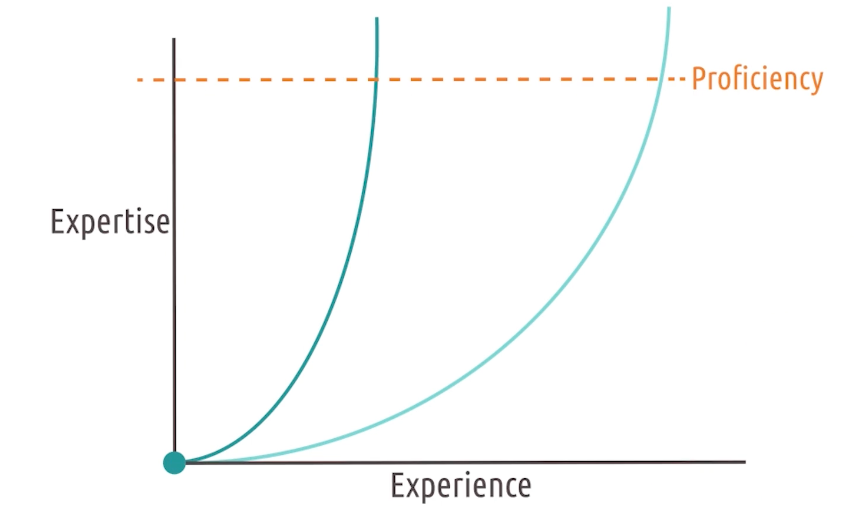
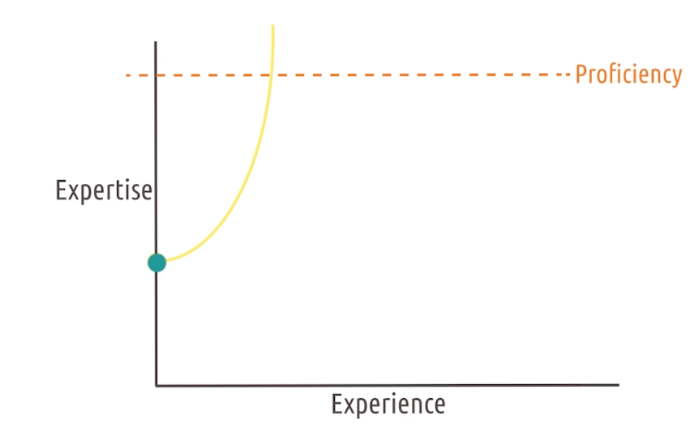
- We want a learning curve that grows quickly with little experience
- Rapid learning curve: expertise grows quickly, with relatively lesser experience
- If we use affordances and good representations, we can start expertise at a higher level

## User Error: Slips and Mistakes
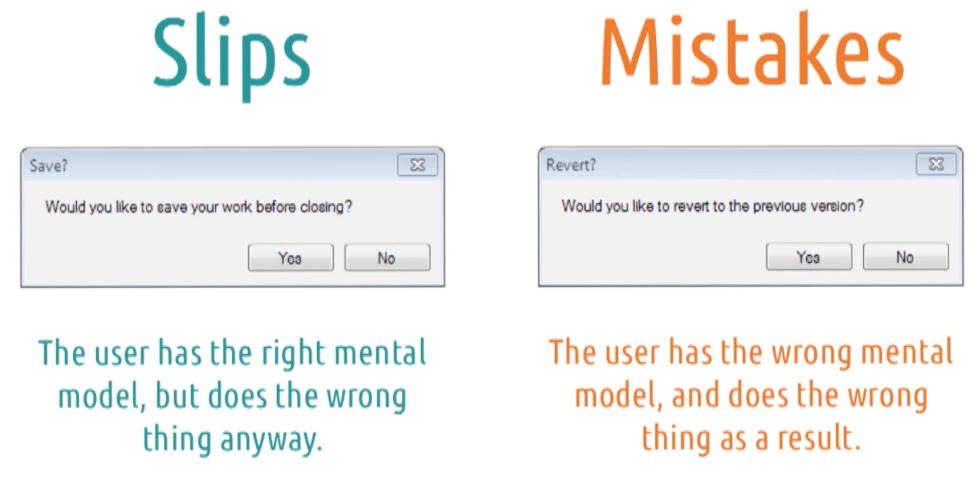
- Any user error is a failure of design

- Slips
    - user has the right mental model, but does the wrong thing anyway
- Mistakes
    - User has the wrong mental model, so they do the wrong thing

## Types of Slips
- Two categories:
    - Action-based
        - user performs the wrong or right action, on the wrong object even tho they know the right action
    - Memory-lapse
        - Forget what they knew to do
        - e.g. set timer on microwave but forget to start it

## Types of Mistakes
- 3 categories
    - Rule-based
        - occur where user correctly assesses the state of world, but makes the wrong decision based on it
    - Knowledge-based
        - incorrectly asses the world in the first place
    - Memory-lapse
        - Focuses on forgetting to fully execute the plan, not just forget to do something in the first place

## Exercise: Slips vs Mistakes
- Q: Morgan accidentally sends a text message to the wrong person. Is this a slip or a mistake?
- A: Slip, Morgan knew who to text, but selected the wrong contact
- More pervasive reminders who Morgan is texting

## Learned Helplessness
- What if no discernible interaction between input and output?
- Act in the system over and over again, but nothing changes
- This is what learned helplessness is
- A user's sense that they are helpless to accomplish their goals in an interface
- Can lead to frustration, anxiety, and abandonment of the system
- No one wants to feel helpless, when others are succeeding

## Learned Helplessness and Education
- In teaching, if students feel like no matter what they do, they can't succeed
- If you're a parent and designer, imagine you are the user and your screaming kid is the interface
- What feedback would you need from your child to help them, and what can you add in that interface

## Expert Blind Spot
- When you're expert, we do task subconsciously
- Lots of things we forgot to say when teaching novices
- Make sure you don't assume that they're expert too, we are not our users!!!
- REPEAT IT!! I AM NOT MY USERS!!!

## Reflections: Learned Helplessness and Expert Blind Spot
- It's important for us to understand to be in the position of helplessness

---

# 2.7: Task Analysis
- The task is at the heart of HCI

## GOMS Model
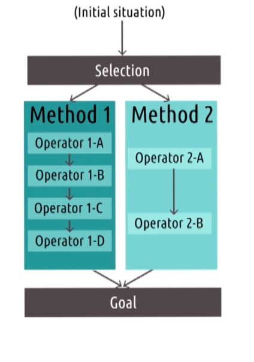
- Human information processing model
- It builds off the processor of the human's role in a system
- GOMS stands for Goals, Operators, Methods, and Selection rules
    - Goals: what the user is trying to accomplish
    - Operators: the basic actions the user can take to accomplish the goal
    - Methods: methods for accomplishing the goal using operators
    - Selection rules: guidelines for choosing between different methods

## GOMS Model in Action
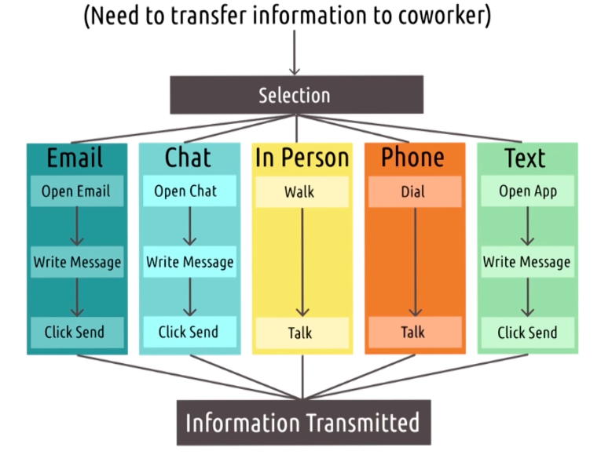

## Design Challenge: Security System 1
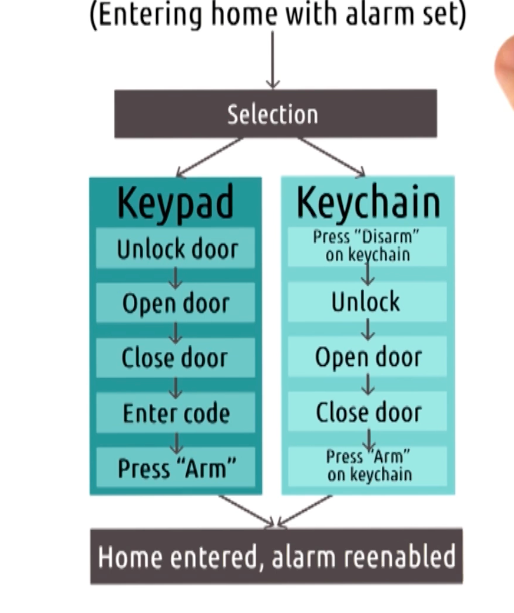

## Strengths and Weaknesses of GOMS
- Weakness
    - Don't address the complexity of the problems
    - Assumes user is an expert
- Strength
    - Formalize user interaction

## Paper Spotlight: The GOMS Family of User Interface Analysis Techniques Comparison and Contrast
- KLM-GOMS: Keystroke-Level Model
- CMN-GOMS: Card, Moran, and Newell GOMS
- NGOMSL: Natural GOMS Language

## 5 Tips: Developing GOMS Models
- Focus on small goals
    - Work in the context of small goals, and abstract up
- Nest goals, not operators
    - Navigation: changing lanes or switch routes
- Differentiate descriptive and prescriptive methods
    - Descriptive: how users actually do
    - Prescriptive: how users should do
- Assign cost to operators
    - Have some measurement how long each operator takes
- Use GOMS to trim waste
    - GOMS let's us visualize the operators, bolstered by the costs, we can see where we can trim waste

## GOMS to Cognitive Task Analysis
- Another way of examine task, but place higher emphasis on things like memory, attention, and cognitive load
- Adapt predictive view of human role in the system

## Reflections: Task Analysis
- Behaviorism: an approach to psychology that emphasizes behavior as a product of stimuli and the environment
- Cognitivism: an approach to psychology that emphasizes internal thought processes
- Both approaches has significant values

## Cognitive Task Analysis
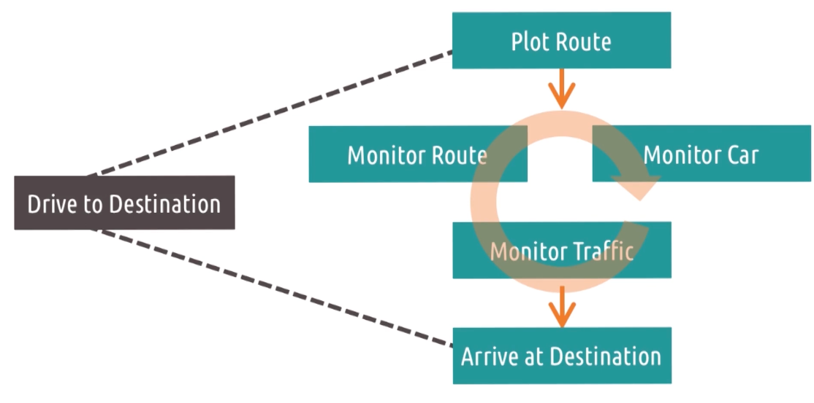
- Type of method of evaluation of how people complete task
- Cognitive task analyses are concerned with the underlying thought process associated with performing a task
- Most methods follow this sequence
    - Collecting preliminary knowledge. Need a good bit of familiarity with the task
    - Identify knowledge representations. What kind of things user need to know to complete the task.
    - Apply focused knowledge elicitation methods. Identify all specific actions, knowledge they must have in mind, interruptions that can change the thought process, equipments involved and sensory experiences
    - Analyze and verify data acquired
    - Format results for intended application

## Hierarchical Task Analysis
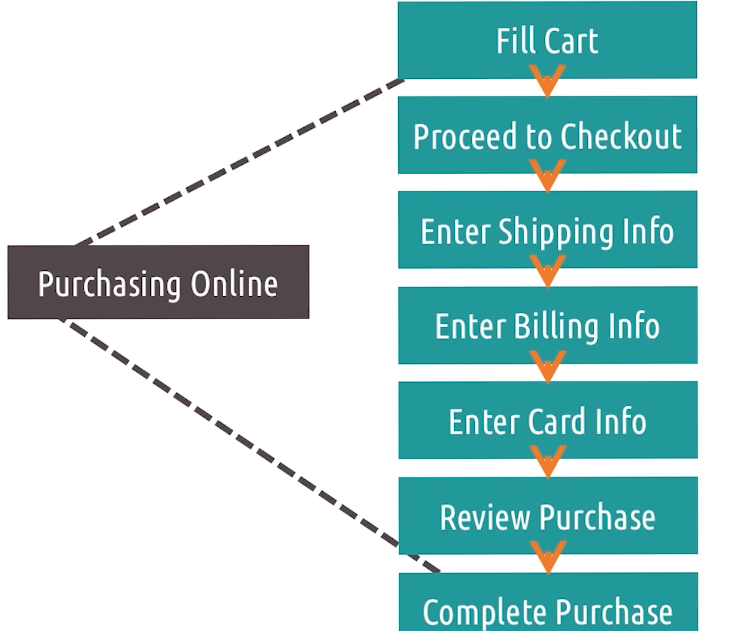
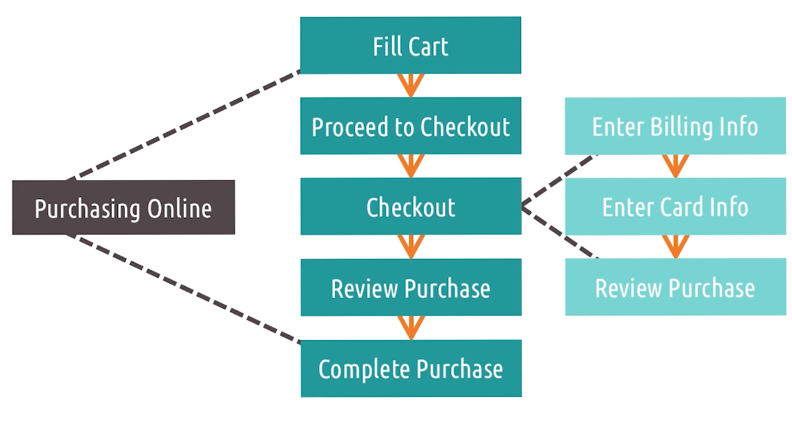
- Advocates building models of human reasoning and decision-making in complex task
- Tips
    - Abstract out unnecessary details for a certain level of abstraction
    - modularize designs or principles so they can be transferred to different task or context
    - organize the cognitive task analysis in a way that makes it easier to understand
- There will be several level of abstractions, different states and additional annotating info

## Design Challenge: Security System 2

## Cognitive Task Analysis Strengths and Weaknesses
- Strengths
    - Emphasize mental processes
    - Formal enough for interface design
- Weaknesses
- Can be time-consuming
    - Time-intensive
    - May de-emphasize context
    - ill-suited for novices

## Other Task Analysis Frameworks
- Human Information Processor Models
    - KLM: Keystroke-Level Model
    - TLM: Task-Level Model
    - MHP: Model Human Processor
    - CPM-GOMS: Cognitive Perceptual Motor GOMS
    - NGOMSL: Natural GOMS Language
- Cognitive Models
    - CDM: Critical Decision Method
    - TKS: Task Knowledge Structure
    - CFM: Cognitive Function Model
    - Applied CTA
    - Skill-based CTA

## Exploring HCI: Task Analysis
- 

---

# 2.8: Distributed Cognition

## Distributed Cognition
- Distributed Cognition suggests models of cognition should be extended outside the mind
- E.g. 1238 + 7787, cannot be done in head, need paper
- Does he get smarter? No, but eh could do more complex tasks

## Paper Spotlight: How a Cockpit Remembers its Speeds
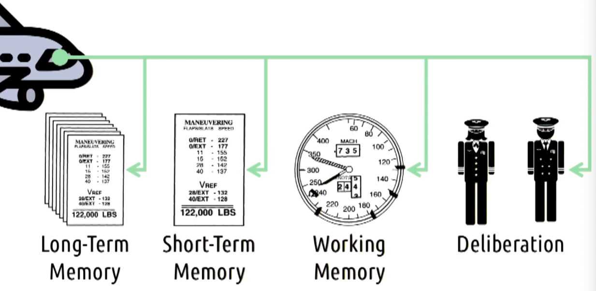
- Edwin Hutchins: The pilots, the systems, and the environment work together to remember the airspeed, not just the pilots
- When plane wanna land, pilot gotta remember airspeed to change wing config
- Problem: lots of stuff going on, high cognitive load
- Speeds: plural, not just now, but also target speeds, speeds for different configs
- Pilots have pages for different speeds, prior to descent pilot finds and writes down speeds on paper
- As pilot descends, they mark speeds on the speedometer
- No single part of the cockpit "remembers" the speeds, but the whole system does
- The cognition involved in landing this plane is distributed across the components of this system

## Distributed Cognition and Cognitive Load
- E.g. driving, keep track of other cars, speed, gas, music, directions, passenger
- GPS helps reduce cognitive load
- Turn on cruise control, also distributed cognition

## Exercise: Distributed Cognition
- E.g. morgan paying bills old-fashioned way
- Any part of the system that helps reduce cognitive load is part of distributed cognition
- Pen, bill itself, pile of bills, morgan, checkbook (not light, table and chair)

## Distributed Cognition as a Lens
- Not another principle, but a way of looking at an interface design

## Reflections: Distributed Cognition
- Capable of doing more, specifically because those interfaces exhibit certain cognitive qualities
- Able to offload cognitive work to other parts of the system
- E.g. mark message as unread, so you don't have to remember to read it later

## Distributed Cognition to Social Cognition
- How the mind can be extended as an artifact
- Distributing across people are powerful as well
- Driving, before GPS, passenger helps with directions

## Social Cognition
- Not only concerned with how social relationships combine to accomplish tasks, also concerned with the cognitive underpinnings of social interaction themselves
- One of common interface design today is social media
    - Facebook - tell friends nearby
    - Games - share highlights with friends
    - We have to understand how social interactions really work to design it well
    - We dont want to, for example, overshare info that makes people uncomfortable

## Design Challenge: Social cognition
- How to design video games to protect against perceptions, that if a player is playing game they have time to take care of other responsibilities
- Base social video game like Tinder
    - contacts can't lookup playing habits
    - Only seen by those you shared with

## Situated Action
- Not interested in the long-tem and enduring permanent interactions amongst these things
- Focus on humans as improvisers
- E.g. baby daughter on camera
    - Don't how she reacts
    - Figure out how Joyner can go along
    - we can try our best to guide it, but ultimately have to improvise
    - Task is what we do, not what we design
- Three key takeaways
    - We must examine the interfaces we design within the context they're used
    - We must understand the task the user performs grows out of interaction with the interface
    - The task doesn't exit until the user gets started, and once they start, they define the task

## Situated Action and Memory
- Valuable lens to examine issues of memory
- Recognition is easier than recall
- E.g. mother just had surgery. Everytime Joyner has to go visit, she ask for 4-5 tasks to do. Joyner sometimes forgot, but she remembers
    - For mother, she has the context behind the task, why needs to be done, and what happends if not done
    - For Joyner, it's just another list of tasks

## Paper Spotlight: Plans and Situated Action: The Problem of Human-Machine Communication
- The first view: adopted by researches in CogSc, views the organization and significance of action as derived from plans
- Second view: people simply act on the world, plans are just interpretations of actions

## Activity Theory
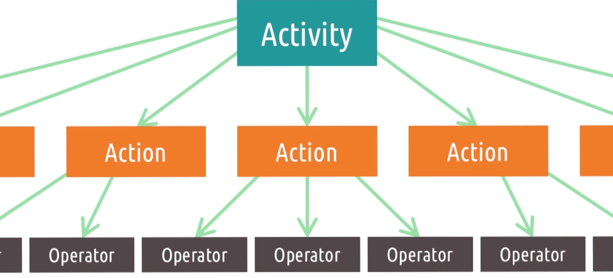
- Predates HCI, three main contributions of activity theory to HCI
    - Why is the user do the task in the first place
    - Puts on emphasis on the idea that we can create low level operations from higher level actions
    - Actions by the user can move and down of the hierarchy

## Paper Spotlight: Activity theory and HCI
- Bonnie Nardi: Activity theory offers a set of perspective on human activity and a set of concepts for describing that activity. This, it seems to me, is exactly what HCI research needs as we struggle to understand and describe "context", "situation", and "practice"

## Paper Spotlight: Studying Context: A Comparison of Activity Theory, Situated Action Models and Distributed Cognition
- Bonnie Nardi
- Activity theory and distributed cognition are driven by goals, where as situated action focuses on improvisation
- Situated actions as goals are constructed retroactively to interpret our past actions
- Activity theory vs distributed cognition: their evaluation of the symmetry between people and artifacts
- Activity theory regards them as fundamentally different given that human has consciousness, distributed cognition views people and things as conceptually equivalent; people and artifacts are agents in the system

## Exploring HCI: Distributed Cognition
- Perspective to analyze and design interfaces that consider how cognitive processes are distributed across people, artifacts, and environments

---

# 2.9: Interfaces and Politics
- Can an artifacts have politics?
- Politics: the way power and authority are distributed in a community

## Change: A third motivation
- Designing for change in response to values that we have
- E.g. cars, beep if not wearing seatbelt, cap speed, to reduce accidents

Three goals of HCI:
- helps users do a task
- understand how users do a task
- change user behavior for the better

## Paper Spotlight: Do Artifacts Have Politics?
- Langdon Winner: noting the belief that nuclear power can only be used in authoritarian society cause of the dangers involved
- Two distinct ways artifacts can have politics
    - Inherently political: requires or is strongly compatible with a particular kind of political relationship among people, nuclear power
    - Technical arrangements as forms of order: can be used to change social order when used in correct way. Factory machines in chicago in 1880s, designed to be operated by unskilled workers, reducing need for skilled labor, undermining labor unions

## Negative Change by Design
- Seemingly normal design with underlying political agenda
- E.g. Robert Moses, construction of parks in Long Islands
    - Bring people of new york to the park
    - Bridge was low, so buses can't go under it
    - Only people with cars can go to the park, only rich people at that time
    - Moses intentionally designed the park to be only accessible to rich people
- E.g. Central Park, NY
    - Designed so that everyone can enjoy it equally

## Positive Change by Design
- can be design to promote positive social change thru natural interactions with the system
- E.g. FB's like button, no dislike button
    - promote positive interactions
    - discourage negative interactions
    - 5 new emotions to the like button, overall connotation is still positive
- Not only dictating change, but supporting change as well
- E.g. GB relationship status
    - Single, in relationship, it's complicated
    - Then, they added "in a civil union", "domestic partnership", "open relationship"
- E.g. gender options

## Design Challenge: Change by Design
- E.g. encourage morgan to stop working and take breaks every once in a while
- Weather app that ask morgan to take picture of the sky outside every hour
- E.g. pokemon go, walk outside to catch pokemon

## Positive Change by Happenstance
- Bi-product of technological advancement
- E.g. bicycle
    - before bike, woman rely on men for transportation
    - Carriages were expensive, men would own them
    - So women always out with men, father or husband
    - With bike, women can go out by themselves
    - Enable profound social shift
    - Wardrobe change as well, more practical clothes
    - Challenge social norms
    - Inventor didn't intend for these to happen

## Negative Change by Happenstance
- E.g. proliferation of internet
    - Before internet, we piggyback phoneline, then cable tv line, then more expensive fiber optic line
    - Now, wealthy people can afford high speed internet first
    - Poor people get left behind
    - They are economically advantaged
    - People with internet access can apply for jobs online, do research, learn new skills
    - Now, they are more advantaged and richer

## Value-sensitive Design
- Need to share the same value as the users
- UWashington: Value sensitive design seeks to provide theory and method to account for human values in a principled and systematic manner throughout the design process
- Is it consistent with the users values?
- Anna Cavoukian: Privacy by design

## Paper Spotlight: Value Sensitive Design and Information Systems
- Batya Friedman: Three main components of value-sensitive design
    - Conceptual investigations: identify and articulate the values implicated in the technology under consideration
    - Empirical investigations: studies of the technology's users to inform and elaborate the conceptual analysis
    - Technical investigations: analysis and design of the technology itself to support or hinder particular values

## Value-sensitive Design Across Cultures
- Values vary across cultures
- E.g. Rights to be forgotten in EU
    - Info about you online can be removed upon request
    - Google not developed with this value in mind
    - One value of freedom of speech conflicts with right to be forgotten

## 5 tips: Value-sensitive Design
- Start early
    - Identify the values at stake as early as possible, check in throughout design process
- Know your users
    - Need to understand the values of your users
- Consider both direct and indirect stakeholders
    - Direct: users who directly interact with the system
    - Indirect: people who are affected by the system but don't directly interact with it
- Brainstorm the interface's possibilities
    - Think not only about how the interface to be used, but also how it could be used
- Choose carefully between supporting values and prescribing values
    - Be careful and be deliberate when choosing to support or prescribe values

## Exploring HCI: Interfaces and Politics
- Two challenges
    - Need to think about places where we can use interface design to invoke social change
    - Need to think about the possible negative ramifications of our designs

## Reversing the relationship
- General Electrics design light bulbs that saves energy
- Electricity companies don't like it cause they make money by selling electricity
- So they lobby government to ban energy-saving light bulbs
- To preserve the power structure that benefits them
- Technology changes society, but society can also change technology

## Reflections: Interfaces and Politics
- E.g. Spiderman games can only works in PS5
    - There's no technical reason for that
    - Sony pays for exclusivity to promote their console

---

# 2.10: Conclusion to Principles

## Zooming out: Human as Processor
- Humans actions are approached almost computationally
- Focus on efficiency, accuracy, speed

## Zooming out: Human as Predictor
- Task focus
- Actively looking at the task, predicting what to do next, anticipating needs
- 15 design principles
- Understand their mental models, design to match their expectations
- Expert blind spots

## Zooming out: Human as Participant
- User is not merely interacting with the system to accomplish a task, they are interacting with the system as a whole
- Use interface to create more equal society for all people

## 5 tips: On-Screen UI Design
- Use a grid
    - Highlight important content
    - E.g. newspaper layout
- Use whitespace
    - works with grids to provide context and guide user's visual perception
- Know your Gestalt principles
    - Proximity, similarity, continuity, closure, figure/ground
- Reduce clutter
    - Above three tips help reduce clutter
- Design in grayscale
    - E.g. traffic light, red-green colorblindness
    - Even though color is important, design should not rely solely on color
    - Red always on top, green on bottom

## Only Half of the Picture
- Know your user
- You are not your user
- These guidelines and principles are only half of the picture, the other half are the methods

---

# 3.6: Evaluation

## Three Types of Evaluation
- 3 categories
- Qualitative
    - Evaluation that emphasizes the totality of a phonemenon
    - What they like, dislike
- Empirical
    - Evaluation based on numeric summaries or observation of phenomenon
    - controlled experiments
- Predictive
    - Evaluation based on systematic application of pre-established principles and heuristics

## Evaluation Terminology
- Reliability
    - Whether a measure consistently returns the smae results for the same phenomenon
- Validity
    - Whether a measure's results actually reflect the underlying phenomenon
    - Can be reliable but not valid
- Generalizability
    - Whether a measure's results can be used to predict phenomena beyond what it measured
    - e.g. measuring usability of a website for college students may not generalize to older adults
- Precision
    - The level of detail a measure supplies
    - 1.30 vs 1.3012 seconds

## 5 tips: What to Evaluate
- Efficiency
    - How quickly can users complete tasks
    - Time users, or predictive models
- Accuracy
    - How many errors do users commit when completing tasks
    - Ideally, we want to reduce number of errors when users complete tasks
- Learnability
    - Sit user down, define expertise, see how long it takes to reach that expertise
- Memorability
    - How easily can users re-learn the system after a period of time
- Satisfaction
    - Cognitive load while they use the system or enjoyment of the system
    - Avoid social desirability bias by e.g. find out how many participants actually download an app they tested after the session is over
    - It's important at the start what we're evaluating, what data we gathering, and how we analyze it

## Evaluation Timeline
- Overtime, evaluation method changes
- From formative to summative
- Formative
    - Evaluation with the intention of improving the interface going forward
- Summative
    - Conclude the design process
    - Hopefully we don't come to this point
- Early evaluation is more qualitative and predictive
- Later evaluation is more empirical
- Predictive tends to be similar to qualitative, they inform how we revise our interface over time
- Low fidelity
    - Lab setting
- High fidelity
    - Field setting

## Evaluation Design
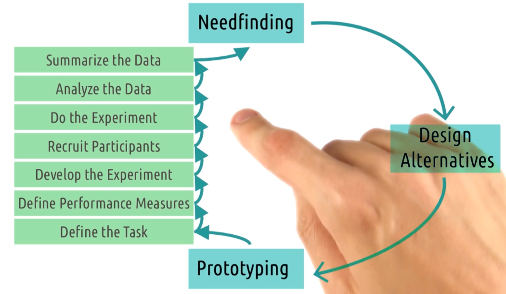
1. Define the task
2. Define performance measures - avoid confirmation bias
3. Develop the experiment
4. Recruit participants
5. Do the experiment
6. Analyze the data
7. Summarize the data

- Can loop thru the design cycle multiple times

## Qualitative Evaluation
- Getting qualitative feedback from users
- What do you like? Dislike?
- What do you think about this feature?
- What was your goal when you clicked this button?

Ways:
- Interviews
- Think aloud protocols
- Focus groups
- Surveys
- Post Event Protocols

## Designing a Qualitative Evaluation
- Prior Experience vs Live Demonstration
- Synchronous vs Asynchronous (easy to carry out with larger population)
- One interface vs Multiple prototypes
    - Multiple prototypes: to compare (may vary the order to avoid bias)
- Think Aloud Protocol vs Post-Event Protocol
    - Think aloud: ask user to think out loud, explain what they are thinking while they use the system
    - Post-event: ask user to reflect on their experience after they used the system, may forget difficulties at the start
    - use think aloud earlier, then post-event
- Individual vs Group
    - Groups: better explanation, more ideas, bias towards stronger personalities
    - Individuals: force the user the only source of knowledge, no bias

## Capturing Qualitative Evaluation
- Video Recording
    - Pros
        - automated: runs automatically, e.g. screen recording software
        - comprehensive: captures everything, e.g. video camera
        - passive: let's us focus admin the session
    - Cons
        - intrusive: uncomfortable being recorded
        - Non-analyzable: hard to analyze, e.g. 200 hours of footage
        - Screenless:
- Note-taking
    - Pros
        - Cheap
        - Non-intrusive
        - Analyzable
    - Cons
        - Slow: can't keep up with interaction
        - Manual: need to write, ideally have 2 people involve, one ask, one take notes
        - Limited: e.g. how long user hesitate, hard to capture
- Software Logging
    - Pros
        - Automated
        - Passive
        - Analyzable: data or text format
    - Cons
        - Limited: can capture only expressed in the software
        - Narrow: what the user does, not how long user look at something
        - Tech-Sensitive: Need prototype that can log data

## 5 Tips: Qualitative Evaluation
- Run pilot studies
    - Experiment with friends, families before actual study
- Focus on feedback
    - Don't need to explain the rationale behind design decisions
- Use questions when users get stuck
    - Less instructional
- Instruct users what to do, not how
    - Let them figure out how to do it
    - If they do it differently than you expect, that's useful info
- Capture satisfaction
    - Ask users how they feel about the system

## Empirical Evaluation
- Evaluate something formal, numeric
- Counting errors, summarizing time on task
- The goal is to get strong conclusions!
- How can we show there is a difference between two interfaces?

## Designing a Empirical Evaluation
- Multiple condition we call treatments
- Treatment: What a participant does in an experiment, e.g. different colors, layouts
- If each participant experiences only one treatment, it's between-subjects design
    - Comparison between two groups of subjects receiving different treatments
- If each participant experiences all treatments, it's within-subjects design
    - Comparison within one group experiencing multiple treatments
    - Which treatment user see first?
    - Random assignment: Using random chance to decide what treatment each participant receives

## Hypotheses Testing
- E.g.what color should we use to alert drive
- Orange vs Green, orange is more quickly noticeable by 0.2 seconds
- Do hypotheses testing: Testing whether or not the data allows us to conclude a difference exists
- See if difference is big enough to be statistically significant, could be random chance

## Quantitative Data and Empirical Tests
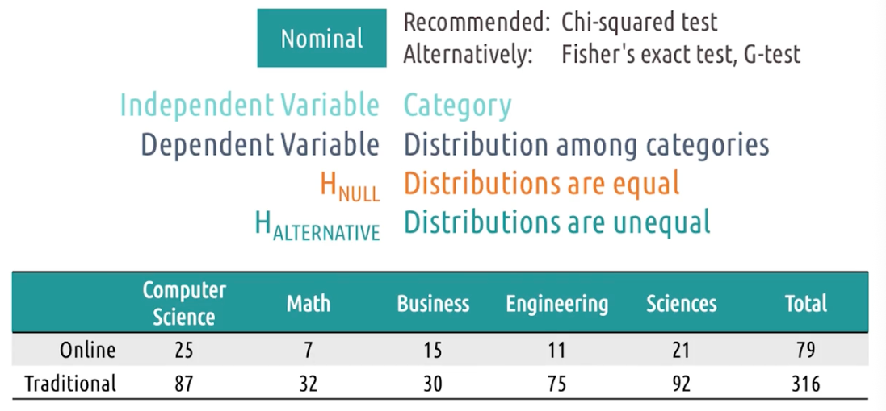
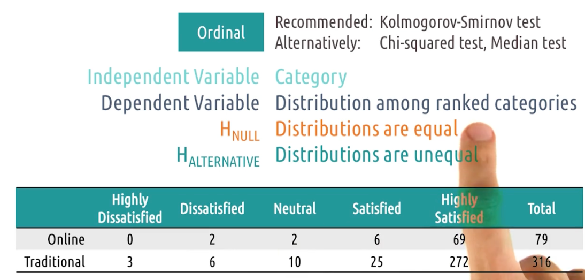
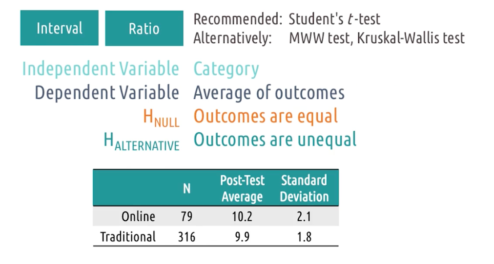
- Nominal
    - Chi-square test: check to see distribution of value in buckets
    - Are the difference big enough to be statistically significant? Or just random chance?
- Ordinal: Kolmogorov-Smirnov test: categories are ranked
    - Sensitive to the fact that the categories are ranked
- Interval/Ratio: Student's t-test: numeric values
    - All we need to know is that the difference is big enough to be statistically significant to justify that one is actually different from the other
    - How big the difference is dependent on the standard deviation of the data

## Special Statistical Tests
- When you have >2 levels of an independent variable, avoid repeated pairwise tests (inflates Type I error / false positives)
- For nominal/ordinal data:
    - Use one overall Chi\-squared test across all levels, then (only if significant) do follow\-up pairwise comparisons to locate the difference
- For interval/ratio data with \>2 groups:
    - Use a one\-way ANOVA (overall difference), then follow with pairwise t\-tests if significant
    - Two\-way ANOVA supports two independent variables and can reveal interaction effects
- For non\-categorical independent variables (interval/ratio predictors):
    - Use regression (e.g., linear/logistic); report strength of fit, not just a binary reject/fail\-to\-reject
- For binary outcomes per trial (success/failure):
    - Use a binomial test (one\-sample vs a baseline rate; two\-sample to compare success rates between conditions)

## Summary of Empirical Tests
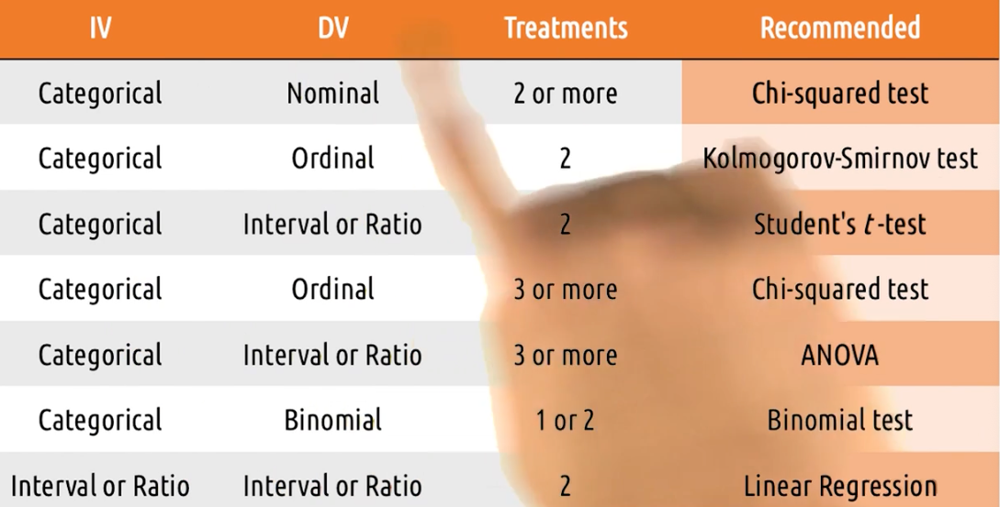

## 5 Tips: Empirical Evaluation
- Control what you can, document what you can't
    - Try to make treatment as identical as possible, if not possible document them
- Limit your variables
    - Focus on varying on one or two things and monitor handful of things in response
    - Nothing wrong, modify one variable and monitor one variable
- Work backwards
    - Decide at the start what question what we want to answer
    - Decide the analysis you want to use
    - Decide what data we wanna gather
- Script your analyses in advance
    - Ronald coase "if you torture the data long enough, it will confess to anything"
    - If we try many different analyses, we may find something that looks significant but actually is just random chance
- Pay attention to power
    - If we want to detect a small effect, we need more participants
    - If we want to detect a large effect, we need less participants

## Predictive Evaluation
- Predictive evaluation is best used as a rapid, low-cost substitute only when real user testing isn’t feasible
- (better than nothing, not a replacement for qualitative or empirical evaluation)

## Types of Predictive Evaluation
- Heuristic evaluation: give the interface + heuristics to multiple experts; each evaluates independently and reports heuristic violations
- Model-based evaluation: trace a user task model (e.g., GOMS) through the new interface and compare against an existing workflow to judge efficiency/fit for target users
- Simulation-based evaluation: build an agent that interacts like a human user and run many trials to test prototypes at scale (high effort to build, high payoff for large/high-stakes systems)

## Cognitive Walkthrough
- Stepped thru the process of interacting with an interface, mentally in each stage what the user seeing and thinking and doing
- At each step, check the Gulf of Execution: is the next action discoverable/obvious given what the user sees?
- At each step, check the Gulf of Evaluation: does the system provide feedback that clearly confirms what happened and that it worked?
- Record breakdowns where the user might hesitate, choose the wrong action, or misinterpret feedback.
- Watch for missing or ambiguous feedback (e.g., note saved vs. not saved), not just whether the flow “works”.
- Include exit paths like cancel/undo, and verify the UI communicates the outcome (e.g., *Saved* vs. *Canceled*) explicitly, not only through implicit state changes.
- Main limitation: the evaluator is often the designer, so bias/expert blind spot can hide issues unless you deliberately “roleplay” a novice.

## Evaluating Prototypes
- Qualitative analysis
- Quantitative analysis
- Wizard of Oz
- Predictive evaluation
- To constantly apply multiple evaluation techniques to center our designs on the user

## Exercise: Evaluation Pros and Cons
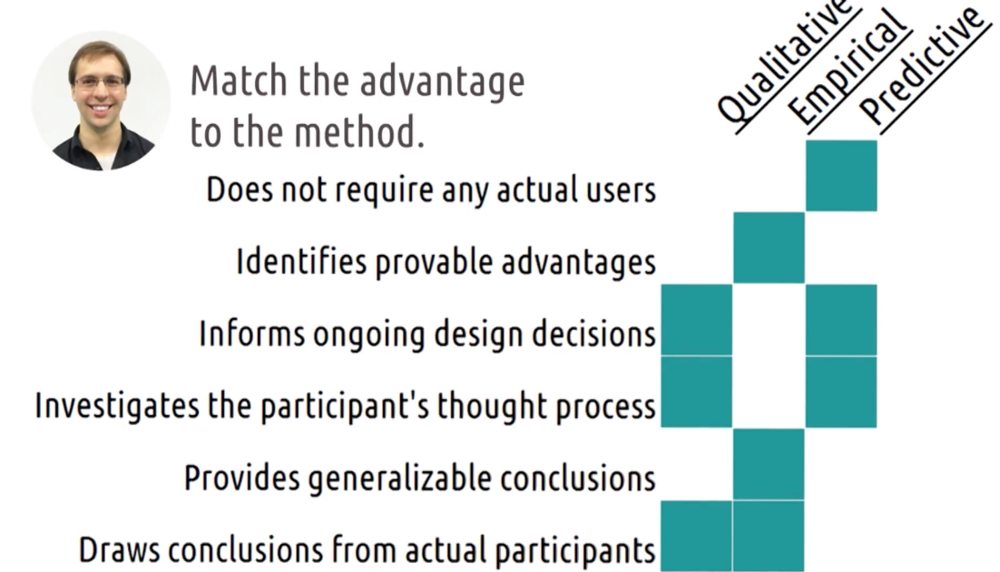

## Exploring HCI: Evaluation
- What kind of evaluation do we choose, and why? 

---

# 3.7: HCI and Agile Development

## The Demands for Rapid HCI
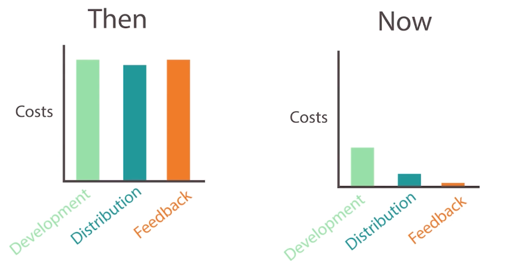
- "A delayed game is eventually good, a rushed game is forever bad"
- Above no longer applies, cause we can update software after release
- Build fast, iterate often

## Exercise: When to go Agile
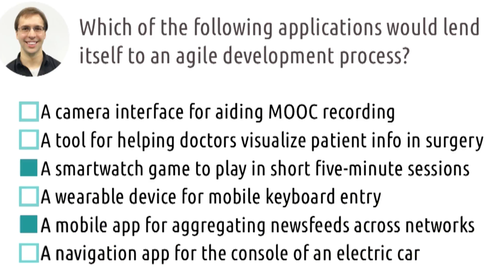

## When to go Agile
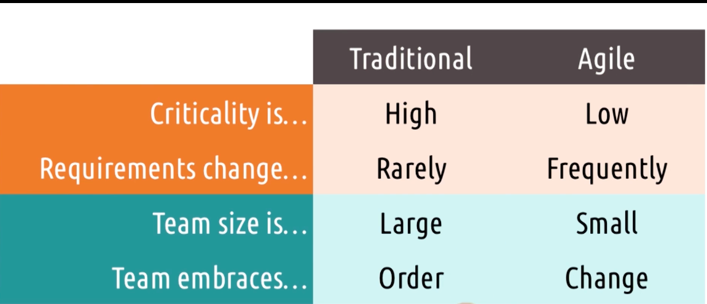
- Agile can only be used at certain times

## Paper Spotlight: Towards a Framework for Integrating Agile Development and User-Centered Design
- Steve Chamberlain
- Agile rely on iterative development
- Heavy emphasis on user's role and team coherence
- 5 principles on integrating User Centric Design and Agile
    - User Involvement
    - Collaboration and Culture
    - Prototyping
    - Project Lifecycle
    - Project Management

## Live Prototyping
- Optimizely: drag and drop to create different versions of a webpage
- Cost of failure is low, so we can try many different designs
- Possible benefits might outweigh the cost of failure

## A/B Testing
- Rapid software testing between A and B
- Small changes with real users
- B is the improved version of A
-

## Agile HCI in the Design Life Cycle
- Doesnt replace design life cycle, but "caffeinates" it
- Changes the rate at which we go through the design life cycle

## 5 Tips: Mitigating risk in HCI and Agile Development
- Start more traditional
    - Only do Agile with have something up and running, but we need something solid to begin with
- Focus on small changes
- Adopt a parallel track method
    - Usually have short 2 -week sprints
- Be careful with consistency
    - if our website has frequent users, we want to be conservative about how we manage user's expectation
- Nest your design cycles
    - Each cycle give a bit info
    - Collect info from each cycle to inform the next cycle

## Exploring HCI: Agile Development

--- 

# 3.8: Conclusion to Methods

## Designing Audiobooks for Exercise 1
- Needfinding
    - Go to park and observe people exercising
    - Surveys
- Design alternatives
    - Different scenarios and personas
- Prototyping
    - wizard of oz
    - paper prototype
- Evaluation
    - get feedback from users
- We still don't have yet, what next? Go back to needfinding

## Designing Audiobooks for Exercise 2
- Needfinding (iterate, don’t restart)
    - Use what you learned from prototyping + evaluation to refine your understanding of the task (e.g., gestures still hard even “hands-free” because arms move a lot)
    - Add new questions based on feedback (e.g., users ask for rewind → find out how common/important it is)
- Design alternatives (expand + revise ideas)
    - Build on current concepts instead of tossing them out
    - Brainstorm using the same personas/scenarios, plus any new insights from iteration 1
    - Consider new concepts that only become obvious after seeing the first prototype in action
- Prototyping (build what’s feasible, fast)
    - Increase fidelity where you can, but adjust when tech/resources aren’t ready
    - Keep the focus on usability by “faking” hard parts:
    - simplified voice commands (even crude recognition)
    - wireframes instead of full app integration
    - Wizard-of-Oz support (a person triggers playback/behaviors behind the scenes)
    - Drop/avoid prototype paths that violate constraints (too expensive, not truly hands-free, etc.)
- Evaluation (more objective over time)
    - Still collect qualitative feedback (experience, frustrations, expectations)
    - Add more empirical measures as fidelity rises:
    - time to complete key actions
    - failure points / what blocks interaction (noise breaks voice, interaction is too distracting, etc.)
- Next step
    - No final product yet but higher fidelity prototype → synthesize results and loop back to Needfinding for the next iteration

## Designing Audiobooks for Exercise 3
- Needfinding (refined understanding)
    - Hands-free interaction is generally more usable for exercisers.
    - Pure gestures are still not technologically feasible/reliable enough.
    - Voice commands fail in common real contexts (e.g., loud areas).
- Design alternatives (Iteration 3: hybrid concept)
    - Propose a hybrid interface: voice + on-screen touch are complementary, not competing.
    - Primary mode: voice (maximizes hands-free usability most of the time).
    - Fallback mode: touch when voice is unreliable (noise, recognition failure).
    - Goal: maintain full functionality in all environments while minimizing friction.
- Prototyping (merge previous prototypes, keep fidelity low)
    - Combine the prior voice prototype and screen-based prototype into one prototype.
    - Keep it low-fidelity initially because this specific integration hasn’t been validated and higher-fidelity builds are expensive.
- Evaluation (gate to implementation)
    - Test whether the hybrid actually resolves the earlier weaknesses:
    - usability in loud areas (touch fallback works)
    - reduced gulf of execution (voice reduces required on-screen navigation)
    - If results are “good enough,” proceed to implementation/deployment (move beyond prototyping).

## Designing Audiobooks for Exercise 4
- Post-launch needfinding (now data-driven)
    - Use usage analytics, error logs, support tickets, and App Store reviews as needfinding inputs.
    - Real users reveal unexpected contexts and edge cases (e.g., people using it while driving).
    - New/updated requirements emerge
    - Subtle control needs (e.g., more precise rewind/fast-forward).
    - New feature demands driven by real environments (e.g., coexist with a navigation app while driving).
- Design alternatives (in response to live needs)
    - Brainstorm targeted improvements (e.g., “back 5 seconds” vs “back 15 seconds”; voice vs touch tradeoffs in cars).
- Prototyping (small, cheap experiments first)
    - Prototype incremental controls/commands before committing to expensive builds.
    - Changes can be scoped as small UI tweaks or larger interaction redesigns.
- Evaluation (at scale)
    - Evaluate with A/B tests, telemetry, and real-world task success/failure rates—beyond lab sessions.
        - Release => repeat (nested cycles)
        - Weekly patches, monthly feature updates, yearly redesigns.
    - The lifecycle becomes iterative forever, unless the product is abandoned.

## Research Methods Meet Design Principles
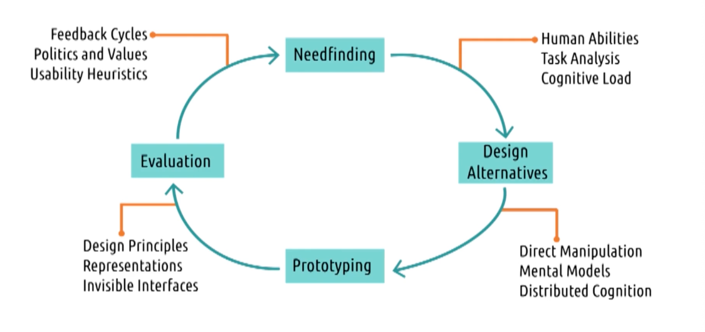

## Exploring HCI: HCI Methods Revisited

## Approaches to User-Centered Design
- Participatory Design
    - Users are part of the design team
    - Omnipresent thruout the design process
    - Careful not to over-represent that one user's view
- Action research
    - Addreses an immediate problem while also studying the process of solving that problem
    - Action research undertaken by the actual users
- Design-based research
    - Same like action research, but can be don by outside researchers as well
    - To improve the theory of our problem

- Iterations still play a key role in all these approaches
- Adjusting to new trends and technologies
  