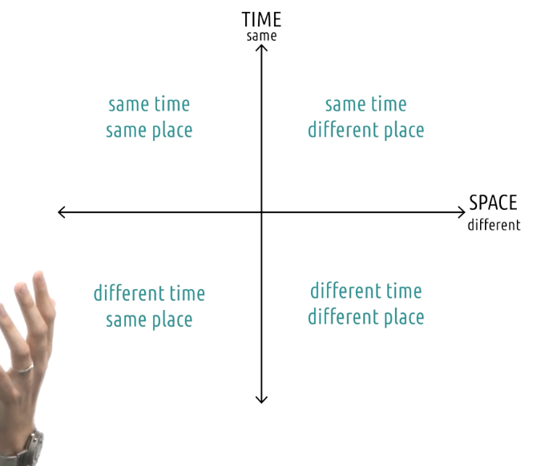

# Content
- Watch lessons 1.1 through 1.3 (1)

# Assignments
- ~~Complete CITI Training (7)~~
- ~~Complete the syllabus comprehension quiz (<0.5)~~

# Readings
Lesson 1.1 (Introduction to Human-Computer Interaction)
- ~~MacKenzie, I.S. (2013). Chapter 1: Historical Context. Human-Computer Interaction: An Empirical Research Perspective. (pp. 1-26). Waltham, MA: Elsevier.~~
- Norman, D. (2013). Chapter 1: The Psychopathology of Everyday Things. In The Design of Everyday Things: Revised and Expanded Edition. (pp. 1-36). Arizona: Basic Books.

Lesson 1.2 (Introduction to CS6750)
- Joyner, D. (2019). The CHI of Teaching Online: Blurring the Lines Between User Interfaces and Learner Interfaces. In E. Kapros & M. Koutsombogera (Eds.) Designing for the User Experience in Learning Systems, Human-Computer Interaction Series. Springer.

# Miscellany
- ~~Complete the start-of-course survey (<0.5)~~
- ~~Complete the syllabus comprehension quiz (<0.5)~~
- ~~Read through the course syllabus and linked pages (1)~~
- ~~Introduce yourself on the forum and greet your classmates (<0.5)~~
- ~~Complete the secret survey to show you read this page by clicking here (<0.5)~~
- ~~Work on additional participation credit opportunities (1)~~

# Notes

## Introduction to HCI
- In 1992, psychologist at Apple studied how people organized the rapid flow of info in their work spaces
- They observed people pile of materials, then they design system that mimic that ability
- They had better understanding on user
- HCI helps us understand users better

- HCI is about research
  - Needfinding
  - prototyping
  - evaluation
- HCI also is about Design
  - distributed cognition
  - mental models
  - universal design

## AI and HCI
- Marty Hurst, made the observation, as technologies improves, computer interaction moves toward being more natural
- Folders, mimics files in cabinet
- Touch screens and voice recognition, touch them like we touch things in the physical world
- ChatGPT interact with us, in a very human way
- Jakob Nielsen, AI is introducing the 3rd user-interface paradigm in computing history, in which human tell computers what they want, now how to do it

## Introduction to exploring HCI
- 3 areas, 
  - technology: emerging technological capabiliities
  - domain: pre-existing areas that could be significantly disrupted by computer interfaces like healthcare, education, entertainment
  - ideas: theories how people interact with interfaces, and world around them

## Tech: VR
- Interaction and visualisation
- Usually video games, tourism, commerce, education, healthcare
- VR therapy for trauma is new

## Tech: AR
- Incredible opportunities enhancing realities
- Automated speech translation
- Tours in museums
- Restaurant review or menu
- What putting cameras would mean? to check in politics topic

## Tech: UbiComp and wearables
- Figuring out how to build smart device that takes away cognitive load from users
- Rise of wearables like smart watches, fitness trackers
- Advance hearing aids in prostethic limbs

## Tech: Robotics
- Physical construction abilties and artificial intelligence
- Human-robot interaction: how people interact with robots
- How do we ensure that robots don't harm humans through faulty reasoning
- How to integrate robot in social life
- How to deal loss of demand for human work
- Voice and touch? Input properly received and understood?

## Tech: Mobile
- Support experiences from navigation to stargazing
- Presents some fascinating challenges to address
  - can't do all works that can be done on computers, like writing essays

## Idea: Context-sensitive computing
- Context is a fundamental part of human interactions
- Give computer interfaces the contextual knowledge that humans have in their everyday lives
- E,g, use mobile phone differently at sidewalk, sofa or sidewalk

## Idea: Gesture-based interaction
- Hand gestures, big, small, narrow, wide
- Microsoft Kinect, healthcare to gaming
- Wristband that reacts to certain motions
- Maybe it;s possible to type in the air with finger one day

## Idea: Pen- and touch-based interaction
- Shorten the distance between user and task we want to accomplish
- Mouse and screen, look at screen and move mouse
- Touch screen, directly touch what we want to interact with

## Idea: Information visualization
- Conclusion are only useful if we can understand them
- Computers give a powerful way to represent data in complex, animated and interactive ways
- match user's mental model with the task at hand
- A visualization is just a representation of data

## Idea: CSCW
- Computer supported cooperative work
- How do we use computers to support people working together?
- Distributed teams are an example of CSCW
-  

## Idea: Social Computing
- How computers affect how we interact and socialize
- Chat online, emojis? emoticons?

## Domain: Special needs
- help people with special needs
- Robotic prosthetics
- How the person intends to use the limbs to perform tasks
- How do we communicate data to blind person?
- VR for people with paralysis
- Autonomous wheelchair

## Domain: Education
- Designing educational technology is part of HCI
- Cognitive load of students must be on materials itself, not the interface itself

## Domain: Healthcare
- Visualize for better diagnosis
- Certain decision on patient's wellbeing
- Fitbit for fitness modelling
- Virtual reality for therapy

## Domain: Security
- It has to be usable, if not people wont use it
- HCI can improve usability of security in number of ways
- CAPTCHAs, now as simple as checkbox
- Less frustating to users
- Password with complexities, rank like a game
- Incentivize users to create strong passwords

## Domain: Games
- A good game has good logical mapping between actions and effects
- Should feel like user are interacting in the game world
- Many of criticsm are because of HCI, penalty of failures are too high/ too low!

## Reflections: Exploring HCI
- Apply what we learn in our chosen interated area

## Conclusion
- Select a topic that we find interested in, read more about it, and reflect on how HCI concepts apply to it
- 

