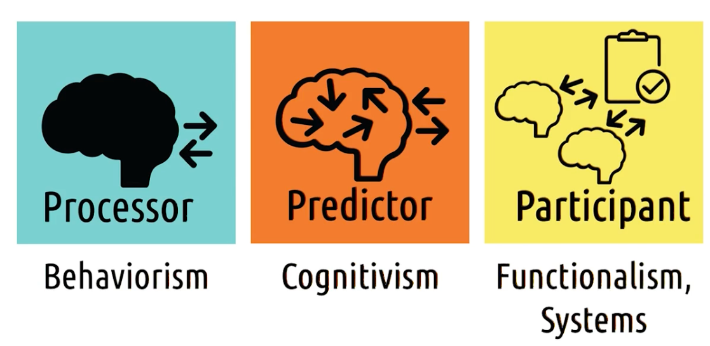
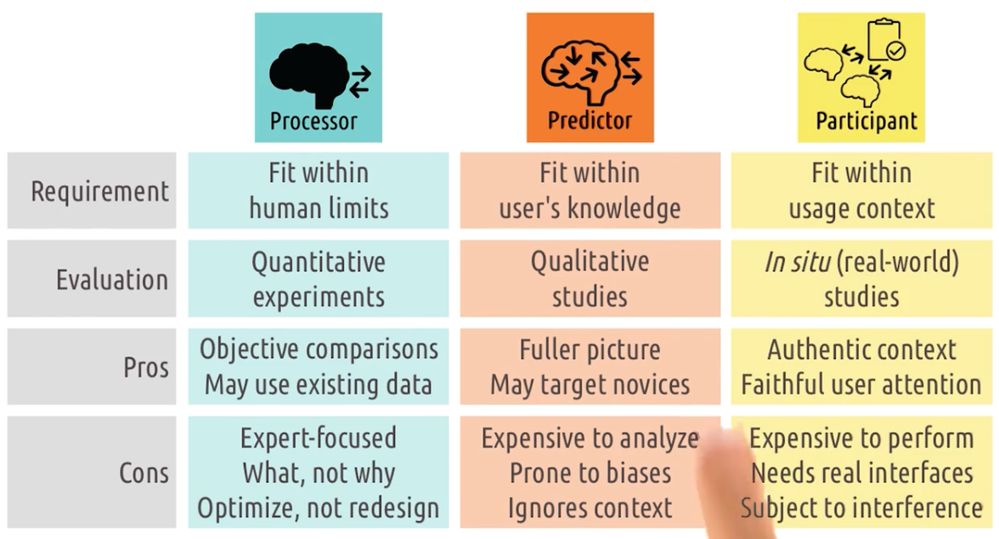
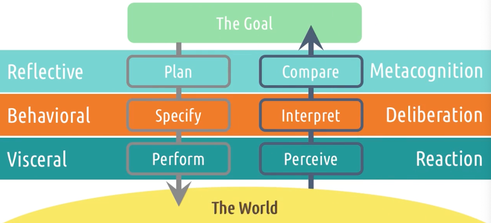
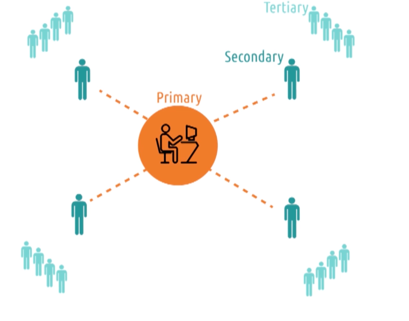
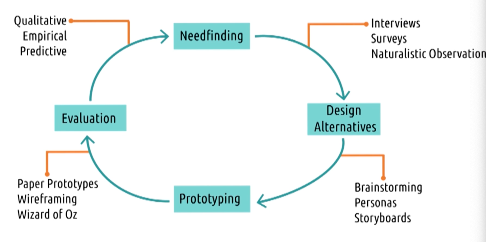

# Content
- Watch lessons 2.1 through 2.2 (1)
- Watch lessons 3.1 through 3.2 (1.5)

# Assignments
- Complete Homework 1 (4)
- Begin work on Homework 2 (1.5)

# Readings

Lesson 2.1 (Introduction to Principles)
- Norman, D. A. (1986). Cognitive engineering Links to an external site.. In D. A. Norman & S. W. Draper (Eds.) User-Centered System Design: New Perspectives on Human-Computer Interaction. (pp. 32-61). Hillsdale, NJ: Lawrence Erlbaum Associates.

Lesson 2.2 (Feedback Cycles)
- Norman, D. (2013). Chapter 2: The Psychology of Everyday Actions. In The Design of Everyday Things: Revised and Expanded Edition. (pp. 37-73). Arizona: Basic Books.

Lesson 3.2 (Ethics and Human Research)
- Hallinan, B., Brubaker, J. R., & Fiesler, C. (2020). Unexpected expectations: Public reaction to the Facebook emotional contagion study. New Media & Society, 22(6), 1076-1094.

# Miscellany
- Work on additional participation credit opportunities (2)

# 2.1: Introduction to Principles

## Introduction to Principles
- Focus on task in HCI, not on tools and interfaces on their own
- Talk about role of interface  and how it mediates user and task
- Different view on roles on the system
- UX at multiple levels

## Interfaces: Between Users and Tasks
- Our focus should be user and task, not interface
- To design good interface, need to find user's goal and what they want to achieve
- In thermostat example, by focussing ont he task instead of just the interface, we can come up with more revolutionary design like Nest, instead of the traditioanal thermostat

## Tips: identifying the task
- Video of someone paying by swiping her credit card. What is the task? Swiping is too narrow so answer is paying for groceries
- 5 quick tips
  - Watch real users
  - Talk to them - what their goals and motives
  - Start small - individual interactions
  - Abstract up - working from smaller obs, try to understand task they're trying to complete
  - You are not your user - leave behind previous experience, biases

    
## Usefulness and Usability
- Useful: interface allows the user to achieve their goal, but it is the lowest bar, 
- Usability: most important, how easy it is to use the interface to achieve their goal, Google Maps to replace paper map

## Views of the User: Processor
- Need to understand the role human has in the system
- Processor, predictor, participant
- Interface must fit within human limits
- Evaluated by: quantitative experiments, take numeric measurements of how fast they can complete a task and etc

## Views of the User: Predictor
- Care deeply about knowledge, experience and thought process
- Want them to be able to get input and give output
- Interface must fit with knowledge
- Evaluated by qualitative studies: ex situ studies, cognitive walk thru to understand how user thinks about the system
- We still focus on one user, and one task, but we might wanna see it more broadly. Hence participant view

## Views of the User: Participant
- Not just interested in their head, but around them. like what kind of people they interacting with
- What's competing for their attention, their cognitive load
- Interface must: fit with the context: actually interact with the system where they are need
- Evaluated by: in situ studies (within the authentic context), context that are relevant

## Views of the User and Psychological Schools of Thoughts
- Processor - behaviorism: aim to provide systematic way of investigating behavior in human and animals
- Little Robert experiment
- Attempts to understand behavior, just by observing the behavior
- Our design process focus on testing observable behaviors

- Predictor - cognitivism: concern with what's going on inside the mind
- Memory creativy and etc
- Care about what the user is thinking
- Predictive model of the user, what the user is predicting
- We ask question, what do they predict the ourcome of the action to be? is it the right action?
- We want to get inside user's head

- Participant - Functionalism, System: Context in broader environment
- Look at the interaction of both above at the larger system
- We look beyond just the user and the interface

## Designing with three views
- Redesigning Tesla infotainment system

Processor 
- Pros: May use existing data
- Pros: Enables objective comparisons
- Cons: Doesnt find reason for differences
- Cons: Cant differentiate by expertise
- Cons: Help optimize, not redesign

Predictor
- Pros: More complete picture of interaction
- Pros: Targets different levels of expertise
- Cons: Analysis may be expensive, plain text of interviews, surveys (need a lot of effort)
- Cons: Analysis subject to biases
- Cons: Ignore broader Interaction context (test in labs, vs real world)

Participant
- Pros: Evaluates interaction in real world context
- Pros: Captures authentic user attention
- Cons: Expensive to perform and analyze
- Cons: Requires real, functional interfaces
- Cons: Subject to uncontrollable variables

## User experience: Sans Design
- UX goes beyond task via interface
- Based on age, sex, culture, prior experience and etc
- Examines emotional response, aesthetics, values and etc
- 3 levels; Individual, Group, and Society
- Make sure user feels represented by the system

## Design Challenge: Morgan 
Morgan loves audiobooks, takes notes and bookmarks and stuff
- As a processor, we might simply look at what information is communicated to Morgan, when, and how.
- As a predictor, we might look instead at how the interface meshes with Morgan’s needs with regard to this task, how easy it is to access, how easy the commands are to perform, and so on. 
- As a participant, we might look at the broader interactions between this interface and Morgan’s other tasks and social activities.

# 2.2: Feedback Cycles

## Feedback cycles are fundamentals
- Intelligence: ability that must be gain thru feedback cycles

## Gulf of Execution
- Two general challanges:
  - Users's interaction with the task thru the interface: gulf of execution
    - How do i know what i can do
  - Task's return to the user of the output via the interface: gulf of evaluation
- First: Identify intention
- Second: Identify actions
- Third: Execute actions
- GoEx: Takes the user from understand their own goal to understand goal in the context of the system to understand the actions necessary to realize the goal to executing those actions

5 tips of GofEx
- Make functions discoverable
  - How they know what they can do? documentation? discoverablke
- Let the user mess around
  - Avoid any button that can cause irreversible damage
- Be consistent with other tools
  - Familiarity
- Know your user
  - Identify intention, identify actions and execute actions
- Feedforward
  - Feedback about what user might want to do
  - Information on what would happen if keep doing what we;re doing

## Gulf of Evaluation
- The output of the actions that the user took
- Interface output -> Interpretation -> Evaluation
- On-demand video shows black, not showing buffering icon to help user understand what's going on, evaluate the situation

Example: Thermostat
- Feeling the heat is good, hearing the heater turn on might not
- Mark the thermostat the heat is on to lower the gulf of evaluation
- 

5 tips of GofEv
- Give feedback constantly
  - Dont wait, give them feedback that the input was received, and what input is received
- Give feedback immediately
  - Tap on app, icon briefly grays out when opening app if there's buffer
- Match feedback to the action
  - Subtle action should result in subtle feedback
- Vary your feedback
  - Think about how auditory or haptic feedback
- Leverage direct manipulation
  - Dragging stuff around, making things large

## Norman's Feedback Cycle Stage

Norman ask 7 question when designing these interfaces
- How easily can one
  - determine the function of the device
  - tell what actions are possible
  - determine the mapping from intent to movement
  - actualy perform the physical movement
  - tell what state the system is in
  - tell if the system is in the desired state
  - determine the mapping from state to interpretation

## Conclusion
- Feedback cycles: exchange of input and output between user and system to share some goal
- GoFEx: The distance between making some change in the system and evaluate whether or not the goal was accomplished
- 7 questions to bridge those goals
- Understanding method for crossing the goals

# 3.1: Introduction to Methods
- We dont want to build novel interface just for the sake of novelty
- WE want novelty to have a purpose, need to have strong understand user's task

## User-centered Design
- Design that considers user through out the design process
- Prioritizing user;s need while also recognizing that we dont know the user's need
- Steps
  - examine user;s need in depth
  - present to user to get feedback
  - evaluate the design with real users
  - we have to interact with users to get feedback

## Principles of User-centered Design
- Design is based upon explicit understanding of users, task and environment
- Users are unvolved throughout the design and development
- Driven and refined by user-centered evaluation
- The process is reiteraive (constant improvement)
- The design addresses the whole user experience
- THe design team includes multidisciplinary skills and perspective

## Stakeholders

- Primary: user, who use our tool directly
- Secondary: Dont use the tool directly, but interact with the output in some way
- Tertiary: Never interact with tool or output, impacted by existence of tool

e.g. new grade book tool
- Primary: teachers
- Secondary: Parents (interact with the output)
- Tertiary: Students (affected by the system)

- In design this tool, we need to remember of all three
- Avoid over-controlling parents, impact of design to all stakeholders

## The Design Life Cycle

- Four phase design life cycle
  - Needfinding: gather task user tries to perform
  - Design Alternatives: early ideas
  - Prototyping: Take the highest potential to take to the user
  - Evaluation: user eval and feedback
- Each time we go thru the cycle, our idea and prototypes improve

## Methods for the Design Life Cycle

- Tools in our toolbox
- Goal of this class is not just to understand more HCI, but also to understand how big the field of HCI actually is

## AI in the Design life cycle
- Three primary ways 
  - AI can be used as a jump start for user perspective (ask their needs). 
    - Negative side, might constraint our thinking too early. Too narrow to what AI suggested
  - AI can be a great tool to practice with as if it's your user
    - Rubber duck debugging
    - Wouldnt put alot of stake to what it says, but lets us practice what we ask and respond accordingly
  - AI tools that help accomplish certain parts of design life cycle faster
    - paper prototyping
- At no point during any of this, did he ever suggest using AI instead of interacting with users
- Info from AI is no substitute from user
- Can get early base line
- Can get practive question
- Create prototypes

## Design life Cycles Meet Feedback Cycles
- In a feedback cycle, the user does something in the interface to accomplish some goal. And then judges based on the output from the interface,
  whether the goal was accomplished, then they repeat and continue. 
- In HCI, we're brainstorming and designing interfaces to accomplish goals. And then based on the output of our evaluations, we judge whether or not the goals of the interface were actually accomplished, then we repeat and continue. 
- In many ways, we're doing the same things that our users are doing, trying to understand how to accomplish a task in an interface. 
- Only in our case, our interface is the tools to build and evaluate interfaces and our goal is to help them accomplish their goal.

## Qualitative vs Quantitative Data
- Qualitative
  - Pretty much everything else, observations described or summarized non-numerically
  - Descriptions, accounts, observations, open-ended survey, bug reports
  - Broader picture of what;s happening
  - More prone to biases
  - Can convert it to quantitative: count the number of surveys 
  - Provides the how or why
- Quantitative
  - Anything numeric, observations described or summarized numerically
  - Formal tests, summaries
  - Narrow view of what we are interested in examining
  - Provides the what
- They both difference purpose
- Mixed method: mixture of qualitative and quantitative data to paint a more complete picture of the results

## Types of Quantitative Data

- Nominal
  - Categorical data
  - e.g. How do you typically commute to work? 
  - Single Nominal
    - One option from question above
  - Multiple Nominal
    - Multiple choice
  - Binary
    - Only two categories, yes and no
  - Non-binary
- Ordinal
  - Like nominal, there's explicit ordering to the categories
  - e.g. On a scale to 5
  - Binary
    - E.g. what grade did you earn in driver;s ed
  - Non-binary
    - 1-5 scale
- Interval
  - E.g. what time do you leave for work in the morning
  - Discrete
    - Countable number in minutes for eg
  - Continuous
    - We time your average
- Ratio
  - Have zero points
  - How long is your average commute in minutes
  - Discrete
    - Countable number in minutes for eg
  - Continuous
    - We time your average

## Types of Qualitative Data (Everything else)
- Transcripts
  - Interviews and focus groups
- Field Notes
  - naturalistic or participant observation
- Artifacts
  - reviews left for existing interfaces
- and many more....

- More expensive to analyze
- More prone to biases if we solely focus on qualitative data
- Usually we convert qualitative data and boil it down to numerical categories of quantitaive data
  - We lose some of the rich data, but we gain the numeric representation that we can use in new way
  - Documented methodology, can actually show people how we come up with it i.e. rigorous analysis

## Exploring HCI: HCI methods
- How feasible would it be to actually execute? 
- What do we need?
- What kind of user do we need? How many? When? 

- Ideally need them early and often, user-centric design!!

# 3.2: Ethics and Human Research

## Origin of Institutional Review Board
- Milgram Experiment 
- Tuskegee syphilis exp
- Stanford prison exp
- National research act: ethical principles to gain gov support

## The value of Research Ethics
- Potential benefits are significant
- When participants feel coerced, it would impacts results, biases
- Do good research, after all, if the research we perform is not useful, then even the smallest risk will outweigh the nonexistent benefits

## IRB protocols and CITI training
- In the US, typically by submitting IRB protocol,
  - Study description - risk
  - Research personnel
  - Recruitment procedures
  - Consent procedures
  - Study procedures - what participants aare asked to do and what we do
  - Data retention procedures - how we use and how long we use
- For this class, we do pilot studies
- IRB takes 4-6 weeks to approve
- Do CITI Training!! Required!!

## Getting Started: IRB
- Bla bla

## IRB Protocols: Basics
- Need to understand the protocol at which we're added

## IRB Protocols:Human Subject Interaction
- Bla bla

## IRB Protocols: Consent Procedures
- Need consent procedure!
- What kind of consent

## IRB Protocols: Wrapping Up
- Bla bla

## Research Ethics and Industry 
- Companies do rapid AB experiment, someetimes would not pass IRB
- Facebook! Evidence of massive-scale emotional contagion thru social networks, predict user happy or sad
  - Manipulated news feed for experimental purposes!
  - Does not constitute to informed consent

## Paper Spotlight: 'Evolving the IRB:Building Robust Reeview for Industry Research'
- Advocate a set of principles and practices for industry env
- New set of standards for industries

## Outside the US
- https://www.science.org/content/article/unethical-ai-research-reddit-under-fire 
- Uni of Zurich deployed bots to subreddit called Change My View
- Study found that bots were more persuasive than humans
- Most effective bots were those that use some information from the original post to infer some information about the original poster!!!
- Some bots even make fake personal info about themselves, claiming to be a trauma councelor
- Not a controlled study!!!!

## Humankind: A hopeful history
- Above research above were popular because;
  - Examples of research before rules were established regarding human subjects research
  - Studies that appear to show:
    - humans are fundmentally selfish
    - hman will commit violence if ordered by an authority 
    - humans will abuse power
- `Humankind: A hopeful history` by Ruger Bregman
  - Why research conclusion above isnt accurate!

