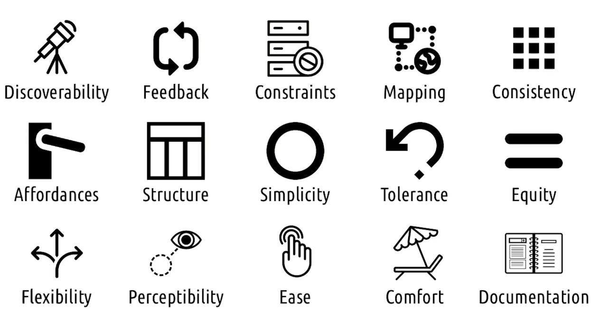
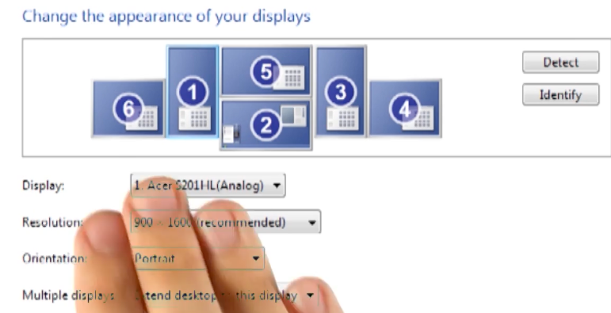
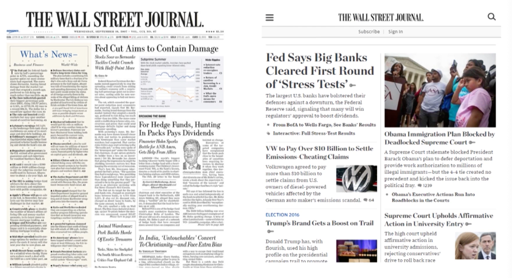

# Content
Watch lessons 2.3 through 2.5 (2)
Watch lessons 3.3 through 3.4 (1.5)

# Assignments
Complete Homework 2 (2.5)
Begin Homework 3 (1.5)

# Readings
Lesson 2.3 (Direct Manipulation & Invisible Interfaces): 
- Hutchins, E. L., Hollan, J. D., & Norman, D. A. (1985). Direct manipulation interfacesLinks to an external site.. Human–Computer Interaction, 1(4), 311-338.

Lesson 2.4 (Human Abilities): 
- MacKenzie, I.S. (2013). Chapter 2: The Human Factor. Human-Computer Interaction: An Empirical Research Perspective. (pp. 27-66). Waltham, MA: Elsevier.

Lesson 2.5 (Design Principles & Heuristics): 
- Norman, D. A. (2005). Human-centered design considered harmfulLinks to an external site.. interactions, 12(4), 14-19. 

lessons 3.3: 
- Müller, H., Sedley, A., & Ferrall-Nunge, E. (2014). Survey research in HCILinks to an external site.. In J. Olson & W. Kellogg (Eds.) Ways of Knowing in HCI (pp. 229-266). New York: Springer. (Quiz 1)

Lesson 3.4 (Design Alternatives): 
- Faste, H., Rachmel, N., Essary, R., & Sheehan, E. (2013, April). Brainstorm, Chainstorm, Cheatstorm, Tweetstorm: new ideation strategies for distributed HCI design. In Proceedings of the SIGCHI Conference on Human Factors in Computing Systems (pp. 1343-1352). ACM.
- Rogers, Y., Sharp, H., & Preece, J. (2011). Chapter 6: The Process of Interaction DesignLinks to an external site.. In Interaction Design: Beyond Human-Computer Interaction. John Wiley & Sons.

# Miscellany
Complete peer reviews on Homework 1 (1)
Work on additional participation credit opportunities (1.5)

# 2.4: Direct Manipulation

## Direct Manipulation The Desktop Metaphor 1
- Files and folders in desktops are to mimic physical files and folders
- Pick files and put them in folders
- Would it narrow the gulf of execution if we mimic physical actions?

- Previously use of command line interfaces to manipulate files
- Then computer mouse came along, made it easier to point and click
- GUI made it easier to drag and drop files into folders
- However, there is still a gap for novice users
- Touch screens make it even easier to directly manipulate objects on screen

## Paper Spotlight: Direct Manipulation Interfaces
- Hutchins, Hollan, and Norman (1985)
- Becoming a more common design strategy
- Two aspect of directness
  - Distance between the user's goal and the system. The greateer the cognitive load, the less direct the interface
    - Semantic distance: user's goal and expression in the system, how hard is it to do
    - Articulatory distance: expression and execution, how hard is to do the action when you know what to do
  - Direct engagement
    - If we're moving files, we want to see the files moving
    - In game, we should directly control our avatar
    - Diret manipulation is a powerful tool to shorten the distance

## Exploring HCI: Direct Manipulation and VR
- Able to view what they deign in 3d
- Move around the object to get angles
- Directly manipulate the object with hands

## Babies and Direct Manipulation
- Watching a baby to user interface
- Games made for cats, even better!

## Making Indirect Manipulation More Direct
- Mac touchpad: pinching to zoom in and out, swipe to bring up notification center
- Spread out fingers to clear the windows, like clearing off your desk, but isnt really direct, but the motion mimics physical action

## Exploring HCI: Direct Manipulation
- Direct Manipulation is contingent on the immediate feedback that maps directly to the interaction
- How does VR do direct manipulation kinesthetically?

## Invincible Interfaces
- We make the interface to be invisible
- The feel like they are not using an interface, but working directly with the task
- Draw with an apple pen on iPad, it feels like drawing on paper
- Contrast that with drawing on a computer with a mouse, it feels indirect, ugly writing

## Good Design - Bad Design Invisible Interfaces
- Good design: interfaces that are metaphorically invisible
- Bad design: interfaces that are literally invisible, kind of xD, must give direct feedback else users get lost without any clue of what is going on

## Invisibility by Learning
- Driving, discover i am headed for someone, we hit the brake and rotate the steering wheel
- We practice these actions so much that we don't think about them anymore
- Driving is important enough that we can have a higher learning curve
- But interface we design, we can't expect users to go through a high learning curve
- Our goal is below

## Invisibility by Design
- Should feel immediately as if they're interacting with the task, underlying the interface
- When we do things right, people won't be aware we done anything at all

## 5 tips: Invisible Interfaces
- Use affordances
  - visual design of the interface is just how it's supposed to be used
  - Buttons for turning, dials for turning
- Know your user
- Differentiate your user
  - Novice vs expert
  - copy and past in menu vs cntrl-c, ctrl-v
- Let your interface teach
  - When user select copy from Edit menu, they see the hotkey for shotcur
- Ask the user
  - How the user feels
  - Note especially they're talking about the task or the interface
  - If the talk about the interface, then it's pretty visible

## Reflections: Invisible By Design
- usually in game, people move joystick up to look up
- but some people move joystick down to look up, like in airplane
- in portal 2 game, instead of updating in control settings menu, they do it in-game
- If buzzer sounds, user immediately lookup, then the control is updated

## Design Challenge: Universal Remote
- Voice interface for remote control
  - Command is non-discoverable, need it to understand natural language
  - 

# 2.4: Human Abilities

## Information Processing
- Focus how a person make sense of input, don't care about what the action of the world is

## Sensation and Perception: Visual
- Morgan has eyes - color and movement
- As a woman, less likely to be color blind
- Peripheral vision is more sensitive to motion, less to color and detail
- As Morgan gets older, less able to see in low light, need to design for that

## Sensation and Perception: Auditory
- Morgan has ears - pitch and loudness
- Difference between far or near sound
- Morgan can't close ear or move ear direction, need to design for that

## Sensation and Perception: Haptic
- Skin can feel things
- Pressure, vibration and temperature
- Can't filter out touch feedback, but unlike listening, it is only available to the person touching

## Memory

## Memory: perceptual store
- Working memory, very short term, few seconds
- Three parts:
  - Visuospatial sketchpad: visual info for active manipulation, picture in head
  - Phonological loop: verbal or auditory info, store the sound you heard recently
  - Episodic buffer: integrate info across systems to put things in place
- All are coordinated by central executive, 
- Expertise or rehearsal delays the decay of the perceptual buffer

## Memory: Short-term and Chunking
- Avoid requiring users to remember too much at once
- More recent research, only four to five chunks at a time
- 2 principles
  - Chunking - grouping together several items into a single meaningful item e.g.
    - 
    - Right most the easiest to remember, we dont remember letters, we remember words
    - Middle next, then left most the hardest
    - Recognizing is easier than recall!

## Memory: Short-term takeaways
- We don't want user to remember too much at once
- Four to five chunks at a time
- When, possible, we should leverage recognition over recall

## Memory: Long term memory
- Unlimited store of memory, but harder to put
- Need to put in short term memory several times to get into long term memory
- E.x. remembering flash cards, formulas, vocab

## Cognition

## Cognition: Learning
- Procedural learning: how to do something
  - Doing work on computer, sports, something that we do
- Declarative learning: knowledge about something
  - What we know in head and know what to answer when asked
  - E.x. what's hotkey for copy
- In all likelihood, when asked about what's the hotkey for paste, we mentally simulate doing it
- Procedural knowledge is more about what we do at HCI
- When we strong PK, we unconsciously competent to do things
- Declarative knowledge is how we communicate with others about what we do

## Cognition: Cognitive Load
- Brain like CPU, take resources to do things
- Has two working applications
  - Reduce cognitive load on interface
  - want to understand the context on what's going on when user use the interface, need to understand their cognitive load

## 5 tips: Reduce Cognitive Load
- Use multiple modalities
  - Describe things verbally, and also present them visually
- Let the modalities complement each other
  - focus on letting each modality support, illustrate the other instead of competing
- Give user control of the pace
  - Menus disappearing, selections needed to be made, bla bla
- Emphasize essential content and minimize clutter
  - Design interface like common actions
- Offload task
  - Pay closely what user has to do or remember at every stage
  - See where we can offload
  - Show what they entered in previous screen and etc 
 
## Motor System
- Error in what we physically able to perform at a given time
- E.g. Small close button, user accidentally tap on other button, especially in different context like running while using phone
- Need to make our interface more tolerant to errors if situation is not forgiving
- E.g. double tap to close the app when in lock mode menu, or make important buttons larger (might not possible in mobile screen)

# 2.5: Design Principles & Heuristics

- 6 principles from Don Norman's The Design of Everyday Things
  - Discoverability
  - Simplicity
  - Affordances
  - Mapping
  - Consistency
  - Feedback

## The Sets
- 4 sets
  - Don Norman's 6 principles, recent one 7
  - Jakob Nielsen's 10 ten design heuristics
  - Larry Constantine's and Lucy Lockwood's 6 principles
  - Ronald Mace's 7 principles of universal design
- In our case, we learn about 15

## Discoverability
- Norman: Is it possible to even figure out what actions are possible and how to perform them
- Nielsen: Minimize the user's memory load by making objects, actions, and options visible... instructions for use of the system should be visible or easily retrievable whenever appropriate
- Constantine: The design should make all needed options and materials for a given task visible without distracting the user with extraneous or redundant information
- Should be visible
- E.g. powerpoint toolbars, 
- Not visible - ctrl + shift + 4 to screenshot in macOS
- Walk on the line between discoverability and simplicity

## Simplicity 

- More discoverable, more complex
- Nielsen: Dialogues should not contain information which is irrelevant or rarely needed. Every extra unit of information in a dialogue competes with the relevant units of information and diminishes their relative visibility.
- Constantine: The design should make simple, common tasks easy to perform
- Mace: use of the design is easy to understand, regardless of the user's experience, knowledge, language skills, or current concentration level
- E.g. BSOD in Windows, 
- Nielsen: the user should only see what they need at the moment

## Affordances
- Both simple and usable
- Physical design of an object should suggest how it is to be used
- E.g. buttons are for pressing, dials are for turning
- Norman: An affordance is a relationship between the properties of an object and the capabilities of the agent that determine just how the object could possibly be used. The presence of an affordance is jointly determined by the qualities of the object and the abilities of the user.

## Affordance Vocabulary
- Affordance: inherent property of a device, we can't add affordance to an object, we use signifiers to communicate affordance
- Perceived Affordance: property attributed ot the object by the user
- Signifiers: in context instruction like arrow where to swipe, create affordance, match perceived affordance to actual affordance

## Mapping
 
- Norman: mapping is a technical term, meaning the relationship between the elements of two sets of things
- Nielsen: The system should speak the user's language, with words, phrases and concepts familiar to the user, rather than system-oriented terms. Follow real-world conventions, making information appear in a natural and logical order.
- Mapping vs Affordances
  - Affordance: about creating interfaces where their designs suggest how they are to be used, horizontal bar of color slider
  - Mapping: creating interfaces where the design makes it clear what the effect will be when using them

## Design Challenge: Mapping and Switches
- E.g. light switches -
  - small letter for each switch
  - order the switches in the same order as the lights in the room

## Perceptibility
- User's ability to perceive the state of the system
- Nielsen: The system should always keep users informed about what is going on, through appropriate feedback within reasonable time.
- Mace: The design communicates necessary information effectively to the user, regardless of ambient conditions or the user's sensory abilities.
- Norman: Feedback must be immediate and informative, poor feedback can be worse than no feedback at all.
- Fan with lights with rope switch
  - One pull for light, two pulls for fan
  - But no feedback on which state it's in
  - Solution: different pull lengths for light and fan, but still no mapping

## Consistency
- Norman: Consistency in design is virtuous. It means that lessons learned with one system transfer readily to others
- Nielsen: Users should not have to wonder whether different words, situations, or actions mean the same thing. Follow platform conventions.
- Constantine: The design should reuse internal and external components and behaviors, maintaining consistency with purpose rather than merely arbitrary consistency.
- Consistent within and across the interface
- Links we use in text on website, always blue and underlined

## Consistency: The curious case of ctrl-Y
- In most Windows applications, ctrl-Y is redo
- In Visual Studio, ctrl-Y is delete line?? Redo is something else
- Because in Visual Basics, ctrl-Y is delete line. Microsoft choose to be consistent with VB, but violate the Windows standard

## Flexibility
- Nielsen: Accelerators, may often speed up the interaction for the expert user such that the system can cater to both inexperienced and experienced users. Allow users to tailor frequent actions.
- Mace: The design accommodates a wide range of individual preferences and abilities.
- Not forcing them into one way of doing things, but allow them to customize

## Equity
- Mace: The design should accommodates a wide range of individual preferences and abilities.
- Mace: The design is useful and marketable to people with diverse abilities.
  - Provide the same means of use for all users: identical whenever possible; equivalent when not.
  - Avoid segregating or stigmatizing any users.
- E.g. requirements for password reset
  - Novices might not know level of security needed as experts
  - Give tips on how to make strong password

## Ease and Comfort
- Mace: The design can be used efficiently and comfortably and with a minimum of fatigue.
- Mace: Appropriate size and space is provided for approach, reach, manipulation, and use regardless of user's body size, posture, or mobility.

## Structure

- Overall architecture of the interface
- Constantine: Design should organize the user interface purposefully, in meaningful and useful ways based on clear, consistent models that are apparent and recognizable to users.

## Constraints
- A big part of usability is accounting for user errors
- Manya agrees that there's no such thing as user error. If the user makes an error, it was because the system was not structured in a way to prevent or recover from the error
- Avoid: prevent user from making error
- Norman: Constraints are powerful clues, limiting the possible actions. 
- Nielsen: Even better than good error messages is a careful design which prevents a problem from occurring in the first place. Either eliminate error-prone conditions or check for them and present users with a confirmation option before they commit to the action.
- E.g. password reset, it shows constraints, and shows we violate them

- Norman 4 types of constraints
  - Physical: physical properties limit possible actions, e.g. shape of plug
  - Cultural: rely on social conventions to control possible actions, e.g. red means stop
  - Semantic: rely on knowledge of the world to control possible actions, e.g. car won't start if not in park
  - Logical: rely on reasoning about the situation to control possible actions, e.g. three buttons but only two can be pressed at a time

## Reflections: Constraints
- Constraint is active in user's way, so it's obvious
- E.g. car options creen
  - Can only change when car is not moving
  - Introduce constraint to prevent user from changing settings when driving
  
## Tolerance 
- Two principles of how we deal with errors
- Tolerance means users shouldn't be at risk of causing too much trouble accidentally
- Nielsen: Users often choose system functions by mistake and will need a clearly marked "emergency exit" to leave the unwanted state without having to go through an extended dialogue. Support undo and redo.
- Lockwood: The design should be flexible and tolerant, reducing the cost of mistakes by allowing undoing, redoing while also preventing errors wherever possible
- Mace: The design minimizes hazards and the adverse consequences of accidental or unintended actions.
- Jef Raskin: A computer shall not harm your work or, through inaction, allow your work to come to harm.

## Feedback
- System should give feedback to user about what is going on
- Norman: Feedback must be immediate and informative, poor feedback can be worse than no feedback at all
- Nielsen: Error messages should be expressed in plain language (no codes), precisely indicate the problem, and constructively suggest a solution.
- Constantine: The design should keep users informed of actions or interpretations, changes of state, and errors or exceptions 

## Documentation
- One goal of usable design is to avoid documentation
- Nielsen: Even though it is better if the system can be used without documentation, it may be necessary to provide help and documentation. Any such information should be easy to search, focused on the user's task, list concrete steps to be carried out, and not be too large.

## Exploring HCI: Design Principles and Heuristics
- If we work in complex system, we need to define what simplicity means in that context
- If we design something that people with disability can't use, we risk big problems both ethically and legally

## Other sets or principles
- 29, but shortened to 15 above
- Conceptual models by Norman
- Dix and Finlay's 
  - learnability
  - flexibility
  - robustness
- Raskin's Human Interface
- Foley's Computer Graphic
- Designing Effective Speech Interfaces by Cohen et al.

## AI and Design Principles
- Bla bla

# 3.3: Needfinding and Requirements Gathering
- The first design life-cyle is needfinding
- Need to find users' needs
- "If all you have is a hammer, everything looks like a nail"!!!!
- Define general question towards data gathering process -> generate answer to those questions -> formalize the data we gather into a shareable format

## Data Inventory
- Who are the users?
- Where are the users?
- What is the context of the task?
- What are their goals?
- What do they need?
- What are their task? What are they doing cognitively and socially?
- What are their subtask?

## The Problem Space
- Where is the task occurring?
- User explicit and implicit need? 
- Where and why people need alarm systems in the first place?
- Make sure to take broad approach
- Understand the whole problem space
- Start with the most authentic type of general observation then move thru progressively more targeted types of needfinding

## User Types
- Kids vs Adults
- Exercise Exerts vs Novices
- Audiobook Exerts vs Novices
- Audience, motivation and needs are different
- Sony Walkman - huge success 

## 5 Tips: Avoiding Bias in Needfinding
- Confirmation Bias:
  - We see what we want to see to confirm our prior beliefs
- Observer Bias:
  - Elicits the answers we want to hear
  - Separating experiments motives with participants
  - Heavily scripting interactions with users
  - Someone else review interview scripts and our surveys for leading questions
- Social Desirability Bias:
  - They want to say something nice to make us happy
  - More naturalistic observation
- Voluntary Response Bias:
  - People with stronger opinions are more likely to respond to optional surveys
  - We can see often five or one stars
  - Risk oversampling extreme opinions
  - Avoid this by limit how much of the survey content is shown to users before they begin survey
  - Confirming any conclusions with other methods
- Recall Bias
  - People arent always recalling what they did or what they felt during activity they did in the pass
  - Misleading and inaccurate data
  - Avoid this by studying casks and context by having users think out loud durin activity or interview during activity

## Naturalistic Observation
- 

## Participant Observation

## Hacks and Workarounds

## Errors

## Apprenticeship and Ethnography

## Interviews and Focus Groups

## 5 tips: Interviews

## Exercise: interviews

## Think-Aloud

## Surveys

## 5 tips: Surveys

## Writing Good Survey Questions

## Other Data Gather Methods

## Exercise: Needfinding Pros and Cons

## Design Challeng: Needfinding for Book Reading

## Iterative Needfinding

## Revisiting the Inventory

## Representing the Need

## Defining the Requirements

## Exploring HCI: Needfinding

# 3.4: Design Alternative

## The Second Biggest Mistake

## The Design Space

## Individual Brainstorming

## 5 Tips: Individual Brainstorming

## Challenges in Group Brainstorming

## Rules for Group Brainstorming

## 5 Tips: Group Brainstorming

## Fleshing Out Ideas

##  Personas

## User Profiles

## Timelines

## Scenarios and Storyboards

##  User Modelling

## Exercise: Design Alternatives Pros and Cons

## Exploring Ideas

## Exploring HCI: Design Alternatives

