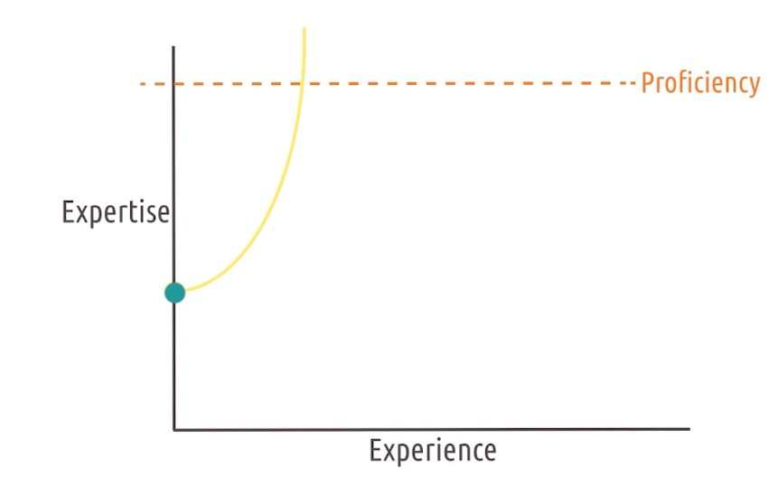
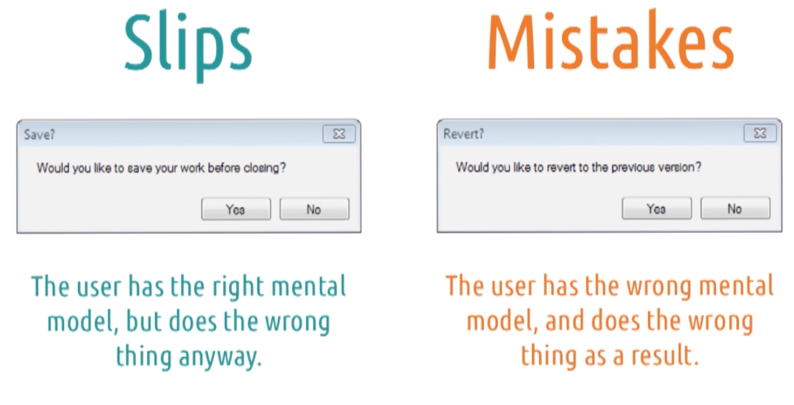
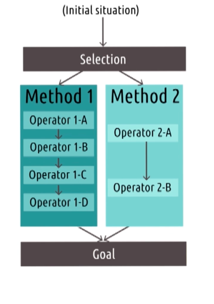
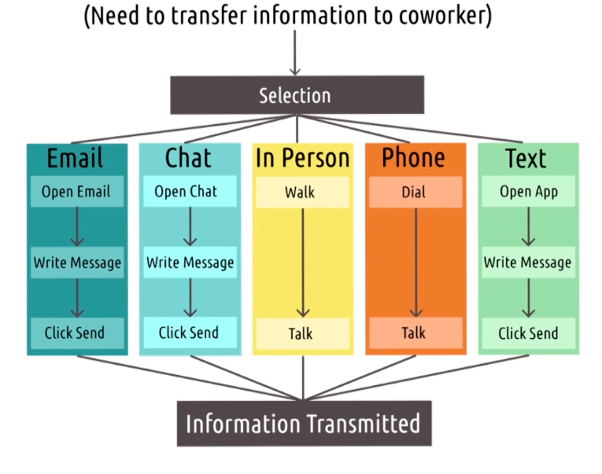
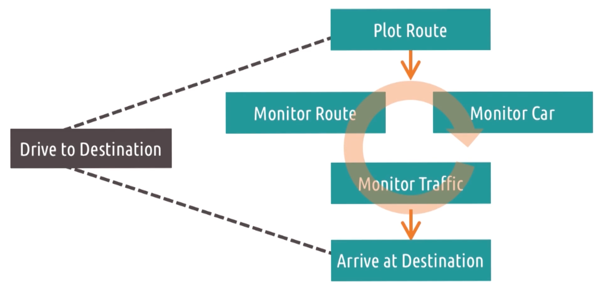
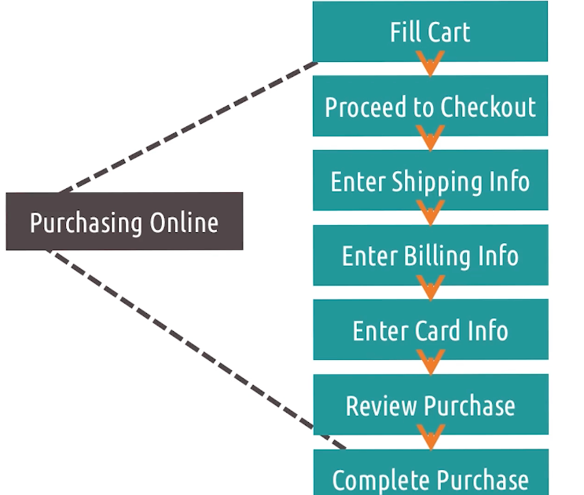
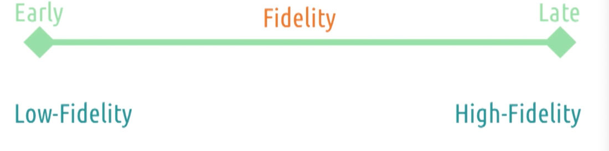
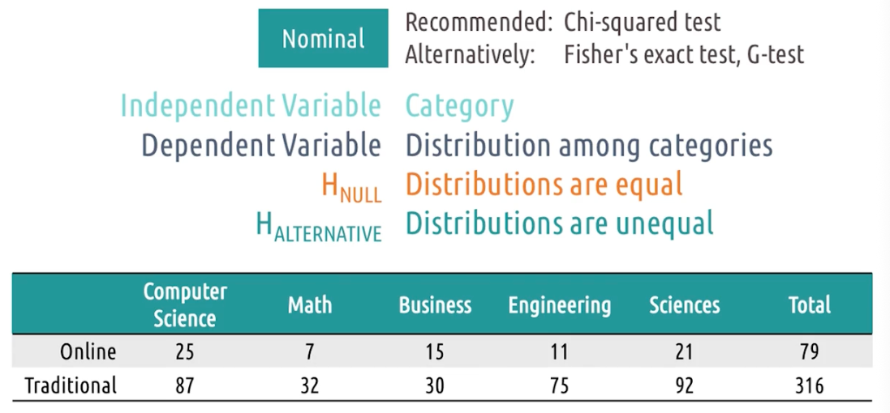

# Content
- Watch lessons 2.6 through 2.7 (2)
- Watch lessons 3.5 through 3.6 (1.5)

# Assignments
- Complete Homework 3 (2.5)
- Begin Homework 4 (1)
- Begin brainstorming individual project ideas (1)

# Readings
Lesson 2.6 (Mental Models & Representations)
- MacKenzie, I.S. (2013). Section 3.4: Mental Models & Metaphor. Human-Computer Interaction: An Empirical Research Perspective. (pp. 88-92). Waltham, MA: Elsevier.
- MacKenzie, I.S. (2013). Section 3.8: Interaction errors. Human-Computer Interaction: An Empirical Research Perspective. (pp. 111-116). Waltham, MA: Elsevier.
- **Norman, D. (2013). Chapter 5: Human Error? No, Bad Design. In The Design of Everyday Things: Revised and Expanded Edition. (pp. 162-216). Arizona: Basic Books.**

Lesson 2.7 (Task Analysis)
- West, R. L., Wong, A., & Vera, A. H. (2022, May). GOMS, distributed cognition, and the knowledge structures of organizations. In Proceedings of the Twentieth Annual Conference of the Cognitive Science Society (pp. 1124-1129). Routledge.

Lesson 3.5 (Prototyping)
- Houde, S., & Hill, C. (1997). What do prototypes prototype?Links to an external site. In M. Helandar, T.K. Landaeur, & P. Prabhu (Eds). Handbook of Human-Computer Interaction, 2. (pp. 367-381). Elsevier Science. (Quiz 2)
- Beaudouin-Lafon, M., & Mackay, W. (2003). Prototyping tools and techniquesLinks to an external site.. Human Computer Interaction-Development Process. (pp. 101-142). (Quiz 2)

Lesson 3.6 (Evaluation)
- MacKenzie, I.S. (2013). Chapter 5: Designing HCI Experiments. Human-Computer Interaction: An Empirical Research Perspective. (pp. 157-188). Waltham, MA: Elsevier. (Quiz 3)
- Nielsen, J., & Molich, R. (1990, March). Heuristic evaluation of user interfacesLinks to an external site.. In Proceedings of the SIGCHI Conference on Human Factors in Computing Systems (pp. 249-256). ACM.
- Polson, P. G., Lewis, C., Rieman, J., & Wharton, C. (1992). Cognitive walkthroughs: a method for theory-based evaluation of user interfacesLinks to an external site.. International Journal of Man-Machine Studies, 36(5). (pp. 741-773).

# Miscellany
- Complete peer reviews on Homework 2 (1)
- Work on additional participation credit opportunities (1)

# 2.6: Mental Models and Representations
- An internal, simulatable understanding of external reality

## Mental Models
- A person's understanding of how something works in the real world
- We generate expectations based on our mental models
- When reality does not match our mental model, it makes us uncomfortable
- We wanna make sure our designs match users' mental models
- There are two ways
  - Designing systems that act the way the use expects them to act
  - Designing systems that teach users how they react, to minimize discomfort

## Mental Models and Education
- Our goal is to teach users through the design of the interface
- Teach users WHILE they are using damn

## 5 tips: Mental Models for Learnable Interfaces
- Predictability
  - Can the user predict what will happen next?
- Synthesizability
  - User should be able to see the sequence of actions that led to their current state
- Familiarity
  - Similar to affordances
- Generalizability
  - Knowledge of one user interface should transfer to another similar interface
- Consistency
  - Behavior of action should be consistent across interfaces

## Representations

- One example is assembly instructions
- Arrows, labels, and exploded views are all representations

## Characteristics of Good Representations
- Good representations:
  - make relationships explicit
  - bring objects and relations together
  - excludes extraneous details
  - expose natural constraints

## Design Challenge: Representations
- Switch box
  - Make the circuit breakers writeable what they control
  - Floor plan on the door with number labels
  - Switch arranged according to the floor plan (crazy)

## Metaphors and Analogies
- Metaphors
  - WSJ articles are the same for printed and online versions
- Analogies
  - We can think of a computer desktop like a real desktop
  - Comparing new concepts to familiar ones
  - When you use analogies, users may not know where the analogy ends

## Exploring HCI: Metaphors and Analogies
- 

## Design Principles Revisited
- We want to be consistent around analogies and metaphors
- They way system looks should match the way it works
- good representations are important because it maps the interface to the task at hand

## New Functionality Meets Old Interfaces
- Innovation
- While we need to leverage analogy and prior experience wherever possible, eventually we're going to do something and it gonna break down
- We gonna need to teach user how to use new functionality

## Learning Curves

- We want a learning curve that grows quickly with little experience
- Rapid learning curve: expertise grows quickly, with relatively lesser experience
- If we use affordances and good representations, we can start expertise at a higher level

## User Error: Slips and Mistakes

- Any user error is a failure of design

- Slips
  - user has the right mental model, but does the wrong thing anyway
- Mistakes
  - User has the wrong mental model, so they do the wrong thing

## Types of Slips
- Two categories:
  - Action-based
    - user performs the wrong or right action, on the wrong object even tho they know the right action
  - Memory-lapse
    - Forget what they knew to do
    - e.g. set timer on microwave but forget to start it

## Types of Mistakes
- 3 categories
  - Rule-based
    - occur where user correctly assesses the state of world, but makes the wrong decision based on it
  - Knowledge-based
    - incorrectly asses the world in the first place
  - Memory-lapse
    - Focuses on forgetting to fully execute the plan, not just forget to do something in the first place

## Exercise: Slips vs Mistakes
- Q: Morgan accidentally sends a text message to the wrong person. Is this a slip or a mistake?
- A: Slip, Morgan knew who to text, but selected the wrong contact
- More pervasive reminders who Morgan is texting

## Learned Helplessness
- What if no discernible interaction between input and output?
- Act in the system over and over again, but nothing changes
- This is what learned helplessness is
- A user's sense that they are helpless to accomplish their goals in an interface
- Can lead to frustration, anxiety, and abandonment of the system
- No one wants to feel helpless, when others are succeeding

## Learned Helplessness and Education 
- In teaching, if students feel like no matter what they do, they can't succeed
- If you're a parent and designer, imagine you are the user and your screaming kid is the interface
- What feedback would you need from your child to help them, and what can you add in that interface

## Expert Blind Spot
- When you're expert, we do task subconsciously
- Lots of things we forgot to say when teaching novices
- Make sure you don't assume that they're expert too, we are not our users!!!
- REPEAT IT!! I AM NOT MY USERS!!!

## Reflections: Learned Helplessness and Expert Blind Spot
- It's important for us to understand to be in the position of helplessness

# 2.7: Task Analysis
- The task is at the heart of HCI

## GOMS Model

- Human information processing model
- It builds off the processor of the human's role in a system
- GOMS stands for Goals, Operators, Methods, and Selection rules
  - Goals: what the user is trying to accomplish
  - Operators: the basic actions the user can take to accomplish the goal
  - Methods: methods for accomplishing the goal using operators
  - Selection rules: guidelines for choosing between different methods

## GOMS Model in Action

## Design Challenge: Security System 1

## Strengths and Weaknesses of GOMS
- Weakness
  - Don't address the complexity of the problems
  - Assumes user is an expert
- Strength
  - Formalize user interaction
  
## Paper Spotlight: The GOMS Family of User Interface Analysis Techniques Comparison and Contrast
- KLM-GOMS: Keystroke-Level Model
- CMN-GOMS: Card, Moran, and Newell GOMS
- NGOMSL: Natural GOMS Language

## 5 Tips: Developing GOMS Models
- Focus on small goals
  - Work in the context of small goals, and abstract up
- Nest goals, not operators
  - Navigation: changing lanes or switch routes
- Differentiate descriptive and prescriptive methods
  - Descriptive: how users actually do
  - Prescriptive: how users should do 
- Assign cost to operators
  - Have some measurement how long each operator takes
- Use GOMS to trim waste
  - GOMS let's us visualize the operators, bolstered by the costs, we can see where we can trim waste

## GOMS to Cognitive Task Analysis
- Another way of examine task, but place higher emphasis on things like memory, attention, and cognitive load
- Adapt predictive view of human role in the system

## Reflections: Task Analysis
- Behaviorism: an approach to psychology that emphasizes behavior as a product of stimuli and the environment
- Cognitivism: an approach to psychology that emphasizes internal thought processes
- Both approaches has significant values

## Cognitive Task Analysis

- Type of method of evaluation of how people complete task
- Cognitive task analyses are concerned with the underlying thought process associated with performing a task
- Most methods follow this sequence
  - Collecting preliminary knowledge. Need a good bit of familiarity with the task
  - Identify knowledge representations. What kind of things user need to know to complete the task. 
  - Apply focused knowledge elicitation methods. Identify all specific actions, knowledge they must have in mind, interruptions that can change the thought process, equipments involved and sensory experiences
  - Analyze and verify data acquired
  - Format results for intended application

## Hierarchical Task Analysis

- Advocates building models of human reasoning and decision-making in complex task
- Tips
  - Abstract out unnecessary details for a certain level of abstraction
  - modularize designs or principles so they can be transferred to different task or context
  - organize the cognitive task analysis in a way that makes it easier to understand
- There will be several level of abstractions, different states and additional annotating info

## Design Challenge: Security System 2

## Cognitive Task Analysis Strengths and Weaknesses
- Strengths
  - Emphasize mental processes
  - Formal enough for interface design
- Weaknesses
- Can be time-consuming
  - Time-intensive
  - May de-emphasize context
  - ill-suited for novices

## Other Task Analysis Frameworks
- Human Information Processor Models
  - KLM: Keystroke-Level Model
  - TLM: Task-Level Model
  - MHP: Model Human Processor
  - CPM-GOMS: Cognitive Perceptual Motor GOMS
  - NGOMSL: Natural GOMS Language
- Cognitive Models
  - CDM: Critical Decision Method
  - TKS: Task Knowledge Structure
  - CFM: Cognitive Function Model
  - Applied CTA
  - Skill-based CTA

## Exploring HCI: Task Analysis 
- 

# 3.5: Prototyping
- We want to actually build things that we can put infront of users
- Want to get feedback and get more complex over time

##  Basics of Prototyping

- Early vs Late Prototyping
- Four main concepts:
  - Representation
    - Verbal
    - Paper
    - Physical
    - Wireframe
    - Functional
    - Wizard of Oz
    - Live
  - Fidelity
    - Low: easy to change
    - High: harder to put together
  - Evaluation
    - Function
    - Interface
    - Performance
  - Scope
    - Horizontal: cover the designs aas whole, but shallow
    - Vertical: deep dive into a few aspects of the design

## Tradeoffs in Prototyping
- Low fidelity
  - Pros
    - easy to create
  - Cons
    - not detailed enough
- High fidelity
  - pros
    - more detailed
  - cons
    - time-consuming
- low fidelity -> high fidelity over time

## 5 Tips: Prototyping
- Keep prototypes easy to change
  - rapid revision and improvement
- Make it clear that it's a prototype
  - if we make it too good, they will look at superficial elements like colors and fonts
- Be creative
  - Our goal is get feedback
- Evaluate risks
  - One of biggest goal of prototyping is to minimize time to pursuing bad design
  - HOW MUCH WOULD YOU LOSE IF YOU FOUND THAT USERS HATES THE PARTS OF YUOR DESIGN THAT THEY HAVENT SEEN YET?
  - If more than couple of hours, try to get feedback so we dont waste time
- Prototype for feedback
  - prototype for the kind of feedback you want to get, not just colors or fonts

## Verbal Prototypes
- Social desirability bias
  - People wanna be nice to you
  - They may not wanna hurt your feelings
- Expert blind-spot
  - analogies can be powerful tool to explain prototupe

## Paper Prototyping
- Draw them out
- Basic layout info
- Easy to change
- Card prototyping: can do some interaction with it: interface 1 in paper 1, click button, then go to interface 2 in paper 2

## Wizard of Oz
- We, behind the curtain, do the things that the interface would do once it's actually implemented
- That way, we can test out the interaction that we plan to design and how well it works
- E.g. audiobook, person A is the user, person B is the wizard who turns pages when user says "next"

## Wireframing
- We use some more detailed tools to mark up what details to look like
- Font size, colors, layout
- Can do it powerpoint, google drawings, paid product axure and balsamiq
- Free tools: PencilProject and Framebox

## Physical Prototypes
- It doesn't have to actually work
- Lots of elements we can test without actually making it work
- Bluetooth device that can press button, we can just make a fake one that looks like it or just a cardboard cutout
- Evaluate the intuitiveness of the design
- Hold something in your hand to see how it feels or works in the real world in different contexts

## Exercise: Prototyping Pros and cons

## Design Life Cycle Revisited
- We go around the design life cycle multiple times
- Over time, we go from low fidelity to high fidelity as we go around the cycle multiple times

## Multi-Level Prototyping
- Use sketches first, then wireframes, then functional prototypes
- Bottom-up approach: design individual screens first, then design overall screen flow
- Top-down approach: design overall screen flow first, then design individual screens
- The points of this is that at any time, prototyping can and should exist at multiple levels of fidelity

## Exploring HCI: Prototyping
- Need to get creative with prototyping
- Gesture or voice interface, we can use Wizard of Oz
- AR? Need to get creative

# 3.6: Evaluation

## Three Types of Evaluation
- 3 categories
- Qualitative
  - Evaluation that emphasizes the totality of a phonemenon
  - What they like, dislike
- Empirical
  - Evaluation based on numeric summaries or observation of phenomenon
  - controlled experiments
- Predictive
  - Evaluation based on systematic application of pre-established principles and heuristics

## Evaluation Terminology
- Reliability
  - Whether a measure consistently returns the smae results for the same phenomenon
- Validity
  - Whether a measure's results actually reflect the underlying phenomenon
  - Can be reliable but not valid
- Generalizability
  - Whether a measure's results can be used to predict phenomena beyond what it measured
  - e.g. measuring usability of a website for college students may not generalize to older adults
- Precision
  - The level of detail a measure supplies
  - 1.30 vs 1.3012 seconds

## 5 tips: What to Evaluate
- Efficiency
  - How quickly can users complete tasks
  - Time users, or predictive models
- Accuracy
  - How many errors do users commit when completing tasks
  - Ideally, we want to reduce number of errors when users complete tasks
- Learnability
  - Sit user down, define expertise, see how long it takes to reach that expertise
- Memorability
    - How easily can users re-learn the system after a period of time
- Satisfaction
  - Cognitive load while they use the system or enjoyment of the system
  - Avoid social desirability bias by e.g. find out how many participants actually download an app they tested after the session is over
  - It's important at the start what we're evaluating, what data we gathering, and how we analyze it

## Evaluation Timeline
- Overtime, evaluation method changes
- From formative to summative
- Formative
  - Evaluation with the intention of improving the interface going forward
- Summative
  - Conclude the design process
  - Hopefully we don't come to this point
- Early evaluation is more qualitative and predictive
- Later evaluation is more empirical
- Predictive tends to be similar to qualitative, they inform how we revise our interface over time
- Low fidelity
  - Lab setting
- High fidelity
  - Field setting

## Evaluation Design

1. Define the task
2. Define performance measures - avoid confirmation bias
3. Develop the experiment 
4. Recruit participants
5. Do the experiment
6. Analyze the data
7. Summarize the data

- Can loop thru the design cycle multiple times

## Qualitative Evaluation
- Getting qualitative feedback from users
- What do you like? Dislike?
- What do you think about this feature?
- What was your goal when you clicked this button?

Ways:
- Interviews
- Think aloud protocols
- Focus groups
- Surveys
- Post Event Protocols

## Designing a Qualitative Evaluation
- Prior Experience vs Live Demonstration
- Synchronous vs Asynchronous (easy to carry out with larger population)
- One interface vs Multiple prototypes
  - Multiple prototypes: to compare (may vary the order to avoid bias)
- Think Aloud Protocol vs Post-Event Protocol
  - Think aloud: ask user to think out loud, explain what they are thinking while they use the system
  - Post-event: ask user to reflect on their experience after they used the system, may forget difficulties at the start
  - use think aloud earlier, then post-event
- Individual vs Group
  - Groups: better explanation, more ideas, bias towards stronger personalities
  - Individuals: force the user the only source of knowledge, no bias

## Capturing Qualitative Evaluation 
- Video Recording
  - Pros
    - automated: runs automatically, e.g. screen recording software
    - comprehensive: captures everything, e.g. video camera
    - passive: let's us focus admin the session
  - Cons
    - intrusive: uncomfortable being recorded
    - Non-analyzable: hard to analyze, e.g. 200 hours of footage 
    - Screenless: 
- Note-taking
  - Pros
    - Cheap
    - Non-intrusive
    - Analyzable
  - Cons
    - Slow: can't keep up with interaction
    - Manual: need to write, ideally have 2 people involve, one ask, one take notes
    - Limited: e.g. how long user hesitate, hard to capture
- Software Logging
  - Pros
    - Automated
    - Passive
    - Analyzable: data or text format
  - Cons
    - Limited: can capture only expressed in the software
    - Narrow: what the user does, not how long user look at something
    - Tech-Sensitive: Need prototype that can log data

## 5 Tips: Qualitative Evaluation
- Run pilot studies
  - Experiment with friends, families before actual study
- Focus on feedback
  - Don't need to explain the rationale behind design decisions
- Use questions when users get stuck
  - Less instructional
- Instruct users what to do, not how
  - Let them figure out how to do it
  - If they do it differently than you expect, that's useful info
- Capture satisfaction
  - Ask users how they feel about the system

## Empirical Evaluation
- Evaluate something formal, numeric
- Counting errors, summarizing time on task
- The goal is to get strong conclusions!
- How can we show there is a difference between two interfaces?

## Designing a Empirical Evaluation
- Multiple condition we call treatments
- Treatment: What a participant does in an experiment, e.g. different colors, layouts
- If each participant experiences only one treatment, it's between-subjects design
  - Comparison between two groups of subjects receiving different treatments
- If each participant experiences all treatments, it's within-subjects design
  - Comparison within one group experiencing multiple treatments
  - Which treatment user see first?
  - Random assignment: Using random chance to decide what treatment each participant receives

## Hypotheses Testing
- E.g.what color should we use to alert drive
- Orange vs Green, orange is more quickly noticeable by 0.2 seconds
- Do hypotheses testing: Testing whether or not the data allows us to conclude a difference exists
- See if difference is big enough to be statistically significant, could be random chance

## Quantitative Data and Empirical Tests

- Nominal
  - Chi-square test: check to see distribution of value in buckets
  - Are the difference big enough to be statistically significant? Or just random chance?
- Ordinal: Kolmogorov-Smirnov test: categories are ranked
  - Sensitive to the fact that the categories are ranked
- Interval/Ratio: Student's t-test: numeric values
  - All we need to know is that the difference is big enough to be statistically significant to justify that one is actually different from the other
  - How big the difference is dependent on the standard deviation of the data

## Special Statistical Tests

## Summary of Empirical Tests

## 5 Tips: Empirical Evaluation

## Predictive Evaluation

## Types of Predictive Evaluation

## Cognitive Walkthrough

## Evaluating Prototypes 

## Exercise: Evaluation Pros and Cons

## Exploring HCI: Evaluation

