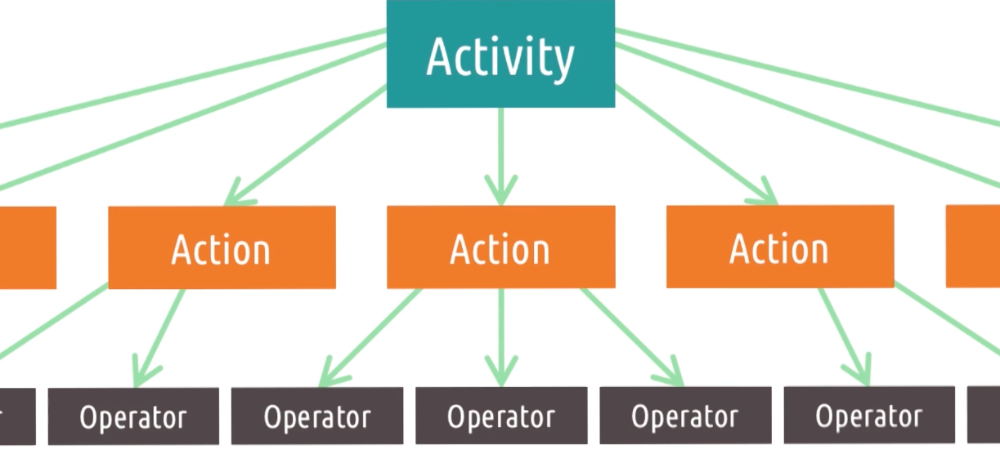
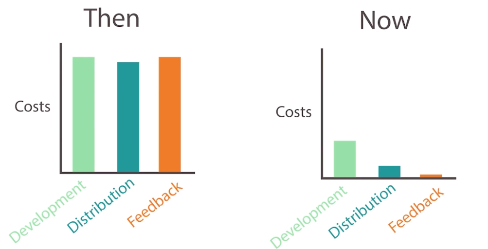
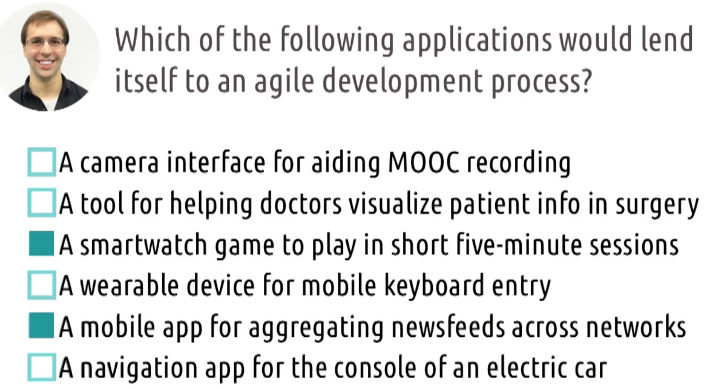
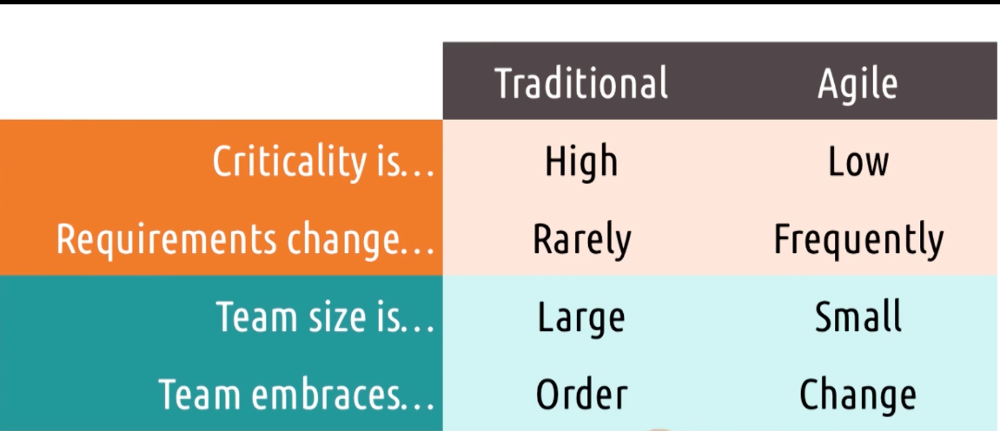
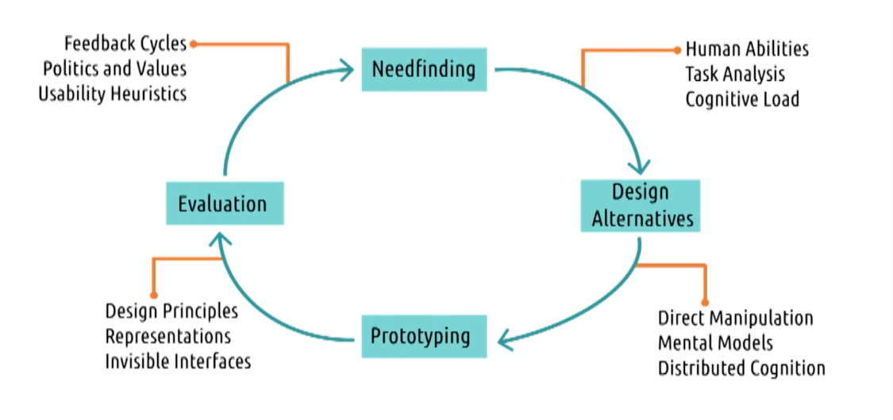

# Content
- Watch lessons 2.8 through 2.10 (1.5)
- Watch lessons 3.7 through 3.8 (0.5)

# Assignments
- Complete Homework 4 (3)
- Select an individual project area and begin your introduction (1.5)

# Readings
Lesson 2.8 (Distributed Cognition)
- Hutchins, E. (1995). How a cockpit remembers its speedsLinks to an external site.. Cognitive Science, 19(3). (pp. 265-288).
- Nardi, B. (1992). Studying context: A comparison of activity theory, situated action models and distributed cognitionLinks to an external site.. In B. Nardi (Ed.) Context and Consciousness: Activity Theory and Human-Computer Interaction. (pp. 35-52). MIT Press.

Lesson 2.9 (Interfaces and Politics)
- Winner, L. (1980). Do Artifacts Have Politics?Links to an external site. In Daedalus 109(1). (pp. 121-136). MIT Press.
- Cowan, R. S. (1976). The “industrial revolution” in the home: Household technology and social change in the 20 centuryLinks to an external site.. Technology and Culture 17(1). (pp. 1-23). Johns Hopkins University Press.
- Friedman, B., Kahn Jr, P. H., Borning, A., & Huldtgren, A. (2013). Value Sensitive Design and Information SystemsLinks to an external site.. In P. Zhang & D. Galletta (Eds.) Human-Computer Interaction in Management Information Systems: Foundations. New York: M.E. Sharpe, Inc.

Lesson 2.10 (Conclusion to Principles and Best of CHI)
- Harvey, E., Koenecke, A., & Kizilcec, R. F. (2025, April). "Don't Forget the Teachers": Towards an Educator-Centered Understanding of Harms from Large Language Models in EducationLinks to an external site.. In Proceedings of the 2025 CHI Conference on Human Factors in Computing Systems.
- Pataranutaporn, P., Archiwaranguprok, C., Chan, S. W., Loftus, E., & Maes, P. (2025, April). Synthetic human memories: Ai-edited images and videos can implant false memories and distort recollectionLinks to an external site.. In Proceedings of the 2025 CHI Conference on Human Factors in Computing Systems.
- Li, C., Solyst, J., Scott, S., Howse, G., Nkrumah, T., Walker, E., ... & Stewart, A. E. (2025, April). "I am a Technology Creator": Black Girls as Technosocial Change Agents in a Culturally-Responsive Robotics CampLinks to an external site.. In Proceedings of the 2025 CHI Conference on Human Factors in Computing Systems.
- Deuber, R., Langer, P., Kraus, M., Pfäffli, M., Bantle, M., Barata, F., ... & Wortmann, F. (2025, April). Moving Beyond the Simulator: Interaction-Based Drunk Driving Detection in a Real Vehicle Using Driver Monitoring Cameras and Real-Time Vehicle DataLinks to an external site.. In Proceedings of the 2025 CHI Conference on Human Factors in Computing Systems.
- Ye, J., Li, Y., Zou, W., & Wang, X. (2025, April). From Awareness to Action: The Effects of Experiential Learning on Educating Users about Dark PatternsLinks to an external site.. In Proceedings of the 2025 CHI Conference on Human Factors in Computing Systems.

Lesson 3.7 (HCI & Agile Development)
- Wania, C. E., Atwood, M. E., & McCain, K. W. (2006, June). How do design and evaluation interrelate in HCI research?Links to an external site. In Proceedings of the 6 Conference on Designing Interactive Systems. (pp. 90-98). ACM.
- Chamberlain, S., Sharp, H., & Maiden, N. (2006). Towards a framework for integrating agile development and user-centered designLinks to an external site.. In Proceedings of the 4 International Conference on Extreme Programming and Agile Processes in Software Engineering. (pp. 143-153). Springer.

Lesson 3.8 (Conclusion to Methods and Best of Georgia Tech HCI)
- **Liu, Z., Nersessian, N., & Stasko, J. (2008). Distributed cognition as a theoretical framework for information visualization. IEEE Transactions on Visualization and Computer Graphics, 14(6). (pp. 1173-1180). (Quiz 4)**
- Kidd, C., Orr, R., Abowd, G., Atkeson, C., Essa, I., MacIntyre, B., Mynatt, E., Starner, T. & Newstetter, W. (1999). The aware home: A living laboratory for ubiquitous computing researchLinks to an external site.. In N. Streitz, S. Konomi, & H. Burkhardt (Eds.) Cooperative Buildings: Integrating Information, Organizations, and Architecture (pp. 191-198).
- Hu, A., Chancellor, S., & De Choudhury, M. (2019). Characterizing Homelessness Discourse on Social MediaLinks to an external site.. In Extended Abstracts of the 2019 CHI Conference on Human Factors in Computing Systems (pp. 1-6).
- Kozubaev, S., Rochaix, F., DiSalvo, C., & Le Dantec, C. (2019). Spaces and Traces: Implications of Smart Technology in Public HousingLinks to an external site.. In Proceedings of the 2019 CHI Conference on Human Factors in Computing Systems. ACM.
- Shahmiri, F., Chen, C., Waghmare, A., Zhang, D., Mittal, S., Zhang, S., Wang, Y., Wang, Z., Starner, T., & Abowd, G. (2019). Serpentine: A Self-Powered Reversibly Deformable Cord Sensor for Human InputLinks to an external site.. In Proceedings of the 2019 CHI Conference on Human Factors in Computing Systems. ACM.

# Miscellany
- Complete peer reviews on Homework 3 (1)
- Complete the quarter-course survey (<0.5)
- Complete Honorlock quiz onboarding (<0.5)
- Work on additional participation credit opportunities (1.5)

# 2.8: Distributed Cognition

## Distributed Cognition
- Distributed Cognition suggests models of cognition should be extended outside the mind
- E.g. 1238 + 7787, cannot be done in head, need paper
- Does he get smarter? No, but eh could do more complex tasks

## Paper Spotlight: How a Cockpit Remembers its Speeds

- Edwin Hutchins: The pilots, the systems, and the environment work together to remember the airspeed, not just the pilots
- When plane wanna land, pilot gotta remember airspeed to change wing config
- Problem: lots of stuff going on, high cognitive load
- Speeds: plural, not just now, but also target speeds, speeds for different configs
- Pilots have pages for different speeds, prior to descent pilot finds and writes down speeds on paper
- As pilot descends, they mark speeds on the speedometer
- No single part of the cockpit "remembers" the speeds, but the whole system does
- The cognition involved in landing this plane is distributed across the components of this system

## Distributed Cognition and Cognitive Load
- E.g. driving, keep track of other cars, speed, gas, music, directions, passenger
- GPS helps reduce cognitive load
- Turn on cruise control, also distributed cognition

## Exercise: Distributed Cognition
- E.g. morgan paying bills old-fashioned way
- Any part of the system that helps reduce cognitive load is part of distributed cognition
- Pen, bill itself, pile of bills, morgan, checkbook (not light, table and chair)

## Distributed Cognition as a Lens
- Not another principle, but a way of looking at an interface design

## Reflections: Distributed Cognition
- Capable of doing more, specifically because those interfaces exhibit certain cognitive qualities
- Able to offload cognitive work to other parts of the system
- E.g. mark message as unread, so you don't have to remember to read it later

## Distributed Cognition to Social Cognition
- How the mind can be extended as an artifact
- Distributing across people are powerful as well
- Driving, before GPS, passenger helps with directions

## Social Cognition
- Not only concerned with how social relationships combine to accomplish tasks, also concerned with the cognitive underpinnings of social interaction themselves
- One of common interface design today is social media
  - Facebook - tell friends nearby
  - Games - share highlights with friends
  - We have to understand how social interactions really work to design it well
  - We dont want to, for example, overshare info that makes people uncomfortable

## Design Challenge: Social cognition
- How to design video games to protect against perceptions, that if a player is playing game they have time to take care of other responsibilities
- Base social video game like Tinder
  - contacts can't lookup playing habits
  - Only seen by those you shared with

## Situated Action
- Not interested in the long-tem and enduring permanent interactions amongst these things
- Focus on humans as improvisers
- E.g. baby daughter on camera
  - Don't how she reacts
  - Figure out how Joyner can go along
  - we can try our best to guide it, but ultimately have to improvise
  - Task is what we do, not what we design
- Three key takeaways
  - We must examine the interfaces we design within the context they're used
  - We must understand the task the user performs grows out of interaction with the interface
  - The task doesn't exit until the user gets started, and once they start, they define the task

## Situated Action and Memory
- Valuable lens to examine issues of memory
- Recognition is easier than recall
- E.g. mother just had surgery. Everytime Joyner has to go visit, she ask for 4-5 tasks to do. Joyner sometimes forgot, but she remembers
  - For mother, she has the context behind the task, why needs to be done, and what happends if not done
  - For Joyner, it's just another list of tasks

## Paper Spotlight: Plans and Situated Action: The Problem of Human-Machine Communication
- The first view: adopted by researches in CogSc, views the organization and significance of action as derived from plans
- Second view: people simply act on the world, plans are just interpretations of actions

## Activity Theory

- Predates HCI, three main contributions of activity theory to HCI
  - Why is the user do the task in the first place
  - Puts on emphasis on the idea that we can create low level operations from higher level actions
  - Actions by the user can move and down of the hierarchy

## Paper Spotlight: Activity theory and HCI
- Bonnie Nardi: Activity theory offers a set of perspective on human activity and a set of concepts for describing that activity. This, it seems to me, is exactly what HCI research needs as we struggle to understand and describe "context", "situation", and "practice"

## Paper Spotlight: Studying Context: A Comparison of Activity Theory, Situated Action Models and Distributed Cognition
- Bonnie Nardi
- Activity theory and distributed cognition are driven by goals, where as situated action focuses on improvisation
- Situated actions as goals are constructed retroactively to interpret our past actions
- Activity theory vs distributed cognition: their evaluation of the symmetry between people and artifacts
- Activity theory regards them as fundamentally different given that human has consciousness, distributed cognition views people and things as conceptually equivalent; people and artifacts are agents in the system

## Exploring HCI: Distributed Cognition
- Perspective to analyze and design interfaces that consider how cognitive processes are distributed across people, artifacts, and environments

# 2.9: Interfaces and Politics
- Can an artifacts have politics?
- Politics: the way power and authority are distributed in a community

## Change: A third motivation
- Designing for change in response to values that we have
- E.g. cars, beep if not wearing seatbelt, cap speed, to reduce accidents

Three goals of HCI:
- helps users do a task
- understand how users do a task
- change user behavior for the better

## Paper Spotlight: Do Artifacts Have Politics?
- Langdon Winner: noting the belief that nuclear power can only be used in authoritarian society cause of the dangers involved
- Two distinct ways artifacts can have politics
  - Inherently political: requires or is strongly compatible with a particular kind of political relationship among people, nuclear power
  - Technical arrangements as forms of order: can be used to change social order when used in correct way. Factory machines in chicago in 1880s, designed to be operated by unskilled workers, reducing need for skilled labor, undermining labor unions

## Negative Change by Design
- Seemingly normal design with underlying political agenda
- E.g. Robert Moses, construction of parks in Long Islands
  - Bring people of new york to the park
  - Bridge was low, so buses can't go under it
  - Only people with cars can go to the park, only rich people at that time
  - Moses intentionally designed the park to be only accessible to rich people
- E.g. Central Park, NY
    - Designed so that everyone can enjoy it equally

## Positive Change by Design
- can be design to promote positive social change thru natural interactions with the system
- E.g. FB's like button, no dislike button
  - promote positive interactions
  - discourage negative interactions
  - 5 new emotions to the like button, overall connotation is still positive
- Not only dictating change, but supporting change as well
- E.g. GB relationship status
  - Single, in relationship, it's complicated
  - Then, they added "in a civil union", "domestic partnership", "open relationship"
- E.g. gender options

## Design Challenge: Change by Design
- E.g. encourage morgan to stop working and take breaks every once in a while
- Weather app that ask morgan to take picture of the sky outside every hour
- E.g. pokemon go, walk outside to catch pokemon

## Positive Change by Happenstance
- Bi-product of technological advancement
- E.g. bicycle
  - before bike, woman rely on men for transportation
  - Carriages were expensive, men would own them
  - So women always out with men, father or husband
  - With bike, women can go out by themselves
  - Enable profound social shift
  - Wardrobe change as well, more practical clothes
  - Challenge social norms
  - Inventor didn't intend for these to happen

## Negative Change by Happenstance
- E.g. proliferation of internet
  - Before internet, we piggyback phoneline, then cable tv line, then more expensive fiber optic line
  - Now, wealthy people can afford high speed internet first
  - Poor people get left behind
  - They are economically advantaged
  - People with internet access can apply for jobs online, do research, learn new skills
  - Now, they are more advantaged and richer

## Value-sensitive Design
- Need to share the same value as the users
- UWashington: Value sensitive design seeks to provide theory and method to account for human values in a principled and systematic manner throughout the design process
- Is it consistent with the users values?
- Anna Cavoukian: Privacy by design

## Paper Spotlight: Value Sensitive Design and Information Systems
- Batya Friedman: Three main components of value-sensitive design
  - Conceptual investigations: identify and articulate the values implicated in the technology under consideration
  - Empirical investigations: studies of the technology's users to inform and elaborate the conceptual analysis
  - Technical investigations: analysis and design of the technology itself to support or hinder particular values

## Value-sensitive Design Across Cultures
- Values vary across cultures
- E.g. Rights to be forgotten in EU
  - Info about you online can be removed upon request
  - Google not developed with this value in mind
  - One value of freedom of speech conflicts with right to be forgotten

## 5 tips: Value-sensitive Design
- Start early
  - Identify the values at stake as early as possible, check in throughout design process
- Know your users
  - Need to understand the values of your users
- Consider both direct and indirect stakeholders
  - Direct: users who directly interact with the system
  - Indirect: people who are affected by the system but don't directly interact with it
- Brainstorm the interface's possibilities
  - Think not only about how the interface to be used, but also how it could be used
- Choose carefully between supporting values and prescribing values
  - Be careful and be deliberate when choosing to support or prescribe values

## Exploring HCI: Interfaces and Politics
- Two challenges
  - Need to think about places where we can use interface design to invoke social change
  - Need to think about the possible negative ramifications of our designs

## Reversing the relationship
- General Electrics design light bulbs that saves energy
- Electricity companies don't like it cause they make money by selling electricity
- So they lobby government to ban energy-saving light bulbs
- To preserve the power structure that benefits them
- Technology changes society, but society can also change technology

## Reflections: Interfaces and Politics
- E.g. Spiderman games can only works in PS5
  - There's no technical reason for that
  - Sony pays for exclusivity to promote their console

# 2.10: Conclusion to Principles

## Zooming out: Human as Processor
- Humans actions are approached almost computationally
- Focus on efficiency, accuracy, speed

## Zooming out: Human as Predictor
- Task focus
- Actively looking at the task, predicting what to do next, anticipating needs
- 15 design principles
- Understand their mental models, design to match their expectations
- Expert blind spots

## Zooming out: Human as Participant
- User is not merely interacting with the system to accomplish a task, they are interacting with the system as a whole
- Use interface to create more equal society for all people

## 5 tips: On-Screen UI Design
- Use a grid
  - Highlight important content
  - E.g. newspaper layout
- Use whitespace
  - works with grids to provide context and guide user's visual perception
- Know your Gestalt principles
  - Proximity, similarity, continuity, closure, figure/ground
- Reduce clutter
  - Above three tips help reduce clutter
- Design in grayscale
  - E.g. traffic light, red-green colorblindness
  - Even though color is important, design should not rely solely on color
  - Red always on top, green on bottom

## Only Half of the Picture
- Know your user
- You are not your user
- These guidelines and principles are only half of the picture, the other half are the methods

# 3.7: HCI and Agile Development

## The Demands for Rapid HCI

- "A delayed game is eventually good, a rushed game is forever bad" 
- Above no longer applies, cause we can update software after release
- Build fast, iterate often

## Exercise: When to go Agile

## When to go Agile

- Agile can only be used at certain times

## Paper Spotlight: Towards a Framework for Integrating Agile Development and User-Centered Design
- Steve Chamberlain
- Agile rely on iterative development
- Heavy emphasis on user's role and team coherence
- 5 principles on integrating User Centric Design and Agile
  - User Involvement
  - Collaboration and Culture
  - Prototyping
  - Project Lifecycle
  - Project Management

## Live Prototyping
- Optimizely: drag and drop to create different versions of a webpage
- Cost of failure is low, so we can try many different designs
- Possible benefits might outweigh the cost of failure

## A/B Testing
- Rapid software testing between A and B
- Small changes with real users
- B is the improved version of A
- 

## Agile HCI in the Design Life Cycle
- Doesnt replace design life cycle, but "caffeinates" it
- Changes the rate at which we go through the design life cycle

## 5 Tips: Mitigating risk in HCI and Agile Development
- Start more traditional
  - Only do Agile with have something up and running, but we need something solid to begin with
- Focus on small changes
- Adopt a parallel track method
  - Usually have short 2 -week sprints
- Be careful with consistency
  - if our website has frequent users, we want to be conservative about how we manage user's expectation
- Nest your design cycles
  - Each cycle give a bit info
  - Collect info from each cycle to inform the next cycle

## Exploring HCI: Agile Development

# 3.8: Conclusion to Methods

## Designing Audiobooks for Exercise 1
- Needfinding
  - Go to park and observe people exercising
  - Surveys
- Design alternatives
  - Different scenarios and personas
- Prototyping
  - wizard of oz
  - paper prototype
- Evaluation
  - get feedback from users
- We still don't have yet, what next? Go back to needfinding

## Designing Audiobooks for Exercise 2
- Needfinding (iterate, don’t restart)
  - Use what you learned from prototyping + evaluation to refine your understanding of the task (e.g., gestures still hard even “hands-free” because arms move a lot)
  - Add new questions based on feedback (e.g., users ask for rewind → find out how common/important it is)
- Design alternatives (expand + revise ideas)
  - Build on current concepts instead of tossing them out
  - Brainstorm using the same personas/scenarios, plus any new insights from iteration 1
  - Consider new concepts that only become obvious after seeing the first prototype in action
- Prototyping (build what’s feasible, fast)
  - Increase fidelity where you can, but adjust when tech/resources aren’t ready
  - Keep the focus on usability by “faking” hard parts:
  - simplified voice commands (even crude recognition)
  - wireframes instead of full app integration
  - Wizard-of-Oz support (a person triggers playback/behaviors behind the scenes)
  - Drop/avoid prototype paths that violate constraints (too expensive, not truly hands-free, etc.)
- Evaluation (more objective over time)
  - Still collect qualitative feedback (experience, frustrations, expectations)
  - Add more empirical measures as fidelity rises:
  - time to complete key actions
  - failure points / what blocks interaction (noise breaks voice, interaction is too distracting, etc.)
- Next step
  - No final product yet but higher fidelity prototype → synthesize results and loop back to Needfinding for the next iteration

## Designing Audiobooks for Exercise 3
- Needfinding (refined understanding)
  - Hands-free interaction is generally more usable for exercisers.
  - Pure gestures are still not technologically feasible/reliable enough.
  - Voice commands fail in common real contexts (e.g., loud areas).
- Design alternatives (Iteration 3: hybrid concept)
  - Propose a hybrid interface: voice + on-screen touch are complementary, not competing.
  - Primary mode: voice (maximizes hands-free usability most of the time).
  - Fallback mode: touch when voice is unreliable (noise, recognition failure).
  - Goal: maintain full functionality in all environments while minimizing friction.
- Prototyping (merge previous prototypes, keep fidelity low)
  - Combine the prior voice prototype and screen-based prototype into one prototype.
  - Keep it low-fidelity initially because this specific integration hasn’t been validated and higher-fidelity builds are expensive.
- Evaluation (gate to implementation)
  - Test whether the hybrid actually resolves the earlier weaknesses:
  - usability in loud areas (touch fallback works)
  - reduced gulf of execution (voice reduces required on-screen navigation)
  - If results are “good enough,” proceed to implementation/deployment (move beyond prototyping).

## Designing Audiobooks for Exercise 4
- Post-launch needfinding (now data-driven)
  - Use usage analytics, error logs, support tickets, and App Store reviews as needfinding inputs.
  - Real users reveal unexpected contexts and edge cases (e.g., people using it while driving).
  - New/updated requirements emerge
  - Subtle control needs (e.g., more precise rewind/fast-forward).
  - New feature demands driven by real environments (e.g., coexist with a navigation app while driving).
- Design alternatives (in response to live needs)
  - Brainstorm targeted improvements (e.g., “back 5 seconds” vs “back 15 seconds”; voice vs touch tradeoffs in cars).
- Prototyping (small, cheap experiments first)
  - Prototype incremental controls/commands before committing to expensive builds.
  - Changes can be scoped as small UI tweaks or larger interaction redesigns.
- Evaluation (at scale)
  - Evaluate with A/B tests, telemetry, and real-world task success/failure rates—beyond lab sessions.
    - Release => repeat (nested cycles)
    - Weekly patches, monthly feature updates, yearly redesigns.
  - The lifecycle becomes iterative forever, unless the product is abandoned.

## Research Methods Meet Design Principles

## Exploring HCI: HCI Methods Revisited

## Approaches to User-Centered Design
- Participatory Design
  - Users are part of the design team
  - Omnipresent thruout the design process
  - Careful not to over-represent that one user's view
- Action research
  - Addreses an immediate problem while also studying the process of solving that problem
  - Action research undertaken by the actual users
- Design-based research
  - Same like action research, but can be don by outside researchers as well
  - To improve the theory of our problem

- Iterations still play a key role in all these approaches
- Adjusting to new trends and technologies
  