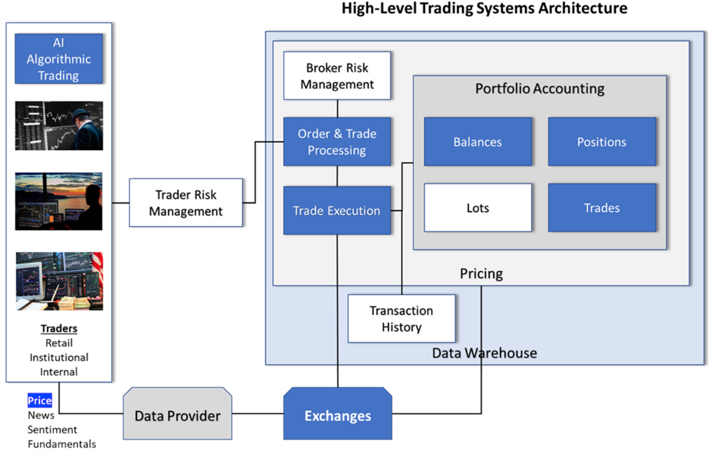
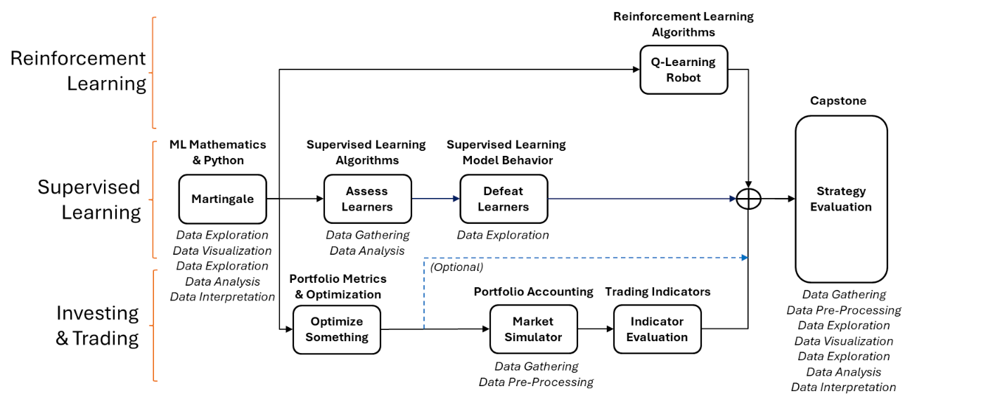

# CS7646: Machine learning for trading

## Topics Covered
### Mini-course 1: Financial Data in Python
- Manipulating financial time-series with **pandas** and **NumPy**
- Portfolio statistics: **Sharpe ratio**, **volatility**, **alpha**, **beta**
- Technical indicators and trading signals:
    - Simple/Exponential Moving Averages (SMA, EMA)
    - Bollinger Bands and %B
    - RSI
    - MACD
    - Momentum & Stochastic Oscillator

### Mini-course 2: Computational Investing
- Portfolio theory:
    - Mean–variance optimization
    - Efficient frontier
    - Capital Asset Pricing Model (CAPM)
- Efficient Market Hypothesis (EMH)
- Options basics, hedge fund mechanics
- Risk–return trade-offs

### Mini-course 3: Machine Learning for Trading
- **Regression models** vs **Classification models**
- **Decision trees**: Implemented DT/RT/Bagged/Random Forest Learner
- **Ensemble methods**: bagging, boosting, random forests
- **K-Nearest Neighbors (KNN)**
- **Reinforcement learning**:
    - Q-Learning
    - Dyna-Q
- Strategy learners:
    - Rule-based strategies
    - Machine learning–based strategies
- Backtesting trading strategies and portfolio simulation

## Projects
- Project 1: Martingale – Simulate betting strategies and understand risk via Monte Carlo
- Project 2: Portfolio Optimization – Find optimal allocations using optimization routines
- Project 3: Assess Learners – Implement and evaluate decision tree, random tree, and bagging learners
- Project 4: Defeat Learners – Craft datasets where one model outperforms another
- Project 5: Market Simulator – Build a simulator to calculate portfolio performance with provided trade data
- Project 6: Manual Strategy – Devise a rule-based trading strategy and compare it against ML models
- Project 7: Q-Learning Robot – Use reinforcement learning to tackle a navigation-like decision problem
- Project 8: Strategy Learner – Apply a learned strategy (e.g., tree-based or Q-Learner) in a trading context

- We develop those highlighted in blue

- Projects P1 through P7 are carefully designed to introduce key ideas and concepts, and also to develop actual modules that will be integrated into your final creation. Think of these projects as the gears of a watch, each one essential and intricate, working together to keep precise time.
- Project P8 is the culmination of all your hard work: the capstone project. Here, you will leverage all the components you've built and knowledge you've acquired to construct and simulate a fully operational AI Trading agent. This is where everything comes together, where theory meets practice, and where you get to see the fruits of your labor in action. By the end of Project P8, you’ll have a mini-version of a trading system that employs the cutting-edge techniques you've learned throughout the course.